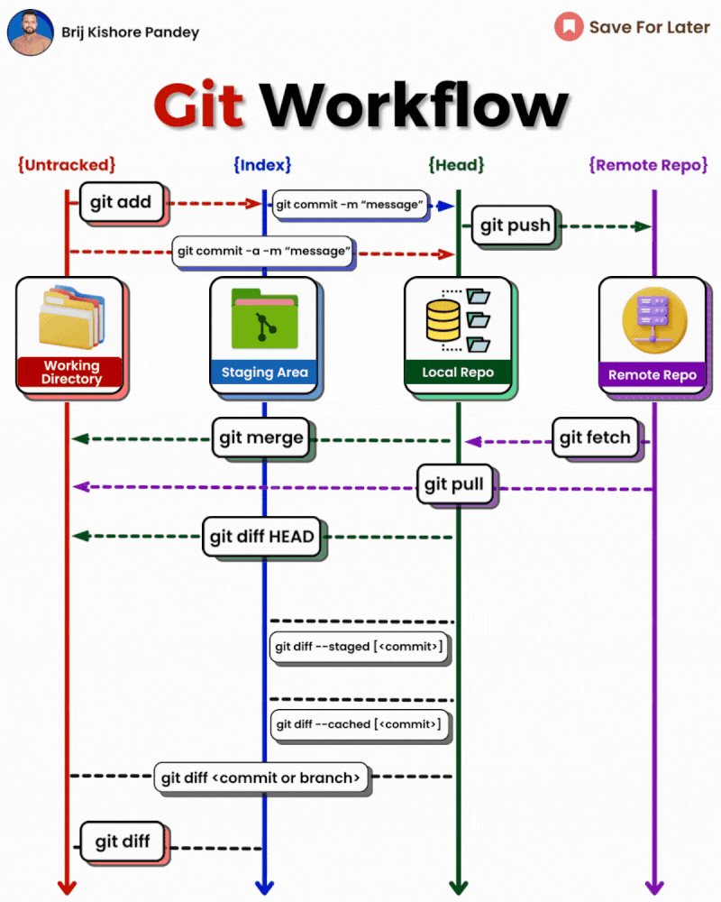

import { Callout } from "nextra/components";

# গিট ও গিটহাব: সম্পূর্ণ গাইড 🚀



## গিট কী? ভার্সন কন্ট্রোল কেন দরকার?

গিট হলো একটি **ভার্সন কন্ট্রোল সিস্টেম**। ধরো, তুমি একটি গল্প লিখছো খাতায়। প্রতিদিন কিছু না কিছু নতুন লিখছো। কিন্তু যদি দুই দিন আগের লেখা ফিরে পেতে চাও? গিট হলো এমন এক জাদুর খাতা, যেখানে তুমি যেকোনো পৃষ্ঠায় ফিরে যেতে পারো, কী কী পরিবর্তন করেছো দেখতে পারো, এমনকি তোমার বন্ধুদেরও লিখতে দিতে পারো!

<Callout type="info">
  <b>উদাহরণ:</b> গিট হলো তোমার কোডের জন্য টাইম মেশিন। তুমি পেছনে যেতে পারো, কে
  কী পরিবর্তন করেছে দেখতে পারো, আর কখনোই তোমার কাজ হারাবে না।
</Callout>

---

## রিপোজিটরি কী?

একটি **রিপোজিটরি** (বা "রিপো") হলো এমন একটি বিশেষ ফোল্ডার, যেখানে গিট তোমার সব ফাইল ও পরিবর্তনের হিসাব রাখে। এটা এমন এক জাদুর বাক্স, যেখানে তুমি যা-ই রাখো, তার সবকিছু ও পরিবর্তন মনে রাখে!

---

## গিট ইন্সটল করা

**ধাপ ১:**  
[git-scm.com/downloads](https://git-scm.com/downloads) এ গিয়ে তোমার কম্পিউটারের জন্য গিট ডাউনলোড করো।

**ধাপ ২:**  
ডাউনলোড করা ফাইলটি ওপেন করো এবং ইন্সটল করার নির্দেশনা অনুসরণ করো।

---

## গিটের গুরুত্বপূর্ণ কমান্ডসমূহ (শুরুর থেকে অ্যাডভান্স)

### ১. গিট ইনিশিয়ালাইজ করা

<Callout type="info">
  <b>এটা কী করে?</b>
  এই কমান্ডটি গিটকে বলে তোমার ফোল্ডারটি নজরদারি করতে। এটা যেন তোমার প্রজেক্টের জন্য
  টাইম মেশিন চালু করা!
</Callout>

```bash
git init
```

এখন তোমার ফোল্ডারটি একটি গিট রিপোজিটরি। তুমি এখন পরিবর্তন ট্র্যাক করতে, ভার্সন সংরক্ষণ করতে এবং অন্যদের সাথে কাজ করতে পারবে।

---

### ২. গিট স্ট্যাটাস চেক করা

<Callout type="info">
  <b>কেন ব্যবহার করো?</b>
  এই কমান্ডটি দেখায় কোন ফাইল পরিবর্তন হয়েছে, কোনগুলো স্টেজড, আর কোনগুলো নয়। এটা
  যেন জমা দেওয়ার আগে তোমার হোমওয়ার্কের তালিকা চেক করা!
</Callout>

```bash
git status
```

---

### ৩. ফাইল স্টেজ করা

<Callout type="info">
  <b>স্টেজিং মানে কী?</b>
  স্টেজিং হলো হোমওয়ার্ক ব্যাগে ভরা—শুধুমাত্র স্টেজ করা ফাইলই পরবর্তী কমিটে যাবে!
</Callout>

```bash
git add <filename>      # নির্দিষ্ট ফাইল স্টেজ করো
git add --all           # সব ফাইল স্টেজ করো
git add .               # কারেন্ট ডিরেক্টরির সব ফাইল স্টেজ করো
```

---

### ৪. কমিট করা

<Callout type="info">
  <b>কমিট কী?</b>
  কমিট হলো ভিডিও গেমের সেভ পয়েন্টের মতো। চাইলে সবসময় ফিরে যেতে পারো!
</Callout>

```bash
git commit -m "তোমার বার্তা"
```

তুমি কী পরিবর্তন করেছো, তা ছোট করে বার্তায় লিখো, যেমন "নতুন অধ্যায় যোগ" বা "টাইপো ঠিক করা"।

---

### ৫. গিট লগ দেখা

<Callout type="info">
  <b>লগ কেন দেখবে?</b>
  লগ হলো তোমার সব সেভ পয়েন্টের তালিকা। এটা যেন ডায়েরি উল্টে দেখা, প্রতিদিন কী করেছো!
</Callout>

```bash
git log
# সংক্ষেপে দেখতে:
git log --oneline
```

---

### ৬. আগের কোনো কমিটে ফিরে যাওয়া

<Callout type="warning">
  <b>সতর্কতা!</b> এটা তোমার প্রজেক্টকে আগের অবস্থায় নিয়ে যেতে পারে। নিশ্চিত
  হয়ে করো!
</Callout>

```bash
git reset --hard <commit id>
```

কমিট আইডি পেতে `git log` ব্যবহার করো।

---

### ৭. গিট রিফ্লগ দেখা

<Callout type="info">
  <b>রিফ্লগ কী?</b>
  রিফ্লগ তোমার সব মুভ দেখায়—even যেগুলো তুমি পরে বাতিল করেছো!
</Callout>

```bash
git reflog
```

---

### ৮. গিট থেকে ফাইল মুছে ফেলা

<Callout type="info">
  <b>কেন ফাইল মুছবে?</b>
  ভুল করে কিছু যোগ করলে, গিটকে বলতে পারো এটা আর ট্র্যাক করতে হবে না।
</Callout>

```bash
git rm <filename>
```

---

### ৯. নতুন ব্রাঞ্চ তৈরি করা

<Callout type="info">
  <b>ব্রাঞ্চ কী?</b>
  ব্রাঞ্চ হলো তোমার প্রজেক্টের সমান্তরাল জগৎ—নতুন কিছু চেষ্টা করতে পারো, মূল কাজ
  নষ্ট না করেই!
</Callout>

```bash
git branch <branch name>
```

---

### ১০. ব্রাঞ্চের তালিকা দেখা

```bash
git branch --list
```

---

### ১১. এক ব্রাঞ্চ থেকে অন্য ব্রাঞ্চে যাওয়া

```bash
git switch <branch name>
```

---

### ১২. এক ব্রাঞ্চ থেকে অন্য ব্রাঞ্চে কোড মার্জ করা

<Callout type="warning" emoji="💡">
  অন্য ব্রাঞ্চের কোড আনতে চাইলে আগে `git switch <branchname>` দিয়ে সেই ব্রাঞ্চে যাও। তারপর নিচের কমান্ড দাও।
</Callout>

```bash
git merge <branch name>
```

---

### ১৩. গিটে ব্রাঞ্চ ডিলিট করা (সব পদ্ধতি, কখন ও কেন)

লোকাল (তোমার কম্পিউটারে) ও রিমোট (গিটহাবে) ব্রাঞ্চ ডিলিট করার বিভিন্ন উপায় আছে।

#### লোকাল ব্রাঞ্চ ডিলিট

```bash
git branch -d branch-name
```

- `-d` ফ্ল্যাগ মানে "ডিলিট"—শুধুমাত্র তখনই ডিলিট করবে যদি ব্রাঞ্চটি পুরোপুরি মার্জ করা হয়ে থাকে (নিরাপদ ডিলিট)।

**জোর করে ডিলিট (যদি মার্জ না করা থাকে):**

```bash
git branch -D branch-name
```

- `-D` ফ্ল্যাগ মানে "যেভাবেই হোক ডিলিট করো"—এটা ব্যবহার করো যদি নিশ্চিত হও যে ওই ব্রাঞ্চের পরিবর্তন আর দরকার নেই।

**কখন ও কেন?**

- যখন তোমার ব্রাঞ্চের পরিবর্তন মূল ব্রাঞ্চে (যেমন `main` বা `master`) মার্জ করা হয়ে গেছে।
- পুরনো ব্রাঞ্চ মুছে প্রজেক্ট পরিষ্কার রাখতে।
- শুধুমাত্র তখনই জোর করে ডিলিট করো যখন নিশ্চিত যে ওই ব্রাঞ্চের কাজ আর দরকার নেই।

#### রিমোট ব্রাঞ্চ ডিলিট (গিটহাবে)

```bash
git push origin --delete branch-name
```

- এটা গিটহাবকে বলে রিমোট রিপোজিটরি থেকে ব্রাঞ্চটি মুছে ফেলতে।

**কখন ও কেন?**

- পুল রিকোয়েস্ট মার্জ করার পর, গিটহাব রিপো পরিষ্কার রাখতে রিমোট ব্রাঞ্চ ডিলিট করো।
- পুরনো ব্রাঞ্চে ভুল করে কাজ করা থেকে বাঁচায়।

---

### ১৪. ব্রাঞ্চের নাম পরিবর্তন

<Callout type="warning" emoji="💡">
  ব্রাঞ্চের নাম বদলাতে চাইলে আগে `git switch <branchname>` দিয়ে সেই ব্রাঞ্চে যাও। তারপর নিচের কমান্ড দাও।
</Callout>

```bash
git branch -m <updated branch name>
```

---

### ১৫. গিট স্ট্যাশ (অস্থায়ীভাবে কাজ সংরক্ষণ)

<Callout type="info">
  <b>স্ট্যাশ কী?</b>
  স্ট্যাশ মানে কাজটা ড্রয়ারে রেখে রাখা—পরে আবার বের করে নিতে পারো!
</Callout>

```bash
git stash
```

---

### ১৬. স্ট্যাশ লিস্ট দেখা

```bash
git stash list
```

---

### ১৭. স্ট্যাশে কী ছিলো দেখো

```bash
git stash show -p
```

---

### ১৮. স্ট্যাশ থেকে কাজ বের করা

```bash
git stash apply <stash id>
# অথবা একসাথে বের করে স্ট্যাশ থেকে মুছে ফেলতে:
git stash pop
```

---

### ১৯. ভুল করে কোনো ফাইল গিটে যোগ করলে বা কমিটের পর গিট থেকে বাদ দিতে চাইলে:

**ধাপ ১:**  
`.gitignore` ফাইলে ওই ফাইলের নাম যোগ করো।

**ধাপ ২:**

```bash
git rm --cached <filename>
```

---

### ২০. গিটহাব বা রিমোট রিপোজিটরিতে ফাইল যোগ/পুশ করা

**ধাপ ১:**

```bash
git remote add <origin name> <github repository link>
```

উদাহরণ:  
`git remote add origin git@github.com:YourUsername/your-repo.git`

**ধাপ ২:**

```bash
git push -u <origin name> <branch name>
```

উদাহরণ:  
`git push -u origin main`

---

### ২১. রিমোট রিপোজিটরি থেকে কোড টানা

```bash
git pull
```

---

### ২২. রিমোট রিপোজিটরি থেকে শুধু পরিবর্তন দেখা (মার্জ ছাড়া)

```bash
git fetch
```

---

## গিটহাব কী?

গিটহাব হলো এক বিশাল লাইব্রেরি, যেখানে তুমি তোমার গিট প্রজেক্ট অনলাইনে রাখতে পারো, বন্ধুদের সাথে শেয়ার করতে পারো, আর একসাথে কাজ করতে পারো। এটা তোমার কাজ দেখানোর ও সাহায্য পাওয়ার জায়গা!


---

## কমিট, ব্রাঞ্চ ও হিস্টোরি বোঝা

- **কমিট:** তোমার প্রজেক্টের একেকটা সেভ পয়েন্ট।
- **ব্রাঞ্চ:** প্রজেক্টের বিকল্প পথ—যেন চয়েস-ইওর-অ্যাডভেঞ্চার বই!
- **হিস্টোরি:** সব কমিট ও ব্রাঞ্চের রেকর্ড—যেকোনো সময় দেখে নিতে পারো।

---

## ব্রাঞ্চিং ও মার্জিং (দৃশ্যত ব্যাখ্যা)

<Callout type="info">
  ব্রাঞ্চে নতুন কিছু চেষ্টা করো, মূল প্রজেক্ট নষ্ট না করেই। ভুল হলে মূল ব্রাঞ্চে
  ফিরে যাও!
</Callout>

---

## মার্জ কনফ্লিক্ট সমাধান (ধাপে ধাপে, পরিষ্কারভাবে)

যখন তুমি বা তোমার বন্ধু একই ফাইলের একই অংশ পরিবর্তন করো, তখন মার্জ করার সময় গিট বুঝতে পারে না কোনটা রাখবে। একে বলে **মার্জ কনফ্লিক্ট**।

### মার্জ কনফ্লিক্ট কী?

দুইটি ব্রাঞ্চের পরিবর্তন একসাথে মেলাতে না পারলে গিট তোমাকে সিদ্ধান্ত নিতে বলে। যেমন, তুমি ও তোমার বন্ধু একই লাইনে কিছু লিখলে—তখন গিট জিজ্ঞেস করবে কোনটা রাখবে।

---

### কনফ্লিক্ট হয়েছে কীভাবে বুঝবে?

- `git merge branch-name` দিলে টার্মিনালে দেখাবে:
  > CONFLICT (content): Merge conflict in filename.txt
- টার্মিনালে দেখাবে: "Automatic merge failed; fix conflicts and then commit the result."
- `git status` দিলে "Unmerged" লেখা ফাইল দেখাবে।

---

### কনফ্লিক্ট সমাধান (ধাপে ধাপে)

১. **মার্জ করার চেষ্টা করো:**

```bash
git merge branch-name
```

- কনফ্লিক্ট হলে গিট জানিয়ে দেবে কোন ফাইলে সমস্যা হয়েছে।

২. **কনফ্লিক্টেড ফাইল ওপেন করো:**

- ফাইল ওপেন করলে দেখবে এরকম মার্কার:
  ```
  <<<<<<< HEAD
  তোমার পরিবর্তন (তুমি যে ব্রাঞ্চে আছো)
  =======
  অন্য ব্রাঞ্চের পরিবর্তন
  >>>>>>> branch-name
  ```
- `<<<<<<< HEAD` থেকে `=======` পর্যন্ত তোমার অংশ।
- `=======` থেকে `>>>>>>> branch-name` পর্যন্ত অন্য ব্রাঞ্চের অংশ।

৩. **কী রাখবে ঠিক করো:**

- দুই অংশ পড়ে ঠিক করো কোনটা রাখবে, বা দুটোই রাখতে পারো।
- ফাইল এডিট করে চাওয়া মতো বানাও।
- **সব কনফ্লিক্ট মার্কার মুছে ফেলো** (`<<<<<<<`, `=======`, `>>>>>>>`)।

**উদাহরণ:**
আগে:

```
<<<<<<< HEAD
Hello, world!
=======
Hello, Git!
>>>>>>> feature-branch
```

পরে (দুটোই রাখতে চাইলে):

```
Hello, world!
Hello, Git!
```

অথবা (শুধু একটা রাখতে চাইলে):

```
Hello, world!
```

৪. **সমাধান হয়েছে জানাও:**

- ফাইল সেভ করো।
- গিটকে বলো কনফ্লিক্ট ঠিক হয়েছে:
  ```bash
  git add filename.txt
  ```

৫. **মার্জ শেষ করো:**

- সব কনফ্লিক্ট ঠিক হলে মার্জ শেষ করো:
  ```bash
  git commit
  ```
- গিট অটো-কমিট মেসেজ দিলে সেভ করে বেরিয়ে আসো।

---

### বিগিনারদের জন্য টিপস

- **ধীরে করো:** দুই অংশ ভালো করে পড়ো। বুঝতে না পারলে টিমমেটকে জিজ্ঞেস করো বা হিস্টোরি দেখো।
- **কোড এডিটর ব্যবহার করো:** VS Code-এর মতো এডিটর কনফ্লিক্ট হাইলাইট করে দেয়, সহজে বেছে নিতে পারো।
- **কোড টেস্ট করো:** কনফ্লিক্ট ঠিক করার পর প্রজেক্ট চালিয়ে দেখো সব ঠিক আছে কিনা।
- **ভয় পেও না!** কনফ্লিক্ট স্বাভাবিক, সবারই হয়। অভ্যাস করলে সহজ লাগবে।

<Callout type="info">
  মার্জ কনফ্লিক্ট মানে দুইজন একই পাতায় লিখছে—তুমি ঠিক করবে শেষ গল্পটা কেমন হবে!
</Callout>

---

## রিবেস ও স্কোয়াশ ব্যাখ্যা

### রিবেস কী?

**রিবেস** মানে তোমার ব্রাঞ্চের পরিবর্তন অন্য ব্রাঞ্চের শেষে নিয়ে যাওয়া—এতে হিস্টোরি সুন্দর ও সরল হয়।

**কমান্ড:**

```bash
git switch your-feature-branch
git rebase main
```

- এতে তোমার পরিবর্তনগুলো `main`-এর সর্বশেষে চলে যাবে।

**কখন ব্যবহার করবে?**

- ফিচার ব্রাঞ্চ মার্জ করার আগে, `main`-এর সর্বশেষ পরিবর্তন নিতে রিবেস করো।
- এতে প্রজেক্ট হিস্টোরি পরিষ্কার থাকে।

<Callout type="warning">
  শেয়ার করা ব্রাঞ্চে রিবেস করো না—এতে হিস্টোরি বদলে যায়। নিজের ফিচার ব্রাঞ্চে
  মার্জের আগে রিবেস করো।
</Callout>

### স্কোয়াশ কী?

**স্কোয়াশ** মানে একাধিক কমিট একসাথে করা—মার্জের আগে হিস্টোরি পরিষ্কার রাখতে কাজে লাগে।

**কমান্ড:**

```bash
git rebase -i HEAD~3
```

- এতে একটি এডিটর খুলবে, যেখানে `pick`-এর জায়গায় `squash` লিখে কমিটগুলো একসাথে করতে পারো।

#### `HEAD~3` মানে কী?

- `HEAD` মানে বর্তমান ব্রাঞ্চের সর্বশেষ কমিট।
- `~3` মানে "HEAD থেকে ৩টি কমিট আগ পর্যন্ত দেখাও"।
- অর্থাৎ, `HEAD~3` দিলে শেষ ৩টি কমিট (বর্তমানটি বাদে) এডিট করতে পারো।

#### কিভাবে ব্যবহার করবে (ধাপে ধাপে):

১. ঠিক করো কতগুলো কমিট স্কোয়াশ করবে (ধরা যাক, শেষ ৩টি)।
২. চালাও:

```bash
git rebase -i HEAD~3
```

৩. এডিটরে শেষ ৩টি কমিটের তালিকা আসবে:

```
pick a1b2c3d Commit message 1
pick b2c3d4e Commit message 2
pick c3d4e5f Commit message 3
```

৪. যেগুলো একসাথে করতে চাও, তাদের `pick`-এর জায়গায় `squash` লেখো:

```
pick a1b2c3d Commit message 1
squash b2c3d4e Commit message 2
squash c3d4e5f Commit message 3
```

৫. সেভ করে বেরিয়ে আসো। গিট নতুন কমিট মেসেজ চাইবে—লিখে সেভ করো।
৬. এবার ৩টি কমিট একসাথে হয়ে গেল!

**কখন ব্যবহার করবে?**

- ফিচার ব্রাঞ্চ মার্জ করার আগে, ছোট ছোট কমিট একসাথে করে পরিষ্কার কমিট রাখো।

<Callout type="info">
  স্কোয়াশ করলে প্রজেক্ট হিস্টোরি পরিষ্কার ও সহজবোধ্য হয়!
</Callout>

---

## এক কম্পিউটারে একাধিক গিটহাব অ্যাকাউন্ট ব্যবহারের সহজ গাইড

ব্যক্তিগত ও অফিস—দুই বা তার বেশি গিটহাব অ্যাকাউন্ট এক কম্পিউটারে ব্যবহারের সহজ উপায়:

---

### ধাপ ১: সব অ্যাকাউন্টের জন্য SSH কী তৈরি করো

প্রথমে টার্মিনাল ওপেন করে `.ssh` ফোল্ডারে যাও:

- উইন্ডোজ: `cd %USERPROFILE%\.ssh`
- ম্যাক/লিনাক্স: `cd ~/.ssh`

#### প্রতিটি অ্যাকাউন্টের জন্য নতুন SSH কী তৈরি করো

প্রতিটি গিটহাব অ্যাকাউন্টের জন্য চালাও:

```bash
ssh-keygen -t ed25519 -C "your-email@example.com"
```

- ফাইলের নাম চাইলেই আলাদা দাও (যেমন: `id_ed25519_personal` বা `id_ed25519_work`)
- লোকেশন এন্টার দাও, চাইলে পাসফ্রেজ দাও বা ফাঁকা রাখো

এখন `.ssh` ফোল্ডারে নতুন কী ফাইল দেখবে:

- `id_ed25519_personal` ও `id_ed25519_personal.pub`
- `id_ed25519_work` ও `id_ed25519_work.pub`

---

### ধাপ ২: প্রতিটি গিটহাব অ্যাকাউন্টে SSH কী যোগ করো

পাবলিক কী কপি করো:

- ম্যাক:
  ```bash
  pbcopy < ~/.ssh/id_ed25519_personal.pub
  ```
- উইন্ডোজ:
  ```bash
  cat ~/.ssh/id_ed25519_personal.pub | clip
  ```
- লিনাক্স:
  ```bash
  xclip -sel clip < ~/.ssh/id_ed25519_personal.pub
  ```

গিটহাব > Settings > SSH and GPG keys > New SSH key-এ গিয়ে কী পেস্ট করো, নাম দাও, সেভ করো।

প্রতিটি অ্যাকাউন্টের জন্য আলাদা কী যোগ করো।

---

### ধাপ ৩: SSH কনফিগ ফাইল তৈরি করো

`~/.ssh/config` (উইন্ডোজে `%USERPROFILE%\.ssh\config`) ফাইল তৈরি বা এডিট করো। প্রতিটি অ্যাকাউন্টের জন্য নিচের মতো এন্ট্রি দাও:

```bash
# Personal GitHub
Host github-personal
  HostName github.com
  User git
  IdentityFile ~/.ssh/id_ed25519_personal

# Work GitHub
Host github-work
  HostName github.com
  User git
  IdentityFile ~/.ssh/id_ed25519_work
```

- এতে SSH জানবে, কোন অ্যাকাউন্টে কোন কী ব্যবহার করতে হবে।

---

### ধাপ ৪: আলাদা অ্যাকাউন্ট দিয়ে রিপো ক্লোন/ক্রিয়েট করো

ক্লোন বা রিমোট অ্যাড করার সময় সঠিক হোস্ট ব্যবহার করো:

- ব্যক্তিগত:
  ```bash
  git clone git@github-personal:your-username/your-repo.git
  ```
- অফিস:
  ```bash
  git clone git@github-work:your-work-username/work-repo.git
  ```

অথবা, পুরনো রিপোতে রিমোট চেঞ্জ করতে:

```bash
git remote set-url origin git@github-personal:your-username/your-repo.git
```

---

### ধাপ ৫: প্রতিটি রিপোতে গিট ইউজার সেট করো

প্রতিটি রিপোতে সঠিক ইউজার সেট করতে:

```bash
git config user.name "তোমার নাম"
git config user.email "your-email@example.com"
```

---

### ধাপ ৬: টেস্ট ও সমস্যা সমাধান

- প্রতিটি রিপোতে পুশ/পুল করে দেখো। পারমিশন সমস্যা হলে SSH কনফিগ ও কী চেক করো।
- `Permission denied (publickey)` দেখালে, সঠিক কী গিটহাবে আছে কিনা ও কনফিগে আছে কিনা দেখো।
- `no matching host key type found` দেখলে [এই StackOverflow উত্তর](https://stackoverflow.com/questions/34620895/unable-to-negotiate-with-xx-xxx-xx-xxx-no-matching-host-key-type-found-their-of) দেখো।

---

<Callout type="info">
  যত খুশি গিটহাব অ্যাকাউন্ট ব্যবহার করবে—প্রতিটির জন্য আলাদা কী ও হোস্ট ব্যবহার
  করলেই হবে!
</Callout>

---

## পুশ, পুল, ফেচ

- **Push:** গিটহাবে তোমার কমিট পাঠাও—যেন হোমওয়ার্ক জমা দাও।
- **Pull:** গিটহাব থেকে নতুন কাজ নাও—যেন গ্রুপ প্রজেক্টের আপডেট পাও।
- **Fetch:** শুধু পরিবর্তন দেখো, মার্জ নয়।

| কমান্ড      | কী করে                         |
| ----------- | ------------------------------ |
| `git push`  | তোমার কমিট আপলোড করে           |
| `git pull`  | রিমোট পরিবর্তন নিয়ে মার্জ করে |
| `git fetch` | শুধু পরিবর্তন আনে, মার্জ নয়   |

<Callout type="info">
  সবসময় পুশ করার আগে পুল করো—তাহলে সবার কাজ আপডেট থাকবে!
</Callout>

---

## ভুল ঠিক করা

সবাই ভুল করে! গিটে সহজেই ঠিক করা যায়।

- **শেষ কমিট বাতিল (কিন্তু পরিবর্তন রাখো):**
  ```bash
  git reset --soft HEAD~1
  ```
- **শেষ কমিট ও পরিবর্তন মুছে ফেলো:**
  ```bash
  git reset --hard HEAD~1
  ```
- **ফাইল আনস্টেজ করো:**
  ```bash
  git reset <filename>
  ```
- **ডিলিট হওয়া ফাইল ফেরত পাও:**
  ```bash
  git checkout -- <filename>
  ```

<Callout type="info">ভয় পেও না! গিটে প্রায় সব ভুল ঠিক করা যায়।</Callout>

---

## অ্যাডভান্সড ফিচার

- **স্ট্যাশিং:** অস্থায়ীভাবে কাজ রেখে দাও:
  ```bash
  git stash
  git stash apply
  ```
- **চেরি-পিক:** নির্দিষ্ট কমিট অন্য ব্রাঞ্চে নাও:
  ```bash
  git cherry-pick <commit-hash>
  ```
- **ট্যাগিং:** বিশেষ পয়েন্ট মার্ক করো (যেমন রিলিজ):
  ```bash
  git tag v1.0.0
  ```

---

## সাধারণ ভুল ও সমাধান

- **পুশ করার আগে পুল করো নি?**
  - `git pull` দাও, কনফ্লিক্ট ঠিক করো, তারপর পুশ করো।
- **ভুল ব্রাঞ্চে পুশ করেছো?**
  - সঠিক ব্রাঞ্চে সুইচ করো, সেখানে পুশ করো।
- **ফাইল ডিলিট হয়ে গেছে?**
  - `git checkout -- <filename>` দিয়ে ফেরত পাও।

<Callout type="warning">
  আটকে গেলে সাহায্য চাও! গিট শক্তিশালী, কিন্তু সবারই কখনো না কখনো সাহায্য লাগে।
</Callout>

---

## সেরা অভ্যাস

<Callout type="info">
  - ছোট ছোট কমিট করো, পরিষ্কার বার্তা দাও (যেমন "নতুন গল্পের শেষ যোগ" বা "লেভেল
  ২-এ বাগ ঠিক"). - ফিচার ও ফিক্সের জন্য ব্রাঞ্চ ব্যবহার করো। - পুশ করার আগে পুল
  করো। - কনফ্লিক্ট সাবধানে ঠিক করো। - পরীক্ষা করতে ভয় পেও না—গিটে ভুল ঠিক করা
  যায়!
</Callout>

---

## ছোটদের জন্য গ্লসারি

- **রিপোজিটরি (রিপো):** গিট ফাইল ট্র্যাক করে এমন ফোল্ডার।
- **কমিট:** প্রজেক্টের সেভ পয়েন্ট।
- **ব্রাঞ্চ:** প্রজেক্টের বিকল্প পথ।
- **মার্জ:** দুই ব্রাঞ্চ একসাথে করা।
- **কনফ্লিক্ট:** দুইজন একই জায়গা পরিবর্তন করলে।
- **রিবেস:** তোমার পরিবর্তন সামনে নিয়ে যাওয়া।
- **স্কোয়াশ:** একাধিক কমিট একসাথে করা।
- **পুশ:** গিটহাবে কাজ পাঠানো।
- **পুল:** গিটহাব থেকে নতুন কাজ আনা।
- **ফেচ:** শুধু পরিবর্তন দেখা, মার্জ নয়।
- **স্ট্যাশ:** অস্থায়ীভাবে কাজ রাখা।
- **ট্যাগ:** বিশেষ কমিটে লেবেল।

---

## আরও জানো

- [গিট অফিসিয়াল ডকুমেন্টেশন](https://git-scm.com/doc)
- [গিটহাব ডকস](https://docs.github.com/en)
- [অ্যাটলাসিয়ান গিট টিউটোরিয়াল](https://www.atlassian.com/git/tutorials)

---

**এই গাইড পড়ে তুমি ১০ বছর বয়সেও গিট ও গিটহাব মাস্টার হতে পারবে!**
