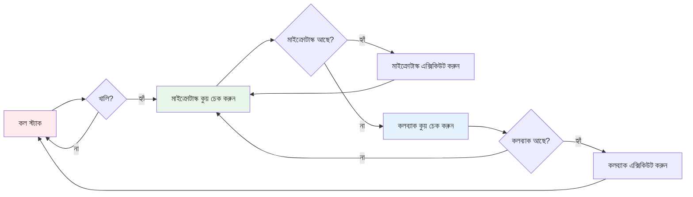

import { Callout } from "nextra/components";
import { Steps } from "nextra/components";
import { Tabs, Tab } from "nextra/components";
import { FileTree } from "nextra/components";

# ⏳ অ্যাসিনক্রোনাস প্রোগ্রামিং: সারাহর টাইম ল্যান্ড অ্যাডভেঞ্চার 🕰️

<Callout type="info" emoji="👋">
  স্বাগতম! এই অধ্যায়টি জটিল অ্যাসিনক্রোনাস ধারণাগুলোকে একটি মজাদার গল্পে
  রূপান্তর করে। সারাহর পিজ্জা শপ অভিযানে যোগ দিন এবং জাভাস্ক্রিপ্টের
  অ্যাসিনক্রোনাস সুপারপাওয়ার আয়ত্ত করুন!
</Callout>

---

## 🍕 সারাহ এবং পিজ্জা শপের সাথে পরিচয়

সারাহ খুব ক্ষুধার্ত এবং সে তার প্রিয় পিজ্জা দোকানে যায়। কিন্তু ব্যাপারটা হচ্ছে — সে একজন জাভাস্ক্রিপ্ট ডেভেলপার, আর সে এক জায়গায় দাঁড়িয়ে কিছু না করে সময় নষ্ট করতে চায় না!

একইভাবে, জাভাস্ক্রিপ্টও **মাল্টিটাস্ক** করতে চায়: পিজ্জা অর্ডার দিতে, মোবাইল গেম খেলতে, বন্ধুদের সঙ্গে চ্যাট করতে, এবং খাবার তৈরি হলে নোটিফিকেশন পেতে চায়। এটাই অ্যাসিনক্রোনাস প্রোগ্রামিংয়ের মূল কথা!

<Callout type="default" emoji="🎯">
  **মূল ধারণা**: অ্যাসিনক্রোনাস প্রোগ্রামিং জাভাস্ক্রিপ্টকে একাধিক কাজ একসাথে
  করতে দেয় — মেইন থ্রেড আটকে না রেখে। ঠিক যেভাবে সারাহ একসাথে অনেক কাজ করে যখন
  সে পিজ্জার জন্য অপেক্ষা করে!
</Callout>

---

## 1. 😴 সিঙ্ক্রোনাস: বিরক্তিকর অপেক্ষা

ভাবুন সারাহ সিদ্ধান্ত নিয়েছে... একদম বিরক্তিকর হয়ে ওঠার।

<Steps>

### ধাপ ১: পিজ্জা অর্ডার করুন

সারাহ কাউন্টারে গিয়ে তার অর্ডার দেয়।

### ধাপ ২: দাঁড়িয়ে অপেক্ষা করুন

সে কেবল দাঁড়িয়ে থাকে। না ফোন, না চ্যাট, কেবল... অপেক্ষা।

### ধাপ ৩: পিজ্জা পান

অবশেষে! পিজ্জা এসে গেছে, সে খেতে শুরু করতে পারে।

</Steps>

```js showLineNumbers
console.log("1. সারাহ পিজ্জা অর্ডার করছে 🍕");
console.log("2. সারাহ অপেক্ষা করছে... এবং করছে... 😴");
console.log("3. সারাহ অবশেষে তার পিজ্জা পেয়েছে! 😋");
// আউটপুট একের পর এক তৎক্ষণাৎ প্রদর্শিত হয়
```

<Callout type="warning" emoji="⚠️">
  **সমস্যা**: সিঙ্ক্রোনাস কোডে, বর্তমান কাজ শেষ না হওয়া পর্যন্ত সবকিছু থেমে
  থাকে। ভাবুন তো, যদি আপনার সম্পূর্ণ ওয়েব অ্যাপ ডেটা আনতে গিয়ে ফ্রিজ হয়ে
  যায়!
</Callout>

---

## 2. 🕹️ অ্যাসিনক্রোনাস: বুদ্ধিদীপ্ত অপেক্ষা

এবার সারাহ মাল্টিটাস্কিংয়ের জাদু আবিষ্কার করেছে! চলুন দেখি তিনটি শক্তিশালী অ্যাসিনক্রোনাস প্যাটার্ন।

### 📞 প্যাটার্ন ১: কলব্যাক - "আমাকে পরে ফোন করো!"

সারাহ পিজ্জা শপে তার ফোন নম্বর দিয়ে বলে "রেডি হলে ফোন করো!" এখন সে অন্যান্য কাজ করতে পারে।

<Tabs items={['বাস্তব জীবন', 'জাভাস্ক্রিপ্ট কোড', 'ফ্লো ডায়াগ্রাম']}>

<Tab>
<Steps>

### ধাপ ১: অর্ডার ও নম্বর দিন

সারাহ পিজ্জা অর্ডার দেয় এবং তার ফোন নম্বর দিয়ে আসে।

### ধাপ ২: অন্যান্য কাজ শুরু

সে মোবাইলে গেম খেলা শুরু করে।

### ধাপ ৩: কলব্যাক পাওয়া

দোকান থেকে ফোন আসে যখন পিজ্জা রেডি।

### ধাপ ৪: সংগ্রহ ও উপভোগ

সারাহ পিজ্জা সংগ্রহ করে এবং উপভোগ করে!

</Steps>
</Tab>

<Tab>
```js showLineNumbers
function orderPizza(callMeBack) {
  console.log("📱 সারাহ: 'এই নাও আমার নম্বর, রেডি হলে ফোন করো!'");

// পিজ্জা তৈরি হওয়ার সময়
setTimeout(() => {
console.log("🍕 দোকান: 'পিজ্জা রেডি! _রিং রিং_'");
callMeBack(); // কলব্যাক ফাংশন এক্সিকিউট
}, 2000); // ২ সেকেন্ড পর
}

// সারাহ কলব্যাক সহ পিজ্জা অর্ডার করে
orderPizza(() => {
console.log("😋 সারাহ: 'ইয়েস! এখন পিজ্জা নিতে যাচ্ছি!'");
});

// এটি সাথে সাথেই চলে - সারাহ অপেক্ষা করে না!
console.log("🎮 সারাহ: 'এখন একটু মোবাইল গেম খেলা যাক!'");
console.log("💬 সারাহ: 'বন্ধুদের টেক্সট করি...'");

````
</Tab>

<Tab>
```mermaid
graph TD
    A[সারাহ পিজ্জা অর্ডার দেয়] --> B[দোকান রান্না শুরু করে]
    A --> C[সারাহ গেম খেলে]
    B --> D[২ সেকেন্ড পর পিজ্জা রেডি]
    D --> E[দোকান সারাহকে কল দেয়]
    E --> F[কলব্যাক এক্সিকিউট হয়]
    F --> G[সারাহ পিজ্জা সংগ্রহ করে]

    style A fill:#e1f5fe
    style C fill:#f3e5f5
    style F fill:#e8f5e9
````

</Tab>

</Tabs>

<Callout type="info" emoji="💡">
  **মূল ধারণা**: কলব্যাক ফাংশন আপনাকে বলে — "এখন এটি করো, আর এটি শেষ হলে এই
  ফাংশনটি চালাও।" এতে মেইন থ্রেড ফাঁকা থাকে অন্য কাজের জন্য!
</Callout>

---

### 🎟️ প্যাটার্ন ২: প্রমিস - "ভবিষ্যতের টিকিট"

প্রমিস হল পিজা শপের নম্বরযুক্ত টিকিটের মতো। এটি এমন একটি মান প্রতিনিধিত্ব করে যা ভবিষ্যতে পাওয়া যাবে।

**সারার প্রমিস যাত্রা:**

১. 🎟️ **টিকিট নিন**: পিজা অর্ডার করুন, প্রমিস (টিকিট #৪২) পান
২. 🎮 **ব্যস্ত থাকুন**: অপেক্ষার সময় গেম খেলুন
৩. ✅ **রেজোলিউশন**: নম্বর ডাকা হল - প্রমিস পূর্ণ হল!
৪. ❌ **রিজেক্টেড**: রান্নাঘরের সমস্যা! প্রমিস এরর সহ ব্যর্থ হল

<Tabs items={['বাস্তব জীবন', 'বেসিক প্রমিস', 'চেইনিং প্রমিস', 'এরর হ্যান্ডলিং']}>

<Tab>
```js showLineNumbers {2,5,8,15,19}
function orderPizzaPromise() {
  return new Promise((resolve, reject) => {
    console.log("🎟️ সারা টিকিট #৪২ পায়");

    setTimeout(() => {
      const pizzaReady = Math.random() > 0.2; // ৮০% সাফল্যের হার

      if (pizzaReady) {
        resolve("🍕 পিজা প্রস্তুত!"); // সাফল্য!
      } else {
        reject("😢 দুঃখিত, আমাদের চিজ শেষ!"); // ব্যর্থতা!
      }
    }, 2000);

});
}

// প্রমিস ব্যবহার
orderPizzaPromise()
.then((successMessage) => {
console.log(successMessage);
console.log("😋 সারা তার পিজা উপভোগ করে!");
})
.catch((errorMessage) => {
console.log(errorMessage);
console.log("😤 সারা অন্য শপ থেকে অর্ডার করে!");
});

console.log("🎮 সারা অপেক্ষার সময় গেম খেলে...");

````

</Tab>

<Tab>
```js showLineNumbers
// সারা পিজা এবং পানীয় চায়
function orderDrinkPromise() {
  return new Promise((resolve) => {
    setTimeout(() => {
      resolve("🥤 পানীয় প্রস্তুত!");
    }, 1000);
  });
}

console.log("🎮 সারা অপেক্ষার সময় গেম খেলে...");
// প্রমিসগুলো একসাথে চেইন করুন
orderPizzaPromise()
.then((pizzaMessage) => {
console.log(pizzaMessage);
console.log("🤔 সারা: 'এখন আমার একটি পানীয় দরকার...'");
return orderDrinkPromise(); // আরেকটি প্রমিস রিটার্ন করুন
})
.then((drinkMessage) => {
console.log(drinkMessage);
console.log("🎉 সারা: 'নিখুঁত খাবারের কম্বো!'");
})
.catch((error) => {
console.log("😞 কিছু ভুল হয়েছে:", error);
});

````

</Tab>

<Tab>
```js showLineNumbers {2,12,18}
function orderPizzaPromise() {
  return new Promise((resolve, reject) => {
    setTimeout(() => {
      // বিভিন্ন পরিস্থিতি সিমুলেট করি
      const scenario = Math.random();

      if (scenario > 0.7) {
        resolve("🍕 সুস্বাদু পেপারোনি পিজা প্রস্তুত!");
      } else if (scenario > 0.4) {
        resolve("🍕 চিজ পিজা প্রস্তুত!");
      } else {
        reject(new Error("রান্নাঘরের সরঞ্জাম ভেঙে গেছে! 💥"));
      }
    }, 2000);

});
}

orderPizzaPromise()
.then((message) => {
console.log("✅ সাফল্য:", message);
return "সারা খুশি! 😊";
})
.then((happiness) => {
console.log(happiness);
})
.catch((error) => {
console.log("❌ এরর:", error.message);
console.log("🚗 সারা অন্য রেস্টুরেন্টে যায়...");
})
.finally(() => {
console.log("🏁 যেভাবেই হোক, সারার অ্যাডভেঞ্চার চলতে থাকে!");
});

````

</Tab>

</Tabs>

<Callout type="default" emoji="🔑">
  **প্রমিস স্টেটস:** - **পেন্ডিং** 🕐: হাতে টিকিট, নম্বর ডাকার অপেক্ষায় -
  **ফুলফিলড** ✅: পিজা প্রস্তুত! প্রমিস সফলভাবে রেজোল্ভ হল - **রিজেক্টেড** ❌:
  রান্নাঘরের সমস্যা! প্রমিস এরর সহ ব্যর্থ হল
</Callout>

### 💤 প্যাটার্ন ৩: অ্যাসিঙ্ক/অ্যাওয়েট - "প্রস্তুত না হওয়া পর্যন্ত ঘুমাও"

অ্যাসিঙ্ক/অ্যাওয়েট অ্যাসিঙ্ক্রোনাস কোডকে সিঙ্ক্রোনাসের মতো দেখায় এবং অনুভব করায় - ঠিক যেমন সারার ধাপে ধাপে টু-ডু লিস্ট!

<Tabs items={['বেসিক ব্যবহার', 'এরর হ্যান্ডলিং', 'মাল্টিপল অ্যাওয়েট', 'রিয়েল-ওয়ার্ল্ড উদাহরণ']}>

<Tab>
```js showLineNumbers {1,4}
async function sarahsLunch() {
  console.log("📝 সারার টু-ডু লিস্ট:");
  console.log("১. পিজা অর্ডার করুন 🍕");

try {
// প্রমিস রেজোল্ভ না হওয়া পর্যন্ত এখানে অপেক্ষা করুন
const pizzaMessage = await orderPizzaPromise();
console.log("২. ✅", pizzaMessage);
console.log("৩. সুস্বাদু খাবার উপভোগ করুন! 😋");
} catch (error) {
console.log("২. ❌ এরর হ্যান্ডল করুন:", error);
console.log("৩. ব্যাকআপ রেস্টুরেন্ট থেকে অর্ডার করুন 🏪");
}
}

// অ্যাসিঙ্ক ফাংশন কল করুন
sarahsLunch();

// এটি এখনও তৎক্ষণাৎ চলে!
console.log("🎮 সারা তার লাঞ্চ হ্যান্ডল করার সময় গেম খেলে...");

````

</Tab>

<Tab>
```js showLineNumbers {1,4,7,10}
async function sarahsDay() {
  console.log("🌅 সারা তার দিন শুরু করে...");

try {
// একাধিক অ্যাসিঙ্ক অপারেশন
console.log("☕ কফি অর্ডার করছে...");
await new Promise(resolve => setTimeout(resolve, 1000));
console.log("✅ কফি প্রস্তুত!");

    console.log("🍕 লাঞ্চ অর্ডার করছে...");
    const pizza = await orderPizzaPromise();
    console.log("✅", pizza);

    console.log("🚗 রাইডশেয়ার কল করছে...");
    await new Promise(resolve => setTimeout(resolve, 500));
    console.log("✅ রাইড এসে গেছে!");

} catch (error) {
console.log("😓 সারার দিনে একটি বাধা আসল:", error.message);
console.log("🔄 কিন্তু সে মানিয়ে নেয় এবং এগিয়ে যায়!");
} finally {
console.log("🌙 সারা তার দিন সফলভাবে শেষ করে!");
}
}

sarahsDay();

````

</Tab>

<Tab>
```js showLineNumbers
async function sarahsFullMeal() {
  console.log("🍽️ সারা একটি সম্পূর্ণ খাবার চায়...");

try {
// প্রথমে পিজার জন্য অপেক্ষা করুন
const pizza = await orderPizzaPromise();
console.log("🍕 পেলাম:", pizza);

    // তারপর পানীয়ের জন্য অপেক্ষা করুন
    const drink = await orderDrinkPromise();
    console.log("🥤 পেলাম:", drink);

    // সবশেষে, ডেজার্টের জন্য অপেক্ষা করুন
    const dessert = await new Promise(resolve => {
      setTimeout(() => resolve("🍰 চকলেট কেক প্রস্তুত!"), 1500);
    });
    console.log("🍰 পেলাম:", dessert);

    console.log("🎉 সারার নিখুঁত খাবার হল!");

} catch (error) {
console.log("😔 খাবারের পরিকল্পনা ব্যর্থ হল:", error.message);
}
}

sarahsFullMeal();

````

</Tab>

<Tab>
```js showLineNumbers
// রিয়েল-ওয়ার্ল্ড উদাহরণ: ইউজার ডাটা ফেচ করা
async function loadUserProfile(userId) {
  try {
    console.log(`👤 ইউজার ${userId} এর প্রোফাইল লোড হচ্ছে...`);

    // API কল সিমুলেট করুন
    const user = await fetchUser(userId);
    console.log(`✅ ইউজার লোড হল: ${user.name}`);

    const posts = await fetchUserPosts(userId);
    console.log(`✅ ${posts.length} টি পোস্ট পাওয়া গেল`);

    const friends = await fetchUserFriends(userId);
    console.log(`✅ ${friends.length} জন বন্ধু পাওয়া গেল`);

    return {
      user,
      posts,
      friends,
      loadedAt: new Date()
    };

} catch (error) {
console.error("💥 প্রোফাইল লোড করতে ব্যর্থ:", error.message);
throw error; // কলারকে হ্যান্ডল করার জন্য রি-থ্রো করুন
}
}

// ব্যবহার
async function displayProfile() {
try {
const profile = await loadUserProfile(123);
console.log("🎨 প্রোফাইল পেজ রেন্ডার হচ্ছে...", profile);
} catch (error) {
console.log("🚫 ইউজারকে এরর পেজ দেখানো হচ্ছে");
}
}

// হেল্পার ফাংশন (সিমুলেটেড)
function fetchUser(id) {
return new Promise(resolve =>
setTimeout(() => resolve({ id, name: "সারা" }), 800)
);
}

function fetchUserPosts(id) {
return new Promise(resolve =>
setTimeout(() => resolve([{}, {}, {}]), 600)
);
}

function fetchUserFriends(id) {
return new Promise(resolve =>
setTimeout(() => resolve([{}, {}]), 400)
);
}

````

</Tab>

</Tabs>

<Callout type="info" emoji="✨">
  **কেন অ্যাসিঙ্ক/অ্যাওয়েট দারুণ:** - সিঙ্ক্রোনাস কোডের মতো পড়া যায় -
  try/catch দিয়ে সহজ এরর হ্যান্ডলিং - কলব্যাক হেল বা জটিল প্রমিস চেইন নেই -
  সিকোয়েনশিয়াল অ্যাসিঙ্ক অপারেশনের জন্য পারফেক্ট
</Callout>

---

## ৩. 🔄 ইভেন্ট লুপ: পিজা শপ ম্যানেজার

ইভেন্ট লুপ হল জাভাস্ক্রিপ্টের গোপন সস - পর্দার আড়ালে সবকিছু সমন্বয় করে এমন ম্যানেজার!

<Callout type="default" emoji="🎭">
  **চরিত্রসমূহ:** - **শেফ** 👨‍🍳: জাভাস্ক্রিপ্ট ইঞ্জিন (সিঙ্গেল-থ্রেডেড) -
  **ম্যানেজার** 👔: ইভেন্ট লুপ (সমন্বয় মাস্টার) - **টাইমার** ⏰: setTimeout,
  setInterval - **ওয়েটার** 🍽️: প্রমিস, অ্যাসিঙ্ক অপারেশন
</Callout>

### পিজা শপ (ইভেন্ট লুপ) কিভাবে কাজ করে

<Steps>

### অর্ডার আসে

কাস্টমার (আপনার কোড) একটি অর্ডার দেয় (অ্যাসিঙ্ক অপারেশন)

### ম্যানেজার নোট নেয়

ইভেন্ট লুপ অ্যাসিঙ্ক টাস্ক রেজিস্টার করে এবং অন্য কাস্টমারদের সেবা চালিয়ে যায়

### ব্যাকগ্রাউন্ড কাজ

টাইমার টিক করে, নেটওয়ার্ক রিকোয়েস্ট উড়ে যায়, প্রমিস ব্যাকগ্রাউন্ডে রান্না হয়

### পিকআপের জন্য প্রস্তুত!

যখন অ্যাসিঙ্ক টাস্ক শেষ হয়, ইভেন্ট লুপ কলব্যাক/প্রমিস রেজোলিউশন কুয়েতে রাখে

### কাস্টমারকে পরিবেশন

যখন মেইন থ্রেড মুক্ত থাকে, ইভেন্ট লুপ ফলাফল পৌঁছে দেয়

</Steps>

```js showLineNumbers
console.log("👨‍🍳 শেফ দিন শুরু করে");

// তৎক্ষণাৎ টাস্ক
console.log("🥪 কাস্টমার ১: দ্রুত স্যান্ডউইচ অর্ডার");

// অ্যাসিঙ্ক টাস্ক ১ (টাইমার)
setTimeout(() => {
  console.log("🍕 কাস্টমার ২: ২ সেকেন্ড পরে পিজা প্রস্তুত!");
}, 2000);

// অ্যাসিঙ্ক টাস্ক ২ (ছোট টাইমার)
setTimeout(() => {
  console.log("☕ কাস্টমার ৩: ১ সেকেন্ড পরে কফি প্রস্তুত!");
}, 1000);

// তৎক্ষণাৎ টাস্ক
console.log("🥗 কাস্টমার ৪: তৎক্ষণাৎ সালাদ অর্ডার");

// অ্যাসিঙ্ক টাস্ক ৩ (প্রমিস)
Promise.resolve().then(() => {
  console.log("🧁 কাস্টমার ৫: ডিসপ্লে কেস থেকে কাপকেক!");
});

console.log("👔 ম্যানেজার: সব অর্ডার লগ করা হয়েছে, এখন আমরা অপেক্ষা করি...");

/* প্রত্যাশিত আউটপুট ক্রম:
   👨‍🍳 শেফ দিন শুরু করে
   🥪 কাস্টমার ১: দ্রুত স্যান্ডউইচ অর্ডার
   🥗 কাস্টমার ৪: তৎক্ষণাৎ সালাদ অর্ডার
   👔 ম্যানেজার: সব অর্ডার লগ করা হয়েছে, এখন আমরা অপেক্ষা করি...
   🧁 কাস্টমার ৫: ডিসপ্লে কেস থেকে কাপকেক!
   ☕ কাস্টমার ৩: ১ সেকেন্ড পরে কফি প্রস্তুত!
   🍕 কাস্টমার ২: ২ সেকেন্ড পরে পিজা প্রস্তুত!
*/
```

<Callout type="warning" emoji="🚨">
  **গুরুত্বপূর্ণ**: জাভাস্ক্রিপ্ট সিঙ্গেল-থ্রেডেড, কিন্তু ইভেন্ট লুপ টাস্কগুলো
  দক্ষতার সাথে জাগলিং করে মাল্টিটাস্কিং এর বিভ্রম তৈরি করে!
</Callout>

### ইভেন্ট লুপ ফেজ ভিজুয়ালাইজড



## ৪. 🎯 অ্যাডভান্সড অ্যাসিঙ্ক প্যাটার্ন

এখন যেহেতু সারা বেসিক আয়ত্ত করেছে, চলুন কিছু অ্যাডভান্সড টেকনিক অন্বেষণ করি!

### 🏃‍♀️ Promise.all() - "একসাথে সব অর্ডার করুন"

সারা একটি পার্টি আয়োজন করছে এবং একসাথে পিজা, পানীয় এবং কেক সব প্রস্তুত চায়।

<Tabs items={['প্যারালেল এক্সিকিউশন', 'রিয়েল উদাহরণ', 'এরর সিনারিও']}>

<Tab>
```js showLineNumbers {11}
// সারা একসাথে সব অর্ডার করে
function orderPartyFood() {
  const pizzaPromise = orderPizzaPromise();
  const drinkPromise = orderDrinkPromise();
  const cakePromise = new Promise(resolve =>
    setTimeout(() => resolve("🎂 জন্মদিনের কেক প্রস্তুত!"), 1500)
  );

  // সব শেষ হওয়া পর্যন্ত অপেক্ষা করুন
  return Promise.all([pizzaPromise, drinkPromise, cakePromise]);
}

async function sarahsParty() {
console.log("🎉 সারা: 'পার্টি প্ল্যানিং মোড অ্যাক্টিভেটেড!'");

try {
// সব অর্ডার একসাথে করা হয়েছে
const [pizza, drink, cake] = await orderPartyFood();

    console.log("🎊 পার্টি মেনু প্রস্তুত:");
    console.log("-", pizza);
    console.log("-", drink);
    console.log("-", cake);
    console.log("🥳 পার্টি শুরু হোক!");

} catch (error) {
console.log("😅 পার্টি বিলম্বিত:", error.message);
}
}

sarahsParty();

````

</Tab>

<Tab>
```js showLineNumbers
// রিয়েল-ওয়ার্ল্ড উদাহরণ: ড্যাশবোর্ড ডাটা লোড করা
async function loadDashboard() {
  console.log("📊 ড্যাশবোর্ড লোড হচ্ছে...");

const startTime = Date.now();

try {
// সবকিছু প্যারালেলে ফেচ করুন
const [
userStats,
recentActivity,
notifications,
weatherData
] = await Promise.all([
fetchUserStats(),
fetchRecentActivity(),
fetchNotifications(),
fetchWeatherData()
]);

    const loadTime = Date.now() - startTime;
    console.log(`✅ ড্যাশবোর্ড ${loadTime}ms এ লোড হল`);

    return {
      userStats,
      recentActivity,
      notifications,
      weatherData,
      loadTime
    };

} catch (error) {
console.error("💥 ড্যাশবোর্ড লোড করতে ব্যর্থ:", error.message);
throw error;
}
}

// সিমুলেটেড API ফাংশন
function fetchUserStats() {
return new Promise(resolve =>
setTimeout(() => resolve({ visits: 142, sales: 89 }), 800)
);
}

function fetchRecentActivity() {
return new Promise(resolve =>
setTimeout(() => resolve([{activity: "লগইন"}, {activity: "ক্রয়"}]), 600)
);
}

function fetchNotifications() {
return new Promise(resolve =>
setTimeout(() => resolve([{message: "ফিরে আসার জন্য স্বাগতম!"}]), 400)
);
}

function fetchWeatherData() {
return new Promise(resolve =>
setTimeout(() => resolve({ temp: 72, condition: "সূর্যালোক" }), 500)
);
}

````

</Tab>

<Tab>
```js showLineNumbers
// যদি ANY প্রমিস ব্যর্থ হয়, Promise.all ব্যর্থ হয়
function orderRiskyPartyFood() {
  const promises = [
    new Promise(resolve => setTimeout(() => resolve("🍕 পিজা প্রস্তুত"), 1000)),
    new Promise(resolve => setTimeout(() => resolve("🥤 পানীয় প্রস্তুত"), 800)),
    new Promise((resolve, reject) =>
      setTimeout(() => reject(new Error("🔥 কেকের ওভেন ভেঙে গেছে!")), 1200)
    )
  ];

  return Promise.all(promises);
}

async function handlePartyRisk() {
try {
const results = await orderRiskyPartyFood();
console.log("🎉 সব প্রস্তুত:", results);
} catch (error) {
console.log("😰 পার্টি সংকট:", error.message);
console.log("🛒 সারা দ্রুত দোকান থেকে ব্যাকআপ কেক কিনতে ছোটে!");
}
}

handlePartyRisk();

````

</Tab>

</Tabs>

### 🏃‍♂️ Promise.race() - "যে আগে আসবে তার সেবা"

সারা সত্যিই ক্ষুধার্ত এবং দুটি পিজা শপ থেকে অর্ডার করে - যে আগে আসবে সেটাই নেবে!

```js showLineNumbers {6}
function orderFromTwoShops() {
  const shop1 = new Promise((resolve) =>
    setTimeout(() => resolve("🍕 টনির পিজা প্রস্তুত!"), 2000)
  );
  const shop2 = new Promise((resolve) =>
    setTimeout(() => resolve("🍕 মারিওর পিজা প্রস্তুত!"), 1500)
  );

  // যে প্রথম শেষ হবে সেটা রিটার্ন করুন
  return Promise.race([shop1, shop2]);
}

async function hungrysarah() {
  console.log("😋 সারা: 'আমি দুটি শপ থেকে অর্ডার করছি!'");

  try {
    const firstPizza = await orderFromTwoShops();
    console.log("🏆 বিজয়ী:", firstPizza);
    console.log("📞 সারা অন্য শপকে বাতিল করতে কল করে");
  } catch (error) {
    console.log("😢 দুটি শপই ব্যর্থ:", error.message);
  }
}

hungrysarah();
```

### ⏱️ টাইমআউট সহ প্রমিস

সারা চিরকাল অপেক্ষা করতে চায় না - সে সর্বোচ্চ অপেক্ষার সময় নির্ধারণ করে!

```js showLineNumbers {1,8,17}
function promiseWithTimeout(promise, timeoutMs) {
  const timeout = new Promise((_, reject) =>
    setTimeout(() => reject(new Error(`${timeoutMs}ms পরে টাইমআউট`)), timeoutMs)
  );

  return Promise.race([promise, timeout]);
}

const slowPizza = new Promise((resolve) =>
  setTimeout(() => resolve("🍕 ধীর পিজা প্রস্তুত!"), 5000)
);

async function impatientSarah() {
  try {
    // সর্বোচ্চ ৩ সেকেন্ড অপেক্ষা করুন
    const result = await promiseWithTimeout(slowPizza, 3000);
    console.log("✅ পিজা পেলাম:", result);
  } catch (error) {
    console.log("⏰ সারা অপেক্ষা করতে ক্লান্ত:", error.message);
    console.log("🏃‍♀️ দ্রুত খাবার খুঁজতে যায়!");
  }
}

impatientSarah();
```

---

## ৫. 💡 সারার প্রো টিপস এবং সেরা অনুশীলন

<Callout type="info" emoji="🎓">
  **অ্যাসিঙ্ক সাফল্যের জন্য সারার স্বর্ণালী নিয়ম:**
</Callout>

### ✅ করণীয়

১. **সবসময় এরর হ্যান্ডল করুন**

```js
// ভালো: সবসময় এরর ক্যাচ করুন
try {
  const data = await fetchData();
  return data;
} catch (error) {
  console.error("কিছু ভুল হয়েছে:", error);
  return null;
}
```

২. **পঠনযোগ্যতার জন্য অ্যাসিঙ্ক/অ্যাওয়েট ব্যবহার করুন**

```js
// ভালো: পরিষ্কার এবং পঠনযোগ্য
async function processOrder() {
  const order = await createOrder();
  const payment = await processPayment(order);
  return await sendConfirmation(payment);
}
```

৩. **যখন সম্ভব প্যারালেলে চালান**

```js
// ভালো: স্বাধীন অপারেশনগুলো প্যারালেলে চালান
const [user, posts, comments] = await Promise.all([
  fetchUser(id),
  fetchPosts(id),
  fetchComments(id),
]);
```

### ❌ করণীয় নয়

১. **অ্যাওয়েট ভুলবেন না**

```js
// খারাপ: অ্যাওয়েট বাদ পড়েছে
async function badExample() {
  const data = fetchData(); // প্রমিস রিটার্ন করে!
  console.log(data); // ডাটা নয়, প্রমিস অবজেক্ট লগ করে
}

// ভালো: সঠিক অ্যাওয়েট
async function goodExample() {
  const data = await fetchData();
  console.log(data); // প্রকৃত ডাটা লগ করে
}
```

২. **সবকিছুর জন্য অ্যাসিঙ্ক ব্যবহার করবেন না**

```js
// খারাপ: অপ্রয়োজনীয় অ্যাসিঙ্ক
async function addNumbers(a, b) {
  return a + b; // কোন অ্যাসিঙ্ক অপারেশন নেই!
}

// ভালো: সাধারণ সিঙ্ক্রোনাস ফাংশন
function addNumbers(a, b) {
  return a + b;
}
```

৩. **অপ্রয়োজনীয় চেইনিং করবেন না**

```js
// খারাপ: অপ্রয়োজনীয় প্রমিস চেইনিং
fetchUser()
  .then((user) => fetchPosts(user.id))
  .then((posts) => fetchComments(posts[0].id))
  .then((comments) => console.log(comments));

// ভালো: পরিষ্কার অ্যাসিঙ্ক/অ্যাওয়েট
async function handleUser() {
  const user = await fetchUser();
  const posts = await fetchPosts(user.id);
  const comments = await fetchComments(posts[0].id);
  console.log(comments);
}
```

---

## ৬. 🧪 ইন্টারেক্টিভ কুইজ

সারার কুইজ দিয়ে আপনার অ্যাসিঙ্ক জ্ঞান পরীক্ষা করুন!

<Callout type="default" emoji="🤔">
**প্রশ্ন ১**: এই কোডের আউটপুট কী হবে?

```js
console.log("A");
setTimeout(() => console.log("B"), 0);
console.log("C");
```

<details>
<summary>উত্তর দেখুন</summary>
**উত্তর**: A, C, B

**ব্যাখ্যা**: ০ মিলিসেকেন্ড টাইমআউট হলেও, setTimeout অ্যাসিঙ্ক এবং ইভেন্ট লুপের মাধ্যমে যায়, তাই 'B' এর আগে 'C' প্রিন্ট হয়।

</details>
</Callout>

<Callout type="default" emoji="🤔">
**প্রশ্ন ২**: সিকোয়েনশিয়াল অপারেশনের জন্য সারা কোন প্যাটার্ন ব্যবহার করবে?

ক) Promise.all()  
খ) Promise.race()  
গ) async/await  
ঘ) কলব্যাক

<details>
<summary>উত্তর দেখুন</summary>
**উত্তর**: গ) async/await

**ব্যাখ্যা**: যেসব অপারেশন ক্রমানুসারে হওয়া আবশ্যক, সেগুলোর জন্য async/await সবচেয়ে পরিষ্কার এবং পঠনযোগ্য পদ্ধতি।

</details>
</Callout>

<Callout type="default" emoji="🤔">
**প্রশ্ন ৩**: এই কোডে কী সমস্যা আছে?

```js
async function processItems(items) {
  items.forEach(async (item) => {
    await processItem(item);
  });
  console.log("All done!");
}
```

<details>
<summary>উত্তর দেখুন</summary>
**উত্তর**: forEach এর ভিতরে async/await আশানুরূপ কাজ করে না। এর পরিবর্তে for...of লুপ বা Promise.all() ব্যবহার করুন:

```js
// Option 1: Sequential processing
async function processItems(items) {
  for (const item of items) {
    await processItem(item);
  }
  console.log("All done!");
}

// Option 2: Parallel processing
async function processItems(items) {
  await Promise.all(items.map((item) => processItem(item)));
  console.log("All done!");
}
```

</details>
</Callout>

---

## ৭. 🚀 বাস্তব জীবনের প্রয়োগ

চলুন দেখি সারা বাস্তব প্রজেক্টে অ্যাসিঙ্ক প্রোগ্রামিং কীভাবে প্রয়োগ করে!

### 📱 রেসিপি অ্যাপ তৈরি

<Tabs items={['ইউজার স্টোরি', 'ইমপ্লিমেন্টেশন', 'এরর হ্যান্ডলিং', 'পারফরম্যান্স']}>

<Tab>
**সারার রেসিপি অ্যাপের প্রয়োজনীয়তা:**

- 👤 **ইউজার অথেনটিকেশন**: রেসিপি দেখার আগে লগইন করতে হবে
- 🔍 **রেসিপি খোঁজা**: উপাদান দিয়ে রেসিপি খুঁজুন
- 📖 **রেসিপি বিস্তারিত**: রিভিউ এবং ছবি সহ রেসিপি লোড করুন
- ⭐ **প্রিয় সংরক্ষণ**: প্রিয় রেসিপি বুকমার্ক করুন
- 📱 **অফলাইন সাপোর্ট**: অফলাইন দেখার জন্য রেসিপি ক্যাশ করুন

প্রতিটি ফিচারে একাধিক অ্যাসিঙ্ক অপারেশন জড়িত!

</Tab>

<Tab>
```js showLineNumbers
class RecipeApp {
  constructor() {
    this.cache = new Map();
    this.user = null;
  }
  
  async login(email, password) {
    try {
      console.log("🔐 লগইন হচ্ছে...");
      const user = await this.authService.login(email, password);
      this.user = user;
      console.log(`👋 স্বাগতম, ${user.name}!`);
      return user;
    } catch (error) {
      console.error("❌ লগইন ব্যর্থ:", error.message);
      throw error;
    }
  }
  
  async searchRecipes(query) {
    try {
      console.log(`🔍 "${query}" খোঁজা হচ্ছে...`);
      
      // প্রথমে ক্যাশ চেক করুন
      if (this.cache.has(query)) {
        console.log("⚡ ক্যাশে পাওয়া গেছে!");
        return this.cache.get(query);
      }
      
      // বাহ্যিক API থেকে খোঁজা
      const recipes = await this.recipeAPI.search(query);
      
      // ফলাফল ক্যাশ করুন
      this.cache.set(query, recipes);
      
      console.log(`✅ ${recipes.length} টি রেসিপি পাওয়া গেছে`);
      return recipes;
      
    } catch (error) {
      console.error("🔍 খোঁজা ব্যর্থ:", error.message);
      return [];
    }
  }
  
  async loadRecipeDetails(recipeId) {
    try {
      console.log(`📖 রেসিপি ${recipeId} লোড হচ্ছে...`);
      
      // রেসিপি, রিভিউ এবং ছবি প্যারালেলে লোড করুন
      const [recipe, reviews, photos] = await Promise.all([
        this.recipeAPI.getRecipe(recipeId),
        this.recipeAPI.getReviews(recipeId),
        this.recipeAPI.getPhotos(recipeId)
      ]);
      
      console.log("✅ রেসিপি বিস্তারিত লোড হল!");
      return { recipe, reviews, photos };
      
    } catch (error) {
      console.error("📖 রেসিপি লোড করতে ব্যর্থ:", error.message);
      throw error;
    }
  }
  
  async saveToFavorites(recipeId) {
    try {
      if (!this.user) {
        throw new Error("প্রিয় সংরক্ষণ করতে লগইন করুন");
      }
      
      console.log("⭐ প্রিয়তে সংরক্ষণ করা হচ্ছে...");
      await this.favoritesAPI.save(this.user.id, recipeId);
      console.log("✅ প্রিয়তে যোগ করা হল!");
      
    } catch (error) {
      console.error("⭐ প্রিয় সংরক্ষণ ব্যর্থ:", error.message);
      throw error;
    }
  }
}

// ব্যবহারের উদাহরণ
async function demonstrateApp() {
const app = new RecipeApp();

try {
// লগইন
await app.login("sarah@example.com", "password123");

    // রেসিপি খোঁজা
    const recipes = await app.searchRecipes("পাস্তা");

    // প্রথম রেসিপির বিস্তারিত লোড
    if (recipes.length > 0) {
      const details = await app.loadRecipeDetails(recipes[0].id);
      console.log("📱 রেসিপি প্রদর্শন:", details.recipe);

      // প্রিয়তে সংরক্ষণ
      await app.saveToFavorites(recipes[0].id);
    }

} catch (error) {
console.error("❌ অ্যাপ এরর:", error.message);
}
}

demonstrateApp();

````

</Tab>

<Tab>
**এরর হ্যান্ডলিং কৌশল:**

১. **গ্রেসফুল ডিগ্রেডেশন**
   ```js
   async function loadRecipeWithFallback(recipeId) {
     try {
       const recipe = await this.recipeAPI.getRecipe(recipeId);
       return recipe;
     } catch (error) {
       console.warn("⚠️ ক্যাশ করা রেসিপি ব্যবহার করা হচ্ছে");
       return this.cache.get(recipeId) || null;
     }
   }
````

২. **রিট্রাই লজিক**

```js
async function fetchWithRetry(url, maxRetries = 3) {
  for (let i = 0; i < maxRetries; i++) {
    try {
      return await fetch(url);
    } catch (error) {
      if (i === maxRetries - 1) throw error;
      await new Promise((r) => setTimeout(r, 1000 * (i + 1)));
    }
  }
}
```

৩. **সার্কিট ব্রেকার**

```js
class CircuitBreaker {
  constructor() {
    this.failures = 0;
    this.isOpen = false;
  }

  async execute(fn) {
    if (this.isOpen) {
      throw new Error("সার্কিট ব্রেকার খোলা আছে");
    }

    try {
      const result = await fn();
      this.failures = 0;
      return result;
    } catch (error) {
      this.failures++;
      if (this.failures >= 3) {
        this.isOpen = true;
        setTimeout(() => (this.isOpen = false), 5000);
      }
      throw error;
    }
  }
}
```

</Tab>

<Tab>
**পারফরম্যান্স অপটিমাইজেশন:**

১. **ক্যাশিং**

```js
class RecipeCache {
  constructor(ttl = 3600000) {
    // ১ ঘন্টা
    this.cache = new Map();
    this.ttl = ttl;
  }

  set(key, value) {
    this.cache.set(key, {
      value,
      timestamp: Date.now(),
    });
  }

  get(key) {
    const item = this.cache.get(key);
    if (!item) return null;

    if (Date.now() - item.timestamp > this.ttl) {
      this.cache.delete(key);
      return null;
    }

    return item.value;
  }
}
```

২. **রিকোয়েস্ট ডিডুপ্লিকেশন**

```js
class RequestDeduplicator {
  constructor() {
    this.pending = new Map();
  }

  async execute(key, fn) {
    if (this.pending.has(key)) {
      return this.pending.get(key);
    }

    const promise = fn();
    this.pending.set(key, promise);

    try {
      return await promise;
    } finally {
      this.pending.delete(key);
    }
  }
}
```

৩. **প্রগ্রেসিভ লোডিং**

```js
async function loadRecipeProgressive(recipeId) {
  // প্রথমে বেসিক তথ্য লোড করুন
  const basic = await this.recipeAPI.getBasicInfo(recipeId);
  this.updateUI(basic);

  // তারপর বিস্তারিত লোড করুন
  const details = await this.recipeAPI.getDetails(recipeId);
  this.updateUI(details);

  // সবশেষে রিভিউ লোড করুন
  const reviews = await this.recipeAPI.getReviews(recipeId);
  this.updateUI({ reviews });
}
```

</Tab>

</Tabs>

---

## ৮. 📚 অতিরিক্ত রিসোর্স

<Callout type="info" emoji="📚">
  **সারার প্রস্তাবিত পড়াশোনা:**
</Callout>

- [MDN Web Docs: অ্যাসিঙ্ক জাভাস্ক্রিপ্ট](https://developer.mozilla.org/en-US/docs/Learn/JavaScript/Asynchronous)
- [JavaScript.info: প্রমিস, async/await](https://javascript.info/async)
- [You Don't Know JS: অ্যাসিঙ্ক এবং পারফরম্যান্স](https://github.com/getify/You-Dont-Know-JS/blob/1st-ed/async%20%26%20performance/README.md)

<Callout type="warning" emoji="⚠️">
  **এড়াতে হবে এমন সাধারণ ভুল:**
</Callout>

১. **কলব্যাক হেল**: নেস্টেড কলব্যাকের পরিবর্তে async/await ব্যবহার করুন
২. **অনহ্যান্ডেল্ড রিজেকশন**: সবসময় প্রমিস রিজেকশন ক্যাচ করুন
৩. **রেস কন্ডিশন**: অ্যাসিঙ্ক কোডে শেয়ার্ড স্টেট নিয়ে সাবধান থাকুন
৪. **মেমরি লিক**: ইভেন্ট লিসেনার এবং টাইমআউট পরিষ্কার করুন

---

## ৯. 🎯 অনুশীলন

<Callout type="default" emoji="💪">
  **অ্যাসিঙ্ক প্রোগ্রামিং আয়ত্ত করতে এই অনুশীলনগুলো করুন:**
</Callout>

১. **ওয়েদার অ্যাপ তৈরি**

- API থেকে আবহাওয়ার তথ্য আনুন
- লোডিং স্টেট হ্যান্ডল করুন
- এরর হ্যান্ডলিং যোগ করুন
- ক্যাশিং যোগ করুন

২. **ফাইল আপলোডার তৈরি**

- একাধিক ফাইল আপলোড করুন
- প্রগ্রেস দেখান
- এরর হ্যান্ডল করুন
- রিট্রাই লজিক যোগ করুন

৩. **চ্যাট অ্যাপ্লিকেশন তৈরি**

- রিয়েল-টাইম মেসেজিং
- ডিসকানেকশন হ্যান্ডল করুন
- মেসেজ কিউইং যোগ করুন
- টাইপিং ইন্ডিকেটর যোগ করুন

---

## ১০. 🎉 উপসংহার

<Callout type="success" emoji="🎓">
  **সারার চূড়ান্ত টিপস:**
</Callout>

- **সহজ থেকে শুরু করুন**: বেসিক async/await দিয়ে শুরু করুন
- **অনুশীলন করুন**: বাস্তব প্রজেক্ট তৈরি করুন
- **প্যাটার্ন শিখুন**: সাধারণ অ্যাসিঙ্ক প্যাটার্নগুলো অধ্যয়ন করুন
- **ডিবাগ করুন**: ব্রাউজার ডেভ টুলস ব্যবহার করুন
- **আপডেট থাকুন**: জাভাস্ক্রিপ্ট নিউজ ফলো করুন

মনে রাখবেন: ধাপে ধাপে এগিয়ে যান, এবং ভুল করতে ভয় পাবেন না। এভাবেই আমরা শিখি! 🚀

---
