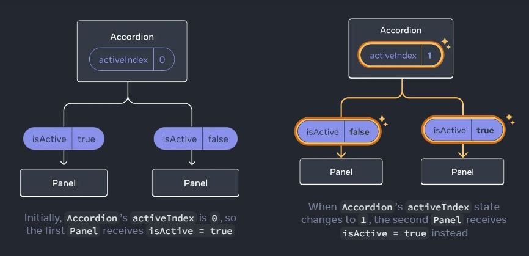

# React-এ Lifting State Up 🚀

React অ্যাপে কাজ করার সময়, আপনি প্রায়ই দেখবেন যে দুই বা তার বেশি কম্পোনেন্টকে একই state শেয়ার ও সমন্বয় করতে হয়। এর জন্য সবচেয়ে গুরুত্বপূর্ণ কৌশল হচ্ছে **Lifting State Up**! চলুন দেখি কিভাবে কম্পোনেন্টগুলো একে অপরের সাথে সহজে state শেয়ার করতে পারে 🤝

---

## কেন Lifting State Up দরকার? 🤔

অনেক সময়, আপনি চান দুইটি কম্পোনেন্টের state একসাথে পরিবর্তন হোক। যেমন, আপনার কাছে একটি `Products` কম্পোনেন্ট এবং একটি `Cart` কম্পোনেন্ট আছে, এবং আপনি চান দুটোই cart-এর অবস্থা জানুক। যদি প্রত্যেকটি নিজের state রাখে, তাহলে তারা অসামঞ্জস্যপূর্ণ হয়ে পড়বে! তাই, এই শেয়ার করা state কে তাদের সবচেয়ে কাছের parent-এ নিয়ে যান এবং props হিসেবে নিচে পাঠান। এটিই হচ্ছে **lifting state up**।

---

## বাস্তব উদাহরণ 🌳

ধরুন দুই ভাইবোন (কম্পোনেন্ট) একটি খেলনা (state) শেয়ার করতে চায়। যদি প্রত্যেকে নিজের খেলনা রাখে, তাহলে ঝামেলা হতে পারে! কিন্তু তাদের বাবা-মা (common parent component) খেলনাটি রাখে এবং প্রয়োজনে দেয়, তাহলে সবাই খুশি ও সমন্বিত থাকে! 👨‍👩‍👧‍👦

---

## Step-by-Step: Lifting State Up 🪜

চলুন একটি বাস্তব উদাহরণ দেখি!

### উদাহরণ: Accordion Panels 📚

ধরুন আপনার একটি `Accordion` আছে, যার মধ্যে দুইটি `Panel` কম্পোনেন্ট। আপনি চান একসাথে শুধুমাত্র একটি panel খোলা থাকুক।

#### ১️⃣ প্রাথমিক অবস্থা: প্রতিটি Panel-এ Local State

```jsx
function Panel({ title, children }) {
  const [isActive, setIsActive] = useState(false);
  return (
    <section>
      <h3>{title}</h3>
      {isActive ? (
        <p>{children}</p>
      ) : (
        <button onClick={() => setIsActive(true)}>Show</button>
      )}
    </section>
  );
}

function Accordion() {
  return (
    <>
      <Panel title="About">About content...</Panel>
      <Panel title="Etymology">Etymology content...</Panel>
    </>
  );
}
```

প্রতিটি `Panel` নিজের state ম্যানেজ করে। কিন্তু একটিতে ক্লিক করলে অন্যটির কোনো পরিবর্তন হয় না। যদি চান একসাথে একটি panel-ই খোলা থাকবে?

---

#### ২️⃣ Step 1: State শিশুদের থেকে সরান 🧹

`isActive` state-টি `Panel` থেকে সরিয়ে parent `Accordion`-এ নিয়ে যান।

```jsx
function Panel({ title, children, isActive, onShow }) {
  return (
    <section>
      <h3>{title}</h3>
      {isActive ? <p>{children}</p> : <button onClick={onShow}>Show</button>}
    </section>
  );
}
```

---

#### ৩️⃣ Step 2: State parent-এ যুক্ত করুন 🏠

এবার parent ঠিক করবে কোন panel খোলা থাকবে:

```jsx
function Accordion() {
  const [activeIndex, setActiveIndex] = useState(0);
  return (
    <>
      <Panel
        title="About"
        isActive={activeIndex === 0}
        onShow={() => setActiveIndex(0)}
      >
        About content...
      </Panel>
      <Panel
        title="Etymology"
        isActive={activeIndex === 1}
        onShow={() => setActiveIndex(1)}
      >
        Etymology content...
      </Panel>
    </>
  );
}
```

এখন একসাথে শুধুমাত্র একটি panel খোলা থাকবে! 🎉

---

## ভিজ্যুয়াল ডায়াগ্রাম 🖼️



---

## কিভাবে কাজ করে? 🧠

- **State parent-এ সংরক্ষিত থাকে** (যেমন, `Accordion`-এ)।
- **শিশু কম্পোনেন্টগুলো state ও event handler props হিসেবে পায়**।
- **শিশু কম্পোনেন্টগুলো handler কল করে parent-এর state আপডেট করে**।
- **Parent নতুন props দিয়ে শিশুদের রি-রেন্ডার করে**।

এই প্যাটার্ন আপনার UI কে সমন্বিত রাখে এবং বাগ এড়াতে সাহায্য করে! 🐞

---

## আরেকটি উদাহরণ: Cart State শেয়ার করা 🛒

ধরুন আপনার কাছে `Products` এবং `Cart` নামে দুইটি sibling কম্পোনেন্ট আছে। আপনি চান `Products` থেকে cart-এ পণ্য যোগ করতে এবং `Cart`-এ তা দেখাতে।

```jsx
function App() {
  const [cart, setCart] = useState([]);
  return (
    <>
      <Products cart={cart} setCart={setCart} />
      <Cart cart={cart} />
    </>
  );
}

function Products({ cart, setCart }) {
  const products = [
    { id: 1, name: "Apple 🍎" },
    { id: 2, name: "Banana 🍌" },
  ];
  const addToCart = (product) => setCart([...cart, product]);
  return (
    <div>
      <h2>Products</h2>
      {products.map((product) => (
        <div key={product.id}>
          {product.name}
          <button onClick={() => addToCart(product)}>Add to Cart</button>
        </div>
      ))}
    </div>
  );
}

function Cart({ cart }) {
  return (
    <div>
      <h2>Cart</h2>
      {cart.length === 0 ? (
        <p>No items in cart.</p>
      ) : (
        <ul>
          {cart.map((item, idx) => (
            <li key={idx}>{item.name}</li>
          ))}
        </ul>
      )}
    </div>
  );
}
```

---

## সংক্ষেপে 📝

- 🔼 **State উপরে তুলুন** (lift up) সবচেয়ে কাছের parent-এ, যাতে একাধিক কম্পোনেন্টে শেয়ার করা যায়।
- 📦 State ও updater function props হিসেবে পাঠান।
- 🧩 শিশু কম্পোনেন্টগুলো props ব্যবহার করে state দেখায় ও আপডেট করে।
- 🧹 এতে UI সমন্বিত থাকে এবং ডুপ্লিকেশন এড়ানো যায়!

---

## নিজেকে চ্যালেঞ্জ করুন! 💡

এটি চেষ্টা করুন: আপনার কাছে দুইটি input field আছে। কিভাবে করবেন যাতে যেকোনো একটিতে টাইপ করলে দুটোতেই একই ভ্যালু দেখায়?

```jsx
function SyncedInputs() {
  const [text, setText] = useState("");
  return (
    <>
      <input value={text} onChange={(e) => setText(e.target.value)} />
      <input value={text} onChange={(e) => setText(e.target.value)} />
    </>
  );
}
```

কেন এটি কাজ করে ব্যাখ্যা করুন! (ইঙ্গিত: state উপরে তোলা হয়েছে!)

---

## আরও পড়ুন 📚

- [React Docs: Sharing State Between Components](https://react.dev/learn/sharing-state-between-components)
- [Thinking in React](https://react.dev/learn/thinking-in-react)

শুভ কোডিং! 🎉
