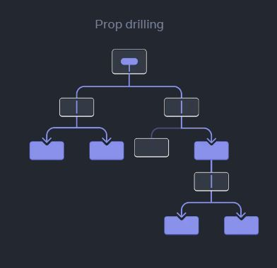
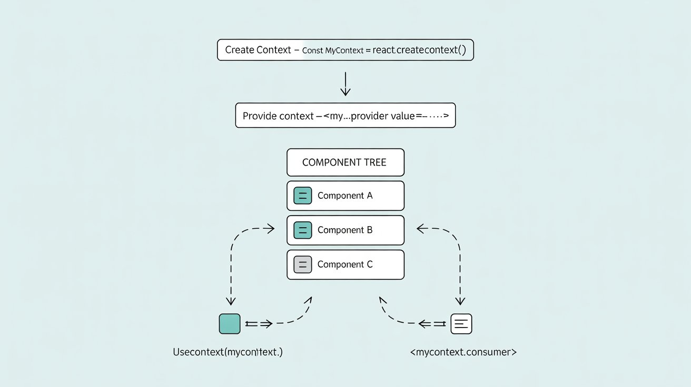

# React-এ Context দিয়ে ডেটা গভীরে পাঠানো 🌳✨

> **লেভেল:** বিগিনার থেকে অ্যাডভান্সড  
> **লক্ষ্য:** "prop drilling" এড়িয়ে সহজে ডেটা শেয়ার করা শিখুন।

---

## 🧐 Context কেন দরকার?

ধরুন, আপনার একটি ফ্যামিলি ট্রি আছে, আর দাদু থেকে নাতি পর্যন্ত একটা গোপন কথা পৌঁছাতে চান। যদি প্রতিটি প্যারেন্টের মাধ্যমে ফিসফিস করে সেই কথা পৌঁছাতে হয়, তাহলে সেটা খুবই ঝামেলার ও বিরক্তিকর!  
React-এ একে বলে **prop drilling**—মানে, এমন ডেটা অনেকগুলো কম্পোনেন্টের ভেতর দিয়ে পাঠানো, যেগুলো আসলে সেই ডেটা ব্যবহারই করে না।

**Context** হলো ম্যাজিক ইন্টারকম: দাদু একবার বললেই, যেকোনো নাতি শুনতে পাবে—গভীর যতই হোক!

**উপমা:**
- **Props:** একে একে হাতে হাতে চিরকুট পাঠানো
- **Context:** গ্রুপ চ্যাট—সবাই একসাথে পায়!

---

## 🚩 Prop Drilling-এর সমস্যা

চিত্র দেখুন:

```
<App>
  <Parent>
    <Child>
      <Grandchild />
    </Child>
  </Parent>
</App>
```

ধরুন `<Grandchild />`-এ `<App>` থেকে ডেটা দরকার।  
Props দিয়ে পাঠাতে হলে প্রতিটি লেয়ার দিয়ে পাঠাতে হবে:

```jsx
function App() {
  const theme = "dark";
  return <Parent theme={theme} />;
}
function Parent({ theme }) {
  return <Child theme={theme} />;
}
function Child({ theme }) {
  return <Grandchild theme={theme} />;
}
function Grandchild({ theme }) {
  return <div>Theme: {theme}</div>;
}
```

**সমস্যা:**
- বারবার একই props পাঠাতে হয়
- অ্যাপ বড় হলে মেইনটেইন করা কঠিন
- মাঝের কম্পোনেন্টগুলো অপ্রয়োজনীয় props পায় ("prop pollution")

---

## 🦸‍♂️ সমাধান: React Context

**Context** দিয়ে—
- যেকোনো গভীর কম্পোনেন্টে ডেটা পাঠানো যায়
- প্রতিটি লেয়ার দিয়ে props পাঠাতে হয় না
- কোড পরিষ্কার ও মেইনটেইনেবল হয়

> **টিপ:** অনেক কম্পোনেন্টে দরকার এমন ডেটার জন্য context ব্যবহার করুন (যেমন theme, user info, language)। ছোট/লোকাল state-এ context না ব্যবহার করাই ভালো।

---

## 🛠️ Context কিভাবে কাজ করে (ধাপে ধাপে)

### ১. **Context তৈরি করুন**

```jsx
import { createContext } from "react";
const ThemeContext = createContext("light"); // 'light' ডিফল্ট ভ্যালু
```

### ২. **Context Value Provide করুন**

আপনার কম্পোনেন্ট ট্রি-কে provider দিয়ে ঘিরে দিন:

```jsx
<ThemeContext.Provider value="dark">
  <App />
</ThemeContext.Provider>
```

### ৩. **Context Value Consume করুন**

যেকোনো চাইল্ড কম্পোনেন্টে `useContext` দিয়ে ভ্যালু নিন:

```jsx
import { useContext } from "react";

function Grandchild() {
  const theme = useContext(ThemeContext);
  return <div>Theme: {theme}</div>;
}
```

---

## 🖼️ চিত্র: Context বনাম Prop Drilling


_Prop drilling: মান প্রতিটি লেয়ার দিয়ে যাচ্ছে_


_Context: provider-এর নিচে যেকোনো জায়গায় মান পাওয়া যায়!_

---

## 🏆 বাস্তব উদাহরণ: থিমিং

ধরুন, ইউজার light/dark mode বদলাতে পারে। অনেক কম্পোনেন্টে থিম দরকার। বারবার props না পাঠিয়ে context ব্যবহার করুন!

```jsx
// ThemeContext.js
import { createContext } from "react";
export const ThemeContext = createContext("light");

// App.js
import { ThemeContext } from "./ThemeContext";
import { useState } from "react";

function App() {
  const [theme, setTheme] = useState("light");
  return (
    <ThemeContext.Provider value={theme}>
      <Toolbar />
      <button onClick={() => setTheme(theme === "light" ? "dark" : "light")}>Toggle Theme</button>
    </ThemeContext.Provider>
  );
}

// যেকোনো গভীর কম্পোনেন্ট
import { useContext } from "react";
import { ThemeContext } from "./ThemeContext";

function Button() {
  const theme = useContext(ThemeContext);
  return <button className={theme}>থিম দিয়ে স্টাইলড!</button>;
}
```

---

## অ্যাডভান্সড: একাধিক Context

একই কম্পোনেন্টে একাধিক context ব্যবহার করা যায়:

```jsx
const UserContext = createContext(null);
const ThemeContext = createContext("light");

function Profile() {
  const user = useContext(UserContext);
  const theme = useContext(ThemeContext);
  return <div className={theme}>Hello, {user.name}!</div>;
}
```

---

## 🔥 Context + useReducer: শক্তিশালী স্টেট ম্যানেজমেন্ট

### কেন Context + Reducer?

- **useReducer** জটিল state logic সহজে ও পূর্বানুমানযোগ্যভাবে ম্যানেজ করে
- **Context** সেই state ও dispatch ফাংশন যেকোনো কম্পোনেন্টে পাঠাতে পারে
- **একসাথে:** ছোটখাটো Redux-এর মতো—centralized, testable, scalable state management

**উপমা:**
- **Reducer:** কন্ট্রোল সেন্টার—action অনুযায়ী state আপডেট করে
- **Context:** রেডিও টাওয়ার—state ও dispatch যেকোনো কম্পোনেন্টে পৌঁছে দেয়

### বাস্তব উদাহরণ: Todo List (Context + Reducer)

```jsx
// TodoContext.js
import { createContext, useReducer, useContext } from "react";

const TodoContext = createContext();

function todoReducer(todos, action) {
  switch (action.type) {
    case "add":
      return [...todos, { id: Date.now(), text: action.text, done: false }];
    case "toggle":
      return todos.map((todo) =>
        todo.id === action.id ? { ...todo, done: !todo.done } : todo
      );
    case "remove":
      return todos.filter((todo) => todo.id !== action.id);
    default:
      throw new Error("Unknown action: " + action.type);
  }
}

export function TodoProvider({ children }) {
  const [todos, dispatch] = useReducer(todoReducer, []);
  return (
    <TodoContext.Provider value={{ todos, dispatch }}>
      {children}
    </TodoContext.Provider>
  );
}

export function useTodos() {
  return useContext(TodoContext);
}
```

```jsx
// App.js
import { TodoProvider, useTodos } from "./TodoContext";

function AddTodo() {
  const { dispatch } = useTodos();
  const [text, setText] = useState("");
  return (
    <form
      onSubmit={(e) => {
        e.preventDefault();
        dispatch({ type: "add", text });
        setText("");
      }}
    >
      <input value={text} onChange={(e) => setText(e.target.value)} />
      <button>Add</button>
    </form>
  );
}

function TodoList() {
  const { todos, dispatch } = useTodos();
  return (
    <ul>
      {todos.map((todo) => (
        <li
          key={todo.id}
          style={{ textDecoration: todo.done ? "line-through" : "" }}
        >
          {todo.text}
          <button onClick={() => dispatch({ type: "toggle", id: todo.id })}>
            Toggle
          </button>
          <button onClick={() => dispatch({ type: "remove", id: todo.id })}>
            Remove
          </button>
        </li>
      ))}
    </ul>
  );
}

export default function App() {
  return (
    <TodoProvider>
      <h1>Todo List</h1>
      <AddTodo />
      <TodoList />
    </TodoProvider>
  );
}
```

**কিভাবে কাজ করে:**
- `TodoProvider` পুরো অ্যাপকে ঘিরে রাখে এবং state (`todos`) ও `dispatch` যেকোনো কম্পোনেন্টে দেয়
- যেকোনো কম্পোনেন্ট state পড়তে বা action (add, toggle, remove) পাঠাতে পারে—prop drilling ছাড়াই!
- সব লজিক এক জায়গায় থাকায় টেস্ট ও মেইনটেইন সহজ

> **টিপ:** এই প্যাটার্ন authentication, shopping cart, notification ইত্যাদিতেও দারুণ!

---

## 🧠 সাধারণ ভুল ও ডিবাগিং

- **অপ্রয়োজনীয় re-render:** প্রতিবার নতুন object/function context value দিলে সব consumer re-render হয়। `useMemo` দিয়ে value memoize করুন:

```jsx
const value = useMemo(() => ({ user, logout }), [user]);
<SomeContext.Provider value={value}>...</SomeContext.Provider>;
```

- **Provider ভুলে যাওয়া:** provider ছাড়া `useContext` ব্যবহার করলে ডিফল্ট ভ্যালু পাবেন (প্রায়ই ভুল হয়!)
- **অনেক nested provider:** খুব বেশি provider কোড পড়া কঠিন করে তোলে—related context একসাথে group করুন
- **অতিরিক্ত context:** সব ডেটার জন্য context দরকার নেই! বেশিরভাগ ক্ষেত্রে props-ই যথেষ্ট
- **ডিবাগিং:** React DevTools দিয়ে context provider/consumer দেখুন

---

## 💡 বেস্ট প্র্যাকটিস ও টিপস

- **শুধু গ্লোবাল/শেয়ারড ডেটার জন্য context** (theme, user, locale)
- **অতিরিক্ত context ব্যবহার করবেন না!** বেশিরভাগ ডেটা props-এ রাখুন
- **ভিন্ন ডেটার জন্য আলাদা context** (ThemeContext, AuthContext)
- **object/function context value হলে memoize করুন**
- **জটিল state-এ reducer + context**
- **context কী দেয়, কোথায় ব্যবহৃত—কমেন্ট ও ডকুমেন্ট করুন**

---

## ⚠️ কখন context ব্যবহার করবেন না

- লোকাল state (form input, toggle)—`useState` ব্যবহার করুন
- শুধু কিছু কম্পোনেন্টে দরকার—props-ই সহজ
- context value বদলালে সব consumer re-render—পারফরম্যান্স খেয়াল রাখুন
- খুব দ্রুত বদলানো ডেটা (যেমন mouse position) context-এ রাখবেন না

---

## 📚 আরও জানুন

- [React অফিসিয়াল ডক: Passing Data Deeply with Context](https://react.dev/learn/passing-data-deeply-with-context)
- [React অফিসিয়াল ডক: Context API Reference](https://react.dev/reference/react/createContext)
- [Reactiflux Discord কমিউনিটি](https://www.reactiflux.com/)
- [CodeSandbox: Context Example](https://codesandbox.io/s/react-context-example-2v8z6)
- [Kent C. Dodds: React Context ভালোভাবে ব্যবহার](https://kentcdodds.com/blog/how-to-use-react-context-effectively)

---

## 📝 FAQ

**প্রশ্ন: এক কম্পোনেন্টে একাধিক context ব্যবহার করা যাবে?**  
উত্তর: হ্যাঁ! একাধিক provider ও `useContext` একসাথে ব্যবহার করুন।

**প্রশ্ন: context কি Redux-এর বিকল্প?**  
উত্তর: সহজ/মাঝারি গ্লোবাল state-এ context যথেষ্ট। খুব জটিল state-এ Redux বা Zustand ভালো।

**প্রশ্ন: context কি স্লো?**  
উত্তর: বেশিরভাগ অ্যাপে না, তবে খুব দ্রুত বদলানো ডেটা context-এ রাখবেন না।

**প্রশ্ন: context ডিবাগ করবেন কিভাবে?**  
উত্তর: React DevTools দিয়ে provider/consumer দেখুন, provider মিসিং বা অপ্রয়োজনীয় re-render চেক করুন।

---

## 🎯 চ্যালেঞ্জ: Prop Drilling থেকে Context-এ রিফ্যাক্টর করুন

যে কম্পোনেন্ট ট্রি-তে ৩+ লেয়ার props দিয়ে ডেটা পাঠাতে হয়, সেটাকে context দিয়ে রিফ্যাক্টর করুন—দেখুন কোড কত পরিষ্কার হয়!

---

## 🏁 সারাংশ

- Context দিয়ে prop drilling এড়ানো ও গ্লোবাল ডেটা শেয়ার সহজ
- বেশিরভাগ ক্ষেত্রে props-ই যথেষ্ট, context শুধু গ্লোবাল/শেয়ারড ডেটায়
- অ্যাডভান্সড state management-এ useReducer + context
- context ডিবাগ ও ডকুমেন্ট করুন

শুভ কোডিং! 🚀
