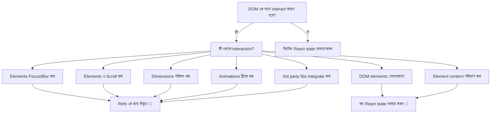

# 🎯 React Refs এর সাথে DOM Manipulation শিখুন

আপনি কি কখনো অনুভব করেছেন যে আপনি React এর সাথে যুদ্ধ করছেন যখন আপনি শুধু একটি input ফোকাস করতে বা কোনো section এ scroll করতে চান? **refs** এর জগতে স্বাগতম – DOM এ আপনার সরাসরি প্রবেশদ্বার! 🚀

refs কে React এর এই কথা বলার মতো ভাবুন: _"ঠিক আছে, কখনো কখনো তোমার নিয়ম ভাঙতে হয়। এই নাও DOM এর backstage pass!"_

---

## 🤔 কেন আমাদের Refs প্রয়োজন?

React declaratively UI state পরিচালনা করতে দুর্দান্ত, কিন্তু কখনো কখনো আপনার প্রয়োজন:

- 🎯 একটি নির্দিষ্ট input field ফোকাস করা
- 📏 একটি element এর dimensions পরিমাপ করা
- 🎬 Imperatively animations ট্রিগার করা
- 📜 নির্দিষ্ট content এ scroll করা
- 🎮 Third-party DOM libraries এর সাথে integrate করা

এখানেই refs এর জৌলুস! এগুলো সরাসরি DOM access এর জন্য আপনার escape hatch।

---

## 🔍 Ref আসলে কী?

একটি **ref** হলো একটি persistent box এর মতো যা একটি DOM element (বা যেকোনো mutable value) এর reference রাখে। State এর বিপরীতে, ref পরিবর্তন করলে re-render ট্রিগার হয় না – এটি শুধু renders জুড়ে কিছু "মনে রাখার" একটি উপায়।

```jsx
import { useRef } from "react";

function MyComponent() {
  // এটি একটি "বাক্স" তৈরি করে যা আমাদের DOM element ধরে রাখবে
  const elementRef = useRef(null);

  // elementRef.current প্রাথমিকভাবে null হবে
  // React এটি attach করার পরে elementRef.current প্রকৃত DOM node হবে
}
```

---

## 🎮 আপনার প্রথম Ref: জাদুকরী Focus Button

চলুন classic উদাহরণ দিয়ে শুরু করি – একটি input field ফোকাস করা:

```jsx
import { useRef } from "react";

export default function FocusDemo() {
  const inputRef = useRef(null);

  function handleFocus() {
    // সরাসরি DOM manipulation! 🎯
    inputRef.current.focus();
  }

  return (
    <div style={{ padding: "20px" }}>
      <input
        ref={inputRef}
        placeholder="আমাকে ফোকাস করতে বাটনে ক্লিক করুন!"
        style={{
          padding: "10px",
          marginRight: "10px",
          borderRadius: "4px",
          border: "2px solid #ddd",
        }}
      />
      <button
        onClick={handleFocus}
        style={{
          padding: "10px 20px",
          backgroundColor: "#007acc",
          color: "white",
          border: "none",
          borderRadius: "4px",
          cursor: "pointer",
        }}
      >
        ✨ Input ফোকাস করুন
      </button>
    </div>
  );
}
```

**এখানে কী ঘটছে?**

1. `useRef(null)` আমাদের ref তৈরি করে null এর প্রাথমিক মান সহ
2. `ref={inputRef}` React কে বলে: "এই DOM element টি আমার ref box এ রাখো!"
3. `inputRef.current.focus()` input ফোকাস করতে সরাসরি DOM API কল করে

---

## 🎢 Smooth Scrolling অ্যাডভেঞ্চার

সেই সন্তোষজনক smooth scroll effects তৈরি করতে চান? Refs এটি অবিশ্বাস্যভাবে সহজ করে তোলে:

```jsx
import { useRef } from "react";

export default function ScrollingDemo() {
  const topRef = useRef(null);
  const middleRef = useRef(null);
  const bottomRef = useRef(null);

  const scrollToSection = (ref) => {
    ref.current?.scrollIntoView({
      behavior: "smooth",
      block: "start",
    });
  };

  return (
    <div>
      {/* Navigation */}
      <nav
        style={{
          position: "fixed",
          top: 0,
          left: 0,
          right: 0,
          backgroundColor: "white",
          padding: "10px",
          boxShadow: "0 2px 4px rgba(0,0,0,0.1)",
          zIndex: 1000,
        }}
      >
        <button onClick={() => scrollToSection(topRef)}>🏠 শীর্ষ</button>
        <button onClick={() => scrollToSection(middleRef)}>🏔️ মধ্য</button>
        <button onClick={() => scrollToSection(bottomRef)}>🏖️ নিম্ন</button>
      </nav>

      {/* Content Sections */}
      <section
        ref={topRef}
        style={{
          height: "100vh",
          backgroundColor: "#e3f2fd",
          display: "flex",
          alignItems: "center",
          justifyContent: "center",
          fontSize: "2rem",
        }}
      >
        🏠 শীর্ষে স্বাগতম!
      </section>

      <section
        ref={middleRef}
        style={{
          height: "100vh",
          backgroundColor: "#f3e5f5",
          display: "flex",
          alignItems: "center",
          justifyContent: "center",
          fontSize: "2rem",
        }}
      >
        🏔️ আপনি মধ্যে পৌঁছেছেন!
      </section>

      <section
        ref={bottomRef}
        style={{
          height: "100vh",
          backgroundColor: "#e8f5e8",
          display: "flex",
          alignItems: "center",
          justifyContent: "center",
          fontSize: "2rem",
        }}
      >
        🏖️ পৃথিবীর নিচে!
      </section>
    </div>
  );
}
```

> **প্রো টিপ:** `ref.current?.scrollIntoView()` এ optional chaining (`?.`) ref এখনো attach না হলে error প্রতিরোধ করে!

---

## 🎨 Dynamic Refs সহ Image Gallery

এখানে বিষয়গুলো রোমাঞ্চকর হয়ে ওঠে – dynamically একাধিক refs পরিচালনা করা:

```jsx
import { useRef } from "react";

export default function ImageGallery() {
  // Image data এর array
  const images = [
    {
      id: 1,
      url: "https://picsum.photos/300/200?random=1",
      title: "পর্বতের হ্রদ",
    },
    {
      id: 2,
      url: "https://picsum.photos/300/200?random=2",
      title: "বনের পথ",
    },
    {
      id: 3,
      url: "https://picsum.photos/300/200?random=3",
      title: "সমুদ্রের ঢেউ",
    },
    {
      id: 4,
      url: "https://picsum.photos/300/200?random=4",
      title: "মরুভূমির সূর্যাস্ত",
    },
  ];

  // প্রতিটি image এর জন্য refs তৈরি করুন
  const imageRefs = useRef({});

  const scrollToImage = (imageId) => {
    imageRefs.current[imageId]?.scrollIntoView({
      behavior: "smooth",
      block: "center",
    });
  };

  return (
    <div style={{ padding: "20px" }}>
      <h2>🖼️ ফটো গ্যালারি</h2>

      {/* Quick Navigation */}
      <div style={{ marginBottom: "20px" }}>
        {images.map((image) => (
          <button
            key={image.id}
            onClick={() => scrollToImage(image.id)}
            style={{
              margin: "5px",
              padding: "8px 12px",
              backgroundColor: "#f0f0f0",
              border: "1px solid #ddd",
              borderRadius: "4px",
              cursor: "pointer",
            }}
          >
            📷 {image.title}
          </button>
        ))}
      </div>

      {/* Image Gallery */}
      <div>
        {images.map((image, index) => (
          <div
            key={image.id}
            ref={(el) => (imageRefs.current[image.id] = el)}
            style={{
              marginBottom: "40px",
              padding: "20px",
              border: "2px solid #eee",
              borderRadius: "8px",
              textAlign: "center",
            }}
          >
            <h3>{image.title}</h3>
            
            <p>সুন্দর ছবি #{index + 1}</p>
          </div>
        ))}
      </div>
    </div>
  );
}
```

**মূল কৌশল:** `ref={(el) => imageRefs.current[image.id] = el}` ব্যবহার করে dynamically একটি object এ refs assign করা!

---

## 🎪 Interactive Playground: Text Manipulator

চলুন এমন কিছু মজার তৈরি করি যা একাধিক ref use case প্রদর্শন করে:

```jsx
import { useRef, useState } from "react";

export default function TextPlayground() {
  const textareaRef = useRef(null);
  const [measurements, setMeasurements] = useState({});

  const focusTextarea = () => {
    textareaRef.current.focus();
  };

  const selectAllText = () => {
    textareaRef.current.select();
  };

  const measureTextarea = () => {
    const element = textareaRef.current;
    setMeasurements({
      width: element.offsetWidth,
      height: element.offsetHeight,
      scrollHeight: element.scrollHeight,
      textLength: element.value.length,
    });
  };

  const insertText = (text) => {
    const element = textareaRef.current;
    const start = element.selectionStart;
    const end = element.selectionEnd;
    const currentValue = element.value;

    element.value =
      currentValue.slice(0, start) + text + currentValue.slice(end);
    element.focus();
    element.setSelectionRange(start + text.length, start + text.length);
  };

  return (
    <div style={{ padding: "20px", maxWidth: "600px" }}>
      <h2>🎪 টেক্সট ম্যানিপুলেশন প্লেগ্রাউন্ড</h2>

      <textarea
        ref={textareaRef}
        placeholder="এখানে টাইপ করা শুরু করুন... অথবা নিচের বাটনগুলো ব্যবহার করুন!"
        style={{
          width: "100%",
          height: "200px",
          padding: "12px",
          fontSize: "16px",
          border: "2px solid #ddd",
          borderRadius: "8px",
          resize: "vertical",
          fontFamily: "monospace",
        }}
        defaultValue="হ্যালো! refs এর কার্যকারিতা দেখতে নিচের বাটনগুলো চেষ্টা করুন! 🚀"
      />

      <div style={{ marginTop: "15px" }}>
        <h3>🎯 নিয়ন্ত্রণ কার্যক্রম</h3>
        <button onClick={focusTextarea} style={buttonStyle}>
          🎯 ফোকাস
        </button>
        <button onClick={selectAllText} style={buttonStyle}>
          📝 সব নির্বাচন
        </button>
        <button onClick={() => insertText("✨ জাদু! ✨")} style={buttonStyle}>
          ✨ জাদু ঢোকান
        </button>
        <button onClick={measureTextarea} style={buttonStyle}>
          📏 পরিমাপ
        </button>
      </div>

      {Object.keys(measurements).length > 0 && (
        <div
          style={{
            marginTop: "15px",
            padding: "12px",
            backgroundColor: "#f8f9fa",
            borderRadius: "6px",
            border: "1px solid #e9ecef",
          }}
        >
          <h4>📊 পরিমাপসমূহ:</h4>
          <ul style={{ margin: 0, paddingLeft: "20px" }}>
            <li>প্রস্থ: {measurements.width}px</li>
            <li>উচ্চতা: {measurements.height}px</li>
            <li>Scroll উচ্চতা: {measurements.scrollHeight}px</li>
            <li>টেক্সটের দৈর্ঘ্য: {measurements.textLength} অক্ষর</li>
          </ul>
        </div>
      )}
    </div>
  );
}

const buttonStyle = {
  margin: "5px",
  padding: "8px 16px",
  backgroundColor: "#007acc",
  color: "white",
  border: "none",
  borderRadius: "4px",
  cursor: "pointer",
  fontSize: "14px",
};
```

---

## ⚠️ সাধারণ ফাঁদ এবং কীভাবে সেগুলো এড়ানো যায়

### 🚫 করবেন না: সরাসরি Children পরিবর্তন করা

```jsx
// ❌ এটি করবেন না
function BadExample() {
  const divRef = useRef(null);

  const addChild = () => {
    // এটি React এর mental model ভেঙে দেয়!
    divRef.current.appendChild(document.createElement("p"));
  };

  return <div ref={divRef} />;
}
```

### ✅ করুন: React কে DOM Structure পরিচালনা করতে দিন

```jsx
// ✅ বরং এটি করুন
function GoodExample() {
  const [items, setItems] = useState([]);

  const addItem = () => {
    setItems((prev) => [...prev, `আইটেম ${prev.length + 1}`]);
  };

  return (
    <div>
      {items.map((item, index) => (
        <p key={index}>{item}</p>
      ))}
      <button onClick={addItem}>আইটেম যোগ করুন</button>
    </div>
  );
}
```

### 🕰️ সময় গুরুত্বপূর্ণ

```jsx
// ⚠️ সময়ের সাথে সতর্ক থাকুন
function TimingExample() {
  const inputRef = useRef(null);

  useEffect(() => {
    // ❌ এটি কাজ নাও করতে পারে - ref এখনো attach হয়নি
    inputRef.current.focus();
  }, []);

  useEffect(() => {
    // ✅ এটি নিরাপদ - render এর পরে চলে
    if (inputRef.current) {
      inputRef.current.focus();
    }
  });

  return <input ref={inputRef} />;
}
```

---

## 🎯 কখন Refs ব্যবহার করবেন: আপনার decision tree



---

## 🚀 উন্নত প্যাটার্ন: Forwarding Refs

কখনো কখনো আপনার components এর মধ্য দিয়ে refs পাস করতে হয়:

```jsx
import { forwardRef, useRef } from "react";

// কাস্টম input component যা তার ref forward করে
const FancyInput = forwardRef((props, ref) => (
  <input
    ref={ref}
    {...props}
    style={{
      padding: "12px",
      border: "2px solid #007acc",
      borderRadius: "6px",
      fontSize: "16px",
    }}
  />
));

// Forwarded ref ব্যবহারকারী parent component
function App() {
  const inputRef = useRef(null);

  return (
    <div>
      <FancyInput ref={inputRef} placeholder="আমি একটি অভিজাত input!" />
      <button onClick={() => inputRef.current?.focus()}>
        অভিজাত Input ফোকাস করুন
      </button>
    </div>
  );
}
```

---

## 📚 দ্রুত রেফারেন্স

| ব্যবহারের ক্ষেত্র           | উদাহরণ                                       | কখন ব্যবহার করবেন                     |
| --------------------------- | -------------------------------------------- | ------------------------------------- |
| **Focus পরিচালনা**          | `inputRef.current.focus()`                   | Forms, accessibility, user experience |
| **Scrolling**               | `elementRef.current.scrollIntoView()`        | Navigation, smooth scrolling effects  |
| **পরিমাপসমূহ**              | `elementRef.current.offsetHeight`            | Dynamic layouts, animations           |
| **Animations**              | CSS animations বা Web Animations API ট্রিগার | জটিল interactions                     |
| **Third-party Integration** | D3, Chart.js এর মতো libraries attach করা     | যখন imperative APIs প্রয়োজন          |

---

## 🎉 মূল বিষয়সমূহ

- 🎯 **Refs হলো আপনার DOM access pass** – imperative operations এর জন্য এগুলো ব্যবহার করুন
- 🔄 **এগুলো re-render ট্রিগার করে না** – UI কে প্রভাবিত না করা values এর জন্য নিখুঁত
- 🎪 **Focus, scroll, এবং measurements এর জন্য দুর্দান্ত** – যেগুলো React declaratively handle করে না
- 🚫 **DOM structure পরিবর্তন করবেন না** – React কে সেটা পরিচালনা করতে দিন
- ⚡ **সর্বদা ref এর অস্তিত্ব পরীক্ষা করুন** – নিরাপত্তার জন্য optional chaining ব্যবহার করুন
- 🔗 **পুনর্ব্যবহারযোগ্য components তৈরি করার সময় refs forward করুন** – ref chains বজায় রাখুন

---

## 🌟 পরবর্তী কী?

এখন যেহেতু আপনি refs আয়ত্ত করেছেন, এগুলো তৈরি করার চেষ্টা করুন:

- 🎮 Focus trapping সহ একটি কাস্টম modal
- 📊 Resize detection সহ একটি chart component
- 🎨 একটি infinite scroll component
- 🎪 একটি drag-and-drop interface

শুভ কোডিং! 🚀✨

---

import { Callout } from "nextra/components";

<Callout type="info" emoji="💡">
  **প্রো টিপ:** Refs accessible components তৈরির জন্য নিখুঁত! Focus flow
  পরিচালনা, screen readers এর কাছে পরিবর্তন announce করা, এবং keyboard
  navigation patterns তৈরি করতে এগুলো ব্যবহার করুন।
</Callout>

<Callout type="warning" emoji="⚠️">
  **মনে রাখবেন:** বড় ক্ষমতার সাথে আসে বড় দায়িত্ব! Refs আপনাকে সরাসরি DOM
  access দেয়, কিন্তু এগুলো কম ব্যবহার করুন এবং শুধুমাত্র যখন React এর
  declarative approach যথেষ্ট নয় তখনই ব্যবহার করুন।
</Callout>
