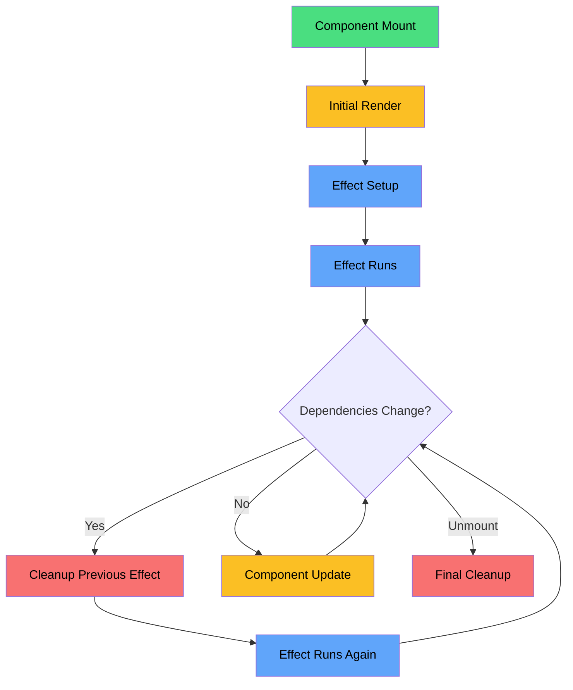
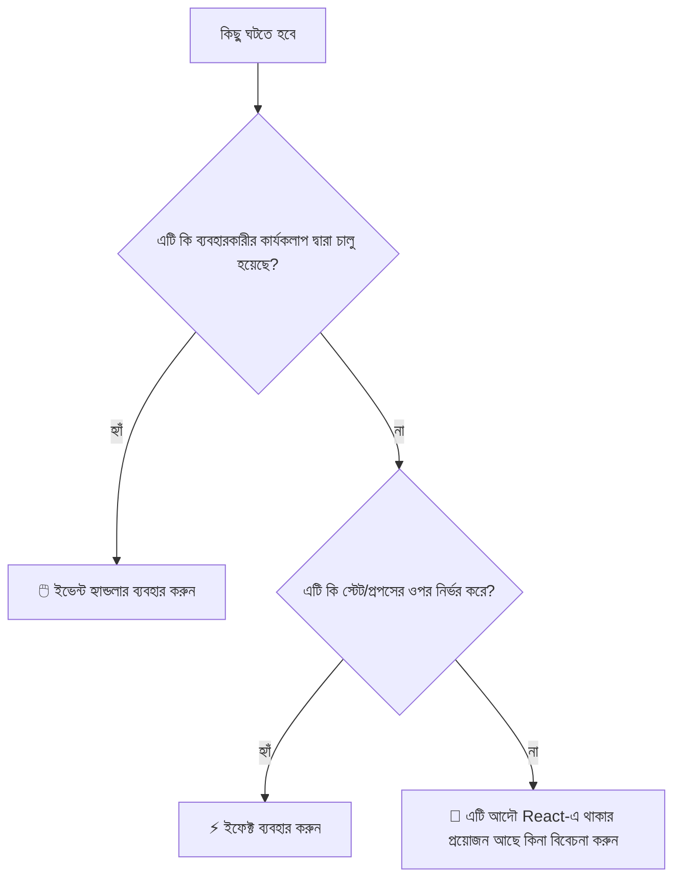
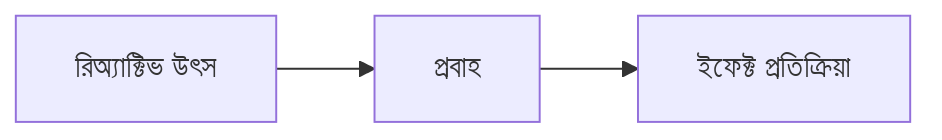
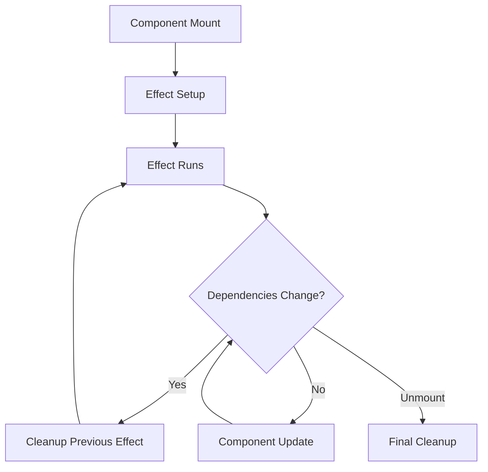

import { Callout, Tabs, Tab } from 'nextra/components'

# 🔄 React Effects আয়ত্ত করার সম্পূর্ণ গাইড: উন্নত প্যাটার্ন ও সর্বোত্তম অনুশীলন

_React-এর useEffect হুক আয়ত্ত করার আমাদের বিস্তৃত গাইডের দ্বিতীয় অংশ_

---

## 📋 সূচিপত্র

1. 🔄 Effect জীবনচক্র এবং Dependencies
2. ⚡ Effects Reactive Values এর প্রতি সাড়া দেয়
3. 🖱️ Events কে Effects থেকে আলাদা করা
4. ✂️ Effect Dependencies অপসারণ করা
5. 🪝 Custom Hooks দিয়ে Logic পুনঃব্যবহার করা
6. 🛠️ অ্যাডভান্সড প্যাটার্ন
7. 🐛 সাধারণ ভুল এবং ডিবাগিং
8. 📚 সম্পূর্ণ রেফারেন্স

---

## 🔄 Effect জীবনচক্র এবং Dependencies

### 🎭 Effect জীবনচক্র বোঝা

Effects কে নাট্য প্রযোজনার একজন স্টেজ ম্যানেজারের মতো ভাবুন। মূল পারফরমেন্স (রেন্ডারিং) মঞ্চে ঘটার সময় তারা পর্দার আড়ালের কার্যক্রম সমন্বয় করে।

<div className="grid grid-cols-1 md:grid-cols-3 gap-4 my-8 p-6 border-2 border-slate-300 rounded-xl bg-slate-50 text-black">

<div className="p-4 bg-green-100 rounded-lg border-2 border-green-600 text-center">
  <div className="font-bold text-lg">🟢 MOUNT</div>
  <div className="text-sm mt-2">কম্পোনেন্ট প্রথমবার রেন্ডার হয় ↓ Effect চালু হয়</div>
</div>

<div className="p-4 bg-amber-100 rounded-lg border-2 border-amber-500 text-center">
  <div className="font-bold text-lg">🔄 UPDATE</div>
  <div className="text-sm mt-2">Dependencies পরিবর্তন হয় ↓ Cleanup চালু হয় ↓ Effect চালু হয়</div>
</div>

<div className="p-4 bg-red-200 rounded-lg border-2 border-red-500 text-center">
  <div className="font-bold text-lg">🔴 UNMOUNT</div>
  <div className="text-sm mt-2">কম্পোনেন্ট সরানো হয় ↓ Cleanup চালু হয়</div>
</div>

</div>

### 📊 Effect জীবনচক্র প্রবাহ



#### 🔍 প্রবাহ বোঝা

1. **কম্পোনেন্ট Mount (🟢)**
   - কম্পোনেন্ট প্রথমবার রেন্ডার হয়
   - Effect সেটআপ শুরু হয়
   - Effect প্রথমবার চালু হয়

2. **আপডেট চক্র (🔄)**
   - যখন dependencies পরিবর্তন হয়:
     - পূর্ববর্তী effect এর cleanup চালু হয়
     - নতুন effect চালু হয়
   - যখন কোনো dependencies পরিবর্তন হয় না:
     - কম্পোনেন্ট স্বাভাবিকভাবে আপডেট হয়
     - Effect পুনরায় চালু হয় না

3. **Unmount (🔴)**
   - কম্পোনেন্ট DOM থেকে সরানো হয়
   - চূড়ান্ত cleanup চালু হয়
   - সমস্ত subscription এবং listener পরিষ্কার করা হয়

### 🔬 ইন্টারঅ্যাক্টিভ জীবনচক্র ডেমো

```jsx
function LifecycleDemo() {
  const [count, setCount] = useState(0)
  const [mounted, setMounted] = useState(true)

  function LifecycleChild() {
    useEffect(
      () => {
        console.log('🟢 MOUNT: Effect চালু হচ্ছে, count হল:', count)

        return () => {
          console.log('🔴 CLEANUP: Effect পরিষ্কার হচ্ছে, count ছিল:', count)
        }
      },
      [count],
    )

    return (
      <div>
        <h3>চাইল্ড কম্পোনেন্ট</h3>
        <p>Count: {count}</p>
        <button onClick={() => setCount(c => c + 1)}>বৃদ্ধি করুন (UPDATE ট্রিগার করে)</button>
      </div>
    )
  }

  return (
    <div>
      <div style={{ marginBottom: '1rem' }}>
        <button onClick={() => setMounted(!mounted)}>
          {mounted ? '🔴 চাইল্ড Unmount করুন' : '🟢 চাইল্ড Mount করুন'}
        </button>
      </div>

      {mounted && <LifecycleChild />}

      <div>
        <strong>🔍 দেখার জন্য কনসোল দেখুন:</strong>
        <ul>
          <li>Mount: চাইল্ড আবির্ভূত হলে Effect চালু হয়</li>
          <li>Update: count পরিবর্তন হলে Cleanup → Effect</li>
          <li>Unmount: চাইল্ড অদৃশ্য হলে Cleanup</li>
        </ul>
      </div>
    </div>
  )
}
```

### 📚 Dependency Array গভীর বিশ্লেষণ

Dependency array হল React এর জিজ্ঞাসা করার উপায়: "কখন আমার এই Effect পুনরায় চালু করা উচিত?"

<div className="grid grid-cols-1 md:grid-cols-[repeat(auto-fit,minmax(300px,1fr))] gap-4 my-6 text-black">

<div className="p-4 bg-red-50 rounded-lg border border-red-500">
<div className="font-bold text-lg text-red-600">🚫 কোনো Array নেই</div>
```jsx
useEffect(() => {
  console.log('প্রতিটি রেন্ডারের পরে চালু হয়')
})
```
<div className="text-sm mt-2">
  <strong>কখন:</strong> প্রতিটি একক রেন্ডারের পরে<br/>
  <strong>ব্যবহারের ক্ষেত্র:</strong> খুব কমই প্রয়োজন, সাধারণত একটি ভুল
</div>
</div>

<div className="p-4 bg-green-50 rounded-lg border border-green-600">
<div className="font-bold text-lg text-green-600">✅ খালি Array</div>
```jsx
useEffect(() => {
  console.log('শুধুমাত্র mount এ চালু হয়')
}, [])
```
<div className="text-sm mt-2">
  <strong>কখন:</strong> শুধুমাত্র একবার, যখন কম্পোনেন্ট mount হয়<br/>
  <strong>ব্যবহারের ক্ষেত্র:</strong> API কল, subscription, timer
</div>
</div>

<div className="p-4 bg-sky-50 rounded-lg border border-sky-600">
<div className="font-bold text-lg text-sky-600">🎯 Dependencies সহ</div>
```jsx
useEffect(() => {
  console.log("deps পরিবর্তন হলে চালু হয়");
}, [count, name]);
```
<div className="text-sm mt-2">
  <strong>কখন:</strong> যেকোনো dependency পরিবর্তন হলে<br/>
  <strong>ব্যবহারের ক্ষেত্র:</strong> props/state এর উপর ভিত্তি করে ডেটা fetch করা
</div>
</div>

</div>

<Callout type="warning" emoji="⚠️">
  **Reference Equality ফাঁদ!** React dependencies তুলনা করে `Object.is()` ব্যবহার করে: - Primitives
  (সংখ্যা, স্ট্রিং): মান দ্বারা তুলনা ✅ - Objects/arrays: reference দ্বারা তুলনা ⚠️
</Callout>

### 🔍 Dependency তুলনার উদাহরণ

<Tabs items={['Primitives (নিরাপদ)', 'Objects (বিপজ্জনক)', 'Functions (জটিল)']}>
<Tab>
```jsx
function SafeDependencies() {
  const [count, setCount] = useState(0)
  const [name, setName] = useState('John')

  useEffect(
    () => {
      console.log(`Count: ${count}, Name: ${name}`)
      // এটি নিখুঁতভাবে কাজ করে কারণ count এবং name হল primitives
    },
    [count, name],
  ) // ✅ নিরাপদ - মান দ্বারা তুলনা

  return (
    <div>
      <button onClick={() => setCount(c => c + 1)}>Count: {count}</button>
      <input value={name} onChange={e => setName(e.target.value)} />
    </div>
  )
}
````
</Tab>
<Tab>
```jsx
function DangerousObjects() {
  const [user, setUser] = useState({ name: 'John', age: 30 })

  // ❌ সমস্যা: প্রতিটি রেন্ডারে নতুন object তৈরি হয়
  const userSettings = {
    theme: user.theme || 'light',
    notifications: true,
  }

  useEffect(
    () => {
      console.log('সেটিংস সংরক্ষণ করা হচ্ছে...')
      saveUserSettings(userSettings)
    },
    [userSettings],
  ) // 🚫 প্রতিটি রেন্ডারে চালু হয়!

  // ✅ সমাধান ১: useMemo ব্যবহার করুন
  const memoizedSettings = useMemo(
    () => ({
      theme: user.theme || 'light',
      notifications: true,
    }),
    [user.theme],
  )

  useEffect(
    () => {
      console.log('মেমোয়াইজড সেটিংস সংরক্ষণ করা হচ্ছে...')
      saveUserSettings(memoizedSettings)
    },
    [memoizedSettings],
  ) // ✅ শুধুমাত্র theme পরিবর্তন হলে চালু হয়

  // ✅ সমাধান ২: primitive dependencies ব্যবহার করুন
  useEffect(
    () => {
      const settings = {
        theme: user.theme || 'light',
        notifications: true,
      }
      console.log('primitives দিয়ে সেটিংস সংরক্ষণ করা হচ্ছে...')
      saveUserSettings(settings)
    },
    [user.theme],
  ) // ✅ সেরা সমাধান!

  return <div>User: {user.name}</div>
}
````

</Tab>
<Tab>
```jsx
function TrickyFunctions({ onDataLoad }) {
  const [data, setData] = useState(null)

  // ❌ সমস্যা: onDataLoad প্রতিটি রেন্ডারে পুনর্সৃষ্টি হতে পারে
  useEffect(
    () => {
      fetchData().then(result => {
        setData(result)
        onDataLoad(result) // Function পুরানো হতে পারে
      })
    },
    [onDataLoad],
  ) // অপ্রয়োজনীয় পুনঃ-রান হতে পারে

  // ✅ সমাধান ১: parent এ useCallback ব্যবহার করুন
  // Parent এর onDataLoad কে useCallback দিয়ে wrap করা উচিত

  // ✅ সমাধান ২: callback এর জন্য একটি ref ব্যবহার করুন
  const callbackRef = useRef(onDataLoad)
  callbackRef.current = onDataLoad

  useEffect(() => {
    fetchData().then(result => {
      setData(result)
      callbackRef.current(result) // সবসময় বর্তমান
    })
  }, []) // কোনো dependency প্রয়োজন নেই

  return <div>{data ? 'ডেটা লোড হয়েছে!' : 'লোড হচ্ছে...'}</div>
}
````
</Tab>
</Tabs>

---

## ⚡ Effects Reactive Values এর প্রতি সাড়া দেয়

### 🌊 Reactive Values বোঝা

Reactive values কে পাইপের মধ্য দিয়ে প্রবাহিত পানির মতো ভাবুন। যখন উৎস পরিবর্তন হয়, প্রবাহ নিচের দিকে সবকিছুকে প্রভাবিত করে।

<div className="grid grid-cols-1 md:grid-cols-[1fr_auto_1fr] gap-4 items-center my-8 p-6 border-2 border-slate-300 rounded-xl bg-slate-50 text-black">

<div className="p-4 bg-blue-100 rounded-lg border-2 border-blue-500">
  <div className="font-bold text-lg">🌊 REACTIVE উৎস</div>
  <ul className="text-sm m-0">
    <li>• useState মান</li>
    <li>• parent থেকে Props</li>
    <li>• Context মান</li>
    <li>• উৎপন্ন গণনা</li>
    <li>• Custom hook রিটার্ন</li>
  </ul>
</div>

<div className="text-2xl font-bold text-indigo-500">
  ⚡<br/>
  প্রবাহ
</div>

<div className="p-4 bg-amber-100 rounded-lg border-2 border-amber-500">
  <div className="font-bold text-lg">🎯 EFFECTS সাড়া দেয়</div>
  <ul className="text-sm m-0">
    <li>• ডেটা fetch করা</li>
    <li>• Subscription</li>
    <li>• DOM আপডেট</li>
    <li>• Analytics ট্র্যাকিং</li>
    <li>• Cache invalidation</li>
  </ul>
</div>

</div>

### 🧪 রিঅ্যাক্টিভ ভ্যালু ল্যাবরেটরি

```jsx
function ReactiveValuesDemo() {
  // 🌊 রিঅ্যাক্টিভ উৎস
  const [userId, setUserId] = useState(1)
  const [filterType, setFilterType] = useState('all')
  const [refreshCount, setRefreshCount] = useState(0)

  // 🧮 উৎপন্ন রিঅ্যাক্টিভ ভ্যালু
  const apiUrl = useMemo(
    () => `/api/users/${userId}/posts?filter=${filterType}&t=${refreshCount}`,
    [userId, filterType, refreshCount],
  )

  // 📊 আমাদের ডেটার জন্য স্টেট
  const [posts, setPosts] = useState([])
  const [loading, setLoading] = useState(false)
  const [lastFetch, setLastFetch] = useState(null)

  // ⚡ ইফেক্ট রিঅ্যাক্টিভ ভ্যালুতে প্রতিক্রিয়া করে
  useEffect(
    () => {
      console.log('🌊 রিঅ্যাক্টিভ ইফেক্ট ট্রিগার হয়েছে!')
      console.log('📊 API URL পরিবর্তিত হয়েছে:', apiUrl)

      setLoading(true)
      const startTime = Date.now()

      // API কল সিমুলেট করা
      setTimeout(() => {
        const mockPosts = [
          `পোস্ট ১ ইউজার ${userId} এর জন্য (${filterType})`,
          `পোস্ট ২ ইউজার ${userId} এর জন্য (${filterType})`,
          `পোস্ট ৩ ইউজার ${userId} এর জন্য (${filterType})`,
        ]

        setPosts(mockPosts)
        setLoading(false)
        setLastFetch(new Date().toLocaleTimeString())

        console.log(`⏱️ ফেচ সম্পন্ন হয়েছে ${Date.now() - startTime}ms এ`)
      }, 1000)
    },
    [apiUrl],
  ) // উৎপন্ন URL এর প্রতি প্রতিক্রিয়া

  return (
    <div style={{ padding: '1rem', border: '1px solid #e5e7eb', borderRadius: '0.5rem' }}>
      <h3>🧪 রিঅ্যাক্টিভ ভ্যালু ল্যাবরেটরি</h3>

      <div
        style={{
          display: 'grid',
          gridTemplateColumns: 'repeat(auto-fit, minmax(200px, 1fr))',
          gap: '1rem',
          marginBottom: '1rem',
        }}
      >
        <div>
          <label>👤 ইউজার আইডি:</label>
          <select value={userId} onChange={e => setUserId(Number(e.target.value))}>
            <option value={1}>ইউজার ১</option>
            <option value={2}>ইউজার ২</option>
            <option value={3}>ইউজার ৩</option>
          </select>
        </div>

        <div>
          <label>🔍 ফিল্টার:</label>
          <select value={filterType} onChange={e => setFilterType(e.target.value)}>
            <option value="all">সমস্ত পোস্ট</option>
            <option value="popular">জনপ্রিয়</option>
            <option value="recent">সাম্প্রতিক</option>
          </select>
        </div>

        <div>
          <button onClick={() => setRefreshCount(c => c + 1)}>
            🔄 জোরপূর্বক রিফ্রেশ ({refreshCount})
          </button>
        </div>
      </div>

      <div>
        <strong>📡 বর্তমান API URL:</strong> {apiUrl}
        <br />
        <strong>⏰ শেষ ফেচ:</strong> {lastFetch || 'কখনো না'}
      </div>

      {loading ? (
        <div style={{ textAlign: 'center', padding: '2rem' }}>🌀 পোস্ট লোড হচ্ছে...</div>
      ) : (
        <div>
          <h4>📝 পোস্টসমূহ:</h4>
          <ul>
            {posts.map((post, index) => (
              <li key={index}>{post}</li>
            ))}
          </ul>
        </div>
      )}
    </div>
  )
}
```

### 🎯 রিঅ্যাক্টিভ প্যাটার্ন প্রদর্শনী

<Tabs items={['স্টেট-চালিত ইফেক্টস', 'প্রপ্স-চালিত ইফেক্টস', 'কনটেক্সট-চালিত ইফেক্টস', 'বহু-উৎস ইফেক্টস']}>
<Tab>
```jsx
function StateReactiveEffect() {
  const [searchTerm, setSearchTerm] = useState('')
  const [sortBy, setSortBy] = useState('name')
  const [results, setResults] = useState([])

  // ইফেক্ট স্টেট পরিবর্তনে প্রতিক্রিয়া করে
  useEffect(
    () => {
      if (!searchTerm.trim()) {
        setResults([])
        return
      }

      console.log(`🔍 "${searchTerm}" খোঁজা হচ্ছে ${sortBy} অনুসারে সর্ট করে`)

      const timeoutId = setTimeout(() => {
        // সর্টিং সহ সিমুলেটেড সার্চ
        const mockResults = [
          { name: 'আলিস', score: 95 },
          { name: 'বব', score: 87 },
          { name: 'চার্লি', score: 92 },
        ]
          .filter(item => item.name.toLowerCase().includes(searchTerm.toLowerCase()))
          .sort((a, b) => {
            if (sortBy === 'name') return a.name.localeCompare(b.name)
            return b.score - a.score
          })

        setResults(mockResults)
      }, 300)

      return () => clearTimeout(timeoutId)
    },
    [searchTerm, sortBy],
  ) // উভয় স্টেট ভ্যালুতে প্রতিক্রিয়া

  return (
    <div>
      <input
        value={searchTerm}
        onChange={e => setSearchTerm(e.target.value)}
        placeholder="ইউজার খুঁজুন..."
      />
      <select value={sortBy} onChange={e => setSortBy(e.target.value)}>
        <option value="name">নাম অনুসারে সর্ট</option>
        <option value="score">স্কোর অনুসারে সর্ট</option>
      </select>

      <div>
        {results.map((user, index) => (
          <div key={index}>
            {user.name} - স্কোর: {user.score}
          </div>
        ))}
      </div>
    </div>
  )
}

```
</Tab>
<Tab>
```jsx
function PropsReactiveEffect({ userId, includePrivate = false }) {
  const [userProfile, setUserProfile] = useState(null)
  const [loading, setLoading] = useState(false)

  // ইফেক্ট প্রপ্স পরিবর্তনে প্রতিক্রিয়া করে
  useEffect(
    () => {
      if (!userId) {
        setUserProfile(null)
        return
      }

      console.log(`👤 ইউজার ${userId} এর প্রোফাইল লোড হচ্ছে, প্রাইভেট: ${includePrivate}`)

      setLoading(true)

      // প্রপ্সের উপর নির্ভরশীল API কল সিমুলেট করা
      const controller = new AbortController()

      async function fetchProfile() {
        try {
          const response = await fetch(`/api/users/${userId}?includePrivate=${includePrivate}`, {
            signal: controller.signal,
          })
          const profile = await response.json()
          setUserProfile(profile)
        } catch (error) {
          if (error.name !== 'AbortError') {
            console.error('প্রোফাইল ফেচ করতে ব্যর্থ:', error)
          }
        } finally {
          setLoading(false)
        }
      }

      fetchProfile()

      return () => controller.abort()
    },
    [userId, includePrivate],
  ) // প্রপ্সে প্রতিক্রিয়া

  if (loading) return <div>প্রোফাইল লোড হচ্ছে...</div>
  if (!userProfile) return <div>কোন ইউজার নির্বাচিত নয়</div>

  return (
    <div>
      <h3>{userProfile.name}</h3>
      <p>ইমেইল: {userProfile.email}</p>
      {includePrivate && userProfile.privateInfo && <p>প্রাইভেট: {userProfile.privateInfo}</p>}
    </div>
  )
}
```

</Tab>
<Tab>
```jsx
function ContextReactiveEffect() {
  const theme = useContext(ThemeContext)
  const user = useContext(UserContext)
  const [analytics, setAnalytics] = useState([])

  // ইফেক্ট কনটেক্সট পরিবর্তনে প্রতিক্রিয়া করে
  useEffect(
    () => {
      console.log(`📊 ট্র্যাকিং: থিম=${theme.name}, ইউজার=${user.id}`)

      // অ্যানালিটিক্সের জন্য থিম এবং ইউজার পরিবর্তন ট্র্যাক করা
      const event = {
        type: 'context_change',
        theme: theme.name,
        userId: user.id,
        timestamp: Date.now(),
      }

      // অ্যানালিটিক্স সার্ভিসে পাঠানো
      sendAnalytics(event)

      // ডেমোর জন্য স্থানীয় অ্যানালিটিক্স আপডেট করা
      setAnalytics(prev => [...prev.slice(-4), event])
    },
    [theme.name, user.id],
  ) // কনটেক্সট ভ্যালুতে প্রতিক্রিয়া

  return (
    <div
      style={{
        backgroundColor: theme.backgroundColor,
        color: theme.textColor,
        padding: '1rem',
        borderRadius: '0.5rem',
      }}
    >
      <h3>স্বাগতম, {user.name}!</h3>
      <p>বর্তমান থিম: {theme.name}</p>

      <div>
        <h4>সাম্প্রতিক অ্যানালিটিক্স:</h4>
        {analytics.map((event, index) => (
          <div key={index} style={{ fontSize: '0.8rem' }}>
            {new Date(event.timestamp).toLocaleTimeString()}: থিম=
            {event.theme}, ইউজার=
            {event.userId}
          </div>
        ))}
      </div>
    </div>
  )
}

```
</Tab>
<Tab>
```jsx
function MultiSourceReactiveEffect({ productId }) {
  // একাধিক রিঅ্যাক্টিভ উৎস
  const [user, setUser] = useState(null)
  const [preferences, setPreferences] = useState({})
  const [location, setLocation] = useState(null)
  const [recommendations, setRecommendations] = useState([])

  const currentTheme = useContext(ThemeContext)

  // ইফেক্ট একাধিক উৎসে প্রতিক্রিয়া করে
  useEffect(
    () => {
      // শুধুমাত্র তখনই চালান যদি আমাদের কাছে সব প্রয়োজনীয় ডেটা থাকে
      if (!productId || !user || !location) {
        setRecommendations([])
        return
      }

      console.log('🎯 একাধিক উৎস থেকে সুপারিশ তৈরি করা হচ্ছে:')
      console.log('- প্রোডাক্ট আইডি:', productId)
      console.log('- ইউজার পছন্দ:', preferences)
      console.log('- অবস্থান:', location)
      console.log('- থিম:', currentTheme.name)

      const controller = new AbortController()

      async function generateRecommendations() {
        try {
          const response = await fetch('/api/recommendations', {
            method: 'POST',
            headers: { 'Content-Type': 'application/json' },
            body: JSON.stringify({
              productId,
              userId: user.id,
              preferences,
              location,
              theme: currentTheme.name,
            }),
            signal: controller.signal,
          })

          const recs = await response.json()
          setRecommendations(recs)
        } catch (error) {
          if (error.name !== 'AbortError') {
            console.error('সুপারিশ পেতে ব্যর্থ:', error)
          }
        }
      }

      generateRecommendations()

      return () => controller.abort()
    },
    [
      productId, // প্রপ
      user?.id, // স্টেট (ঐচ্ছিক চেইনিং সহ)
      preferences, // স্টেট (অবজেক্ট)
      location, // স্টেট
      currentTheme.name, // কনটেক্সট
    ],
  )

  return (
    <div>
      <h3>🎯 স্মার্ট সুপারিশ</h3>
      {recommendations.length > 0 ? (
        <ul>
          {recommendations.map((rec, index) => (
            <li key={index}>
              {rec.title} - স্কোর: {rec.score}
            </li>
          ))}
        </ul>
      ) : (
        <p>কোন সুপারিশ উপলব্ধ নেই</p>
      )}
    </div>
  )
}
```

</Tab>
</Tabs>

---

## 🖱️ ইভেন্ট থেকে ইফেক্ট আলাদা করা

### 🎭 ইভেন্ট বনাম ইফেক্ট দর্শন

আপনার React কম্পোনেন্টকে একটি রেস্তোরাঁর মতো ভাবুন:

<div className="grid grid-cols-1 md:grid-cols-[1fr_auto_1fr] gap-4 items-center my-8 p-6 border-2 border-slate-300 rounded-xl bg-slate-50 text-black">

<div className="p-4 bg-amber-100 rounded-lg border-2 border-amber-500">
  <div className="font-bold text-lg">🖱️ ইভেন্ট</div>
  <div className="text-sm mt-2">
    <strong>গ্রাহকের অর্ডারের মতো:</strong>
  </div>
  <ul className="text-sm m-0">
    <li>• বাটন ক্লিক</li>
    <li>• ফর্ম সাবমিশন</li>
    <li>• মেনু নির্বাচন</li>
    <li>• নির্দিষ্ট ব্যবহারকারীর কার্যক্রম</li>
  </ul>
  <div className="text-xs text-amber-700 mt-2">ব্যবহারকারী কিছু করলে ঘটে</div>
</div>

<div className="text-2xl font-bold text-indigo-500">বনাম</div>

<div className="p-4 bg-blue-100 rounded-lg border-2 border-blue-500">
  <div className="font-bold text-lg">⚡ ইফেক্ট</div>
  <div className="text-sm mt-2">
    <strong>পটভূমি সেবার মতো:</strong>
  </div>
  <ul className="text-sm m-0">
    <li>• রান্নাঘর পূর্ণ রাখা</li>
    <li>• তাপমাত্রা নিরীক্ষণ</li>
    <li>• মেনু ডিসপ্লে আপডেট</li>
    <li>• সরবরাহকারীদের সাথে সিঙ্ক</li>
  </ul>
  <div className="text-xs text-blue-700 mt-2">স্টেট পরিবর্তিত হলে ঘটে</div>
</div>

</div>

### 🚫 সাধারণ অ্যান্টি-প্যাটার্ন: ইভেন্ট এবং ইফেক্ট মিশ্রণ

<Tabs items={['❌ ভুল উপায়', '✅ সঠিক উপায়', '🎯 সর্বোত্তম অনুশীলন']}>
<Tab>
```jsx
// ❌ এটি করবেন না - ব্যবহারকারীর ইন্টারঅ্যাকশনের জন্য ইফেক্ট ব্যবহার
function BadSearchForm() {
  const [query, setQuery] = useState('')
  const [results, setResults] = useState([])

  // ❌ সমস্যা: যা ইভেন্ট হওয়া উচিত তার জন্য ইফেক্ট ব্যবহার
  useEffect(
    () => {
      if (query) {
        console.log('ব্যবহারকারী টাইপ করার সাথে সাথে স্বয়ংক্রিয় অনুসন্ধান...')
        searchAPI(query).then(setResults)
      }
    },
    [query],
  ) // প্রতিটি কীস্ট্রোকে অনুসন্ধান!

  return (
    <div>
      <input
        value={query}
        onChange={e => setQuery(e.target.value)}
        placeholder="স্বয়ংক্রিয় অনুসন্ধান..."
      />
      <button type="submit">অনুসন্ধান</button> {/* বাটন কিছুই করে না! */}
      <div>
        {results.map(r => (
          <div key={r.id}>{r.title}</div>
        ))}
      </div>
    </div>
  )
}

````

<div className="p-4 bg-red-50 rounded-lg border border-red-500 mt-4 text-black">
  <strong>🚫 এই পদ্ধতির সমস্যা:</strong>
  <ul>
    <li>প্রতি কীস্ট্রোকে অনুসন্ধান (ব্যয়বহুল!)</li>
    <li>চাহিদামতো অনুসন্ধানের কোনো উপায় নেই</li>
    <li>বাটন প্রত্যাশিত মতো কাজ করে না</li>
    <li>লোডিং স্টেট যোগ করা কঠিন</li>
    <li>এরর সঠিকভাবে হ্যান্ডল করা কঠিন</li>
  </ul>
</div>
</Tab>

<Tab>
```jsx
// ✅ আরো ভাল - ইভেন্ট এবং ইফেক্ট আলাদা
function GoodSearchForm() {
  const [query, setQuery] = useState('')
  const [results, setResults] = useState([])
  const [isSearching, setIsSearching] = useState(false)

  // ✅ ইভেন্ট: ব্যবহারকারী সাবমিট করলে স্পষ্ট অনুসন্ধান
  async function handleSubmit(e) {
    e.preventDefault()
    if (!query.trim()) return

    setIsSearching(true)
    try {
      console.log('🔍 ব্যবহারকারী অনুসন্ধান শুরু করেছেন:', query)
      const data = await searchAPI(query)
      setResults(data)
    } catch (error) {
      console.error('অনুসন্ধান ব্যর্থ:', error)
      // এরর স্টেট হ্যান্ডল করুন
    } finally {
      setIsSearching(false)
    }
  }

  // ✅ ইফেক্ট: সুবিধার জন্য ডিবাউন্সড অনুসন্ধান
  useEffect(
    () => {
      if (!query.trim()) {
        setResults([])
        return
      }

      console.log('⏱️ টাইপিং দ্বারা স্বয়ংক্রিয় অনুসন্ধান চালু')
      const timeoutId = setTimeout(() => {
        searchAPI(query).then(setResults)
      }, 500) // ডিবাউন্সড

      return () => clearTimeout(timeoutId)
    },
    [query],
  )

  return (
    <form onSubmit={handleSubmit}>
      <input
        value={query}
        onChange={e => setQuery(e.target.value)}
        placeholder="স্বয়ংক্রিয় অনুসন্ধানের জন্য টাইপ করুন বা এন্টার চাপুন"
      />
      <button type="submit" disabled={isSearching}>
        {isSearching ? '🔍 অনুসন্ধান চলছে...' : '🔍 অনুসন্ধান'}
      </button>

      <div>
        {results.map(r => (
          <div key={r.id}>{r.title}</div>
        ))}
      </div>
    </form>
  )
}
````

<div className="p-4 bg-green-50 rounded-lg border border-green-600 mt-4">
  <strong className="text-black">✅ এই পদ্ধতির সুবিধা:</strong>
  <ul className="text-black">
    <li>বাটন প্রত্যাশিত মতো কাজ করে (ইভেন্ট)</li>
    <li>স্বয়ংক্রিয় অনুসন্ধান ডিবাউন্সড (ইফেক্ট)</li>
    <li>স্পষ্ট লোডিং স্টেট</li>
    <li>সঠিক এরর হ্যান্ডলিং</li>
    <li>কখন অনুসন্ধান করবেন তার ওপর ব্যবহারকারীর নিয়ন্ত্রণ</li>
  </ul>
</div>

</Tab>
<Tab>
```jsx
// 🎯 সর্বোত্তম অনুশীলন - useEvent ব্যবহার (React 18.3+)
import { useEvent } from 'react'

function BestSearchForm() {
  const [query, setQuery] = useState('')
  const [results, setResults] = useState([])
  const [searchHistory, setSearchHistory] = useState([])

  // 🎯 useEvent - স্থিতিশীল ফাংশন রেফারেন্স যা ইফেক্ট ট্রিগার করে না
  const logSearch = useEvent((searchTerm, source) => {
    console.log(`📊 অনুসন্ধান লগ: "${searchTerm}" থেকে ${source}`)
    setSearchHistory(prev => [
      ...prev.slice(-9),
      {
        term: searchTerm,
        source,
        timestamp: Date.now(),
      },
    ])
  })

  // ✅ ইভেন্ট: ম্যানুয়াল অনুসন্ধান
  async function handleSubmit(e) {
    e.preventDefault()
    if (!query.trim()) return

    const data = await searchAPI(query)
    setResults(data)
    logSearch(query, 'manual') // ইফেক্ট পুনরায় চালনা ট্রিগার করবে না
  }

  // ✅ ইফেক্ট: স্থিতিশীল লগিং সহ স্বয়ংক্রিয় অনুসন্ধান
  useEffect(
    () => {
      if (!query.trim()) {
        setResults([])
        return
      }

      const timeoutId = setTimeout(async () => {
        const data = await searchAPI(query)
        setResults(data)
        logSearch(query, 'auto') // স্থিতিশীল রেফারেন্স!
      }, 500)

      return () => clearTimeout(timeoutId)
    },
    [query],
  ) // logSearch নির্ভরতায় প্রয়োজন নেই!

  return (
    <div>
      <form onSubmit={handleSubmit}>
        <input
          value={query}
          onChange={e => setQuery(e.target.value)}
          placeholder="ইতিহাসসহ স্মার্ট অনুসন্ধান"
        />
        <button type="submit">🔍 অনুসন্ধান</button>
      </form>

      <div>
        <h4>ফলাফল:</h4>
        {results.map(r => (
          <div key={r.id}>{r.title}</div>
        ))}
      </div>

      <div>
        <h4>অনুসন্ধান ইতিহাস:</h4>
        {searchHistory.map((entry, index) => (
          <div key={index} style={{ fontSize: '0.8rem' }}>
            {entry.term} ({entry.source}) - {new Date(entry.timestamp).toLocaleTimeString()}
          </div>
        ))}
      </div>
    </div>
  )
}

````

</Tab>
</Tabs>

### 🎯 ইভেন্ট বনাম ইফেক্ট সিদ্ধান্ত ট্রি



#### 🔍 সিদ্ধান্ত ট্রি বোঝা

1. **ব্যবহারকারীর কার্যকলাপে চালিত (🖱️ ইভেন্ট হ্যান্ডলার)**
   - ব্যবহার করুন: বাটন ক্লিক, ফর্ম সাবমিশন, ব্যবহারকারীর ইন্টারঅ্যাকশনের জন্য
   - উদাহরণ: `onClick`, `onSubmit`, `onChange`
   - এগুলো ব্যবহারকারীর কর্মের সরাসরি প্রতিক্রিয়া

2. **স্টেট/প্রপসের ওপর নির্ভরশীল (⚡ ইফেক্ট)**
   - ব্যবহার করুন: ডেটা ফেচিং, সাবস্ক্রিপশন, DOM আপডেটের জন্য
   - উদাহরণ: নির্ভরতা সহ `useEffect`
   - এগুলো আপনার কম্পোনেন্টের ডেটার পরিবর্তনে প্রতিক্রিয়া করে

3. **কোনোটিই নয় (🤔 বিকল্প বিবেচনা করুন)**
   - ব্যবহার করুন: ইউটিলিটি ফাংশন, সার্ভিস লেয়ার লজিকের জন্য
   - উদাহরণ: বিশুদ্ধ ফাংশন, API কল
   - এগুলো হয়তো React-এ থাকার প্রয়োজনই নেই

### 🌊 রিঅ্যাক্টিভ ভ্যালু ফ্লো



#### 🔍 রিঅ্যাক্টিভ ফ্লো বোঝা

1. **রিঅ্যাক্টিভ উৎস (🌊)**
   - `useState` ভ্যালু
   - প্যারেন্ট থেকে প্রপস
   - কনটেক্সট ভ্যালু
   - ডেরাইভড ক্যালকুলেশন
   - কাস্টম হুক রিটার্ন

2. **প্রবাহ (⚡)**
   - ডেটা পরিবর্তন আপডেট ট্রিগার করে
   - আপডেট কম্পোনেন্ট ট্রিতে প্রবাহিত হয়
   - পরিবর্তনগুলো ইফেক্টে প্রচারিত হয়

3. **ইফেক্ট প্রতিক্রিয়া (🎯)**
   - ডেটা ফেচিং
   - সাবস্ক্রিপশন
   - DOM আপডেট
   - অ্যানালিটিক্স ট্র্যাকিং
   - ক্যাশ অবৈধকরণ

### 🎨 ইফেক্ট কম্পোজিশন প্যাটার্ন

#### 1. ক্রমিক ইফেক্ট
```jsx
// ক্রমানুসারে চালিত ইফেক্ট
useEffect(() => {
  // প্রথম ইফেক্ট
  const data = fetchData();
  setData(data);
}, []);

useEffect(() => {
  // দ্বিতীয় ইফেক্ট প্রথমটির ওপর নির্ভর করে
  if (data) {
    processData(data);
  }
}, [data]);
```

#### 2. সমান্তরাল ইফেক্ট
```jsx
// একসাথে চালিত স্বাধীন ইফেক্ট
useEffect(() => {
  // ব্যবহারকারীর ডেটা ফেচ
  fetchUserData();
}, []);

useEffect(() => {
  // পোস্ট ফেচ
  fetchPosts();
}, []);

useEffect(() => {
  // নোটিফিকেশন ফেচ
  fetchNotifications();
}, []);
```

#### 3. শর্তসাপেক্ষ ইফেক্ট
```jsx
// নির্দিষ্ট শর্তে চালিত ইফেক্ট
useEffect(() => {
  if (isFeatureEnabled) {
    // ডেটা সাবস্ক্রাইব
    const subscription = subscribeToData();
    return () => subscription.unsubscribe();
  }
}, [isFeatureEnabled]);
```

### 💡 সর্বোত্তম অনুশীলন

1. **ইফেক্ট ফোকাসড রাখুন**
   - প্রতিটি ইফেক্ট একটি কাজ করবে
   - জটিল ইফেক্টগুলোকে ছোট ছোট ভাগে বিভক্ত করুন
   - ইফেক্ট ফাংশনের জন্য বর্ণনামূলক নাম ব্যবহার করুন

2. **ক্লিনআপ সঠিকভাবে হ্যান্ডল করুন**
   - প্রয়োজনে সর্বদা ক্লিনআপ ফাংশন রিটার্ন করুন
   - সাবস্ক্রিপশন এবং লিসনার ক্লিন করুন
   - মেমরি লিক প্রতিরোধ করুন

3. **নির্ভরতা অপ্টিমাইজ করুন**
   - সব রিঅ্যাক্টিভ ভ্যালু অন্তর্ভুক্ত করুন
   - নির্ভরতা অ্যারে সঠিকভাবে ব্যবহার করুন
   - `useCallback` এবং `useMemo` ব্যবহার বিবেচনা করুন

4. **ইফেক্ট সমস্যা ডিবাগ করুন**
   - React DevTools ব্যবহার করুন
   - কনসোল লগ যোগ করুন
   - নির্ভরতা অ্যারে পরীক্ষা করুন
   - ক্লিনআপ ফাংশন যাচাই করুন
   
---

## ✂️ Effect Dependencies অপসারণ করা

### 🎯 Dependency কমানোর শিল্প

সবচেয়ে ভালো Effect হলো যার সবচেয়ে কম dependencies আছে। এখানে dependency zen অর্জন করার উপায়:

<div className="grid gap-4 my-6" style={{ gridTemplateColumns: 'repeat(auto-fit, minmax(250px, 1fr))' }}>

<div className="p-4 bg-green-50 rounded-md border border-green-600">
  <div className="font-bold text-lg text-black">✅ Effect এর ভিতরে সরান</div>
  <div className="text-sm mt-2 text-black">
    যদি এটি শুধুমাত্র effect এর ভিতরে ব্যবহৃত হয়, সেখানেই define করুন
  </div>
</div>

<div className="p-4 bg-sky-50 rounded-md border border-sky-600">
  <div className="font-bold text-lg text-black">🔧 Refs ব্যবহার করুন</div>
  <div className="text-sm mt-2 text-black">যে values গুলো re-run trigger করার প্রয়োজন নেই</div>
</div>

<div className="p-4 bg-amber-100 rounded-md border border-amber-500">
  <div className="font-bold text-lg text-black">🧮 Reducers ব্যবহার করুন</div>
  <div className="text-sm mt-2 text-black">
    জটিল state updates এর জন্য যা previous state এর উপর নির্ভর করে
  </div>
</div>

<div className="p-4 bg-purple-100 rounded-md border border-purple-700">
  <div className="font-bold text-lg text-black">🎭 Non-Reactive Extract করুন</div>
  <div className="text-sm mt-2 text-black">constants এবং pure functions কে component এর বাইরে সরান</div>
</div>

</div>

### 🔬 Dependency কমানোর কৌশল

<Tabs items={['Effect এর ভিতরে সরানো', 'Non-Reactive এর জন্য Refs ব্যবহার', 'Constants Extract করা', 'Reducers ব্যবহার', 'Functional Updates']}>
<Tab>
```jsx
// ❌ অপ্রয়োজনীয় dependency
function BadTimer() {
  const [count, setCount] = useState(0)
  const [delay, setDelay] = useState(1000)

  // ❌ formatTime প্রতি render এ পুনর্নির্মিত হয়
  const formatTime = seconds => {
    const mins = Math.floor(seconds / 60)
    const secs = seconds % 60
    return `${mins}:${secs.toString().padStart(2, '0')}`
  }

  useEffect(
    () => {
      const intervalId = setInterval(() => {
        setCount(c => c + 1)
        console.log(formatTime(count)) // পুরানো count ব্যবহার করে!
      }, delay)

      return () => clearInterval(intervalId)
    },
    [count, delay, formatTime],
  ) // ❌ formatTime প্রতি render এ পরিবর্তিত হয়

  return <div>সময়: {formatTime(count)}</div>
}

// ✅ function কে effect এর ভিতরে সরান
function GoodTimer() {
  const [count, setCount] = useState(0)
  const [delay, setDelay] = useState(1000)

  useEffect(
    () => {
      // ✅ function টি effect এর ভিতরে define করুন
      const formatTime = seconds => {
        const mins = Math.floor(seconds / 60)
        const secs = seconds % 60
        return `${mins}:${secs.toString().padStart(2, '0')}`
      }

      const intervalId = setInterval(() => {
        setCount(c => {
          const newCount = c + 1
          console.log(formatTime(newCount)) // সবসময় বর্তমান!
          return newCount
        })
      }, delay)

      return () => clearInterval(intervalId)
    },
    [delay],
  ) // ✅ শুধুমাত্র delay এর উপর নির্ভর করে

  // ✅ প্রদর্শনের জন্য Format (এটিও effect এর ভিতরে হতে পারে যদি শুধুমাত্র সেখানে ব্যবহৃত হয়)
  const formatTime = seconds => {
    const mins = Math.floor(seconds / 60)
    const secs = seconds % 60
    return `${mins}:${secs.toString().padStart(2, '0')}`
  }

  return <div>সময়: {formatTime(count)}</div>
}

````
</Tab>
<Tab>
```jsx
// ❌ Callback অপ্রয়োজনীয় re-runs trigger করে
function BadDataLogger({ onDataReceived }) {
  const [data, setData] = useState([])

  useEffect(
    () => {
      const ws = new WebSocket('ws://localhost:8080')

      ws.onmessage = event => {
        const newData = JSON.parse(event.data)
        setData(prev => [...prev, newData])
        onDataReceived(newData) // প্রতি render এ পুনর্নির্মিত হতে পারে
      }

      return () => ws.close()
    },
    [onDataReceived],
  ) // ❌ callback পরিবর্তিত হলে পুনরায় connect করে

  return <div>ডেটা পয়েন্ট: {data.length}</div>
}

// ✅ callback এর জন্য ref ব্যবহার করুন
function GoodDataLogger({ onDataReceived }) {
  const [data, setData] = useState([])
  const callbackRef = useRef(onDataReceived)

  // ref কে বর্তমান রাখুন
  callbackRef.current = onDataReceived

  useEffect(() => {
    const ws = new WebSocket('ws://localhost:8080')

    ws.onmessage = event => {
      const newData = JSON.parse(event.data)
      setData(prev => [...prev, newData])
      callbackRef.current(newData) // সবসময় বর্তমান callback
    }

    return () => ws.close()
  }, []) // ✅ কোন dependencies নেই - শুধুমাত্র একবার connect করে

  return <div>ডেটা পয়েন্ট: {data.length}</div>
}

// 🎯 useEvent এর সাথে আরও ভালো (React 18.3+)
function BestDataLogger({ onDataReceived }) {
  const [data, setData] = useState([])
  const handleDataReceived = useEvent(onDataReceived)

  useEffect(() => {
    const ws = new WebSocket('ws://localhost:8080')

    ws.onmessage = event => {
      const newData = JSON.parse(event.data)
      setData(prev => [...prev, newData])
      handleDataReceived(newData) // স্থিতিশীল কিন্তু সবসময় বর্তমান
    }

    return () => ws.close()
  }, []) // ✅ কোন dependencies প্রয়োজন নেই

  return <div>ডেটা পয়েন্ট: {data.length}</div>
}
````

</Tab>
<Tab>
```jsx
// ❌ component এর ভিতরে Constant
function BadApiClient() {
  const [data, setData] = useState(null)
  const [userId, setUserId] = useState(1)

  // ❌ প্রতি render এ পুনর্নির্মিত
  const API_CONFIG = {
    baseURL: 'https://api.example.com',
    timeout: 5000,
    headers: {
      'Content-Type': 'application/json',
    },
  }

  useEffect(
    () => {
      async function fetchData() {
        const response = await fetch(`${API_CONFIG.baseURL}/users/${userId}`, {
          ...API_CONFIG,
        })
        const result = await response.json()
        setData(result)
      }

      fetchData()
    },
    [userId, API_CONFIG],
  ) // ❌ API_CONFIG প্রতি render এ পরিবর্তিত হয়

  return <div>{data?.name}</div>
}

// ✅ constants কে component এর বাইরে extract করুন
const API_CONFIG = {
  baseURL: 'https://api.example.com',
  timeout: 5000,
  headers: {
    'Content-Type': 'application/json',
  },
}

function GoodApiClient() {
  const [data, setData] = useState(null)
  const [userId, setUserId] = useState(1)

  useEffect(
    () => {
      async function fetchData() {
        const response = await fetch(`${API_CONFIG.baseURL}/users/${userId}`, {
          ...API_CONFIG,
        })
        const result = await response.json()
        setData(result)
      }

      fetchData()
    },
    [userId],
  ) // ✅ শুধুমাত্র userId এর উপর নির্ভর করে

  return <div>{data?.name}</div>
}

// 🎯 বিকল্প: effect এর ভিতরে সরান যদি শুধুমাত্র সেখানে ব্যবহৃত হয়
function AlternativeApiClient() {
  const [data, setData] = useState(null)
  const [userId, setUserId] = useState(1)

  useEffect(
    () => {
      // ✅ effect এর ভিতরে define করুন যদি শুধুমাত্র এখানে ব্যবহৃত হয়
      const API_CONFIG = {
        baseURL: 'https://api.example.com',
        timeout: 5000,
        headers: {
          'Content-Type': 'application/json',
        },
      }

      async function fetchData() {
        const response = await fetch(`${API_CONFIG.baseURL}/users/${userId}`, {
          ...API_CONFIG,
        })
        const result = await response.json()
        setData(result)
      }

      fetchData()
    },
    [userId],
  ) // ✅ শুধুমাত্র userId এর উপর নির্ভর করে

  return <div>{data?.name}</div>
}

````
</Tab>
<Tab>
```jsx
// ❌ dependencies সহ জটিল state updates
function BadShoppingCart() {
  const [items, setItems] = useState([])
  const [discounts, setDiscounts] = useState([])
  const [total, setTotal] = useState(0)

  // ❌ overlapping dependencies সহ একাধিক effects
  useEffect(
    () => {
      const subtotal = items.reduce((sum, item) => sum + item.price * item.quantity, 0)
      const discountAmount = discounts.reduce((sum, discount) => sum + discount.amount, 0)
      setTotal(subtotal - discountAmount)
    },
    [items, discounts],
  ) // জটিল dependency management

  const addItem = product => {
    setItems(prev => [...prev, { ...product, quantity: 1 }])
  }

  const updateQuantity = (itemId, quantity) => {
    setItems(prev => prev.map(item => (item.id === itemId ? { ...item, quantity } : item)))
  }

  return <div>মোট: ${total}</div>
}

// ✅ state logic একত্রিত করতে reducer ব্যবহার করুন
function cartReducer(state, action) {
  switch (action.type) {
    case 'ADD_ITEM':
      const newItems = [...state.items, { ...action.product, quantity: 1 }]
      return {
        ...state,
        items: newItems,
        total: calculateTotal(newItems, state.discounts),
      }

    case 'UPDATE_QUANTITY':
      const updatedItems = state.items.map(
        item => (item.id === action.itemId ? { ...item, quantity: action.quantity } : item),
      )
      return {
        ...state,
        items: updatedItems,
        total: calculateTotal(updatedItems, state.discounts),
      }

    case 'APPLY_DISCOUNT':
      const newDiscounts = [...state.discounts, action.discount]
      return {
        ...state,
        discounts: newDiscounts,
        total: calculateTotal(state.items, newDiscounts),
      }

    default:
      return state
  }
}

function calculateTotal(items, discounts) {
  const subtotal = items.reduce((sum, item) => sum + item.price * item.quantity, 0)
  const discountAmount = discounts.reduce((sum, discount) => sum + discount.amount, 0)
  return subtotal - discountAmount
}

function GoodShoppingCart() {
  const [cart, dispatch] = useReducer(cartReducer, {
    items: [],
    discounts: [],
    total: 0,
  })

  // ✅ কোন effects প্রয়োজন নেই - state সবসময় সামঞ্জস্যপূর্ণ

  const addItem = product => {
    dispatch({ type: 'ADD_ITEM', product })
  }

  const updateQuantity = (itemId, quantity) => {
    dispatch({ type: 'UPDATE_QUANTITY', itemId, quantity })
  }

  return <div>মোট: ${cart.total}</div>
}
````

</Tab>
<Tab>
```jsx
// ❌ effect এ বর্তমান state পাঠ করা
function BadCounter() {
  const [count, setCount] = useState(0)
  const [step, setStep] = useState(1)

  useEffect(
    () => {
      const intervalId = setInterval(() => {
        setCount(count + step) // ❌ বর্তমান count পড়ে - stale closure
      }, 1000)

      return () => clearInterval(intervalId)
    },
    [count, step],
  ) // ❌ count এর উপর নির্ভর করে - ক্রমাগত interval পুনর্নির্মাণ করে

  return (
    <div>
      <p>গণনা: {count}</p>
      <button onClick={() => setStep(s => s + 1)}>ধাপ: {step}</button>
    </div>
  )
}

// ✅ functional updates ব্যবহার করুন
function GoodCounter() {
  const [count, setCount] = useState(0)
  const [step, setStep] = useState(1)

  useEffect(
    () => {
      const intervalId = setInterval(() => {
        setCount(prevCount => prevCount + step) // ✅ বর্তমান step ব্যবহার করে, count এর উপর নির্ভর করে না
      }, 1000)

      return () => clearInterval(intervalId)
    },
    [step],
  ) // ✅ শুধুমাত্র step এর উপর নির্ভর করে

  return (
    <div>
      <p>গণনা: {count}</p>
      <button onClick={() => setStep(s => s + 1)}>ধাপ: {step}</button>
    </div>
  )
}

// 🎯 আরও ভালো - step dependency ও দূর করুন
function BestCounter() {
  const [count, setCount] = useState(0)
  const [step, setStep] = useState(1)
  const stepRef = useRef(step)
  stepRef.current = step

  useEffect(() => {
    const intervalId = setInterval(() => {
      setCount(prevCount => prevCount + stepRef.current) // ✅ সবসময় বর্তমান step
    }, 1000)

    return () => clearInterval(intervalId)
  }, []) // ✅ কোন dependencies নেই - কখনো পুনর্নির্মাণ করে না

  return (
    <div>
      <p>গণনা: {count}</p>
      <button onClick={() => setStep(s => s + 1)}>ধাপ: {step}</button>
    </div>
  )
}
````
</Tab>
</Tabs>

---

## 🪝 Custom Hooks দিয়ে Logic পুনর্ব্যবহার

### 🎭 Custom Hooks এর দর্শন

Custom hooks হলো React এ আপনার নিজস্ব জাদুকরী মন্ত্র তৈরি করার মতো। এগুলো জটিল stateful logic কে encapsulate করে এবং components জুড়ে এটিকে পুনর্ব্যবহারযোগ্য করে তোলে।

<div className="grid gap-4 my-6" style={{ gridTemplateColumns: 'repeat(auto-fit, minmax(200px, 1fr))' }}>

  <div className="p-4 bg-green-50 rounded-md border border-green-600 text-center">
    <div className="text-4xl">🔄</div>
    <div className="font-bold text-black">পুনর্ব্যবহারযোগ্যতা</div>
    <div className="text-sm text-black">components এর মধ্যে logic ভাগাভাগি</div>
  </div>

  <div className="p-4 bg-sky-50 rounded-md border border-sky-600 text-center">
    <div className="text-4xl">🧹</div>
    <div className="font-bold text-black">পৃথকীকরণ</div>
    <div className="text-sm text-black">পরিষ্কারভাবে concerns আলাদা করা</div>
  </div>

  <div className="p-4 bg-amber-100 rounded-md border border-amber-500 text-center">
    <div className="text-4xl">🧪</div>
    <div className="font-bold text-black">পরীক্ষাযোগ্যতা</div>
    <div className="text-sm text-black">logic কে আলাদাভাবে পরীক্ষা করা</div>
  </div>

  <div className="p-4 bg-purple-100 rounded-md border border-purple-700 text-center">
    <div className="text-4xl">📦</div>
    <div className="font-bold text-black">Encapsulation</div>
    <div className="text-sm text-black">implementation details লুকিয়ে রাখা</div>
  </div>

</div>

### 🎨 কাস্টম হুক প্যাটার্নসমূহ

<Tabs items={['ডেটা ফেচিং', 'লোকাল স্টোরেজ', 'ওয়েবসকেট', 'জিওলোকেশন', 'টাইমার/ইন্টারভ্যাল']}>
<Tab>
```jsx
// 🎣 useApi - স্মার্ট data fetching hook
function useApi(url, options = {}) {
  const [data, setData] = useState(null)
  const [loading, setLoading] = useState(false)
  const [error, setError] = useState(null)

  // options এর জন্য স্থিতিশীল reference
  const optionsRef = useRef(options)
  optionsRef.current = options

  const fetchData = useCallback(
    async overrideUrl => {
      const fetchUrl = overrideUrl || url
      if (!fetchUrl) return

      setLoading(true)
      setError(null)

      try {
        const controller = new AbortController()
        const response = await fetch(fetchUrl, {
          ...optionsRef.current,
          signal: controller.signal,
        })

        if (!response.ok) {
          throw new Error(`HTTP error! status: ${response.status}`)
        }

        const result = await response.json()
        setData(result)
      } catch (err) {
        if (err.name !== 'AbortError') {
          setError(err.message)
        }
      } finally {
        setLoading(false)
      }
    },
    [url],
  )

  // mount এবং URL পরিবর্তনে Auto-fetch
  useEffect(
    () => {
      fetchData()
    },
    [fetchData],
  )

  // Manual refetch function
  const refetch = useCallback(() => fetchData(), [fetchData])

  return {
    data,
    loading,
    error,
    refetch,
  }
}

// 📱 components এ ব্যবহার
function UserProfile({ userId }) {
  const { data: user, loading, error, refetch } = useApi(`/api/users/${userId}`)

  if (loading) return <div>ব্যবহারকারী লোড হচ্ছে...</div>
  if (error) return <div>ত্রুটি: {error}</div>

  return (
    <div>
      <h1>{user?.name}</h1>
      <p>{user?.email}</p>
      <button onClick={refetch}>প্রোফাইল রিফ্রেশ করুন</button>
    </div>
  )
}

function PostsList() {
  const { data: posts, loading, error } = useApi('/api/posts', {
    headers: { Authorization: 'Bearer token' },
  })

  if (loading) return <div>পোস্ট লোড হচ্ছে...</div>
  if (error) return <div>ত্রুটি: {error}</div>

  return (
    <div>
      {posts?.map(post => (
        <article key={post.id}>
          <h2>{post.title}</h2>
          <p>{post.excerpt}</p>
        </article>
      ))}
    </div>
  )
}
````

</Tab>
<Tab>
```jsx
// 💾 useLocalStorage - স্থায়ী state hook
function useLocalStorage(key, initialValue) {
  // localStorage থেকে প্রাথমিক মান পান বা প্রদত্ত প্রাথমিক মান ব্যবহার করুন
  const [storedValue, setStoredValue] = useState(() => {
    try {
      const item = window.localStorage.getItem(key)
      return item ? JSON.parse(item) : initialValue
    } catch (error) {
      console.warn(`Error reading localStorage key "${key}":`, error)
      return initialValue
    }
  })

  // useState এর setter function এর একটি wrapped version return করুন যা নতুন মানকে localStorage এ persist করে
  const setValue = useCallback(
    value => {
      try {
        // value কে একটি function হতে দিন যাতে আমাদের useState এর মতো একই API থাকে
        const valueToStore = value instanceof Function ? value(storedValue) : value

        setStoredValue(valueToStore)

        // localStorage এ সংরক্ষণ করুন
        if (valueToStore === undefined) {
          window.localStorage.removeItem(key)
        } else {
          window.localStorage.setItem(key, JSON.stringify(valueToStore))
        }
      } catch (error) {
        console.warn(`Error setting localStorage key "${key}":`, error)
      }
    },
    [key, storedValue],
  )

  // অন্যান্য tabs/windows এ পরিবর্তনের জন্য শুনুন
  useEffect(
    () => {
      const handleStorageChange = e => {
        if (e.key === key && e.newValue !== null) {
          try {
            setStoredValue(JSON.parse(e.newValue))
          } catch (error) {
            console.warn(`Error parsing localStorage value for key "${key}":`, error)
          }
        }
      }

      window.addEventListener('storage', handleStorageChange)
      return () => window.removeEventListener('storage', handleStorageChange)
    },
    [key],
  )

  return [storedValue, setValue]
}

// 📱 ব্যবহারের উদাহরণ
function SettingsPanel() {
  const [theme, setTheme] = useLocalStorage('theme', 'light')
  const [language, setLanguage] = useLocalStorage('language', 'en')
  const [notifications, setNotifications] = useLocalStorage('notifications', true)

  return (
    <div
      style={{
        backgroundColor: theme === 'dark' ? '#1a1a1a' : '#ffffff',
        color: theme === 'dark' ? '#ffffff' : '#000000',
        padding: '1rem',
      }}
    >
      <h2>সেটিংস</h2>

      <div>
        <label>
          থিম:
          <select value={theme} onChange={e => setTheme(e.target.value)}>
            <option value="light">হালকা</option>
            <option value="dark">গাঢ়</option>
          </select>
        </label>
      </div>

      <div>
        <label>
          ভাষা:
          <select value={language} onChange={e => setLanguage(e.target.value)}>
            <option value="en">ইংরেজি</option>
            <option value="es">স্প্যানিশ</option>
            <option value="fr">ফরাসি</option>
          </select>
        </label>
      </div>

      <div>
        <label>
          <input
            type="checkbox"
            checked={notifications}
            onChange={e => setNotifications(e.target.checked)}
          />
          নোটিফিকেশন সক্রিয় করুন
        </label>
      </div>
    </div>
  )
}

function ShoppingCart() {
  const [cartItems, setCartItems] = useLocalStorage('cart', [])

  const addItem = product => {
    setCartItems(items => [...items, product])
  }

  const removeItem = productId => {
    setCartItems(items => items.filter(item => item.id !== productId))
  }

  const clearCart = () => {
    setCartItems([])
  }

  return (
    <div>
      <h2>শপিং কার্ট ({cartItems.length} আইটেম)</h2>
      {cartItems.map(item => (
        <div key={item.id}>
          {item.name} - ${item.price}
          <button onClick={() => removeItem(item.id)}>সরান</button>
        </div>
      ))}
      <button onClick={clearCart}>কার্ট খালি করুন</button>
    </div>
  )
}
````

</Tab>
<Tab>
```jsx
// 🌐 useWebSocket - WebSocket connection hook
function useWebSocket(url, options = {}) {
  const [socket, setSocket] = useState(null)
  const [lastMessage, setLastMessage] = useState(null)
  const [readyState, setReadyState] = useState(WebSocket.CONNECTING)
  const [error, setError] = useState(null)

  // options এর জন্য stable reference
  const optionsRef = useRef(options)
  optionsRef.current = options

  // Connection স্থাপন
  useEffect(() => {
    if (!url) return

    const ws = new WebSocket(url)
    setSocket(ws)
    setReadyState(WebSocket.CONNECTING)
    setError(null)

    ws.onopen = () => {
      setReadyState(WebSocket.OPEN)
      optionsRef.current.onOpen?.(event)
    }

    ws.onmessage = event => {
      setLastMessage(event.data)
      optionsRef.current.onMessage?.(event)
    }

    ws.onerror = error => {
      setError(error)
      optionsRef.current.onError?.(error)
    }

    ws.onclose = () => {
      setReadyState(WebSocket.CLOSED)
      optionsRef.current.onClose?.(event)
    }

    return () => {
      ws.close()
    }
  }, [url])

  // বার্তা পাঠানোর function
  const sendMessage = useCallback(
    message => {
      if (socket && readyState === WebSocket.OPEN) {
        socket.send(message)
      }
    },
    [socket, readyState],
  )

  return {
    socket,
    lastMessage,
    readyState,
    error,
    sendMessage,
  }
}

// 📱 Usage examples
function ChatRoom({ roomId }) {
  const { lastMessage, messageHistory, sendMessage, isConnected, connectionStatus } = useWebSocket(
    `ws://localhost:8080/chat/${roomId}`,
    {
      onOpen: () => console.log('Chat connected!'),
      onClose: () => console.log('Chat disconnected!'),
    },
  )

  const [message, setMessage] = useState('')
  const [messages, setMessages] = useState([])

  // Handle new messages
  useEffect(
    () => {
      if (lastMessage?.data) {
        try {
          const parsedMessage = JSON.parse(lastMessage.data)
          setMessages(prev => [...prev, parsedMessage])
        } catch (error) {
          console.error('Failed to parse message:', error)
        }
      }
    },
    [lastMessage],
  )

  const handleSendMessage = e => {
    e.preventDefault()
    if (message.trim() && sendMessage({ text: message, timestamp: Date.now() })) {
      setMessage('')
    }
  }

  return (
    <div>
      <div>Status: {connectionStatus}</div>

      <div style={{ height: '300px', overflowY: 'scroll', border: '1px solid #ccc' }}>
        {messages.map((msg, index) => (
          <div key={index}>
            <strong>{new Date(msg.timestamp).toLocaleTimeString()}</strong>: {msg.text}
          </div>
        ))}
      </div>

      <form onSubmit={handleSendMessage}>
        <input
          value={message}
          onChange={e => setMessage(e.target.value)}
          placeholder="Type a message..."
          disabled={!isConnected}
        />
        <button type="submit" disabled={!isConnected}>
          Send
        </button>
      </form>
    </div>
  )
}

function LiveDataMonitor() {
  const { lastMessage, isConnected } = useWebSocket('ws://localhost:8080/data')
  const [metrics, setMetrics] = useState({ cpu: 0, memory: 0, network: 0 })

  useEffect(
    () => {
      if (lastMessage?.data) {
        try {
          const data = JSON.parse(lastMessage.data)
          setMetrics(data)
        } catch (error) {
          console.error('Failed to parse metrics:', error)
        }
      }
    },
    [lastMessage],
  )

  return (
    <div>
      <h2>System Metrics {isConnected ? '🟢' : '🔴'}</h2>
      <div>CPU: {metrics.cpu}%</div>
      <div>Memory: {metrics.memory}%</div>
      <div>Network: {metrics.network} MB/s</div>
    </div>
  )
}
````

</Tab>
<Tab>
```jsx
// 🌍 useGeolocation - Location tracking hook
function useGeolocation(options = {}) {
  const [location, setLocation] = useState({
    latitude: null,
    longitude: null,
    accuracy: null,
    timestamp: null,
  })
  const [error, setError] = useState(null)
  const [loading, setLoading] = useState(false)

  const optionsRef = useRef({
    enableHighAccuracy: false,
    timeout: 5000,
    maximumAge: 0,
    ...options,
  })
  optionsRef.current = { ...optionsRef.current, ...options }

  const getCurrentPosition = useCallback(() => {
    if (!navigator.geolocation) {
      setError('Geolocation is not supported by this browser.')
      return
    }

    setLoading(true)
    setError(null)

    navigator.geolocation.getCurrentPosition(
      position => {
        setLocation({
          latitude: position.coords.latitude,
          longitude: position.coords.longitude,
          accuracy: position.coords.accuracy,
          timestamp: position.timestamp,
        })
        setLoading(false)
      },
      error => {
        setError(error.message)
        setLoading(false)
      },
      optionsRef.current,
    )
  }, [])

  const watchPosition = useCallback(() => {
    if (!navigator.geolocation) {
      setError('Geolocation is not supported by this browser.')
      return null
    }

    setLoading(true)
    setError(null)

    const watchId = navigator.geolocation.watchPosition(
      position => {
        setLocation({
          latitude: position.coords.latitude,
          longitude: position.coords.longitude,
          accuracy: position.coords.accuracy,
          timestamp: position.timestamp,
        })
        setLoading(false)
      },
      error => {
        setError(error.message)
        setLoading(false)
      },
      optionsRef.current,
    )

    return watchId
  }, [])

  const clearWatch = useCallback(watchId => {
    if (watchId && navigator.geolocation) {
      navigator.geolocation.clearWatch(watchId)
    }
  }, [])

  return {
    location,
    error,
    loading,
    getCurrentPosition,
    watchPosition,
    clearWatch,
  }
}

// 📱 Usage examples
function LocationDisplay() {
  const { location, error, loading, getCurrentPosition } = useGeolocation({
    enableHighAccuracy: true,
    timeout: 10000,
  })

  useEffect(
    () => {
      getCurrentPosition() // Get location on mount
    },
    [getCurrentPosition],
  )

  if (loading) return <div>🌍 Getting your location...</div>
  if (error) return <div>❌ Error: {error}</div>

  return (
    <div>
      <h2>Your Location</h2>
      {location.latitude ? (
        <div>
          <p>📍 Latitude: {location.latitude.toFixed(6)}</p>
          <p>📍 Longitude: {location.longitude.toFixed(6)}</p>
          <p>🎯 Accuracy: {location.accuracy} meters</p>
          <p>⏰ Last updated: {new Date(location.timestamp).toLocaleString()}</p>
          <button onClick={getCurrentPosition}>Refresh Location</button>
        </div>
      ) : (
        <p>No location data available</p>
      )}
    </div>
  )
}

function LocationTracker() {
  const { location, error, watchPosition, clearWatch } = useGeolocation()
  const [isTracking, setIsTracking] = useState(false)
  const [positions, setPositions] = useState([])
  const watchIdRef = useRef(null)

  const startTracking = () => {
    const watchId = watchPosition()
    watchIdRef.current = watchId
    setIsTracking(true)
  }

  const stopTracking = () => {
    if (watchIdRef.current) {
      clearWatch(watchIdRef.current)
      watchIdRef.current = null
    }
    setIsTracking(false)
  }

  // Track position changes
  useEffect(
    () => {
      if (location.latitude && location.longitude) {
        setPositions(prev => [
          ...prev.slice(-19),
          {
            // Keep last 20 positions
            ...location,
            id: Date.now(),
          },
        ])
      }
    },
    [location],
  )

  // Cleanup on unmount
  useEffect(
    () => {
      return () => {
        if (watchIdRef.current) {
          clearWatch(watchIdRef.current)
        }
      }
    },
    [clearWatch],
  )

  return (
    <div>
      <h2>Location Tracker</h2>

      <div>
        <button onClick={isTracking ? stopTracking : startTracking}>
          {isTracking ? '⏹️ Stop Tracking' : '▶️ Start Tracking'}
        </button>
        {error && <p style={{ color: 'red' }}>Error: {error}</p>}
      </div>

      <div>
        <h3>Current Position</h3>
        {location.latitude ? (
          <p>
            📍 {location.latitude.toFixed(6)}, {location.longitude.toFixed(6)}
          </p>
        ) : (
          <p>No current position</p>
        )}
      </div>

      <div>
        <h3>Position History</h3>
        <div style={{ maxHeight: '200px', overflowY: 'scroll' }}>
          {positions.map(pos => (
            <div key={pos.id} style={{ fontSize: '0.8rem', marginBottom: '4px' }}>
              {new Date(pos.timestamp).toLocaleTimeString()}:{pos.latitude.toFixed(4)},{' '}
              {pos.longitude.toFixed(4)}
            </div>
          ))}
        </div>
      </div>
    </div>
  )
}

````

</Tab>
<Tab>
```jsx
// ⏰ useTimer - Timer and interval hook
function useTimer(initialTime = 0, options = {}) {
  const [time, setTime] = useState(initialTime)
  const [isRunning, setIsRunning] = useState(false)
  const [isCompleted, setIsCompleted] = useState(false)

  const {
    interval = 1000,
    onComplete,
    onTick,
    autoStart = false,
    countdown = false,
    endTime = null,
  } = options

  const intervalRef = useRef(null)
  const callbacksRef = useRef({ onComplete, onTick })
  callbacksRef.current = { onComplete, onTick }

  const start = useCallback(
    () => {
      if (!isRunning) {
        setIsRunning(true)
        setIsCompleted(false)
      }
    },
    [isRunning],
  )

  const pause = useCallback(() => {
    setIsRunning(false)
  }, [])

  const reset = useCallback(
    () => {
      setTime(initialTime)
      setIsRunning(false)
      setIsCompleted(false)
    },
    [initialTime],
  )

  const stop = useCallback(
    () => {
      setTime(initialTime)
      setIsRunning(false)
      setIsCompleted(false)
    },
    [initialTime],
  )

  // Timer logic
  useEffect(
    () => {
      if (isRunning) {
        intervalRef.current = setInterval(() => {
          setTime(prevTime => {
            const newTime = countdown ? prevTime - 1 : prevTime + 1

            // Check completion conditions
            const shouldComplete = countdown ? newTime <= 0 : endTime !== null && newTime >= endTime

            if (shouldComplete) {
              setIsRunning(false)
              setIsCompleted(true)
              callbacksRef.current.onComplete?.()
              return countdown ? 0 : endTime || newTime
            }

            callbacksRef.current.onTick?.(newTime)
            return newTime
          })
        }, interval)
      } else {
        if (intervalRef.current) {
          clearInterval(intervalRef.current)
          intervalRef.current = null
        }
      }

      return () => {
        if (intervalRef.current) {
          clearInterval(intervalRef.current)
        }
      }
    },
    [isRunning, interval, countdown, endTime],
  )

  // Auto-start if specified
  useEffect(
    () => {
      if (autoStart) {
        start()
      }
    },
    [autoStart, start],
  )

  // Format time helper
  const formatTime = useCallback(seconds => {
    const hours = Math.floor(seconds / 3600)
    const minutes = Math.floor((seconds % 3600) / 60)
    const secs = seconds % 60

    if (hours > 0) {
      return `${hours}:${minutes.toString().padStart(2, '0')}:${secs.toString().padStart(2, '0')}`
    }
    return `${minutes}:${secs.toString().padStart(2, '0')}`
  }, [])

  return {
    time,
    formattedTime: formatTime(Math.max(0, time)),
    isRunning,
    isCompleted,
    start,
    pause,
    reset,
    stop,
  }
}

// 📱 Usage examples
function StopWatch() {
  const { time, formattedTime, isRunning, start, pause, reset } = useTimer(0, {
    onTick: time => {
      if (time % 10 === 0) {
        console.log(`⏱️ ${time} seconds elapsed`)
      }
    },
  })

  return (
    <div style={{ textAlign: 'center', padding: '2rem' }}>
      <h2>Stopwatch</h2>
      <div style={{ fontSize: '3rem', fontFamily: 'monospace', margin: '1rem 0' }}>
        {formattedTime}
      </div>
      <div>
        {!isRunning ? (
          <button onClick={start} style={{ marginRight: '1rem' }}>
            ▶️ Start
          </button>
        ) : (
          <button onClick={pause} style={{ marginRight: '1rem' }}>
            ⏸️ Pause
          </button>
        )}
        <button onClick={reset}>🔄 Reset</button>
      </div>
      <div style={{ marginTop: '1rem', fontSize: '0.9rem', color: '#666' }}>
        Total seconds: {time}
      </div>
    </div>
  )
}

function CountdownTimer() {
  const [duration, setDuration] = useState(300) // 5 minutes default
  const [isSetup, setIsSetup] = useState(true)

  const { time, formattedTime, isRunning, isCompleted, start, pause, reset } = useTimer(duration, {
    countdown: true,
    onComplete: () => {
      alert("⏰ Time's up!")
      setIsSetup(true)
    },
    onTick: remaining => {
      if (remaining <= 10 && remaining > 0) {
        console.log(`⚠️ ${remaining} seconds remaining!`)
      }
    },
  })

  const handleSetTimer = minutes => {
    const seconds = minutes * 60
    setDuration(seconds)
    setIsSetup(false)
  }

  const handleReset = () => {
    reset()
    setIsSetup(true)
  }

  if (isSetup) {
    return (
      <div style={{ textAlign: 'center', padding: '2rem' }}>
        <h2>Countdown Timer</h2>
        <p>Choose a duration:</p>
        <div>
          <button onClick={() => handleSetTimer(1)} style={{ margin: '0.5rem' }}>
            1 min
          </button>
          <button onClick={() => handleSetTimer(5)} style={{ margin: '0.5rem' }}>
            5 min
          </button>
          <button onClick={() => handleSetTimer(10)} style={{ margin: '0.5rem' }}>
            10 min
          </button>
          <button onClick={() => handleSetTimer(25)} style={{ margin: '0.5rem' }}>
            25 min (Pomodoro)
          </button>
        </div>
        <div style={{ marginTop: '1rem' }}>
          <input
            type="number"
            placeholder="Custom minutes"
            onChange={e => setDuration(Number(e.target.value) * 60)}
            style={{ marginRight: '0.5rem' }}
          />
          <button onClick={() => handleSetTimer(duration / 60)}>Set Custom</button>
        </div>
      </div>
    )
  }

  return (
    <div style={{ textAlign: 'center', padding: '2rem' }}>
      <h2>Countdown Timer</h2>
      <div
        style={{
          fontSize: '4rem',
          fontFamily: 'monospace',
          margin: '1rem 0',
          color: time <= 10 ? 'red' : 'black',
        }}
      >
        {formattedTime}
      </div>

      {isCompleted ? (
        <div>
          <div style={{ fontSize: '2rem', margin: '1rem 0' }}>⏰ Time's Up!</div>
          <button onClick={handleReset}>🔄 New Timer</button>
        </div>
      ) : (
        <div>
          {!isRunning ? (
            <button onClick={start} style={{ marginRight: '1rem' }}>
              ▶️ Start
            </button>
          ) : (
            <button onClick={pause} style={{ marginRight: '1rem' }}>
              ⏸️ Pause
            </button>
          )}
          <button onClick={handleReset}>🔄 Reset</button>
        </div>
      )}
    </div>
  )
}

function PomodoroTimer() {
  const [mode, setMode] = useState('work') // 'work', 'shortBreak', 'longBreak'
  const [cycles, setCycles] = useState(0)

  const durations = {
    work: 25 * 60, // 25 minutes
    shortBreak: 5 * 60, // 5 minutes
    longBreak: 15 * 60, // 15 minutes
  }

  const { formattedTime, isRunning, isCompleted, start, pause, reset } = useTimer(durations[mode], {
    countdown: true,
    onComplete: () => {
      const nextMode = getNextMode(mode, cycles)
      if (mode === 'work') {
        setCycles(prev => prev + 1)
      }
      setMode(nextMode)
    },
  })

  function getNextMode(currentMode, currentCycles) {
    if (currentMode === 'work') {
      return (currentCycles + 1) % 4 === 0 ? 'longBreak' : 'shortBreak'
    }
    return 'work'
  }

  const modeLabels = {
    work: '💼 Work Time',
    shortBreak: '☕ Short Break',
    longBreak: '🏖️ Long Break',
  }

  return (
    <div style={{ textAlign: 'center', padding: '2rem' }}>
      <h2>🍅 Pomodoro Timer</h2>
      <div style={{ marginBottom: '1rem' }}>
        <div style={{ fontSize: '1.5rem', marginBottom: '0.5rem' }}>{modeLabels[mode]}</div>
        <div style={{ fontSize: '0.9rem', color: '#666' }}>
          Cycle: {cycles} | Next: {modeLabels[getNextMode(mode, cycles)]}
        </div>
      </div>

      <div
        style={{
          fontSize: '4rem',
          fontFamily: 'monospace',
          margin: '2rem 0',
          color: mode === 'work' ? '#d97706' : '#16a34a',
        }}
      >
        {formattedTime}
      </div>

      <div>
        {!isRunning ? (
          <button onClick={start} style={{ marginRight: '1rem' }}>
            ▶️ Start {mode === 'work' ? 'Working' : 'Break'}
          </button>
        ) : (
          <button onClick={pause} style={{ marginRight: '1rem' }}>
            ⏸️ Pause
          </button>
        )}
        <button
          onClick={() => {
            reset()
            setMode('work')
            setCycles(0)
          }}
        >
          🔄 Reset Session
        </button>
      </div>
    </div>
  )
}
````

</Tab>
</Tabs>

---

## 🎯 কাস্টম হুক সেরা অনুশীলন

### ✅ করণীয় এবং ❌ করণীয় নয়

<div className="grid grid-cols-2 gap-8 my-8">

  <div className="p-6 bg-green-50 rounded-md border border-green-600 text-black">
    <div className="text-green-600 mt-0 font-bold text-[1.1em]">✅ সেরা অনুশীলন</div>

    - **"use" দিয়ে শুরু করুন** - নামকরণের নিয়ম অনুসরণ করুন
    - **অবজেক্ট রিটার্ন করুন** - অ্যারের চেয়ে বেশি নমনীয়
    - **useCallback ব্যবহার করুন** - ফাংশনের জন্য যা dependency হতে পারে
    - **ক্লিনআপ পরিচালনা করুন** - সবসময় সাইড ইফেক্ট পরিষ্কার করুন
    - **স্থিতিশীল API প্রদান করুন** - রিটার্ন স্ট্রাকচার পরিবর্তন করবেন না
    - **ভালো ডকুমেন্টেশন** - কাস্টম হুক স্ব-ব্যাখ্যামূলক হওয়া উচিত
    - **ফোকাসড রাখুন** - প্রতি হুকের একটি দায়বদ্ধতা
    - **স্বাধীনভাবে টেস্ট করুন** - হুক ইউনিট টেস্টযোগ্য হওয়া উচিত

  </div>

  <div className="p-6 bg-red-50 rounded-md border border-red-600 text-black">
    <div className="text-red-600 mt-0 font-bold text-[1.1em]">❌ সাধারণ ভুল</div>

    - **শর্তসাপেক্ষে কল করবেন না** - হুক একই ক্রমে কল করতে হবে
    - **ভিন্ন আকার রিটার্ন করবেন না** - কম্পোনেন্টের প্রত্যাশা ভাঙে
    - **dependency ভুলবেন না** - stale closure সৃষ্টি করে
    - **খুব জটিল করবেন না** - ছোট হুকে বিভক্ত করুন
    - **ক্লিনআপ উপেক্ষা করবেন না** - মেমরি লিক এবং বাগ
    - **সরাসরি state পরিবর্তন করবেন না** - সবসময় setter ব্যবহার করুন
    - **কম্পোনেন্টের বাইরে কল করবেন না** - শুধু React ফাংশনে
    - **সবকিছু হুক করবেন না** - কিছু লজিক অন্যত্র থাকে

  </div>

</div>

### 🎪 হুক কম্পোজিশন উদাহরণ

```jsx
// 🎭 জটিল কার্যকারিতার জন্য একাধিক হুক একত্রিত করা
function useAdvancedSearch() {
  // একাধিক সহজ হুক একত্রিত করা
  const [query, setQuery] = useLocalStorage('searchQuery', '')
  const [filters, setFilters] = useLocalStorage('searchFilters', {})
  const [history, setHistory] = useLocalStorage('searchHistory', [])

  const { data, loading, error, refetch } = useApi('/api/search', {
    method: 'POST',
    body: JSON.stringify({ query, filters }),
  })

  const { time: searchTime, start: startTimer, stop: stopTimer } = useTimer(0)

  // উন্নত সার্চ ফাংশন
  const performSearch = useCallback(
    async (newQuery, newFilters = {}) => {
      setQuery(newQuery)
      setFilters(newFilters)

      // ইতিহাসে যোগ করা
      if (newQuery.trim()) {
        setHistory(prev => [
          { query: newQuery, filters: newFilters, timestamp: Date.now() },
          ...prev.slice(0, 9), // শেষ ১০টি সার্চ রাখা
        ])
      }

      startTimer()
      const result = await refetch()
      stopTimer()

      return result
    },
    [setQuery, setFilters, setHistory, startTimer, stopTimer, refetch],
  )

  return {
    query,
    setQuery,
    filters,
    setFilters,
    history,
    results: data,
    loading,
    error,
    searchTime,
    performSearch,
  }
}
```

## 🛠️ Advanced প্যাটার্ন

### 🎭 ইফেক্ট কম্পোজিশন প্যাটার্ন

<div className="grid gap-4 my-6" style={{ gridTemplateColumns: 'repeat(auto-fit, minmax(300px, 1fr))' }}>

  <div className="p-4 bg-green-50 rounded-md border border-green-600 text-black">
    <div className="font-bold text-lg text-green-600">🎯 ক্রমিক ইফেক্ট</div>
    ```jsx
    function SequentialEffects() {
      const [step, setStep] = useState(1)
      const [data, setData] = useState(null)

      // প্রথম ইফেক্ট: প্রাথমিক ডেটা আনা
      useEffect(() => {
        fetchInitialData().then(setData)
      }, [])

      // দ্বিতীয় ইফেক্ট: ডেটা উপলব্ধ হলে প্রক্রিয়া করা
      useEffect(() => {
        if (data) {
          processData(data)
        }
      }, [data])

      // তৃতীয় ইফেক্ট: প্রক্রিয়াকৃত ডেটার ভিত্তিতে UI আপডেট
      useEffect(() => {
        if (data && step > 1) {
          updateUI(data)
        }
      }, [data, step])
    }
    ```

  </div>

  <div className="p-4 bg-sky-50 rounded-md border border-sky-600 text-black">
    <div className="font-bold text-lg text-sky-600">🔄 সমান্তরাল ইফেক্ট</div>
    ```jsx
    function ParallelEffects() {
      const [user, setUser] = useState(null)
      const [posts, setPosts] = useState([])
      const [notifications, setNotifications] = useState([])

      // স্বাধীন ইফেক্ট সমান্তরালে চলছে
      useEffect(() => {
        fetchUser().then(setUser)
      }, [])

      useEffect(() => {
        fetchPosts().then(setPosts)
      }, [])

      useEffect(() => {
        fetchNotifications().then(setNotifications)
      }, [])
    }
    ```

  </div>

  <div className="p-4 bg-amber-100 rounded-md border border-amber-500 text-black">
    <div className="font-bold text-lg text-amber-500">🎭 শর্তসাপেক্ষ ইফেক্ট</div>
    ```jsx
    function ConditionalEffects() {
      const [isEnabled, setIsEnabled] = useState(false)
      const [data, setData] = useState(null)

      // শুধুমাত্র সক্রিয় হলে ইফেক্ট চালানো
      useEffect(() => {
        if (!isEnabled) return

        const subscription = subscribeToData()
        return () => subscription.unsubscribe()

      }, [isEnabled])
    }
    ```

  </div>

</div>

### 🔄 Advanced ইফেক্ট প্যাটার্ন

<Tabs items={['Race Conditions', 'Debouncing', 'Throttling', 'Polling']}>
<Tab>
```jsx
// 🏃‍♂️ Race Condition পরিচালনা
function RaceConditionExample() {
  const [data, setData] = useState(null)
  const [loading, setLoading] = useState(false)

  useEffect(() => {
    let isCurrentRequest = true

    async function fetchData() {
      setLoading(true)
      try {
        const result = await fetch('/api/data')
        if (isCurrentRequest) {
          setData(result)
        }
      } finally {
        if (isCurrentRequest) {
          setLoading(false)
        }
      }
    }

    fetchData()

    return () => {
      isCurrentRequest = false
    }
  }, [])

  return <div>{loading ? 'লোড হচ্ছে...' : data}</div>
}
```

</Tab>
<Tab>
```jsx
// ⏱️ Debouncing ইফেক্ট
function DebouncedSearch() {
  const [query, setQuery] = useState('')
  const [results, setResults] = useState([])

  useEffect(
    () => {
      const timeoutId = setTimeout(() => {
        if (query) {
          searchAPI(query).then(setResults)
        }
      }, 500)

      return () => clearTimeout(timeoutId)
    },
    [query],
  )

  return (
    <div>
      <input value={query} onChange={e => setQuery(e.target.value)} placeholder="খুঁজুন..." />
      <div>
        {results.map(r => (
          <div key={r.id}>{r.title}</div>
        ))}
      </div>
    </div>
  )
}
```

</Tab>
<Tab>
```jsx
// 🚦 Throttling ইফেক্ট
function ThrottledScroll() {
  const [scrollCount, setScrollCount] = useState(0)
  const lastScrollTime = useRef(0)

  useEffect(() => {
    const handleScroll = () => {
      const now = Date.now()
      if (now - lastScrollTime.current >= 1000) {
        setScrollCount(c => c + 1)
        lastScrollTime.current = now
      }
    }

    window.addEventListener('scroll', handleScroll)
    return () => window.removeEventListener('scroll', handleScroll)
  }, [])

  return <div>স্ক্রল ইভেন্ট: {scrollCount}</div>
}
```

</Tab>
<Tab>
```jsx
// 🔄 ইফেক্ট দিয়ে Polling
function PollingExample() {
  const [data, setData] = useState(null)
  const [error, setError] = useState(null)

  useEffect(() => {
    let isPolling = true

    async function poll() {
      while (isPolling) {
        try {
          const result = await fetch('/api/status')
          if (isPolling) {
            setData(result)
          }
        } catch (err) {
          if (isPolling) {
            setError(err)
          }
        }
        await new Promise(resolve => setTimeout(resolve, 5000))
      }
    }

    poll()

    return () => {
      isPolling = false
    }
  }, [])

  return <div>{error ? <div>ত্রুটি: {error.message}</div> : <div>অবস্থা: {data}</div>}</div>
}
```

</Tab>
</Tabs>

## 🐛 সাধারণ ভুল এবং ডিবাগিং

### 🚫 সাধারণ ইফেক্ট ভুল

<div className="grid gap-4 my-6" style={{ gridTemplateColumns: 'repeat(auto-fit, minmax(300px, 1fr))' }}>

  <div className="p-4 bg-red-50 rounded-md border border-red-600 text-black">
    <div className="font-bold text-lg text-red-600">❌ অনুপস্থিত Dependency</div>
    ```jsx
    // ❌ ভুল
    useEffect(() => {
      console.log(count) // count ব্যবহার করে কিন্তু deps এ নেই
    }, []) // count dependency অনুপস্থিত

    // ✅ সঠিক
    useEffect(() => {
      console.log(count)
    }, [count]) // সব dependency অন্তর্ভুক্ত করা
    ```

  </div>

  <div className="p-4 bg-red-50 rounded-md border border-red-600 text-black">
    <div className="font-bold text-lg text-red-600">❌ অসীম লুপ</div>
    ```jsx
    // ❌ ভুল
    useEffect(() => {
      setCount(count + 1) // state আপডেট, re-render ট্রিগার
    }, [count]) // count এর উপর নির্ভর, লুপ তৈরি করে

    // ✅ সঠিক
    useEffect(() => {
      const timer = setInterval(() => {
        setCount(c => c + 1) // ফাংশনাল আপডেট
      }, 1000)
      return () => clearInterval(timer)
    }, []) // কোন dependency নেই
    ```

  </div>

  <div className="p-4 bg-red-50 rounded-md border border-red-600 text-black">
    <div className="font-bold text-lg text-red-600">❌ ক্লিনআপ অনুপস্থিত</div>
    ```jsx
    // ❌ ভুল
    useEffect(() => {
      const subscription = subscribe() // কোন cleanup নেই
    }, [])

    // ✅ সঠিক
    useEffect(() => {
      const subscription = subscribe()
      return () => subscription.unsubscribe() // সঠিক cleanup
    }, [])
    ```

  </div>

</div>

### 🔍 ডিবাগিং কৌশল

<Tabs items={['Console Logging', 'React DevTools', 'Error Boundaries', 'Performance Profiling']}>
<Tab>
```jsx
// 📝 Console Logging কৌশল
function DebuggingExample() {
  const [count, setCount] = useState(0)

  useEffect(
    () => {
      console.log('🔄 ইফেক্ট চলছে count এর সাথে:', count)

      return () => {
        console.log('🧹 Cleanup চলছে count এর সাথে:', count)
      }
    },
    [count],
  )

  // রেন্ডার ডিবাগ
  console.log('🎨 রেন্ডার হচ্ছে count এর সাথে:', count)

  return <button onClick={() => setCount(c => c + 1)}>Count: {count}</button>
}
```

</Tab>
<Tab>
```jsx
// 🛠️ React DevTools ব্যবহার
function DevToolsExample() {
  const [state, setState] = useState({
    count: 0,
    step: 1,
  })

  // জটিল state সহ ইফেক্ট
  useEffect(
    () => {
      console.log('State পরিবর্তিত:', state)
    },
    [state],
  )

  // React DevTools ব্যবহার করুন:
  // 1. Component state পরীক্ষা করুন
  // 2. Effect রান মনিটর করুন
  // 3. Component tree চেক করুন
  // 4. Render প্রোফাইল করুন

  return <div>Count: {state.count}</div>
}
```

</Tab>
<Tab>
```jsx
// 🛡️ ইফেক্টের জন্য Error Boundary
class EffectErrorBoundary extends React.Component {
  state = { hasError: false, error: null }

  static getDerivedStateFromError(error) {
    return { hasError: true, error }
  }

  componentDidCatch(error, errorInfo) {
    console.error('ইফেক্ট ত্রুটি:', error, errorInfo)
  }

  render() {
    if (this.state.hasError) {
      return <div>কিছু ভুল হয়েছে: {this.state.error.message}</div>
    }
    return this.props.children
  }
}

// ব্যবহার

<EffectErrorBoundary>
  <ComponentWithEffects />
</EffectErrorBoundary>
```
</Tab>
<Tab>
```jsx
// 📊 Performance Profiling
function ProfilingExample() {
  const [data, setData] = useState([])

  useEffect(() => {
    // React Profiler ব্যবহার করে পরিমাপ করুন:
    // 1. ইফেক্ট execution time
    // 2. Re-render frequency 
    // 3. Component mount/unmount
    // 4. State update

    const fetchData = async () => {
      const start = performance.now()
      const result = await fetch('/api/data')
      const end = performance.now()
      console.log(`Fetch সময় ${end - start}ms`)
      setData(result)
    }

    fetchData()
  }, [])

  return <div>{data.length} আইটেম</div>
}
```

</Tab>
</Tabs>

## 📚 সম্পূর্ণ রেফারেন্স

### 🎯 ইফেক্ট API রেফারেন্স

<div className="grid gap-4 my-6" style={{ gridTemplateColumns: 'repeat(auto-fit, minmax(300px, 1fr))' }}>

  <div className="p-4 bg-sky-50 rounded-md border border-sky-600 text-black">
    <div className="font-bold text-lg text-sky-600">📝 মৌলিক ব্যবহার</div>
    ```jsx
    useEffect(() => {
      // ইফেক্ট কোড
      return () => {
        // ক্লিনআপ কোড
      }
    }, [/* dependencies */])
    ```
  </div>

  <div className="p-4 bg-sky-50 rounded-md border border-sky-600 text-black">
    <div className="font-bold text-lg text-sky-600">⚡ সাধারণ প্যাটার্ন</div>
    ```jsx
    // শুধু mount এ
    useEffect(() => {}, [])

    // Dependency পরিবর্তনে
    useEffect(() => {}, [dep1, dep2])

    // Unmount এ cleanup
    useEffect(() => {
      return () => {}
    }, [])
    ```
  </div>

  <div className="p-4 bg-sky-50 rounded-md border border-sky-600 text-black">
    <div className="font-bold text-lg text-sky-600">🔧 উন্নত ব্যবহার</div>
    ```jsx
    // Async ইফেক্ট
    useEffect(() => {
      async function fetchData() {
        const result = await api.getData()
        setData(result)
      }
      fetchData()
    }, [])

    // একাধিক ইফেক্ট
    useEffect(() => {}, [dep1])
    useEffect(() => {}, [dep2])
    ```
  </div>

</div>

### 📋 ইফেক্ট জীবনচক্র

ইফেক্ট জীবনচক্রকে একটি রেস্তোরাঁর দৈনন্দিন কার্যক্রমের মতো ভাবুন:



#### 🎯 প্রবাহ বোঝা

1. **Component Mount (A) - রেস্তোরাঁ খোলা**
   - দিনের জন্য রেস্তোরাঁ খোলার মতো
   - কম্পোনেন্ট প্রথমবার পৃষ্ঠায় যোগ করা হয়
   - কার্যক্রম শুরু করার জন্য প্রস্তুত

2. **Effect Setup (B) - রান্নাঘর প্রস্তুত করা**
   - রান্নাঘর তৈরি করার মতো
   - React আপনার ইফেক্ট চালানোর জন্য প্রস্তুত করে
   - প্রয়োজনীয় সংস্থান সেটআপ করে

3. **Effect Runs (C) - রান্না এবং পরিবেশন**
   - আসলে রান্না এবং খাবার পরিবেশনের মতো
   - আপনার ইফেক্ট কোড কার্যকর হয়
   - মূল কাজ সম্পাদন (ডেটা আনা, সাবস্ক্রিপশন ইত্যাদি)

4. **Dependencies Check (D) - পরিবর্তন পরীক্ষা**
   - মেনু আইটেম আপডেট প্রয়োজন কিনা পরীক্ষার মতো
   - React পরীক্ষা করে কোন গুরুত্বপূর্ণ পরিবর্তন হয়েছে
   - তিনটি সম্ভাব্য ফলাফল:
     - Dependency পরিবর্তিত → পরিষ্কার করে নতুনভাবে শুরু
     - কোন পরিবর্তন নেই → স্বাভাবিক কার্যক্রম চালিয়ে যান
     - কম্পোনেন্ট unmount → দোকান বন্ধ করুন

5. **Cleanup Previous Effect (E) - পরিষ্কার করা**
   - অর্ডারের মধ্যে রান্নাঘর পরিষ্কার করার মতো
   - ক্লিনআপ কোড চালায় (unsubscribe, disconnect ইত্যাদি)
   - নতুন শুরুর জন্য প্রস্তুত করে

6. **Component Update (F) - নিয়মিত কার্যক্রম**
   - রেস্তোরাঁর স্বাভাবিক কার্যক্রমের মতো
   - ইফেক্ট পুনরায় চালানো ছাড়াই কম্পোনেন্ট আপডেট
   - সব কিছু মসৃণভাবে চালু রাখে

7. **Final Cleanup (G) - বন্ধের সময়**
   - রেস্তোরাঁ বন্ধ করার মতো
   - কম্পোনেন্ট সরানো হচ্ছে
   - সব সংস্থানের চূড়ান্ত পরিষ্কার

#### 🔬 বাস্তব উদাহরণ

```jsx
function ChatRoom({ roomId }) {
  useEffect(() => {
    // Effect Setup (B) - সংযোগ প্রস্তুত করা
    console.log('🟢 চ্যাট সংযোগ সেটআপ রুমের জন্য:', roomId);
    const connection = createConnection(roomId);
    
    // Effect Runs (C) - সংযোগ শুরু করা
    console.log('🔵 চ্যাট রুমে সংযোগ করা হচ্ছে...');
    connection.connect();
    
    // ক্লিনআপ ফাংশন - dependency পরিবর্তন এবং unmount উভয়ের জন্য চলবে
    return () => {
      console.log('🔴 সংযোগ পরিষ্কার করা হচ্ছে...');
      connection.disconnect();
    };
  }, [roomId]); // Dependencies Check (D)
}
```

#### 📝 কী ঘটে যখন:

1. **কম্পোনেন্ট প্রথম Mount:**
   ```jsx
   // 1. Component Mount (A)
   <ChatRoom roomId="general" />
   // 2. Effect Setup (B)
   // 3. Effect Runs (C)
   // Console: 🟢 চ্যাট সংযোগ সেটআপ রুমের জন্য: general
   // Console: 🔵 চ্যাট রুমে সংযোগ করা হচ্ছে...
   ```

2. **Dependencies পরিবর্তন:**
   ```jsx
   // ব্যবহারকারী ভিন্ন রুমে পরিবর্তন
   <ChatRoom roomId="random" />
   // 1. Dependencies Check (D) - roomId পরিবর্তিত
   // 2. Cleanup Previous Effect (E)
   // Console: 🔴 সংযোগ পরিষ্কার করা হচ্ছে...
   // 3. Effect আবার Runs (C)
   // Console: 🟢 চ্যাট সংযোগ সেটআপ রুমের জন্য: random
   // Console: 🔵 চ্যাট রুমে সংযোগ করা হচ্ছে...
   ```

3. **কম্পোনেন্ট Unmount:**
   ```jsx
   // ব্যবহারকারী অন্যত্র চলে গেলে
   // 1. Dependencies Check (D) - unmounting
   // 2. Final Cleanup (G)
   // Console: 🔴 সংযোগ পরিষ্কার করা হচ্ছে...
   ```

#### 💡 মনে রাখার মূল বিষয়

1. **ইফেক্ট রেন্ডারের পরে চলে**
   - ইফেক্ট সবসময় কম্পোনেন্ট রেন্ডারের পরে চলে
   - এটি নিশ্চিত করে DOM আপ টু ডেট আছে

2. **ক্লিনআপ গুরুত্বপূর্ণ**
   - সবসময় সংস্থান পরিষ্কার করুন
   - মেমরি লিক প্রতিরোধ করে
   - আপনার অ্যাপ মসৃণভাবে চালু রাখে

3. **Dependency গুরুত্বপূর্ণ**
   - আপনার ইফেক্ট যা ব্যবহার করে সব value অন্তর্ভুক্ত করুন
   - অনুপস্থিত dependency বাগ সৃষ্টি করতে পারে
   - অতিরিক্ত dependency অপ্রয়োজনীয় পুনরাবৃত্তি সৃষ্টি করতে পারে

4. **কার্যক্রমের ক্রম**
   - Mount → Setup → Run
   - Change → Cleanup → Run
   - Unmount → Final Cleanup

#### 🎯 সর্বোত্তম অনুশীলন

1. **ইফেক্টগুলি ফোকাসড রাখুন**
   ```jsx
   // ✅ ভাল: একটি ইফেক্ট, একটি উদ্দেশ্য
   useEffect(() => {
     const subscription = subscribe();
     return () => subscription.unsubscribe();
   }, []);
   
   // ❌ খারাপ: একাধিক অসম্পর্কিত ইফেক্ট
   useEffect(() => {
     subscribe();
     fetchData();
     updateUI();
   }, []);
   ```

2. **ক্লিনআপ সঠিকভাবে পরিচালনা করুন**
   ```jsx
   // ✅ ভাল: সঠিক ক্লিনআপ
   useEffect(() => {
     const timer = setInterval(() => {}, 1000);
     return () => clearInterval(timer);
   }, []);
   
   // ❌ খারাপ: ক্লিনআপ অনুপস্থিত
   useEffect(() => {
     setInterval(() => {}, 1000);
   }, []);
   ```

3. **ডিপেন্ডেন্সি সঠিকভাবে ব্যবহার করুন**
   ```jsx
   // ✅ ভাল: সমস্ত ডিপেন্ডেন্সি অন্তর্ভুক্ত
   useEffect(() => {
     document.title = `${user.name}'s Profile`;
   }, [user.name]);
   
   // ❌ খারাপ: ডিপেন্ডেন্সি অনুপস্থিত
   useEffect(() => {
     document.title = `${user.name}'s Profile`;
   }, []); // user.name ডিপেন্ডেন্সি অনুপস্থিত
   ```

## নির্দেশিকা এবং সর্বোত্তম অনুশীলন

### ১. পারফরম্যান্স অপটিমাইজেশন নির্দেশিকা

<Callout type="info">ইফেক্টের সাথে সর্বোত্তম পারফরম্যান্স নিশ্চিত করতে এই নির্দেশিকাগুলি অনুসরণ করুন:</Callout>

1. **ডিপেন্ডেন্সি ব্যবস্থাপনা**

   - ডিপেন্ডেন্সি অ্যারে যতটা সম্ভব ছোট রাখুন
   - ESLint exhaustive-deps নিয়ম ব্যবহার করুন
   - জটিল ডিপেন্ডেন্সির জন্য `useCallback` এবং `useMemo` ব্যবহার বিবেচনা করুন
   - অনাবশ্যক ডিপেন্ডেন্সি এড়িয়ে চলুন

2. **ইফেক্ট ক্লিনআপ**

   - সর্বদা সাবস্ক্রিপশন এবং ইভেন্ট লিসেনার পরিষ্কার করুন
   - অ্যাসিঙ্ক ইফেক্টে রেস কন্ডিশন পরিচালনা করুন
   - টাইমার এবং ইন্টারভাল পরিষ্কার করুন
   - প্রয়োজনে ক্লিনআপে স্টেট রিসেট করুন

3. **ইফেক্ট সংগঠন**
   - সম্পর্কিত ইফেক্টগুলি একসাথে গ্রুপ করুন
   - বিভিন্ন ইফেক্টে উদ্বেগ আলাদা করুন
   - ইফেক্টগুলি ফোকাসড এবং একক-উদ্দেশ্য রাখুন
   - পুনঃব্যবহারযোগ্য ইফেক্ট লজিকের জন্য কাস্টম হুক ব্যবহার করুন

### ২. টেস্টিং নির্দেশিকা

<Callout type="warning">ইফেক্ট টেস্টিং বিশেষ বিবেচনার প্রয়োজন:</Callout>

1. **ইউনিট টেস্টিং**

   ```jsx
   // ইফেক্ট টেস্টিংয়ের উদাহরণ
   test('effect runs on mount', () => {
     const { result } = renderHook(() => {
       const [count, setCount] = useState(0)
       useEffect(() => {
         setCount(1)
       }, [])
       return count
     })
     expect(result.current).toBe(1)
   })
   ```

2. **ইন্টিগ্রেশন টেস্টিং**

   - অন্যান্য কম্পোনেন্টের সাথে ইফেক্ট ইন্টারঅ্যাকশন টেস্ট করুন
   - ক্লিনআপ ফাংশন যাচাই করুন
   - অ্যাসিঙ্ক ইফেক্ট টেস্ট করুন
   - বাহ্যিক ডিপেন্ডেন্সি মক করুন

3. **কাস্টম হুক টেস্টিং**
   - হুক আচরণ বিচ্ছিন্নভাবে টেস্ট করুন
   - হুক ডিপেন্ডেন্সি যাচাই করুন
   - ক্লিনআপ ফাংশন টেস্ট করুন
   - ত্রুটি পরিচালনা টেস্ট করুন

### ৩. নিরাপত্তা নির্দেশিকা

<Callout type="warning">ইফেক্টের জন্য নিরাপত্তা বিবেচনা:</Callout>

1. **ডেটা ফেচিং**

   - API রেসপন্স যাচাই করুন
   - ত্রুটি সুন্দরভাবে পরিচালনা করুন
   - ব্যবহারকারীর ইনপুট স্যানিটাইজ করুন
   - যথাযথ প্রমাণীকরণ ব্যবহার করুন

2. **ইভেন্ট হ্যান্ডলিং**
   - মেমোরি লিক প্রতিরোধ করুন
   - এজ কেস পরিচালনা করুন
   - ইভেন্ট ডেটা যাচাই করুন
   - যথাযথ ত্রুটি সীমানা প্রয়োগ করুন

### ৪. অ্যাক্সেসিবিলিটি নির্দেশিকা

<Callout type="info">নিশ্চিত করুন যে ইফেক্টগুলি অ্যাক্সেসিবিলিটিতে প্রভাব ফেলে না:</Callout>

1. **ফোকাস ব্যবস্থাপনা**

   - ইফেক্টের পরে ফোকাস বজায় রাখুন
   - কীবোর্ড নেভিগেশন পরিচালনা করুন
   - স্ক্রিন রিডার প্রসঙ্গ সংরক্ষণ করুন
   - ফোকাস ফাঁদ পরিচালনা করুন

2. **স্টেট ঘোষণা**
   - স্টেট পরিবর্তন ঘোষণা করুন
   - লোডিং স্টেট পরিচালনা করুন
   - ত্রুটি স্টেট পরিচালনা করুন
   - ব্যবহারকারীর ক্রিয়াকলাপের জন্য প্রতিক্রিয়া প্রদান করুন

### ৫. মাইগ্রেশন নির্দেশিকা

<Callout type="warning">ক্লাস কম্পোনেন্ট বা পুরাতন প্যাটার্ন থেকে মাইগ্রেট করার সময়:</Callout>

1. **ক্লাস থেকে ফাংশন কম্পোনেন্ট**

   - লাইফসাইকেল মেথড ইফেক্টে রূপান্তর করুন
   - স্টেট সঠিকভাবে পরিচালনা করুন
   - রেফ সঠিকভাবে পরিচালনা করুন
   - ইভেন্ট হ্যান্ডলার আপডেট করুন

2. **লিগেসি কোড আপডেট**
   - অবচিত প্যাটার্ন আপডেট করুন
   - ইফেক্ট ব্যবহার আধুনিকীকরণ করুন
   - যথাযথ ক্লিনআপ প্রয়োগ করুন
   - আধুনিক React প্যাটার্ন ব্যবহার করুন

### ৬. ডিবাগিং নির্দেশিকা

<Callout type="info">ইফেক্টের জন্য কার্যকর ডিবাগিং কৌশল:</Callout>

1. **সাধারণ সমস্যা**

   - অসীম লুপ
   - অনুপস্থিত ডিপেন্ডেন্সি
   - রেস কন্ডিশন
   - মেমোরি লিক

2. **ডিবাগিং টুলস**
   - React DevTools
   - কনসোল লগিং
   - ত্রুটি সীমানা
   - পারফরম্যান্স প্রোফাইলিং

### ৭. ডকুমেন্টেশন নির্দেশিকা

<Callout type="info">ইফেক্ট ডকুমেন্ট করার জন্য সর্বোত্তম অনুশীলন:</Callout>

1. **কোড মন্তব্য**

   - জটিল লজিক ডকুমেন্ট করুন
   - ডিপেন্ডেন্সি ব্যাখ্যা করুন
   - ক্লিনআপ প্রয়োজনীয়তা নোট করুন
   - পার্শ্ব প্রতিক্রিয়া ডকুমেন্ট করুন

2. **কম্পোনেন্ট ডকুমেন্টেশন**
   - ইফেক্টের উদ্দেশ্য ডকুমেন্ট করুন
   - ডিপেন্ডেন্সি ব্যাখ্যা করুন
   - ক্লিনআপ প্রয়োজনীয়তা নোট করুন
   - পার্শ্ব প্রতিক্রিয়া ডকুমেন্ট করুন

### ৮. পারফরম্যান্স মনিটরিং

<Callout type="warning">ইফেক্ট পারফরম্যান্স মনিটর করুন:</Callout>

1. **ট্র্যাক করার জন্য মেট্রিক্স**

   - ইফেক্ট এক্সিকিউশন সময়
   - রি-রেন্ডার ফ্রিকোয়েন্সি
   - মেমোরি ব্যবহার
   - নেটওয়ার্ক অনুরোধ

2. **অপটিমাইজেশন কৌশল**
   - React.memo ব্যবহার করুন
   - যথাযথ ক্লিনআপ প্রয়োগ করুন
   - ডিপেন্ডেন্সি অপটিমাইজ করুন
   - যথাযথ স্টেট ব্যবস্থাপনা ব্যবহার করুন

### 🎨 ইফেক্ট সর্বোত্তম অনুশীলন চেকলিস্ট

- [ ] ডিপেন্ডেন্সি অ্যারেতে সমস্ত ডিপেন্ডেন্সি অন্তর্ভুক্ত করুন
- [ ] যথাযথ ক্লিনআপ ফাংশন প্রয়োগ করুন
- [ ] অ্যাসিঙ্ক অপারেশন সঠিকভাবে পরিচালনা করুন
- [ ] অসীম লুপ এড়িয়ে চলুন
- [ ] উপযুক্ত ইফেক্ট প্যাটার্ন ব্যবহার করুন
- [ ] পারফরম্যান্স প্রভাব বিবেচনা করুন
- [ ] ইফেক্ট আচরণ টেস্ট করুন
- [ ] ইফেক্টের উদ্দেশ্য ডকুমেন্ট করুন
- [ ] ত্রুটির ক্ষেত্রে পরিচালনা করুন
- [ ] রেস কন্ডিশন বিবেচনা করুন

### 📚 অতিরিক্ত সংস্থান

- [React ডকুমেন্টেশন](https://reactjs.org/docs/hooks-effect.html)
- [useEffect সম্পূর্ণ গাইড](https://overreacted.io/a-complete-guide-to-useeffect/)
- [React Hooks FAQ](https://reactjs.org/docs/hooks-faq.html)
- [ইফেক্ট প্যাটার্ন](https://reactpatterns.com/#effect-patterns)
- [ইফেক্ট টেস্টিং](https://reactjs.org/docs/testing-recipes.html#testing-hooks)