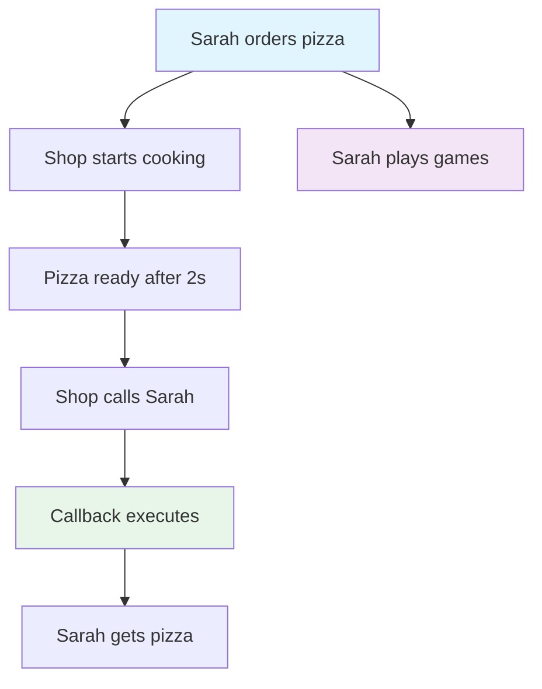
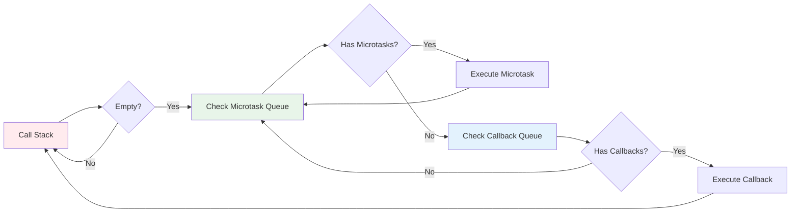

import { Callout } from "nextra/components";
import { Steps } from "nextra/components";
import { Tabs, Tab } from "nextra/components";
import { FileTree } from "nextra/components";

# ⏳ Asynchronous Programming: Sarah's Adventure in Time Land 🕰️

<Callout type="info" emoji="👋">
  Welcome! This chapter transforms confusing async concepts into a delightful
  story. Join Sarah on her pizza shop adventure and master JavaScript's
  asynchronous superpowers!
</Callout>

---

## 🍕 Meet Sarah and the Pizza Shop

Sarah is hungry and visits her favorite pizza shop. But here's the thing - she's also a JavaScript developer who hates waiting around doing nothing!

Just like JavaScript, Sarah wants to **multitask**: order pizza, play mobile games, chat with friends, and get notified when her food is ready. This is the essence of asynchronous programming!

<Callout type="default" emoji="🎯">
  **The Big Idea**: Asynchronous programming lets JavaScript handle multiple
  tasks without blocking the main thread - just like Sarah handling multiple
  activities while waiting for pizza!
</Callout>

---

## 1. 😴 Synchronous: The Boring Wait

Imagine Sarah decides to be... well, boring.

<Steps>

### Step 1: Order Pizza

Sarah walks up to the counter and places her order.

### Step 2: Stand and Wait

She just stands there. No phone. No chatting. Just... waiting.

### Step 3: Get Pizza

Finally! Pizza arrives and she can eat.

</Steps>

```js showLineNumbers
console.log("1. Sarah orders pizza 🍕");
console.log("2. Sarah waits... and waits... 😴");
console.log("3. Sarah finally gets her pizza! 😋");
// Output appears instantly, one after another
```

<Callout type="warning" emoji="⚠️">
  **The Problem**: In synchronous code, everything stops until the current task
  finishes. Imagine if your entire web app froze every time it needed to fetch
  data!
</Callout>

---

## 2. 🕹️ Asynchronous: The Smart Wait

Now Sarah discovers the art of multitasking! Let's explore three powerful async patterns.

### 📞 Pattern 1: Callbacks - "Call Me Back!"

Sarah gives the pizza shop her number and says "call me when it's ready!" Now she's free to do other things.

<Tabs items={['Real Life', 'JavaScript Code', 'Flow Diagram']}>

<Tab>
<Steps>

### Step 1: Order & Give Number

Sarah orders pizza and provides her phone number.

### Step 2: Start Other Activities

She immediately starts playing games on her phone.

### Step 3: Receive Callback

The shop calls when pizza is ready.

### Step 4: Collect & Enjoy

Sarah gets her pizza and enjoys her meal!

</Steps>
</Tab>

<Tab>
```js showLineNumbers {1,7,13}
function orderPizza(callMeBack) {
  console.log("📱 Sarah: 'Here's my number, call when ready!'");
  
  // Simulate pizza cooking time
  setTimeout(() => {
    console.log("🍕 Shop: 'Pizza ready! *ring ring*'");
    callMeBack(); // Execute the callback function
  }, 2000); // 2 seconds later
}

// Sarah orders pizza with a callback
orderPizza(() => {
console.log("😋 Sarah: 'Yay! Getting my pizza now!'");
});

// This runs immediately - Sarah doesn't wait!
console.log("🎮 Sarah: 'Time to play mobile games!'");
console.log("💬 Sarah: 'Let me text my friends...'");

```
</Tab>

<Tab>


</Tab>

</Tabs>

<Callout type="info" emoji="💡">
  **Key Insight**: Callbacks let you say "do this now, and call this function
  when you're done." The main thread stays free for other tasks!
</Callout>

---

### 🎟️ Pattern 2: Promises - "Your Ticket to the Future"

A Promise is like a numbered ticket at the pizza shop. It represents a value that will be available in the future.

**Sarah's Promise Journey:**

1. 🎟️ **Get Ticket**: Order pizza, receive promise (ticket #42)
2. 🎮 **Stay Busy**: Play games while waiting
3. ✅ **Resolution**: Number called - promise fulfilled!
4. ❌ **Rejection**: Kitchen fire - promise rejected!

<Tabs items={['Real Life', 'Basic Promise', 'Chaining Promises', 'Error Handling']}>

<Tab>
```js showLineNumbers {2,5,8,15,19}
function orderPizzaPromise() {
  return new Promise((resolve, reject) => {
    console.log("🎟️ Sarah gets ticket #42");
    
    setTimeout(() => {
      const pizzaReady = Math.random() > 0.2; // 80% success rate
      
      if (pizzaReady) {
        resolve("🍕 Pizza is ready!"); // Success!
      } else {
        reject("😢 Sorry, we ran out of cheese!"); // Failure!
      }
    }, 2000);
  });
}

// Using the promise
orderPizzaPromise()
.then((successMessage) => {
console.log(successMessage);
console.log("😋 Sarah enjoys her pizza!");
})
.catch((errorMessage) => {
console.log(errorMessage);
console.log("😤 Sarah orders from another shop!");
});

console.log("🎮 Sarah plays games while waiting...");

```
</Tab>

<Tab>
```js showLineNumbers
// Sarah wants pizza AND a drink
function orderDrinkPromise() {
  return new Promise((resolve) => {
    setTimeout(() => {
      resolve("🥤 Drink is ready!");
    }, 1000);
  });
}

console.log("🎮 Sarah plays games while waiting...");
// Chain promises together
orderPizzaPromise()
  .then((pizzaMessage) => {
    console.log(pizzaMessage);
    console.log("🤔 Sarah: 'Now I need a drink...'");
    return orderDrinkPromise(); // Return another promise
  })
  .then((drinkMessage) => {
    console.log(drinkMessage);
    console.log("🎉 Sarah: 'Perfect meal combo!'");
  })
  .catch((error) => {
    console.log("😞 Something went wrong:", error);
  });
```

</Tab>

<Tab>
```js showLineNumbers {2,12,18}
function orderPizzaPromise() {
  return new Promise((resolve, reject) => {
    setTimeout(() => {
      // Let's simulate different scenarios
      const scenario = Math.random();
      
      if (scenario > 0.7) {
        resolve("🍕 Delicious pepperoni pizza ready!");
      } else if (scenario > 0.4) {
        resolve("🍕 Cheese pizza ready!");
      } else {
        reject(new Error("Kitchen equipment broke down! 💥"));
      }
    }, 2000);
  });
}

orderPizzaPromise()
.then((message) => {
console.log("✅ Success:", message);
return "Sarah is happy! 😊";
})
.then((happiness) => {
console.log(happiness);
})
.catch((error) => {
console.log("❌ Error:", error.message);
console.log("🚗 Sarah drives to another restaurant...");
})
.finally(() => {
console.log("🏁 Either way, Sarah's adventure continues!");
});

```
</Tab>

</Tabs>

<Callout type="default" emoji="🔑">
**Promise States:**
- **Pending** 🕐: Ticket in hand, waiting for number to be called
- **Fulfilled** ✅: Pizza ready! Promise resolved successfully
- **Rejected** ❌: Kitchen issue! Promise failed with an error
</Callout>

---

### 💤 Pattern 3: Async/Await - "Sleep Until Ready"

Async/await makes asynchronous code look and feel synchronous - like Sarah's step-by-step to-do list!

<Tabs items={['Basic Usage', 'Error Handling', 'Multiple Awaits', 'Real-World Example']}>

<Tab>
```js showLineNumbers {1,4}
async function sarahsLunch() {
  console.log("📝 Sarah's to-do list:");
  console.log("1. Order pizza 🍕");

  try {
    // Wait here until promise resolves
    const pizzaMessage = await orderPizzaPromise();
    console.log("2. ✅", pizzaMessage);
    console.log("3. Enjoy delicious meal! 😋");
  } catch (error) {
    console.log("2. ❌ Handle error:", error);
    console.log("3. Order from backup restaurant 🏪");
  }
}

// Call the async function
sarahsLunch();

// This still runs immediately!
console.log("🎮 Playing games while Sarah handles her lunch...");
```

</Tab>

<Tab>
```js showLineNumbers {1,4,7,10}
async function sarahsDay() {
  console.log("🌅 Sarah starts her day...");
  
  try {
    // Multiple async operations
    console.log("☕ Ordering coffee...");
    await new Promise(resolve => setTimeout(resolve, 1000));
    console.log("✅ Coffee ready!");
    
    console.log("🍕 Ordering lunch...");
    const pizza = await orderPizzaPromise();
    console.log("✅", pizza);
    
    console.log("🚗 Calling rideshare...");
    await new Promise(resolve => setTimeout(resolve, 500));
    console.log("✅ Ride arrived!");
    
  } catch (error) {
    console.log("😓 Sarah's day hit a snag:", error.message);
    console.log("🔄 But she adapts and moves on!");
  } finally {
    console.log("🌙 Sarah ends her day fulfilled!");
  }
}

sarahsDay();

```

</Tab>

<Tab>
```js showLineNumbers
async function sarahsFullMeal() {
  console.log("🍽️ Sarah wants a complete meal...");

  try {
    // Wait for pizza first
    const pizza = await orderPizzaPromise();
    console.log("🍕 Got:", pizza);

    // Then wait for drink
    const drink = await orderDrinkPromise();
    console.log("🥤 Got:", drink);

    // Finally, wait for dessert
    const dessert = await new Promise(resolve => {
      setTimeout(() => resolve("🍰 Chocolate cake ready!"), 1500);
    });
    console.log("🍰 Got:", dessert);

    console.log("🎉 Sarah has the perfect meal!");

  } catch (error) {
    console.log("😔 Meal plan failed:", error.message);
  }
}

sarahsFullMeal();
```

</Tab>

<Tab>
```js showLineNumbers
// Real-world example: Fetching user data
async function loadUserProfile(userId) {
  try {
    console.log(`👤 Loading profile for user ${userId}...`);
    
    // Simulate API calls
    const user = await fetchUser(userId);
    console.log(`✅ User loaded: ${user.name}`);
    
    const posts = await fetchUserPosts(userId);
    console.log(`✅ Found ${posts.length} posts`);
    
    const friends = await fetchUserFriends(userId);
    console.log(`✅ Found ${friends.length} friends`);
    
    return {
      user,
      posts,
      friends,
      loadedAt: new Date()
    };
    
  } catch (error) {
    console.error("💥 Failed to load profile:", error.message);
    throw error; // Re-throw for caller to handle
  }
}

// Usage
async function displayProfile() {
try {
const profile = await loadUserProfile(123);
console.log("🎨 Rendering profile page...", profile);
} catch (error) {
console.log("🚫 Showing error page to user");
}
}

// Helper functions (simulated)
function fetchUser(id) {
return new Promise(resolve =>
setTimeout(() => resolve({ id, name: "Sarah" }), 800)
);
}

function fetchUserPosts(id) {
return new Promise(resolve =>
setTimeout(() => resolve([{}, {}, {}]), 600)
);
}

function fetchUserFriends(id) {
return new Promise(resolve =>
setTimeout(() => resolve([{}, {}]), 400)
);
}

```

</Tab>

</Tabs>

<Callout type="info" emoji="✨">
**Why Async/Await Rocks:**
- Reads like synchronous code
- Easy error handling with try/catch
- No callback hell or complex promise chains
- Perfect for sequential async operations
</Callout>

---

## 3. 🔄 The Event Loop: Pizza Shop Manager

The Event Loop is JavaScript's secret sauce - the manager coordinating everything behind the scenes!

<Callout type="default" emoji="🎭">
**Cast of Characters:**
- **Chef** 👨‍🍳: JavaScript Engine (single-threaded)
- **Manager** 👔: Event Loop (coordination master)
- **Timers** ⏰: setTimeout, setInterval
- **Waiters** 🍽️: Promises, async operations
</Callout>

### How the Pizza Shop (Event Loop) Works

<Steps>

### The Order Comes In
Customer (your code) places an order (async operation)

### Manager Takes Note
Event Loop registers the async task and continues serving other customers

### Background Work
Timers tick, network requests fly, promises cook in the background

### Ready for Pickup!
When async task completes, Event Loop queues the callback/promise resolution

### Serve the Customer
When the main thread is free, Event Loop delivers the result

</Steps>

```js showLineNumbers
console.log("👨‍🍳 Chef starts the day");

// Immediate task
console.log("🥪 Customer 1: Quick sandwich order");

// Async task 1 (timer)
setTimeout(() => {
  console.log("🍕 Customer 2: Pizza ready after 2s!");
}, 2000);

// Async task 2 (shorter timer)
setTimeout(() => {
  console.log("☕ Customer 3: Coffee ready after 1s!");
}, 1000);

// Immediate task
console.log("🥗 Customer 4: Instant salad order");

// Async task 3 (promise)
Promise.resolve().then(() => {
  console.log("🧁 Customer 5: Cupcake from display case!");
});

console.log("👔 Manager: All orders logged, now we wait...");

/* Expected Output Order:
   👨‍🍳 Chef starts the day
   🥪 Customer 1: Quick sandwich order
   🥗 Customer 4: Instant salad order
   👔 Manager: All orders logged, now we wait...
   🧁 Customer 5: Cupcake from display case!
   ☕ Customer 3: Coffee ready after 1s!
   🍕 Customer 2: Pizza ready after 2s!
*/
```

<Callout type="warning" emoji="🚨">
  **Important**: JavaScript is single-threaded, but the Event Loop creates the
  illusion of multitasking by juggling tasks efficiently!
</Callout>

### Event Loop Phases Visualized



---

## 4. 🎯 Advanced Async Patterns

Now that Sarah's mastered the basics, let's explore some advanced techniques!

### 🏃‍♀️ Promise.all() - "Order Everything at Once"

Sarah's hosting a party and needs pizza, drinks, and cake all ready at the same time.

<Tabs items={['Parallel Execution', 'Real Example', 'Error Scenarios']}>

<Tab>
```js showLineNumbers {11}
// Sarah orders everything simultaneously
function orderPartyFood() {
  const pizzaPromise = orderPizzaPromise();
  const drinkPromise = orderDrinkPromise();
  const cakePromise = new Promise(resolve => 
    setTimeout(() => resolve("🎂 Birthday cake ready!"), 1500)
  );
  
  // Wait for ALL to complete
  return Promise.all([pizzaPromise, drinkPromise, cakePromise]);
}

async function sarahsParty() {
console.log("🎉 Sarah: 'Party planning mode activated!'");

try {
// All orders placed simultaneously
const [pizza, drink, cake] = await orderPartyFood();

    console.log("🎊 Party menu ready:");
    console.log("-", pizza);
    console.log("-", drink);
    console.log("-", cake);
    console.log("🥳 Let the party begin!");

} catch (error) {
console.log("😅 Party delayed:", error.message);
}
}

sarahsParty();

```

</Tab>

<Tab>
```js showLineNumbers
// Real-world example: Loading dashboard data
async function loadDashboard() {
  console.log("📊 Loading dashboard...");

  const startTime = Date.now();

  try {
    // Fetch everything in parallel
    const [
      userStats,
      recentActivity,
      notifications,
      weatherData
    ] = await Promise.all([
      fetchUserStats(),
      fetchRecentActivity(),
      fetchNotifications(),
      fetchWeatherData()
    ]);

    const loadTime = Date.now() - startTime;
    console.log(`✅ Dashboard loaded in ${loadTime}ms`);

    return {
      userStats,
      recentActivity,
      notifications,
      weatherData,
      loadTime
    };

  } catch (error) {
    console.error("💥 Dashboard failed to load:", error.message);
    throw error;
  }
}

// Simulated API functions
function fetchUserStats() {
  return new Promise(resolve =>
    setTimeout(() => resolve({ visits: 142, sales: 89 }), 800)
  );
}

function fetchRecentActivity() {
  return new Promise(resolve =>
    setTimeout(() => resolve([{activity: "login"}, {activity: "purchase"}]), 600)
  );
}

function fetchNotifications() {
  return new Promise(resolve =>
    setTimeout(() => resolve([{message: "Welcome back!"}]), 400)
  );
}

function fetchWeatherData() {
  return new Promise(resolve =>
    setTimeout(() => resolve({ temp: 72, condition: "sunny" }), 500)
  );
}
```

</Tab>

<Tab>
```js showLineNumbers
// If ANY promise fails, Promise.all fails
function orderRiskyPartyFood() {
  const promises = [
    new Promise(resolve => setTimeout(() => resolve("🍕 Pizza ready"), 1000)),
    new Promise(resolve => setTimeout(() => resolve("🥤 Drinks ready"), 800)),
    new Promise((resolve, reject) => 
      setTimeout(() => reject(new Error("🔥 Cake oven broke!")), 1200)
    )
  ];
  
  return Promise.all(promises);
}

async function handlePartyRisk() {
try {
const results = await orderRiskyPartyFood();
console.log("🎉 All ready:", results);
} catch (error) {
console.log("😰 Party crisis:", error.message);
console.log("🛒 Sarah rushes to buy backup cake from store!");
}
}

handlePartyRisk();

```

</Tab>

</Tabs>

### 🏃‍♂️ Promise.race() - "First Come, First Served"

Sarah's really hungry and orders from two pizza shops - she'll take whichever comes first!

```js showLineNumbers {6}
function orderFromTwoShops() {
  const shop1 = new Promise(resolve =>
    setTimeout(() => resolve("🍕 Tony's Pizza ready!"), 2000)
  );
  const shop2 = new Promise(resolve =>
    setTimeout(() => resolve("🍕 Mario's Pizza ready!"), 1500)
  );

  // Return the first one that completes
  return Promise.race([shop1, shop2]);
}

async function hungrysarah() {
  console.log("😋 Sarah: 'I'm ordering from both shops!'");

  try {
    const firstPizza = await orderFromTwoShops();
    console.log("🏆 Winner:", firstPizza);
    console.log("📞 Sarah calls the other shop to cancel");
  } catch (error) {
    console.log("😢 Both shops failed:", error.message);
  }
}

hungrysarah();
```

### ⏱️ Promise with Timeout

Sarah doesn't want to wait forever - she sets a maximum wait time!

```js showLineNumbers {1,8,17}
function promiseWithTimeout(promise, timeoutMs) {
  const timeout = new Promise((_, reject) =>
    setTimeout(
      () => reject(new Error(`Timeout after ${timeoutMs}ms`)),
      timeoutMs
    )
  );

  return Promise.race([promise, timeout]);
}

const slowPizza = new Promise((resolve) =>
  setTimeout(() => resolve("🍕 Slow pizza ready!"), 5000)
);

async function impatientSarah() {
  try {
    // Wait maximum 3 seconds
    const result = await promiseWithTimeout(slowPizza, 3000);
    console.log("✅ Got pizza:", result);
  } catch (error) {
    console.log("⏰ Sarah got tired of waiting:", error.message);
    console.log("🏃‍♀️ Going to find faster food!");
  }
}

impatientSarah();
```

---

## 5. 💡 Sarah's Pro Tips & Best Practices

<Callout type="info" emoji="🎓">
  **Sarah's Golden Rules for Async Success:**
</Callout>

### ✅ Do's

1. **Always Handle Errors**

   ```js
   // Good: Always catch errors
   try {
     const data = await fetchData();
     return data;
   } catch (error) {
     console.error("Something went wrong:", error);
     return null;
   }
   ```

2. **Use Async/Await for Readability**

   ```js
   // Good: Clean and readable
   async function processOrder() {
     const order = await createOrder();
     const payment = await processPayment(order);
     return await sendConfirmation(payment);
   }
   ```

3. **Parallel When Possible**
   ```js
   // Good: Run independent operations in parallel
   const [user, posts, comments] = await Promise.all([
     fetchUser(id),
     fetchPosts(id),
     fetchComments(id),
   ]);
   ```

### ❌ Don'ts

1. **Don't Forget to Await**

   ```js
   // Bad: Missing await
   async function badExample() {
     const data = fetchData(); // Returns a Promise!
     console.log(data); // Logs Promise object, not data
   }

   // Good: Proper await
   async function goodExample() {
     const data = await fetchData();
     console.log(data); // Logs actual data
   }
   ```

2. **Don't Use Async for Everything**

   ```js
   // Bad: Unnecessary async
   async function addNumbers(a, b) {
     return a + b; // No async operation needed!
   }

   // Good: Simple synchronous function
   function addNumbers(a, b) {
     return a + b;
   }
   ```

3. **Don't Chain Unnecessarily**

   ```js
   // Bad: Unnecessary promise chaining
   fetchUser()
     .then((user) => fetchPosts(user.id))
     .then((posts) => fetchComments(posts[0].id))
     .then((comments) => console.log(comments));

   // Good: Clean async/await
   async function handleUser() {
     const user = await fetchUser();
     const posts = await fetchPosts(user.id);
     const comments = await fetchComments(posts[0].id);
     console.log(comments);
   }
   ```

---

## 6. 🧪 Interactive Quiz

Test your async knowledge with Sarah's quiz!

<Callout type="default" emoji="🤔">
**Question 1**: What will this code output?

```js
console.log("A");
setTimeout(() => console.log("B"), 0);
console.log("C");
```

<details>
<summary>Show Answer</summary>
**Answer**: A, C, B

**Explanation**: Even with 0ms timeout, setTimeout is async and goes through the event loop, so 'C' prints before 'B'.

</details>
</Callout>

<Callout type="default" emoji="🤔">
**Question 2**: Which pattern should Sarah use for sequential operations?

a) Promise.all()  
b) Promise.race()  
c) async/await  
d) Callbacks

<details>
<summary>Show Answer</summary>
**Answer**: c) async/await

**Explanation**: For operations that must happen in order, async/await provides the clearest, most readable approach.

</details>
</Callout>

<Callout type="default" emoji="🤔">
**Question 3**: What's wrong with this code?

```js
async function processItems(items) {
  items.forEach(async (item) => {
    await processItem(item);
  });
  console.log("All done!");
}
```

<details>
<summary>Show Answer</summary>
**Answer**: The async/await inside forEach doesn't work as expected. Use for...of loop or Promise.all() instead:

```js
// Option 1: Sequential processing
async function processItems(items) {
  for (const item of items) {
    await processItem(item);
  }
  console.log("All done!");
}

// Option 2: Parallel processing
async function processItems(items) {
  await Promise.all(items.map((item) => processItem(item)));
  console.log("All done!");
}
```

</details>
</Callout>

---

## 7. 🚀 Real-World Applications

Let's see how Sarah applies async programming in real projects!

### 📱 Building a Recipe App

<Tabs items={['User Stories', 'Implementation', 'Error Handling', 'Performance']}>

<Tab>
**Sarah's Recipe App Requirements:**

- 👤 **User Authentication**: Login before accessing recipes
- 🔍 **Search Recipes**: Find recipes by ingredients
- 📖 **Recipe Details**: Load recipe with reviews and photos
- ⭐ **Save Favorites**: Bookmark favorite recipes
- 📱 **Offline Support**: Cache recipes for offline viewing

Each feature involves multiple async operations!

</Tab>

<Tab>
```js showLineNumbers
class RecipeApp {
  constructor() {
    this.cache = new Map();
    this.user = null;
  }
  
  async login(email, password) {
    try {
      console.log("🔐 Logging in...");
      const user = await this.authService.login(email, password);
      this.user = user;
      console.log(`👋 Welcome back, ${user.name}!`);
      return user;
    } catch (error) {
      console.error("❌ Login failed:", error.message);
      throw error;
    }
  }
  
  async searchRecipes(query) {
    try {
      console.log(`🔍 Searching for "${query}"...`);
      
      // Check cache first
      if (this.cache.has(query)) {
        console.log("⚡ Found in cache!");
        return this.cache.get(query);
      }
      
      // Search external API
      const recipes = await this.recipeAPI.search(query);
      
      // Cache results
      this.cache.set(query, recipes);
      
      console.log(`✅ Found ${recipes.length} recipes`);
      return recipes;
      
    } catch (error) {
      console.error("🔍 Search failed:", error.message);
      return [];
    }
  }
  
  async loadRecipeDetails(recipeId) {
    try {
      console.log(`📖 Loading recipe ${recipeId}...`);
      
      // Load recipe, reviews, and photos in parallel
      const [recipe, reviews, photos] = await Promise.all([
        this.recipeAPI.getRecipe(recipeId),
        this.recipeAPI.getReviews(recipeId),
        this.recipeAPI.getPhotos(recipeId)
      ]);
      
      console.log("✅ Recipe details loaded!");
      return { recipe, reviews, photos };
      
    } catch (error) {
      console.error("📖 Failed to load recipe:", error.message);
      throw error;
    }
  }
  
  async saveToFavorites(recipeId) {
    try {
      if (!this.user) {
        throw new Error("Please login to save favorites");
      }
      
      console.log("⭐ Saving to favorites...");
      await this.favoritesAPI.save(this.user.id, recipeId);
      console.log("✅ Added to favorites!");
      
    } catch (error) {
      console.error("⭐ Failed to save favorite:", error.message);
      throw error;
    }
  }
}

// Usage example
async function demonstrateApp() {
const app = new RecipeApp();

try {
// Login
await app.login("sarah@example.com", "password123");

    // Search recipes
    const recipes = await app.searchRecipes("pasta");

    // Load first recipe details
    if (recipes.length > 0) {
      const details = await app.loadRecipeDetails(recipes[0].id);
      console.log("📱 Displaying recipe:", details.recipe);

      // Save to favorites
      await app.saveToFavorites(recipes[0].id);
    }

} catch (error) {
console.error("❌ App error:", error.message);
}
}

demonstrateApp();

```
</Tab>

<Tab>
**Error Handling Strategies:**

1. **Graceful Degradation**
   ```js
   async function loadRecipeWithFallback(recipeId) {
     try {
       const recipe = await this.recipeAPI.getRecipe(recipeId);
       return recipe;
     } catch (error) {
       console.warn("⚠️ Using cached recipe");
       return this.cache.get(recipeId) || null;
     }
   }
```

2. **Retry Logic**

   ```js
   async function fetchWithRetry(url, maxRetries = 3) {
     for (let i = 0; i < maxRetries; i++) {
       try {
         return await fetch(url);
       } catch (error) {
         if (i === maxRetries - 1) throw error;
         await new Promise((r) => setTimeout(r, 1000 * (i + 1)));
       }
     }
   }
   ```

3. **Circuit Breaker**

   ```js
   class CircuitBreaker {
     constructor() {
       this.failures = 0;
       this.isOpen = false;
     }

     async execute(fn) {
       if (this.isOpen) {
         throw new Error("Circuit breaker is open");
       }

       try {
         const result = await fn();
         this.failures = 0;
         return result;
       } catch (error) {
         this.failures++;
         if (this.failures >= 3) {
           this.isOpen = true;
           setTimeout(() => (this.isOpen = false), 5000);
         }
         throw error;
       }
     }
   }
```

</Tab>

<Tab>
**Performance Optimizations:**

1. **Caching**

   ```js
   class RecipeCache {
     constructor(ttl = 3600000) {
       // 1 hour
       this.cache = new Map();
       this.ttl = ttl;
     }

     set(key, value) {
       this.cache.set(key, {
         value,
         timestamp: Date.now(),
       });
     }

     get(key) {
       const item = this.cache.get(key);
       if (!item) return null;

       if (Date.now() - item.timestamp > this.ttl) {
         this.cache.delete(key);
         return null;
       }

       return item.value;
     }
   }
```

2. **Request Deduplication**

   ```js
   class RequestDeduplicator {
     constructor() {
       this.pending = new Map();
     }

     async execute(key, fn) {
       if (this.pending.has(key)) {
         return this.pending.get(key);
       }

       const promise = fn();
       this.pending.set(key, promise);

       try {
         return await promise;
       } finally {
         this.pending.delete(key);
       }
     }
   }
```

3. **Progressive Loading**

   ```js
   async function loadRecipeProgressive(recipeId) {
     // Load basic info first
     const basic = await this.recipeAPI.getBasicInfo(recipeId);
     this.updateUI(basic);

     // Then load details
     const details = await this.recipeAPI.getDetails(recipeId);
     this.updateUI(details);

     // Finally load reviews
     const reviews = await this.recipeAPI.getReviews(recipeId);
     this.updateUI({ reviews });
   }
```

</Tab>

</Tabs>

---

## 8. 📚 Additional Resources

<Callout type="info" emoji="📚">
  **Sarah's Recommended Reading:**
</Callout>

- [MDN Web Docs: Async JavaScript](https://developer.mozilla.org/en-US/docs/Learn/JavaScript/Asynchronous)
- [JavaScript.info: Promises, async/await](https://javascript.info/async)
- [You Don't Know JS: Async & Performance](https://github.com/getify/You-Dont-Know-JS/blob/1st-ed/async%20%26%20performance/README.md)

<Callout type="warning" emoji="⚠️">
  **Common Pitfalls to Avoid:**
</Callout>

1. **Callback Hell**: Use async/await instead of nested callbacks
2. **Unhandled Rejections**: Always catch promise rejections
3. **Race Conditions**: Be careful with shared state in async code
4. **Memory Leaks**: Clean up event listeners and timeouts

---

## 9. 🎯 Practice Exercises

<Callout type="default" emoji="💪">
  **Try these exercises to master async programming:**
</Callout>

1. **Build a Weather App**

   - Fetch weather data from an API
   - Handle loading states
   - Implement error handling
   - Add caching

2. **Create a File Uploader**

   - Upload multiple files
   - Show progress
   - Handle errors
   - Implement retry logic

3. **Build a Chat Application**
   - Real-time messaging
   - Handle disconnections
   - Implement message queuing
   - Add typing indicators

---

## 10. 🎉 Conclusion

<Callout type="success" emoji="🎓">
  **Sarah's Final Tips:**
</Callout>

1. **Start Simple**: Begin with basic async/await
2. **Practice**: Build real projects
3. **Learn Patterns**: Study common async patterns
4. **Debug**: Use browser dev tools
5. **Stay Updated**: Follow JavaScript news

Remember: Async programming is a journey. Take it step by step, and don't be afraid to make mistakes. That's how we learn! 🚀

export default function Layout({ children }) {
  return <>{children}</>;
}
