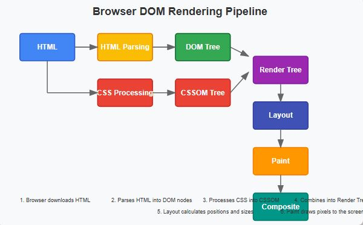
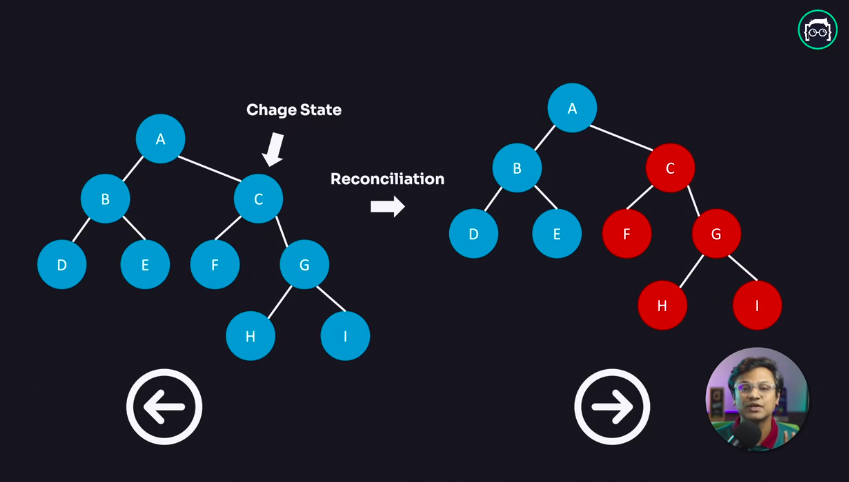

## Is DOM Really Slow?

No, DOM is never slow. In fact, if coded properly, DOM is faster than anything else. But in today's world, web applications are highly interactive, so whenever a user interacts with them, the browser needs to repaint the entire website. When the browser has to repeatedly repaint due to many reactions, that repainting process becomes slow, but fundamentally, the DOM itself is not slow.

## How Does the Browser Render DOM?



We can see that the browser's rendering process is shown through a graph above. What do we see here? We see that when a browser receives `HTML` and `CSS` files, it processes them through parsing, using `HTML PARSER` for `HTML` and `CSS PARSER` for `CSS`. After parsing, the browser creates a `DOM TREE` from the `HTML` and creates `STYLE RULES` called `CSSOM` from the `CSS`. The `DOM TREE` and `STYLE RULES` are then attached together to create a `RENDER TREE`. This `RENDER TREE` goes through a `LAYOUT` phase in the browser. In this `LAYOUT` phase, the coordinates of where the `DOM TREE` will be rendered in the browser are prepared. Finally, the browser paints it in the browser through its PAINTING mechanism, and we see the final output.

## Vanilla JS vs React: DOM Repaint Example

Let's see how DOM repainting works in both Vanilla JavaScript and React with a simple example: adding fruits to a list.

### Vanilla JavaScript Example

```js
Array.prototype.myPush = function (...a) {
  this.push(a[0]);
  init();
};

const display = document.getElementById("fruits");
const button = document.querySelector("#button");

let fruits = ["mango", "guava", "apple", "oragne"];

const init = function () {
  document.getElementById("fruits").innerHTML = "";
  fruits.sort().forEach((fruit) => {
    let item = document.createElement("li");
    item.textContent = fruit;
    document.getElementById("fruits").appendChild(item);
  });
};

const addItem = function () {
  fruits.myPush(document.getElementById("input").value);
};

init();
```

**HTML:**

```html
<ul id="fruits"></ul>
<input type="text" id="input" />
<button id="button" onclick="addItem()">Add Item</button>
```

**Explanation:**

- Every time you add a fruit, the entire list is cleared and rebuilt from scratch. This means the DOM is repainted for the whole list, even if only one item was added.
- The custom `myPush` method is used to add a new fruit and re-render the list.

### What is Prototype in JavaScript?

In JavaScript, every object has a prototype. A prototype is also an object. All JavaScript objects inherit their properties and methods from their prototype. You can extend built-in objects (like Array) by adding methods to their prototype. In the example above, we added a custom `myPush` method to the Array prototype, so all arrays can use it.

**Note:** Modifying built-in prototypes is generally discouraged in production code, but it's useful for learning and experimentation.

---

## What is Virtual DOM? How Does Virtual DOM Work?

Virtual DOM is a fundamental aspect of React. The foundation of React is primarily this Virtual DOM.

The browser's repainting process slows down the application. To avoid this problem, what can we do? We can solve this in two ways:

- We can batch update,
- We can minimize DOM manipulation.

React does exactly that through its Virtual DOM. React performs minimal DOM manipulation.

### React Example

```jsx
const Fruits = () => {
  const [fruit, setFruit] = React.useState("");
  const [fruits, setFruits] = React.useState([
    "mango",
    "guava",
    "apple",
    "oragne",
  ]);

  return (
    <div className="container">
      <ul id="fruits">
        {fruits.sort().map((fruit, index) => (
          <li key={index}>{fruit}</li>
        ))}
      </ul>
      <br />
      <p>
        <input
          type="text"
          value={fruit}
          onChange={(e) => setFruit(e.target.value)}
        />
      </p>
      <button onClick={() => setFruits([...fruits, fruit])}>Add Item</button>
    </div>
  );
};

ReactDOM.render(<Fruits />, document.getElementById("root"));
```

**Explanation:**

- React uses its Virtual DOM to track changes. When you add a fruit, React only updates the part of the DOM that changed (the new list item), not the entire list.
- This makes updates more efficient and improves performance, especially for large lists or complex UIs.



When a user interacts with the application and if there's a need to change the `UI`, React doesn't directly change the `DOM TREE` of the `HTML`. Whenever there's a change in the `UI`, React creates a replica or copy of the `UI` with the help of its Virtual `DOM`. Then React checks exactly where the change has occurred in the `UI` using its custom algorithm called `Diffing` or `Reconciliation`. This allows it to update only the part that has changed in the `DOM` without re-rendering the entire website. This way, React improves application performance through minimal DOM operations.

## Summary: Why Virtual DOM Matters

- In vanilla JS, direct DOM manipulation can cause unnecessary repaints and performance issues as the UI grows.
- React's Virtual DOM ensures only the necessary parts of the UI are updated, making applications faster and more efficient.
