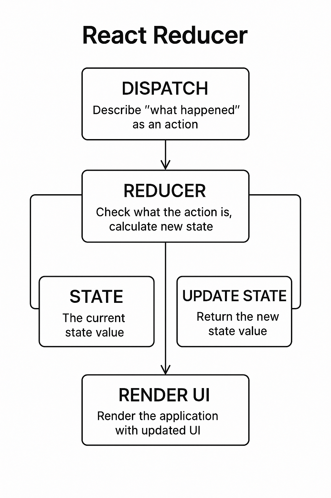

# Extracting State Logic into a Reducer 🚀🧩

> **This guide will take you from absolute beginner to advanced with reducers in React. We'll use simple language, real-life analogies, visuals, and hands-on challenges!**

---

## What is State in React? 🏗️

In React, **state** is like a box where your component stores information it needs to remember. For example, if you have a counter, the number is stored in state. If you have a to-do list, the list of tasks is stored in state.

- **State is data that can change over time.**
- **When state changes, your UI updates automatically!**

### Example: A Simple Counter

```js
import { useState } from "react";

function Counter() {
  const [count, setCount] = useState(0);
  return (
    <button onClick={() => setCount(count + 1)}>
      You clicked {count} times
    </button>
  );
}
```

---

## Why Do We Need Reducers? 🤔

For simple components, `useState` is perfect. But as your app grows, you might have:

- Many pieces of state that depend on each other
- Complicated logic for updating state
- Lots of event handlers doing similar things

This can make your code messy and hard to understand. Imagine trying to keep track of a big to-do list, with tasks being added, edited, deleted, and marked as done—all in different places! 😵‍💫

**Reducers help you organize all your state logic in one place, making your code easier to read, debug, and maintain.**

---

## What is a Reducer? 🛠️

A **reducer** is a function that takes two things:

1. The current state (what your data looks like now)
2. An action (an object describing what happened)

And it returns the new state (what your data should look like after the action).

**Analogy:**

- Imagine your state is a pizza 🍕.
- An action is an order, like "add pepperoni" or "remove olives".
- The reducer is the chef 👨‍🍳 who takes the pizza and the order, and returns a new pizza with the requested changes!

```js
function pizzaReducer(pizza, action) {
  if (action.type === "addTopping") {
    return { ...pizza, toppings: [...pizza.toppings, action.topping] };
  }
  // ...other actions
}
```

---

## How Does `useReducer` Work? 🧑‍💻

React gives you a special hook called `useReducer` for using reducers in your components.

```js
const [state, dispatch] = useReducer(reducerFunction, initialState);
```

- `state` is your current data
- `dispatch` is a function you call to send an action to the reducer
- `reducerFunction` is your chef (the reducer)
- `initialState` is what your data looks like at the start

---

## Visual: How Reducers Work in React 🖼️


_How actions flow through dispatch to the reducer and update state!_

---

## Step-by-Step Example: To-Do List 📝

Let's build a simple to-do list, first with `useState`, then with `useReducer`.

### 1. To-Do List with `useState` 🧱

```js
import { useState } from "react";

function TodoApp() {
  const [tasks, setTasks] = useState([]);

  function addTask(text) {
    setTasks([...tasks, { id: Date.now(), text, done: false }]);
  }

  function toggleTask(id) {
    setTasks(
      tasks.map((task) =>
        task.id === id ? { ...task, done: !task.done } : task
      )
    );
  }

  function deleteTask(id) {
    setTasks(tasks.filter((task) => task.id !== id));
  }

  // ...render UI
}
```

**Problems:**

- All the logic is spread out in different functions
- If you add more features, it gets messy fast!

---

### 2. To-Do List with `useReducer` 🦾

Let's move all the logic into a single reducer function!

```js
import { useReducer } from "react";

function tasksReducer(tasks, action) {
  switch (action.type) {
    case "added":
      return [...tasks, { id: action.id, text: action.text, done: false }];
    case "toggled":
      return tasks.map((task) =>
        task.id === action.id ? { ...task, done: !task.done } : task
      );
    case "deleted":
      return tasks.filter((task) => task.id !== action.id);
    default:
      throw new Error("Unknown action: " + action.type);
  }
}

function TodoApp() {
  const [tasks, dispatch] = useReducer(tasksReducer, []);

  function addTask(text) {
    dispatch({ type: "added", id: Date.now(), text });
  }

  function toggleTask(id) {
    dispatch({ type: "toggled", id });
  }

  function deleteTask(id) {
    dispatch({ type: "deleted", id });
  }

  // ...render UI
}
```

**Benefits:**

- All the logic is in one place (the reducer)
- Easy to add new actions (like editing a task)
- Easier to debug and test

---

## Challenge: Predict the State! 🏆

> **Try it Yourself!**
>
> What happens if you dispatch `{ type: 'deleted', id: 2 }` to this list?
>
> ```js
> const tasks = [
>   { id: 1, text: "Learn React", done: false },
>   { id: 2, text: "Write docs", done: true },
> ];
> ```

---

## Breaking Down the Reducer 🧬

Let's look at the reducer more closely:

- **State**: The current list of tasks
- **Action**: An object like `{ type: 'added', id: 123, text: 'Learn React' }`
- **Return**: The new list of tasks after the action

**Every time you call `dispatch(action)`, React calls your reducer and updates the state!**

---

## What is an Action? 🎬

An **action** is just an object that describes what happened. It usually has a `type` (a string) and any extra info needed.

```js
{ type: 'added', id: 123, text: 'Learn React' }
{ type: 'deleted', id: 123 }
```

**Tip:** Use clear, descriptive action types!

---

## Why is This Better for Bigger Apps? 🏢

- **All logic in one place**: Easier to see what can happen to your state
- **Predictable**: Every action goes through the reducer, so you always know how state changes
- **Testable**: Reducers are just functions! You can test them without React
- **Scalable**: Add more actions as your app grows

---

## Real-Life Analogy: The Pizza Shop 🍕

- **State**: The pizza you're making
- **Action**: The customer's order (add cheese, remove olives)
- **Reducer**: The chef who updates the pizza based on the order
- **Dispatch**: The waiter who brings the order to the chef

---

## Tips for Writing Reducers 📝

- **Reducers must be pure**: No side effects (no API calls, no timeouts)
- **Never change the state directly**: Always return a new object/array
- **Use clear action types**: Like `'added'`, `'deleted'`, `'toggled'`
- **Keep it simple**: Each action should do one thing

---

## Bonus: Using Immer for Simpler Reducers 🍰

Sometimes, writing reducers without mutating state can feel awkward. [Immer](https://immerjs.github.io/immer/) lets you write reducers that look like you're changing state directly, but it keeps things safe under the hood!

```js
import { useImmerReducer } from "use-immer";

function tasksReducer(draft, action) {
  switch (action.type) {
    case "added":
      draft.push({ id: action.id, text: action.text, done: false });
      break;
    case "toggled":
      const task = draft.find((t) => t.id === action.id);
      if (task) task.done = !task.done;
      break;
    case "deleted":
      return draft.filter((t) => t.id !== action.id);
    default:
      throw new Error("Unknown action: " + action.type);
  }
}
```

---

## Advanced: When to Use useReducer vs useState? 🧑‍🎓

- Use `useState` for simple, independent pieces of state.
- Use `useReducer` when:
  - State logic is complex or involves multiple sub-values
  - The next state depends on the previous state
  - You want to centralize state updates
  - You need to test or debug state logic separately

**Pro Tip:** Many large apps use reducers for global state management (see Redux below!).

---

## Comparing `useState` and `useReducer` ⚖️

Both `useState` and `useReducer` are hooks for managing state in React, but they shine in different scenarios. Here's how they compare:

| Aspect          | useState                              | useReducer                                                                 |
| --------------- | ------------------------------------- | -------------------------------------------------------------------------- |
| **Code size**   | Less code for simple state            | More code (reducer + actions), but can reduce repetition for complex logic |
| **Readability** | Very readable for simple updates      | Cleaner for complex logic, separates "what happened" from "how to update"  |
| **Debugging**   | Harder to trace bugs in complex state | Easier to log actions and see why state changed                            |
| **Testing**     | State logic is inside component       | Reducer is a pure function, easy to test in isolation                      |
| **Preference**  | Simple and direct                     | More structure, but more boilerplate                                       |

### Summary

- **useState** is best for simple, independent state updates.
- **useReducer** is best for complex state logic, or when you want to centralize updates and make debugging/testing easier.
- You can mix and match both in the same component!

For more, see the [official React docs on comparing useState and useReducer](https://react.dev/learn/extracting-state-logic-into-a-reducer#comparing-usestate-and-usereducer).

---

## How to Write Reducers Well 🏆

Writing reducers well ensures your state logic is predictable, maintainable, and bug-free. Here are the best practices:

### 1. Reducers Must Be Pure Functions

- No side effects (no API calls, no timeouts, no random values).
- Always return the same output for the same input.

### 2. Never Mutate State Directly

- Always return a new object or array.
- Use the spread operator (`...`) or libraries like Immer for complex updates.

### 3. Handle All Action Types Explicitly

- Use a `switch` or `if`/`else` to handle each action.
- Always have a `default` case that returns the current state.

### 4. Keep Actions Descriptive and Minimal

- Action objects should have a clear `type` and only the data needed for the update.

### 5. Keep Reducers Focused

- Each reducer should manage a single piece of state (or a closely related group).

---

### Example: Well-Written Reducer

```js
function counterReducer(state, action) {
  switch (action.type) {
    case "increment":
      return { ...state, count: state.count + 1 };
    case "decrement":
      return { ...state, count: state.count - 1 };
    case "reset":
      return { ...state, count: 0 };
    default:
      return state; // Always return current state for unknown actions
  }
}

// Usage in a component
const initialState = { count: 0 };

function Counter() {
  const [state, dispatch] = React.useReducer(counterReducer, initialState);

  return (
    <div>
      <p>Count: {state.count}</p>
      <button onClick={() => dispatch({ type: "increment" })}>+</button>
      <button onClick={() => dispatch({ type: "decrement" })}>-</button>
      <button onClick={() => dispatch({ type: "reset" })}>Reset</button>
    </div>
  );
}
```

---

### Tips for Writing Reducers Well

- **No side effects:** Don't fetch data, log, or update outside variables inside the reducer.
- **No mutation:** Don't change arrays/objects in place—always return new ones.
- **Descriptive actions:** Use clear action types like `'add_todo'`, `'remove_todo'`.
- **Minimal state:** Only store what you need; compute derived data outside the reducer.
- **Testable:** Since reducers are pure, you can easily write unit tests for them.

---

For more, see the [official React docs: Writing reducers well](https://react.dev/learn/extracting-state-logic-into-a-reducer#writing-reducers-well).

---

## Real-World Use Cases 🌍

- **Forms with many fields** (e.g., sign-up forms)
- **Undo/redo functionality**
- **Complex UI state** (e.g., tabs, modals, notifications)
- **Global state management** (e.g., Redux uses reducers!)

---

## FAQ: Common Questions & Pitfalls ❓

**Q: Can I use async code in a reducer?**

> No! Reducers must be pure. Do async work outside, then dispatch actions when done.

**Q: What if I mutate state by accident?**

> You might see weird bugs! Always return a new object/array.

**Q: Can I use both useState and useReducer?**

> Yes! Use whatever makes your code clearer.

**Q: Is useReducer only for big apps?**

> No, but it shines when state logic is complex or related.

## Next Steps & Resources 📚

- Try building your own to-do app with reducers!
- Explore [React's official docs on reducers](https://react.dev/learn/extracting-state-logic-into-a-reducer#consolidate-state-logic-with-a-reducer)
- Play with [this CodeSandbox example](https://codesandbox.io/s/react-usereducer-todo-example-6v6wz)
- Join the [Reactiflux Discord](https://www.reactiflux.com/) to ask questions!

Happy coding! 🎉👩‍💻👨‍💻
