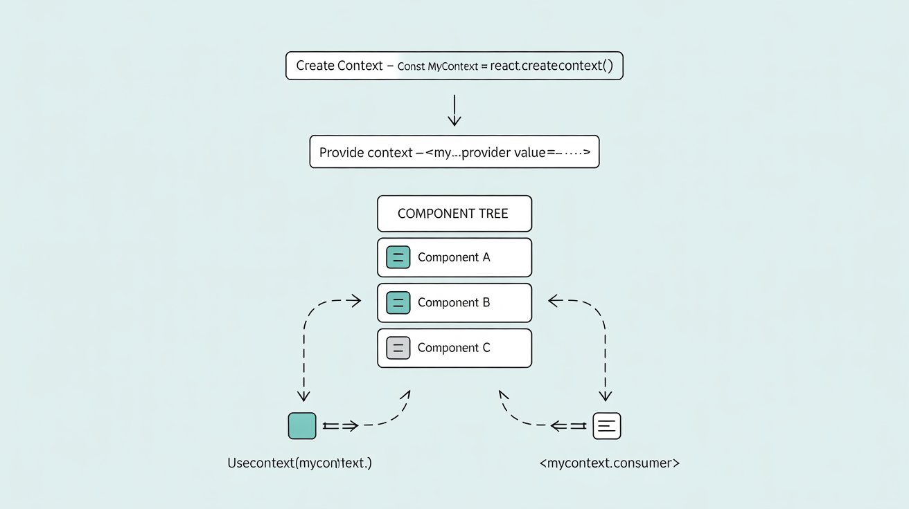

# Passing Data Deeply with Context in React 🌳✨

> **Level:** Beginner to Advanced  
> **Goal:** Learn how to avoid "prop drilling" and share data easily across your React app using Context.

---

## 🧐 Why Do We Need Context?

Imagine you have a family tree, and you want to pass a secret from the grandparent to the grandchild. If you have to whisper the secret through every parent in between, it gets repetitive and messy!  
In React, this is called **prop drilling**—passing data through many layers of components that don't even use it.

**Context** is like a magical intercom: the grandparent can broadcast the secret, and any grandchild can listen—no matter how deep in the tree!

**Analogy:**

- **Props:** Like passing a note hand-to-hand through every person in a row.
- **Context:** Like using a group chat—everyone in the group can see the message instantly!

---

## 🚩 The Problem: Prop Drilling

Let's see a visual:

```
<App>
  <Parent>
    <Child>
      <Grandchild />
    </Child>
  </Parent>
</App>
```

Suppose `<Grandchild />` needs a value from `<App>`.  
With props, you'd have to pass it down through every layer:

```jsx
function App() {
  const theme = "dark";
  return <Parent theme={theme} />;
}
function Parent({ theme }) {
  return <Child theme={theme} />;
}
function Child({ theme }) {
  return <Grandchild theme={theme} />;
}
function Grandchild({ theme }) {
  return <div>Theme: {theme}</div>;
}
```

**Problems:**

- Tedious and repetitive
- Hard to maintain as the app grows
- Intermediate components receive props they don't use ("prop pollution")

---

## 🦸‍♂️ The Solution: React Context

**Context** lets you:

- Share data with any component, no matter how deep
- Avoid passing props through every level
- Make your code cleaner and more maintainable

> **Tip:** Use context for data that many components need (like theme, user info, or language), not for local state.

---

## 🛠️ How Context Works (Step by Step)

### 1. **Create a Context**

```jsx
import { createContext } from "react";
const ThemeContext = createContext("light"); // 'light' is the default value
```

### 2. **Provide the Context Value**

Wrap your component tree with the context provider:

```jsx
<ThemeContext.Provider value="dark">
  <App />
</ThemeContext.Provider>
```

### 3. **Consume the Context Value**

Any child component can access the value using `useContext`:

```jsx
import { useContext } from "react";

function Grandchild() {
  const theme = useContext(ThemeContext);
  return <div>Theme: {theme}</div>;
}
```

---

## 🖼️ Visual: Context vs Prop Drilling


_Prop drilling: value passed through every layer_


_Context: value available anywhere below the provider!_

---

## 🏆 Real-Life Scenario: Theming

Suppose you want to let users switch between light and dark mode. Many components need to know the current theme. Instead of passing `theme` as a prop everywhere, use context!

```jsx
// ThemeContext.js
import { createContext } from "react";
export const ThemeContext = createContext("light");

// App.js
import { ThemeContext } from "./ThemeContext";
import { useState } from "react";

function App() {
  const [theme, setTheme] = useState("light");
  return (
    <ThemeContext.Provider value={theme}>
      <Toolbar />
      <button onClick={() => setTheme(theme === "light" ? "dark" : "light")}>
        Toggle Theme
      </button>
    </ThemeContext.Provider>
  );
}

// Any deeply nested component
import { useContext } from "react";
import { ThemeContext } from "./ThemeContext";

function Button() {
  const theme = useContext(ThemeContext);
  return <button className={theme}>I am styled by theme!</button>;
}
```

---

## 🧩 Advanced Use Cases

### 1. **Multiple Contexts**

You can use more than one context in a component:

```jsx
const UserContext = createContext(null);
const ThemeContext = createContext("light");

function Profile() {
  const user = useContext(UserContext);
  const theme = useContext(ThemeContext);
  return <div className={theme}>Hello, {user.name}!</div>;
}
```

---

## 🔥 Context + useReducer: Powerful State Management

### Why Combine Context and Reducer?

- **useReducer** is great for managing complex state logic (like a todo list, cart, or authentication) in a predictable way.
- **Context** lets you share that state and its update logic (the dispatch function) with any component, no matter how deep in the tree.
- **Together:** You get a mini version of Redux—centralized, testable, and scalable state management, but built-in to React!

**Analogy:**

- **Reducer:** Like a control center that decides how to update the state based on actions.
- **Context:** Like a radio tower that broadcasts the current state and the control center's phone number (dispatch) to any component that wants to listen or send commands.

### Real-Life Example: Todo List with Context + Reducer

Let's build a simple todo app where any component can add, toggle, or remove todos—no matter how deep it is in the tree!

```jsx
// TodoContext.js
import { createContext, useReducer, useContext } from "react";

const TodoContext = createContext();

function todoReducer(todos, action) {
  switch (action.type) {
    case "add":
      return [...todos, { id: Date.now(), text: action.text, done: false }];
    case "toggle":
      return todos.map((todo) =>
        todo.id === action.id ? { ...todo, done: !todo.done } : todo
      );
    case "remove":
      return todos.filter((todo) => todo.id !== action.id);
    default:
      throw new Error("Unknown action: " + action.type);
  }
}

export function TodoProvider({ children }) {
  const [todos, dispatch] = useReducer(todoReducer, []);
  return (
    <TodoContext.Provider value={{ todos, dispatch }}>
      {children}
    </TodoContext.Provider>
  );
}

export function useTodos() {
  return useContext(TodoContext);
}
```

```jsx
// App.js
import { TodoProvider, useTodos } from "./TodoContext";

function AddTodo() {
  const { dispatch } = useTodos();
  const [text, setText] = useState("");
  return (
    <form
      onSubmit={(e) => {
        e.preventDefault();
        dispatch({ type: "add", text });
        setText("");
      }}
    >
      <input value={text} onChange={(e) => setText(e.target.value)} />
      <button>Add</button>
    </form>
  );
}

function TodoList() {
  const { todos, dispatch } = useTodos();
  return (
    <ul>
      {todos.map((todo) => (
        <li
          key={todo.id}
          style={{ textDecoration: todo.done ? "line-through" : "" }}
        >
          {todo.text}
          <button onClick={() => dispatch({ type: "toggle", id: todo.id })}>
            Toggle
          </button>
          <button onClick={() => dispatch({ type: "remove", id: todo.id })}>
            Remove
          </button>
        </li>
      ))}
    </ul>
  );
}

export default function App() {
  return (
    <TodoProvider>
      <h1>Todo List</h1>
      <AddTodo />
      <TodoList />
    </TodoProvider>
  );
}
```

**How it works:**

- The `TodoProvider` wraps your app and provides both the state (`todos`) and the `dispatch` function to any component.
- Any component can read the todos or dispatch actions (add, toggle, remove) without prop drilling!
- The reducer keeps all state logic in one place, making it easy to test and maintain.

> **Tip:** This pattern is great for authentication, shopping carts, notifications, and more!

---

## 🧠 Common Pitfalls & Debugging

- **Unintentional re-renders:** If you pass a new object/function as context value every render, all consumers re-render. Use `useMemo` to memoize values:

```jsx
const value = useMemo(() => ({ user, logout }), [user]);
<SomeContext.Provider value={value}>...</SomeContext.Provider>;
```

- **Forgetting the Provider:** If you use `useContext` outside a provider, you'll get the default value (which may not be what you expect!).

- **Deeply nested providers:** Too many nested providers can make code hard to read. Consider flattening or grouping related contexts.

- **Overusing context:** Not all shared data needs context! Prefer props for most cases.

- **Debugging:** Use React DevTools to inspect context values and providers in your component tree.

---

## 💡 Best Practices & Tips

- **Use context for truly global/shared data** (theme, user, locale, etc.)
- **Don't overuse context!** For most data, passing props is clearer and easier to debug.
- **Split contexts** for unrelated data (e.g., ThemeContext, AuthContext)
- **Memoize context values** if they're objects/functions to avoid unnecessary re-renders.
- **Combine with reducers** for complex state: useReducer + context = mini Redux!
- **Document your contexts**: Explain what each context is for and what values it provides.

---

## ⚠️ When _Not_ to Use Context

- For local state (form input, toggle, etc.)—use `useState` instead.
- If only a few components need the data, props are simpler.
- Context updates re-render all consuming components—be mindful of performance.
- Avoid putting frequently changing values (like mouse position) in context.

---

## 📚 Further Learning & Resources

- [React Official Docs: Passing Data Deeply with Context](https://react.dev/learn/passing-data-deeply-with-context)
- [React Official Docs: Context API Reference](https://react.dev/reference/react/createContext)
- [Reactiflux Discord Community](https://www.reactiflux.com/)
- [CodeSandbox: Context Example](https://codesandbox.io/s/react-context-example-2v8z6)
- [Kent C. Dodds: How to use React Context effectively](https://kentcdodds.com/blog/how-to-use-react-context-effectively)

---

## 📝 FAQ

**Q: Can I use multiple contexts in one component?**  
A: Yes! Just use multiple providers and `useContext` calls.

**Q: Does context replace Redux?**  
A: For simple/medium global state, yes. For very complex state, Redux or Zustand may be better.

**Q: Is context slow?**  
A: Not for most apps, but avoid putting frequently changing values in context.

**Q: How do I debug context issues?**  
A: Use React DevTools to inspect context providers and consumers. Check for missing providers or unnecessary re-renders.

---

## 🎯 Challenge: Refactor Prop Drilling to Context

Try refactoring a component tree that passes a value through 3+ layers of props. Replace it with context and see how much cleaner your code becomes!

---

## 🏁 Recap

- Context helps you avoid prop drilling and makes global data sharing easy.
- Use it wisely—prefer props for most cases, and context for truly shared/global data.
- Combine with hooks like `useReducer` for advanced state management.
- Debug and document your contexts for maintainable code.

Happy coding! 🚀
