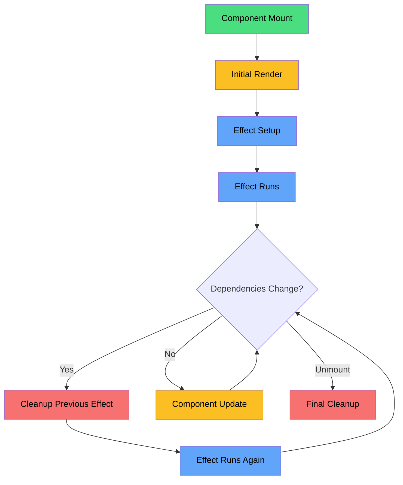
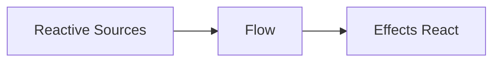
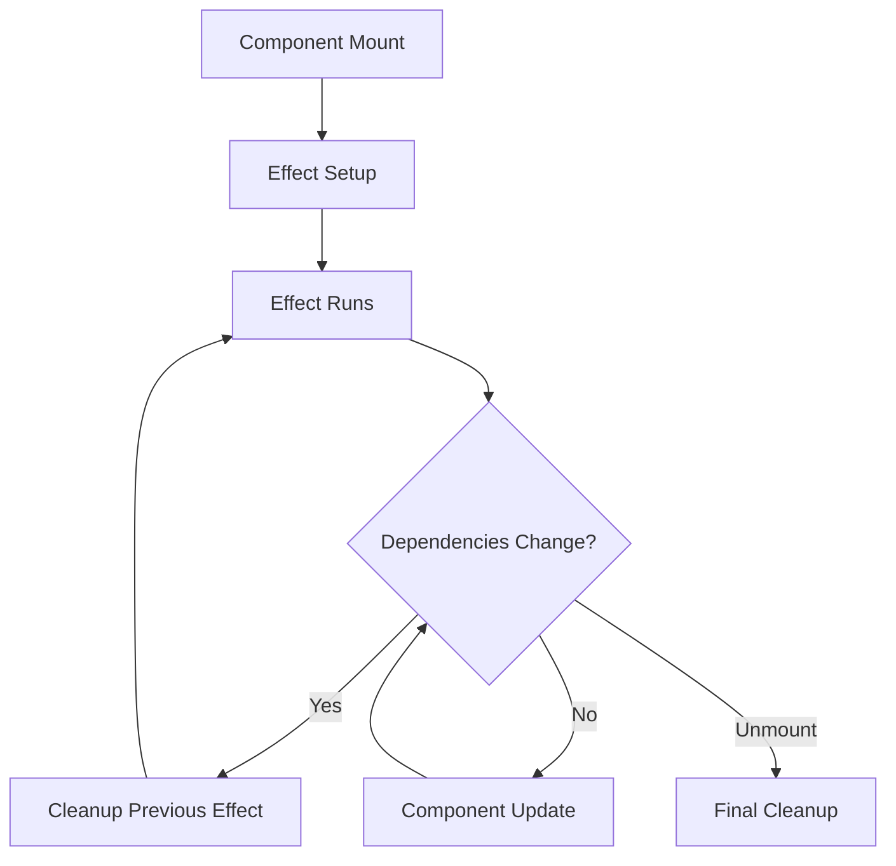

import { Callout, Tabs, Tab } from 'nextra/components'

# 🔄 The Complete Guide to Mastering React Effects: Advanced Patterns & Best Practices

_The second part of our comprehensive guide to mastering React's useEffect hook_

---

## 📋 Table of Contents

1. 🔄 Effect Lifecycle and Dependencies
2. ⚡ Effects React to Reactive Values
3. 🖱️ Separating Events from Effects
4. ✂️ Removing Effect Dependencies
5. 🪝 Reusing Logic with Custom Hooks
6. 🛠️ Advanced Patterns
7. 🐛 Common Mistakes & Debugging
8. 📚 Complete Reference

---

## 🔄 Effect Lifecycle and Dependencies

### 🎭 Understanding the Effect Lifecycle

Think of Effects like a stage manager in a theater production. They coordinate behind-the-scenes activities while the main performance (rendering) happens on stage.

<div className="grid grid-cols-1 md:grid-cols-3 gap-4 my-8 p-6 border-2 border-slate-300 rounded-xl bg-slate-50 text-black">

<div className="p-4 bg-green-100 rounded-lg border-2 border-green-600 text-center">
  <div className="font-bold text-lg">🟢 MOUNT</div>
  <div className="text-sm mt-2">Component renders for the first time ↓ Effect runs</div>
</div>

<div className="p-4 bg-amber-100 rounded-lg border-2 border-amber-500 text-center">
  <div className="font-bold text-lg">🔄 UPDATE</div>
  <div className="text-sm mt-2">Dependencies change ↓ Cleanup runs ↓ Effect runs</div>
</div>

<div className="p-4 bg-red-200 rounded-lg border-2 border-red-500 text-center">
  <div className="font-bold text-lg">🔴 UNMOUNT</div>
  <div className="text-sm mt-2">Component is removed ↓ Cleanup runs</div>
</div>

</div>

### 📊 Effect Lifecycle Flow



#### 🔍 Understanding the Flow

1. **Component Mount (🟢)**
   - Component is first rendered
   - Effect setup begins
   - Effect runs for the first time

2. **Update Cycle (🔄)**
   - When dependencies change:
     - Previous effect's cleanup runs
     - New effect runs
   - When no dependencies change:
     - Component updates normally
     - Effect doesn't re-run

3. **Unmount (🔴)**
   - Component is removed from DOM
   - Final cleanup runs
   - All subscriptions and listeners are cleaned up

### 🔬 Interactive Lifecycle Demo

```jsx
function LifecycleDemo() {
  const [count, setCount] = useState(0)
  const [mounted, setMounted] = useState(true)

  function LifecycleChild() {
    useEffect(
      () => {
        console.log('🟢 MOUNT: Effect running, count is:', count)

        return () => {
          console.log('🔴 CLEANUP: Effect cleaning up, count was:', count)
        }
      },
      [count],
    )

    return (
      <div>
        <h3>Child Component</h3>
        <p>Count: {count}</p>
        <button onClick={() => setCount(c => c + 1)}>Increment (triggers UPDATE)</button>
      </div>
    )
  }

  return (
    <div>
      <div style={{ marginBottom: '1rem' }}>
        <button onClick={() => setMounted(!mounted)}>
          {mounted ? '🔴 Unmount Child' : '🟢 Mount Child'}
        </button>
      </div>

      {mounted && <LifecycleChild />}

      <div>
        <strong>🔍 Watch the console to see:</strong>
        <ul>
          <li>Mount: Effect runs when child appears</li>
          <li>Update: Cleanup → Effect when count changes</li>
          <li>Unmount: Cleanup when child disappears</li>
        </ul>
      </div>
    </div>
  )
}
```

### 📚 Dependency Array Deep Dive

The dependency array is React's way of asking: "When should I re-run this Effect?"

<div className="grid grid-cols-1 md:grid-cols-[repeat(auto-fit,minmax(300px,1fr))] gap-4 my-6 text-black">

<div className="p-4 bg-red-50 rounded-lg border border-red-500">
<div className="font-bold text-lg text-red-600">🚫 No Array</div>
```jsx
useEffect(() => {
  console.log('Runs after EVERY render')
})
```
<div className="text-sm mt-2">
  <strong>When:</strong> After every single render<br/>
  <strong>Use case:</strong> Rarely needed, usually a mistake
</div>
</div>

<div className="p-4 bg-green-50 rounded-lg border border-green-600">
<div className="font-bold text-lg text-green-600">✅ Empty Array</div>
```jsx
useEffect(() => {
  console.log('Runs only on mount')
}, [])
```
<div className="text-sm mt-2">
  <strong>When:</strong> Only once, when component mounts<br/>
  <strong>Use case:</strong> API calls, subscriptions, timers
</div>
</div>

<div className="p-4 bg-sky-50 rounded-lg border border-sky-600">
<div className="font-bold text-lg text-sky-600">🎯 With Dependencies</div>
```jsx
useEffect(() => {
  console.log("Runs when deps change");
}, [count, name]);
```
<div className="text-sm mt-2">
  <strong>When:</strong> When any dependency changes<br/>
  <strong>Use case:</strong> Data fetching based on props/state
</div>
</div>

</div>

<Callout type="warning" emoji="⚠️">
  **Reference Equality Trap!** React compares dependencies using `Object.is()`: - Primitives
  (numbers, strings): compared by value ✅ - Objects/arrays: compared by reference ⚠️
</Callout>

### 🔍 Dependency Comparison Examples

<Tabs items={['Primitives (Safe)', 'Objects (Dangerous)', 'Functions (Tricky)']}>
<Tab>
```jsx
function SafeDependencies() {
  const [count, setCount] = useState(0)
  const [name, setName] = useState('John')

  useEffect(
    () => {
      console.log(`Count: ${count}, Name: ${name}`)
      // This works perfectly because count and name are primitives
    },
    [count, name],
  ) // ✅ Safe - compared by value

  return (
    <div>
      <button onClick={() => setCount(c => c + 1)}>Count: {count}</button>
      <input value={name} onChange={e => setName(e.target.value)} />
    </div>
  )
}
````
</Tab>
<Tab>
```jsx
function DangerousObjects() {
  const [user, setUser] = useState({ name: 'John', age: 30 })

  // ❌ PROBLEM: New object created every render
  const userSettings = {
    theme: user.theme || 'light',
    notifications: true,
  }

  useEffect(
    () => {
      console.log('Saving settings...')
      saveUserSettings(userSettings)
    },
    [userSettings],
  ) // 🚫 Runs every render!

  // ✅ SOLUTION 1: Use useMemo
  const memoizedSettings = useMemo(
    () => ({
      theme: user.theme || 'light',
      notifications: true,
    }),
    [user.theme],
  )

  useEffect(
    () => {
      console.log('Saving memoized settings...')
      saveUserSettings(memoizedSettings)
    },
    [memoizedSettings],
  ) // ✅ Only runs when theme changes

  // ✅ SOLUTION 2: Use primitive dependencies
  useEffect(
    () => {
      const settings = {
        theme: user.theme || 'light',
        notifications: true,
      }
      console.log('Saving settings with primitives...')
      saveUserSettings(settings)
    },
    [user.theme],
  ) // ✅ Best solution!

  return <div>User: {user.name}</div>
}
````

</Tab>
<Tab>
```jsx
function TrickyFunctions({ onDataLoad }) {
  const [data, setData] = useState(null)

  // ❌ PROBLEM: onDataLoad might be recreated every render
  useEffect(
    () => {
      fetchData().then(result => {
        setData(result)
        onDataLoad(result) // Function might be stale
      })
    },
    [onDataLoad],
  ) // Could cause unnecessary re-runs

  // ✅ SOLUTION 1: Use useCallback in parent
  // Parent should wrap onDataLoad with useCallback

  // ✅ SOLUTION 2: Use a ref for callback
  const callbackRef = useRef(onDataLoad)
  callbackRef.current = onDataLoad

  useEffect(() => {
    fetchData().then(result => {
      setData(result)
      callbackRef.current(result) // Always current
    })
  }, []) // No dependency needed

  return <div>{data ? 'Data loaded!' : 'Loading...'}</div>
}
````
</Tab>
</Tabs>

---

## ⚡ Effects React to Reactive Values

### 🌊 Understanding Reactive Values

Think of reactive values like water flowing through pipes. When the source changes, the flow affects everything downstream.

<div className="grid grid-cols-1 md:grid-cols-[1fr_auto_1fr] gap-4 items-center my-8 p-6 border-2 border-slate-300 rounded-xl bg-slate-50 text-black">

<div className="p-4 bg-blue-100 rounded-lg border-2 border-blue-500">
  <div className="font-bold text-lg">🌊 REACTIVE SOURCES</div>
  <ul className="text-sm m-0">
    <li>• useState values</li>
    <li>• Props from parent</li>
    <li>• Context values</li>
    <li>• Derived calculations</li>
    <li>• Custom hook returns</li>
  </ul>
</div>

<div className="text-2xl font-bold text-indigo-500">
  ⚡<br/>
  Flow
</div>

<div className="p-4 bg-amber-100 rounded-lg border-2 border-amber-500">
  <div className="font-bold text-lg">🎯 EFFECTS REACT</div>
  <ul className="text-sm m-0">
    <li>• Data fetching</li>
    <li>• Subscriptions</li>
    <li>• DOM updates</li>
    <li>• Analytics tracking</li>
    <li>• Cache invalidation</li>
  </ul>
</div>

</div>

### 🧪 Reactive Values Laboratory

```jsx
function ReactiveValuesDemo() {
  // 🌊 Reactive sources
  const [userId, setUserId] = useState(1)
  const [filterType, setFilterType] = useState('all')
  const [refreshCount, setRefreshCount] = useState(0)

  // 🧮 Derived reactive value
  const apiUrl = useMemo(
    () => `/api/users/${userId}/posts?filter=${filterType}&t=${refreshCount}`,
    [userId, filterType, refreshCount],
  )

  // 📊 State for our data
  const [posts, setPosts] = useState([])
  const [loading, setLoading] = useState(false)
  const [lastFetch, setLastFetch] = useState(null)

  // ⚡ Effect reacts to reactive values
  useEffect(
    () => {
      console.log('🌊 Reactive effect triggered!')
      console.log('📊 API URL changed to:', apiUrl)

      setLoading(true)
      const startTime = Date.now()

      // Simulate API call
      setTimeout(() => {
        const mockPosts = [
          `Post 1 for user ${userId} (${filterType})`,
          `Post 2 for user ${userId} (${filterType})`,
          `Post 3 for user ${userId} (${filterType})`,
        ]

        setPosts(mockPosts)
        setLoading(false)
        setLastFetch(new Date().toLocaleTimeString())

        console.log(`⏱️ Fetch completed in ${Date.now() - startTime}ms`)
      }, 1000)
    },
    [apiUrl],
  ) // Reacts to the derived URL

  return (
    <div style={{ padding: '1rem', border: '1px solid #e5e7eb', borderRadius: '0.5rem' }}>
      <h3>🧪 Reactive Values Laboratory</h3>

      <div
        style={{
          display: 'grid',
          gridTemplateColumns: 'repeat(auto-fit, minmax(200px, 1fr))',
          gap: '1rem',
          marginBottom: '1rem',
        }}
      >
        <div>
          <label>👤 User ID:</label>
          <select value={userId} onChange={e => setUserId(Number(e.target.value))}>
            <option value={1}>User 1</option>
            <option value={2}>User 2</option>
            <option value={3}>User 3</option>
          </select>
        </div>

        <div>
          <label>🔍 Filter:</label>
          <select value={filterType} onChange={e => setFilterType(e.target.value)}>
            <option value="all">All Posts</option>
            <option value="popular">Popular</option>
            <option value="recent">Recent</option>
          </select>
        </div>

        <div>
          <button onClick={() => setRefreshCount(c => c + 1)}>
            🔄 Force Refresh ({refreshCount})
          </button>
        </div>
      </div>

      <div>
        <strong>📡 Current API URL:</strong> {apiUrl}
        <br />
        <strong>⏰ Last Fetch:</strong> {lastFetch || 'Never'}
      </div>

      {loading ? (
        <div style={{ textAlign: 'center', padding: '2rem' }}>🌀 Loading posts...</div>
      ) : (
        <div>
          <h4>📝 Posts:</h4>
          <ul>
            {posts.map((post, index) => (
              <li key={index}>{post}</li>
            ))}
          </ul>
        </div>
      )}
    </div>
  )
}
````

### 🎯 Reactive Patterns Showcase

<Tabs items={['State-Driven Effects', 'Props-Driven Effects', 'Context-Driven Effects', 'Multi-Source Effects']}>
<Tab>
```jsx
function StateReactiveEffect() {
  const [searchTerm, setSearchTerm] = useState('')
  const [sortBy, setSortBy] = useState('name')
  const [results, setResults] = useState([])

  // Effect reacts to state changes
  useEffect(
    () => {
      if (!searchTerm.trim()) {
        setResults([])
        return
      }

      console.log(`🔍 Searching for "${searchTerm}" sorted by ${sortBy}`)

      const timeoutId = setTimeout(() => {
        // Simulated search with sorting
        const mockResults = [
          { name: 'Alice', score: 95 },
          { name: 'Bob', score: 87 },
          { name: 'Charlie', score: 92 },
        ]
          .filter(item => item.name.toLowerCase().includes(searchTerm.toLowerCase()))
          .sort((a, b) => {
            if (sortBy === 'name') return a.name.localeCompare(b.name)
            return b.score - a.score
          })

        setResults(mockResults)
      }, 300)

      return () => clearTimeout(timeoutId)
    },
    [searchTerm, sortBy],
  ) // Reacts to both state values

  return (
    <div>
      <input
        value={searchTerm}
        onChange={e => setSearchTerm(e.target.value)}
        placeholder="Search users..."
      />
      <select value={sortBy} onChange={e => setSortBy(e.target.value)}>
        <option value="name">Sort by Name</option>
        <option value="score">Sort by Score</option>
      </select>

      <div>
        {results.map((user, index) => (
          <div key={index}>
            {user.name} - Score: {user.score}
          </div>
        ))}
      </div>
    </div>
  )
}

````
</Tab>
<Tab>
```jsx
function PropsReactiveEffect({ userId, includePrivate = false }) {
  const [userProfile, setUserProfile] = useState(null)
  const [loading, setLoading] = useState(false)

  // Effect reacts to prop changes
  useEffect(
    () => {
      if (!userId) {
        setUserProfile(null)
        return
      }

      console.log(`👤 Loading profile for user ${userId}, private: ${includePrivate}`)

      setLoading(true)

      // Simulate API call that depends on props
      const controller = new AbortController()

      async function fetchProfile() {
        try {
          const response = await fetch(`/api/users/${userId}?includePrivate=${includePrivate}`, {
            signal: controller.signal,
          })
          const profile = await response.json()
          setUserProfile(profile)
        } catch (error) {
          if (error.name !== 'AbortError') {
            console.error('Failed to fetch profile:', error)
          }
        } finally {
          setLoading(false)
        }
      }

      fetchProfile()

      return () => controller.abort()
    },
    [userId, includePrivate],
  ) // Reacts to props

  if (loading) return <div>Loading profile...</div>
  if (!userProfile) return <div>No user selected</div>

  return (
    <div>
      <h3>{userProfile.name}</h3>
      <p>Email: {userProfile.email}</p>
      {includePrivate && userProfile.privateInfo && <p>Private: {userProfile.privateInfo}</p>}
    </div>
  )
}
````

</Tab>
<Tab>
```jsx
function ContextReactiveEffect() {
  const theme = useContext(ThemeContext)
  const user = useContext(UserContext)
  const [analytics, setAnalytics] = useState([])

  // Effect reacts to context changes
  useEffect(
    () => {
      console.log(`📊 Tracking: theme=${theme.name}, user=${user.id}`)

      // Track theme and user changes for analytics
      const event = {
        type: 'context_change',
        theme: theme.name,
        userId: user.id,
        timestamp: Date.now(),
      }

      // Send to analytics service
      sendAnalytics(event)

      // Update local analytics for demo
      setAnalytics(prev => [...prev.slice(-4), event])
    },
    [theme.name, user.id],
  ) // Reacts to context values

  return (
    <div
      style={{
        backgroundColor: theme.backgroundColor,
        color: theme.textColor,
        padding: '1rem',
        borderRadius: '0.5rem',
      }}
    >
      <h3>Welcome, {user.name}!</h3>
      <p>Current theme: {theme.name}</p>

      <div>
        <h4>Recent Analytics:</h4>
        {analytics.map((event, index) => (
          <div key={index} style={{ fontSize: '0.8rem' }}>
            {new Date(event.timestamp).toLocaleTimeString()}: theme=
            {event.theme}, user=
            {event.userId}
          </div>
        ))}
      </div>
    </div>
  )
}

````
</Tab>
<Tab>
```jsx
function MultiSourceReactiveEffect({ productId }) {
  // Multiple reactive sources
  const [user, setUser] = useState(null)
  const [preferences, setPreferences] = useState({})
  const [location, setLocation] = useState(null)
  const [recommendations, setRecommendations] = useState([])

  const currentTheme = useContext(ThemeContext)

  // Effect reacts to multiple sources
  useEffect(
    () => {
      // Only run if we have all required data
      if (!productId || !user || !location) {
        setRecommendations([])
        return
      }

      console.log('🎯 Generating recommendations from multiple sources:')
      console.log('- Product ID:', productId)
      console.log('- User preferences:', preferences)
      console.log('- Location:', location)
      console.log('- Theme:', currentTheme.name)

      const controller = new AbortController()

      async function generateRecommendations() {
        try {
          const response = await fetch('/api/recommendations', {
            method: 'POST',
            headers: { 'Content-Type': 'application/json' },
            body: JSON.stringify({
              productId,
              userId: user.id,
              preferences,
              location,
              theme: currentTheme.name,
            }),
            signal: controller.signal,
          })

          const recs = await response.json()
          setRecommendations(recs)
        } catch (error) {
          if (error.name !== 'AbortError') {
            console.error('Failed to get recommendations:', error)
          }
        }
      }

      generateRecommendations()

      return () => controller.abort()
    },
    [
      productId, // Prop
      user?.id, // State (with optional chaining)
      preferences, // State (object)
      location, // State
      currentTheme.name, // Context
    ],
  )

  return (
    <div>
      <h3>🎯 Smart Recommendations</h3>
      {recommendations.length > 0 ? (
        <ul>
          {recommendations.map((rec, index) => (
            <li key={index}>
              {rec.title} - Score: {rec.score}
            </li>
          ))}
        </ul>
      ) : (
        <p>No recommendations available</p>
      )}
    </div>
  )
}
````

</Tab>
</Tabs>

---

## 🖱️ Separating Events from Effects

### 🎭 The Event vs Effect Philosophy

Think of your React component like a restaurant:

<div className="grid grid-cols-1 md:grid-cols-[1fr_auto_1fr] gap-4 items-center my-8 p-6 border-2 border-slate-300 rounded-xl bg-slate-50 text-black">

<div className="p-4 bg-amber-100 rounded-lg border-2 border-amber-500">
  <div className="font-bold text-lg">🖱️ EVENTS</div>
  <div className="text-sm mt-2">
    <strong>Like customer orders:</strong>
  </div>
  <ul className="text-sm m-0">
    <li>• Button clicks</li>
    <li>• Form submissions</li>
    <li>• Menu selections</li>
    <li>• Specific user actions</li>
  </ul>
  <div className="text-xs text-amber-700 mt-2">Happen when user does something</div>
</div>

<div className="text-2xl font-bold text-indigo-500">vs</div>

<div className="p-4 bg-blue-100 rounded-lg border-2 border-blue-500">
  <div className="font-bold text-lg">⚡ EFFECTS</div>
  <div className="text-sm mt-2">
    <strong>Like background services:</strong>
  </div>
  <ul className="text-sm m-0">
    <li>• Keep kitchen stocked</li>
    <li>• Monitor temperature</li>
    <li>• Update menu displays</li>
    <li>• Sync with suppliers</li>
  </ul>
  <div className="text-xs text-blue-700 mt-2">Happen when state changes</div>
</div>

</div>

### 🚫 Common Anti-Pattern: Mixing Events and Effects

<Tabs items={['❌ Wrong Way', '✅ Right Way', '🎯 Best Practice']}>
<Tab>
```jsx
// ❌ DON'T DO THIS - Using Effects for user interactions
function BadSearchForm() {
  const [query, setQuery] = useState('')
  const [results, setResults] = useState([])

  // ❌ PROBLEM: Using Effect for what should be an event
  useEffect(
    () => {
      if (query) {
        console.log('Searching automatically as user types...')
        searchAPI(query).then(setResults)
      }
    },
    [query],
  ) // Searches on every keystroke!

  return (
    <div>
      <input
        value={query}
        onChange={e => setQuery(e.target.value)}
        placeholder="Search automatically..."
      />
      <button type="submit">Search</button> {/* Button does nothing! */}
      <div>
        {results.map(r => (
          <div key={r.id}>{r.title}</div>
        ))}
      </div>
    </div>
  )
}

````

<div className="p-4 bg-red-50 rounded-lg border border-red-500 mt-4 text-black">
  <strong>🚫 Problems with this approach:</strong>
  <ul>
    <li>Searches on every keystroke (expensive!)</li>
    <li>No way to search on demand</li>
    <li>Button doesn't work as expected</li>
    <li>Difficult to add loading states</li>
    <li>Hard to handle errors properly</li>
  </ul>
</div>
</Tab>

<Tab>
```jsx
// ✅ BETTER - Separate events and effects
function GoodSearchForm() {
  const [query, setQuery] = useState('')
  const [results, setResults] = useState([])
  const [isSearching, setIsSearching] = useState(false)

  // ✅ EVENT: Explicit search when user submits
  async function handleSubmit(e) {
    e.preventDefault()
    if (!query.trim()) return

    setIsSearching(true)
    try {
      console.log('🔍 User initiated search for:', query)
      const data = await searchAPI(query)
      setResults(data)
    } catch (error) {
      console.error('Search failed:', error)
      // Handle error state
    } finally {
      setIsSearching(false)
    }
  }

  // ✅ EFFECT: Debounced search for convenience
  useEffect(
    () => {
      if (!query.trim()) {
        setResults([])
        return
      }

      console.log('⏱️ Auto-search triggered by typing')
      const timeoutId = setTimeout(() => {
        searchAPI(query).then(setResults)
      }, 500) // Debounced

      return () => clearTimeout(timeoutId)
    },
    [query],
  )

  return (
    <form onSubmit={handleSubmit}>
      <input
        value={query}
        onChange={e => setQuery(e.target.value)}
        placeholder="Type to search automatically or press Enter"
      />
      <button type="submit" disabled={isSearching}>
        {isSearching ? '🔍 Searching...' : '🔍 Search'}
      </button>

      <div>
        {results.map(r => (
          <div key={r.id}>{r.title}</div>
        ))}
      </div>
    </form>
  )
}
````

<div className="p-4 bg-green-50 rounded-lg border border-green-600 mt-4">
  <strong className="text-black">✅ Benefits of this approach:</strong>
  <ul className="text-black">
    <li>Button works as expected (event)</li>
    <li>Auto-search is debounced (effect)</li>
    <li>Clear loading states</li>
    <li>Proper error handling</li>
    <li>User has control over when to search</li>
  </ul>
</div>

</Tab>
<Tab>
```jsx
// 🎯 BEST PRACTICE - Using useEvent (React 18.3+)
import { useEvent } from 'react'

function BestSearchForm() {
  const [query, setQuery] = useState('')
  const [results, setResults] = useState([])
  const [searchHistory, setSearchHistory] = useState([])

  // 🎯 useEvent - Stable function reference that doesn't trigger effects
  const logSearch = useEvent((searchTerm, source) => {
    console.log(`📊 Search logged: "${searchTerm}" from ${source}`)
    setSearchHistory(prev => [
      ...prev.slice(-9),
      {
        term: searchTerm,
        source,
        timestamp: Date.now(),
      },
    ])
  })

  // ✅ EVENT: Manual search
  async function handleSubmit(e) {
    e.preventDefault()
    if (!query.trim()) return

    const data = await searchAPI(query)
    setResults(data)
    logSearch(query, 'manual') // Won't trigger effect re-runs
  }

  // ✅ EFFECT: Auto-search with stable logging
  useEffect(
    () => {
      if (!query.trim()) {
        setResults([])
        return
      }

      const timeoutId = setTimeout(async () => {
        const data = await searchAPI(query)
        setResults(data)
        logSearch(query, 'auto') // Stable reference!
      }, 500)

      return () => clearTimeout(timeoutId)
    },
    [query],
  ) // logSearch is NOT needed in dependencies!

  return (
    <div>
      <form onSubmit={handleSubmit}>
        <input
          value={query}
          onChange={e => setQuery(e.target.value)}
          placeholder="Smart search with history"
        />
        <button type="submit">🔍 Search</button>
      </form>

      <div>
        <h4>Results:</h4>
        {results.map(r => (
          <div key={r.id}>{r.title}</div>
        ))}
      </div>

      <div>
        <h4>Search History:</h4>
        {searchHistory.map((entry, index) => (
          <div key={index} style={{ fontSize: '0.8rem' }}>
            {entry.term} ({entry.source}) - {new Date(entry.timestamp).toLocaleTimeString()}
          </div>
        ))}
      </div>
    </div>
  )
}

````

</Tab>
</Tabs>

### 🎯 Event vs Effect Decision Tree

```mermaid
graph TD
    A[Something needs to happen] --> B{Is it triggered by user action?}
    B -->|Yes| C[🖱️ Use Event Handler]
    B -->|No| D{Does it depend on state/props?}
    D -->|Yes| E[⚡ Use Effect]
    D -->|No| F[🤔 Consider if it belongs in React at all]
```



#### 🔍 Understanding the Decision Tree

1. **User Action Triggered (🖱️ Event Handler)**
   - Use for: Button clicks, form submissions, user interactions
   - Example: `onClick`, `onSubmit`, `onChange`
   - These are direct responses to user actions

2. **State/Props Dependent (⚡ Effect)**
   - Use for: Data fetching, subscriptions, DOM updates
   - Example: `useEffect` with dependencies
   - These react to changes in your component's data

3. **Neither (🤔 Consider Alternatives)**
   - Use for: Utility functions, service layer logic
   - Example: Pure functions, API calls
   - These might not need to be in React at all

### 🌊 Reactive Values Flow



#### 🔍 Understanding Reactive Flow

1. **Reactive Sources (🌊)**
   - `useState` values
   - Props from parent
   - Context values
   - Derived calculations
   - Custom hook returns

2. **Flow (⚡)**
   - Data changes trigger updates
   - Updates flow through the component tree
   - Changes propagate to effects

3. **Effects React (🎯)**
   - Data fetching
   - Subscriptions
   - DOM updates
   - Analytics tracking
   - Cache invalidation

### 🎨 Effect Composition Patterns

#### 1. Sequential Effects
```jsx
// Effects that run in sequence
useEffect(() => {
  // First effect
  const data = fetchData();
  setData(data);
}, []);

useEffect(() => {
  // Second effect depends on first
  if (data) {
    processData(data);
  }
}, [data]);
```

#### 2. Parallel Effects
```jsx
// Independent effects running simultaneously
useEffect(() => {
  // Fetch user data
  fetchUserData();
}, []);

useEffect(() => {
  // Fetch posts
  fetchPosts();
}, []);

useEffect(() => {
  // Fetch notifications
  fetchNotifications();
}, []);
```

#### 3. Conditional Effects
```jsx
// Effects that only run under certain conditions
useEffect(() => {
  if (isFeatureEnabled) {
    // Subscribe to data
    const subscription = subscribeToData();
    return () => subscription.unsubscribe();
  }
}, [isFeatureEnabled]);
```

### 💡 Best Practices

1. **Keep Effects Focused**
   - Each effect should do one thing
   - Split complex effects into smaller ones
   - Use descriptive names for effect functions

2. **Handle Cleanup Properly**
   - Always return cleanup function when needed
   - Clean up subscriptions and listeners
   - Prevent memory leaks

3. **Optimize Dependencies**
   - Include all reactive values
   - Use dependency arrays correctly
   - Consider using `useCallback` and `useMemo`

4. **Debug Effect Issues**
   - Use React DevTools
   - Add console logs
   - Check dependency arrays
   - Verify cleanup functions

---

## ✂️ Removing Effect Dependencies

### 🎯 The Art of Dependency Minimization

The best Effect is one with the fewest dependencies. Here's how to achieve dependency zen:

<div className="grid gap-4 my-6" style={{ gridTemplateColumns: 'repeat(auto-fit, minmax(250px, 1fr))' }}>

<div className="p-4 bg-green-50 rounded-md border border-green-600">
  <div className="font-bold text-lg text-black">✅ Move Inside Effect</div>
  <div className="text-sm mt-2 text-black">
    If it's only used inside the effect, define it there
  </div>
</div>

<div className="p-4 bg-sky-50 rounded-md border border-sky-600">
  <div className="font-bold text-lg text-black">🔧 Use Refs</div>
  <div className="text-sm mt-2 text-black">For values that don't need to trigger re-runs</div>
</div>

<div className="p-4 bg-amber-100 rounded-md border border-amber-500">
  <div className="font-bold text-lg text-black">🧮 Use Reducers</div>
  <div className="text-sm mt-2 text-black">
    For complex state updates that depend on previous state
  </div>
</div>

<div className="p-4 bg-purple-100 rounded-md border border-purple-700">
  <div className="font-bold text-lg text-black">🎭 Extract Non-Reactive</div>
  <div className="text-sm mt-2 text-black">Move constants and pure functions outside component</div>
</div>

</div>

### 🔬 Dependency Reduction Techniques

<Tabs items={['Move Inside Effect', 'Use Refs for Non-Reactive', 'Extract Constants', 'Use Reducers', 'Functional Updates']}>
<Tab>
```jsx
// ❌ Unnecessary dependency
function BadTimer() {
  const [count, setCount] = useState(0)
  const [delay, setDelay] = useState(1000)

  // ❌ formatTime is recreated every render
  const formatTime = seconds => {
    const mins = Math.floor(seconds / 60)
    const secs = seconds % 60
    return `${mins}:${secs.toString().padStart(2, '0')}`
  }

  useEffect(
    () => {
      const intervalId = setInterval(() => {
        setCount(c => c + 1)
        console.log(formatTime(count)) // Uses stale count!
      }, delay)

      return () => clearInterval(intervalId)
    },
    [count, delay, formatTime],
  ) // ❌ formatTime changes every render

  return <div>Time: {formatTime(count)}</div>
}

// ✅ Move function inside effect
function GoodTimer() {
  const [count, setCount] = useState(0)
  const [delay, setDelay] = useState(1000)

  useEffect(
    () => {
      // ✅ Define function inside effect
      const formatTime = seconds => {
        const mins = Math.floor(seconds / 60)
        const secs = seconds % 60
        return `${mins}:${secs.toString().padStart(2, '0')}`
      }

      const intervalId = setInterval(() => {
        setCount(c => {
          const newCount = c + 1
          console.log(formatTime(newCount)) // Always current!
          return newCount
        })
      }, delay)

      return () => clearInterval(intervalId)
    },
    [delay],
  ) // ✅ Only depends on delay

  // ✅ Format for display (could also be inside effect if only used there)
  const formatTime = seconds => {
    const mins = Math.floor(seconds / 60)
    const secs = seconds % 60
    return `${mins}:${secs.toString().padStart(2, '0')}`
  }

  return <div>Time: {formatTime(count)}</div>
}

````
</Tab>
<Tab>
```jsx
// ❌ Callback triggers unnecessary re-runs
function BadDataLogger({ onDataReceived }) {
  const [data, setData] = useState([])

  useEffect(
    () => {
      const ws = new WebSocket('ws://localhost:8080')

      ws.onmessage = event => {
        const newData = JSON.parse(event.data)
        setData(prev => [...prev, newData])
        onDataReceived(newData) // Might be recreated each render
      }

      return () => ws.close()
    },
    [onDataReceived],
  ) // ❌ Re-connects when callback changes

  return <div>Data points: {data.length}</div>
}

// ✅ Use ref for callback
function GoodDataLogger({ onDataReceived }) {
  const [data, setData] = useState([])
  const callbackRef = useRef(onDataReceived)

  // Keep ref current
  callbackRef.current = onDataReceived

  useEffect(() => {
    const ws = new WebSocket('ws://localhost:8080')

    ws.onmessage = event => {
      const newData = JSON.parse(event.data)
      setData(prev => [...prev, newData])
      callbackRef.current(newData) // Always current callback
    }

    return () => ws.close()
  }, []) // ✅ No dependencies - only connects once

  return <div>Data points: {data.length}</div>
}

// 🎯 Even better with useEvent (React 18.3+)
function BestDataLogger({ onDataReceived }) {
  const [data, setData] = useState([])
  const handleDataReceived = useEvent(onDataReceived)

  useEffect(() => {
    const ws = new WebSocket('ws://localhost:8080')

    ws.onmessage = event => {
      const newData = JSON.parse(event.data)
      setData(prev => [...prev, newData])
      handleDataReceived(newData) // Stable but always current
    }

    return () => ws.close()
  }, []) // ✅ No dependencies needed

  return <div>Data points: {data.length}</div>
}
````

</Tab>
<Tab>
```jsx
// ❌ Constant inside component
function BadApiClient() {
  const [data, setData] = useState(null)
  const [userId, setUserId] = useState(1)

  // ❌ Recreated every render
  const API_CONFIG = {
    baseURL: 'https://api.example.com',
    timeout: 5000,
    headers: {
      'Content-Type': 'application/json',
    },
  }

  useEffect(
    () => {
      async function fetchData() {
        const response = await fetch(`${API_CONFIG.baseURL}/users/${userId}`, {
          ...API_CONFIG,
        })
        const result = await response.json()
        setData(result)
      }

      fetchData()
    },
    [userId, API_CONFIG],
  ) // ❌ API_CONFIG changes every render

  return <div>{data?.name}</div>
}

// ✅ Extract constants outside component
const API_CONFIG = {
  baseURL: 'https://api.example.com',
  timeout: 5000,
  headers: {
    'Content-Type': 'application/json',
  },
}

function GoodApiClient() {
  const [data, setData] = useState(null)
  const [userId, setUserId] = useState(1)

  useEffect(
    () => {
      async function fetchData() {
        const response = await fetch(`${API_CONFIG.baseURL}/users/${userId}`, {
          ...API_CONFIG,
        })
        const result = await response.json()
        setData(result)
      }

      fetchData()
    },
    [userId],
  ) // ✅ Only depends on userId

  return <div>{data?.name}</div>
}

// 🎯 Alternative: Move inside effect if only used there
function AlternativeApiClient() {
  const [data, setData] = useState(null)
  const [userId, setUserId] = useState(1)

  useEffect(
    () => {
      // ✅ Define inside effect if only used here
      const API_CONFIG = {
        baseURL: 'https://api.example.com',
        timeout: 5000,
        headers: {
          'Content-Type': 'application/json',
        },
      }

      async function fetchData() {
        const response = await fetch(`${API_CONFIG.baseURL}/users/${userId}`, {
          ...API_CONFIG,
        })
        const result = await response.json()
        setData(result)
      }

      fetchData()
    },
    [userId],
  ) // ✅ Only depends on userId

  return <div>{data?.name}</div>
}

````
</Tab>
<Tab>
```jsx
// ❌ Complex state updates with dependencies
function BadShoppingCart() {
  const [items, setItems] = useState([])
  const [discounts, setDiscounts] = useState([])
  const [total, setTotal] = useState(0)

  // ❌ Multiple effects with overlapping dependencies
  useEffect(
    () => {
      const subtotal = items.reduce((sum, item) => sum + item.price * item.quantity, 0)
      const discountAmount = discounts.reduce((sum, discount) => sum + discount.amount, 0)
      setTotal(subtotal - discountAmount)
    },
    [items, discounts],
  ) // Complex dependency management

  const addItem = product => {
    setItems(prev => [...prev, { ...product, quantity: 1 }])
  }

  const updateQuantity = (itemId, quantity) => {
    setItems(prev => prev.map(item => (item.id === itemId ? { ...item, quantity } : item)))
  }

  return <div>Total: ${total}</div>
}

// ✅ Use reducer to consolidate state logic
function cartReducer(state, action) {
  switch (action.type) {
    case 'ADD_ITEM':
      const newItems = [...state.items, { ...action.product, quantity: 1 }]
      return {
        ...state,
        items: newItems,
        total: calculateTotal(newItems, state.discounts),
      }

    case 'UPDATE_QUANTITY':
      const updatedItems = state.items.map(
        item => (item.id === action.itemId ? { ...item, quantity: action.quantity } : item),
      )
      return {
        ...state,
        items: updatedItems,
        total: calculateTotal(updatedItems, state.discounts),
      }

    case 'APPLY_DISCOUNT':
      const newDiscounts = [...state.discounts, action.discount]
      return {
        ...state,
        discounts: newDiscounts,
        total: calculateTotal(state.items, newDiscounts),
      }

    default:
      return state
  }
}

function calculateTotal(items, discounts) {
  const subtotal = items.reduce((sum, item) => sum + item.price * item.quantity, 0)
  const discountAmount = discounts.reduce((sum, discount) => sum + discount.amount, 0)
  return subtotal - discountAmount
}

function GoodShoppingCart() {
  const [cart, dispatch] = useReducer(cartReducer, {
    items: [],
    discounts: [],
    total: 0,
  })

  // ✅ No effects needed - state is always consistent

  const addItem = product => {
    dispatch({ type: 'ADD_ITEM', product })
  }

  const updateQuantity = (itemId, quantity) => {
    dispatch({ type: 'UPDATE_QUANTITY', itemId, quantity })
  }

  return <div>Total: ${cart.total}</div>
}
````

</Tab>
<Tab>
```jsx
// ❌ Reading current state in effect
function BadCounter() {
  const [count, setCount] = useState(0)
  const [step, setStep] = useState(1)

  useEffect(
    () => {
      const intervalId = setInterval(() => {
        setCount(count + step) // ❌ Reads current count - stale closure
      }, 1000)

      return () => clearInterval(intervalId)
    },
    [count, step],
  ) // ❌ Depends on count - recreates interval constantly

  return (
    <div>
      <p>Count: {count}</p>
      <button onClick={() => setStep(s => s + 1)}>Step: {step}</button>
    </div>
  )
}

// ✅ Use functional updates
function GoodCounter() {
  const [count, setCount] = useState(0)
  const [step, setStep] = useState(1)

  useEffect(
    () => {
      const intervalId = setInterval(() => {
        setCount(prevCount => prevCount + step) // ✅ Uses current step, doesn't depend on count
      }, 1000)

      return () => clearInterval(intervalId)
    },
    [step],
  ) // ✅ Only depends on step

  return (
    <div>
      <p>Count: {count}</p>
      <button onClick={() => setStep(s => s + 1)}>Step: {step}</button>
    </div>
  )
}

// 🎯 Even better - eliminate step dependency too
function BestCounter() {
  const [count, setCount] = useState(0)
  const [step, setStep] = useState(1)
  const stepRef = useRef(step)
  stepRef.current = step

  useEffect(() => {
    const intervalId = setInterval(() => {
      setCount(prevCount => prevCount + stepRef.current) // ✅ Always current step
    }, 1000)

    return () => clearInterval(intervalId)
  }, []) // ✅ No dependencies - never recreates

  return (
    <div>
      <p>Count: {count}</p>
      <button onClick={() => setStep(s => s + 1)}>Step: {step}</button>
    </div>
  )
}
````
</Tab>
</Tabs>

---

## 🪝 Reusing Logic with Custom Hooks

### 🎭 The Philosophy of Custom Hooks

Custom hooks are like creating your own magical spells in React. They encapsulate complex stateful logic and make it reusable across components.

<div className="grid gap-4 my-6" style={{ gridTemplateColumns: 'repeat(auto-fit, minmax(200px, 1fr))' }}>

  <div className="p-4 bg-green-50 rounded-md border border-green-600 text-center">
    <div className="text-4xl">🔄</div>
    <div className="font-bold text-black">Reusability</div>
    <div className="text-sm text-black">Share logic between components</div>
  </div>

  <div className="p-4 bg-sky-50 rounded-md border border-sky-600 text-center">
    <div className="text-4xl">🧹</div>
    <div className="font-bold text-black">Separation</div>
    <div className="text-sm text-black">Separate concerns cleanly</div>
  </div>

  <div className="p-4 bg-amber-100 rounded-md border border-amber-500 text-center">
    <div className="text-4xl">🧪</div>
    <div className="font-bold text-black">Testability</div>
    <div className="text-sm text-black">Test logic in isolation</div>
  </div>

  <div className="p-4 bg-purple-100 rounded-md border border-purple-700 text-center">
    <div className="text-4xl">📦</div>
    <div className="font-bold text-black">Encapsulation</div>
    <div className="text-sm text-black">Hide implementation details</div>
  </div>

</div>

### 🎨 Custom Hook Patterns

<Tabs items={['Data Fetching', 'Local Storage', 'WebSocket', 'Geolocation', 'Timer/Interval']}>
<Tab>
```jsx
// 🎣 useApi - Smart data fetching hook
function useApi(url, options = {}) {
  const [data, setData] = useState(null)
  const [loading, setLoading] = useState(false)
  const [error, setError] = useState(null)

  // Stable reference for options
  const optionsRef = useRef(options)
  optionsRef.current = options

  const fetchData = useCallback(
    async overrideUrl => {
      const fetchUrl = overrideUrl || url
      if (!fetchUrl) return

      setLoading(true)
      setError(null)

      try {
        const controller = new AbortController()
        const response = await fetch(fetchUrl, {
          ...optionsRef.current,
          signal: controller.signal,
        })

        if (!response.ok) {
          throw new Error(`HTTP error! status: ${response.status}`)
        }

        const result = await response.json()
        setData(result)
      } catch (err) {
        if (err.name !== 'AbortError') {
          setError(err.message)
        }
      } finally {
        setLoading(false)
      }
    },
    [url],
  )

  // Auto-fetch on mount and URL changes
  useEffect(
    () => {
      fetchData()
    },
    [fetchData],
  )

  // Manual refetch function
  const refetch = useCallback(() => fetchData(), [fetchData])

  return {
    data,
    loading,
    error,
    refetch,
  }
}

// 📱 Usage in components
function UserProfile({ userId }) {
  const { data: user, loading, error, refetch } = useApi(`/api/users/${userId}`)

  if (loading) return <div>Loading user...</div>
  if (error) return <div>Error: {error}</div>

  return (
    <div>
      <h1>{user?.name}</h1>
      <p>{user?.email}</p>
      <button onClick={refetch}>Refresh Profile</button>
    </div>
  )
}

function PostsList() {
  const { data: posts, loading, error } = useApi('/api/posts', {
    headers: { Authorization: 'Bearer token' },
  })

  if (loading) return <div>Loading posts...</div>
  if (error) return <div>Error: {error}</div>

  return (
    <div>
      {posts?.map(post => (
        <article key={post.id}>
          <h2>{post.title}</h2>
          <p>{post.excerpt}</p>
        </article>
      ))}
    </div>
  )
}
````

</Tab>
<Tab>
```jsx
// 💾 useLocalStorage - Persistent state hook
function useLocalStorage(key, initialValue) {
  // Get initial value from localStorage or use provided initial value
  const [storedValue, setStoredValue] = useState(() => {
    try {
      const item = window.localStorage.getItem(key)
      return item ? JSON.parse(item) : initialValue
    } catch (error) {
      console.warn(`Error reading localStorage key "${key}":`, error)
      return initialValue
    }
  })

  // Return a wrapped version of useState's setter function that persists the new value to localStorage
  const setValue = useCallback(
    value => {
      try {
        // Allow value to be a function so we have the same API as useState
        const valueToStore = value instanceof Function ? value(storedValue) : value

        setStoredValue(valueToStore)

        // Save to localStorage
        if (valueToStore === undefined) {
          window.localStorage.removeItem(key)
        } else {
          window.localStorage.setItem(key, JSON.stringify(valueToStore))
        }
      } catch (error) {
        console.warn(`Error setting localStorage key "${key}":`, error)
      }
    },
    [key, storedValue],
  )

  // Listen for changes in other tabs/windows
  useEffect(
    () => {
      const handleStorageChange = e => {
        if (e.key === key && e.newValue !== null) {
          try {
            setStoredValue(JSON.parse(e.newValue))
          } catch (error) {
            console.warn(`Error parsing localStorage value for key "${key}":`, error)
          }
        }
      }

      window.addEventListener('storage', handleStorageChange)
      return () => window.removeEventListener('storage', handleStorageChange)
    },
    [key],
  )

  return [storedValue, setValue]
}

// 📱 Usage examples
function SettingsPanel() {
  const [theme, setTheme] = useLocalStorage('theme', 'light')
  const [language, setLanguage] = useLocalStorage('language', 'en')
  const [notifications, setNotifications] = useLocalStorage('notifications', true)

  return (
    <div
      style={{
        backgroundColor: theme === 'dark' ? '#1a1a1a' : '#ffffff',
        color: theme === 'dark' ? '#ffffff' : '#000000',
        padding: '1rem',
      }}
    >
      <h2>Settings</h2>

      <div>
        <label>
          Theme:
          <select value={theme} onChange={e => setTheme(e.target.value)}>
            <option value="light">Light</option>
            <option value="dark">Dark</option>
          </select>
        </label>
      </div>

      <div>
        <label>
          Language:
          <select value={language} onChange={e => setLanguage(e.target.value)}>
            <option value="en">English</option>
            <option value="es">Español</option>
            <option value="fr">Français</option>
          </select>
        </label>
      </div>

      <div>
        <label>
          <input
            type="checkbox"
            checked={notifications}
            onChange={e => setNotifications(e.target.checked)}
          />
          Enable notifications
        </label>
      </div>
    </div>
  )
}

function ShoppingCart() {
  const [cartItems, setCartItems] = useLocalStorage('cart', [])

  const addItem = product => {
    setCartItems(items => [...items, product])
  }

  const removeItem = productId => {
    setCartItems(items => items.filter(item => item.id !== productId))
  }

  const clearCart = () => {
    setCartItems([])
  }

  return (
    <div>
      <h2>Shopping Cart ({cartItems.length} items)</h2>
      {cartItems.map(item => (
        <div key={item.id}>
          {item.name} - ${item.price}
          <button onClick={() => removeItem(item.id)}>Remove</button>
        </div>
      ))}
      <button onClick={clearCart}>Clear Cart</button>
    </div>
  )
}

````

</Tab>
<Tab>
```jsx
// 🔌 useWebSocket - Real-time connection hook
function useWebSocket(url, options = {}) {
  const [socket, setSocket] = useState(null)
  const [lastMessage, setLastMessage] = useState(null)
  const [readyState, setReadyState] = useState(WebSocket.CONNECTING)
  const [messageHistory, setMessageHistory] = useState([])

  const optionsRef = useRef(options)
  optionsRef.current = options

  // Connect to WebSocket
  useEffect(
    () => {
      if (!url) return

      console.log('🔌 Connecting to WebSocket:', url)
      const ws = new WebSocket(url)

      ws.onopen = event => {
        console.log('✅ WebSocket connected')
        setReadyState(WebSocket.OPEN)
        optionsRef.current.onOpen?.(event)
      }

      ws.onmessage = event => {
        const message = {
          data: event.data,
          timestamp: Date.now(),
          id: Math.random()
            .toString(36)
            .substr(2, 9),
        }

        setLastMessage(message)
        setMessageHistory(prev => [...prev.slice(-99), message]) // Keep last 100 messages
        optionsRef.current.onMessage?.(event)
      }

      ws.onerror = error => {
        console.error('❌ WebSocket error:', error)
        optionsRef.current.onError?.(error)
      }

      ws.onclose = event => {
        console.log('🔌 WebSocket disconnected:', event.code, event.reason)
        setReadyState(WebSocket.CLOSED)
        optionsRef.current.onClose?.(event)
      }

      setSocket(ws)
      setReadyState(WebSocket.CONNECTING)

      return () => {
        console.log('🧹 Cleaning up WebSocket connection')
        ws.close()
      }
    },
    [url],
  )

  // Send message function
  const sendMessage = useCallback(
    message => {
      if (socket && readyState === WebSocket.OPEN) {
        socket.send(typeof message === 'string' ? message : JSON.stringify(message))
        return true
      } else {
        console.warn('⚠️ WebSocket not connected. Message not sent:', message)
        return false
      }
    },
    [socket, readyState],
  )

  // Connection status helpers
  const connectionStatus = {
    [WebSocket.CONNECTING]: 'Connecting',
    [WebSocket.OPEN]: 'Connected',
    [WebSocket.CLOSING]: 'Closing',
    [WebSocket.CLOSED]: 'Closed',
  }[readyState]

  return {
    socket,
    lastMessage,
    messageHistory,
    readyState,
    connectionStatus,
    sendMessage,
    isConnected: readyState === WebSocket.OPEN,
  }
}

// 📱 Usage examples
function ChatRoom({ roomId }) {
  const { lastMessage, messageHistory, sendMessage, isConnected, connectionStatus } = useWebSocket(
    `ws://localhost:8080/chat/${roomId}`,
    {
      onOpen: () => console.log('Chat connected!'),
      onClose: () => console.log('Chat disconnected!'),
    },
  )

  const [message, setMessage] = useState('')
  const [messages, setMessages] = useState([])

  // Handle new messages
  useEffect(
    () => {
      if (lastMessage?.data) {
        try {
          const parsedMessage = JSON.parse(lastMessage.data)
          setMessages(prev => [...prev, parsedMessage])
        } catch (error) {
          console.error('Failed to parse message:', error)
        }
      }
    },
    [lastMessage],
  )

  const handleSendMessage = e => {
    e.preventDefault()
    if (message.trim() && sendMessage({ text: message, timestamp: Date.now() })) {
      setMessage('')
    }
  }

  return (
    <div>
      <div>Status: {connectionStatus}</div>

      <div style={{ height: '300px', overflowY: 'scroll', border: '1px solid #ccc' }}>
        {messages.map((msg, index) => (
          <div key={index}>
            <strong>{new Date(msg.timestamp).toLocaleTimeString()}</strong>: {msg.text}
          </div>
        ))}
      </div>

      <form onSubmit={handleSendMessage}>
        <input
          value={message}
          onChange={e => setMessage(e.target.value)}
          placeholder="Type a message..."
          disabled={!isConnected}
        />
        <button type="submit" disabled={!isConnected}>
          Send
        </button>
      </form>
    </div>
  )
}

function LiveDataMonitor() {
  const { lastMessage, isConnected } = useWebSocket('ws://localhost:8080/data')
  const [metrics, setMetrics] = useState({ cpu: 0, memory: 0, network: 0 })

  useEffect(
    () => {
      if (lastMessage?.data) {
        try {
          const data = JSON.parse(lastMessage.data)
          setMetrics(data)
        } catch (error) {
          console.error('Failed to parse metrics:', error)
        }
      }
    },
    [lastMessage],
  )

  return (
    <div>
      <h2>System Metrics {isConnected ? '🟢' : '🔴'}</h2>
      <div>CPU: {metrics.cpu}%</div>
      <div>Memory: {metrics.memory}%</div>
      <div>Network: {metrics.network} MB/s</div>
    </div>
  )
}
````

</Tab>
<Tab>
```jsx
// 🌍 useGeolocation - Location tracking hook
function useGeolocation(options = {}) {
  const [location, setLocation] = useState({
    latitude: null,
    longitude: null,
    accuracy: null,
    timestamp: null,
  })
  const [error, setError] = useState(null)
  const [loading, setLoading] = useState(false)

  const optionsRef = useRef({
    enableHighAccuracy: false,
    timeout: 5000,
    maximumAge: 0,
    ...options,
  })
  optionsRef.current = { ...optionsRef.current, ...options }

  const getCurrentPosition = useCallback(() => {
    if (!navigator.geolocation) {
      setError('Geolocation is not supported by this browser.')
      return
    }

    setLoading(true)
    setError(null)

    navigator.geolocation.getCurrentPosition(
      position => {
        setLocation({
          latitude: position.coords.latitude,
          longitude: position.coords.longitude,
          accuracy: position.coords.accuracy,
          timestamp: position.timestamp,
        })
        setLoading(false)
      },
      error => {
        setError(error.message)
        setLoading(false)
      },
      optionsRef.current,
    )
  }, [])

  const watchPosition = useCallback(() => {
    if (!navigator.geolocation) {
      setError('Geolocation is not supported by this browser.')
      return null
    }

    setLoading(true)
    setError(null)

    const watchId = navigator.geolocation.watchPosition(
      position => {
        setLocation({
          latitude: position.coords.latitude,
          longitude: position.coords.longitude,
          accuracy: position.coords.accuracy,
          timestamp: position.timestamp,
        })
        setLoading(false)
      },
      error => {
        setError(error.message)
        setLoading(false)
      },
      optionsRef.current,
    )

    return watchId
  }, [])

  const clearWatch = useCallback(watchId => {
    if (watchId && navigator.geolocation) {
      navigator.geolocation.clearWatch(watchId)
    }
  }, [])

  return {
    location,
    error,
    loading,
    getCurrentPosition,
    watchPosition,
    clearWatch,
  }
}

// 📱 Usage examples
function LocationDisplay() {
  const { location, error, loading, getCurrentPosition } = useGeolocation({
    enableHighAccuracy: true,
    timeout: 10000,
  })

  useEffect(
    () => {
      getCurrentPosition() // Get location on mount
    },
    [getCurrentPosition],
  )

  if (loading) return <div>🌍 Getting your location...</div>
  if (error) return <div>❌ Error: {error}</div>

  return (
    <div>
      <h2>Your Location</h2>
      {location.latitude ? (
        <div>
          <p>📍 Latitude: {location.latitude.toFixed(6)}</p>
          <p>📍 Longitude: {location.longitude.toFixed(6)}</p>
          <p>🎯 Accuracy: {location.accuracy} meters</p>
          <p>⏰ Last updated: {new Date(location.timestamp).toLocaleString()}</p>
          <button onClick={getCurrentPosition}>Refresh Location</button>
        </div>
      ) : (
        <p>No location data available</p>
      )}
    </div>
  )
}

function LocationTracker() {
  const { location, error, watchPosition, clearWatch } = useGeolocation()
  const [isTracking, setIsTracking] = useState(false)
  const [positions, setPositions] = useState([])
  const watchIdRef = useRef(null)

  const startTracking = () => {
    const watchId = watchPosition()
    watchIdRef.current = watchId
    setIsTracking(true)
  }

  const stopTracking = () => {
    if (watchIdRef.current) {
      clearWatch(watchIdRef.current)
      watchIdRef.current = null
    }
    setIsTracking(false)
  }

  // Track position changes
  useEffect(
    () => {
      if (location.latitude && location.longitude) {
        setPositions(prev => [
          ...prev.slice(-19),
          {
            // Keep last 20 positions
            ...location,
            id: Date.now(),
          },
        ])
      }
    },
    [location],
  )

  // Cleanup on unmount
  useEffect(
    () => {
      return () => {
        if (watchIdRef.current) {
          clearWatch(watchIdRef.current)
        }
      }
    },
    [clearWatch],
  )

  return (
    <div>
      <h2>Location Tracker</h2>

      <div>
        <button onClick={isTracking ? stopTracking : startTracking}>
          {isTracking ? '⏹️ Stop Tracking' : '▶️ Start Tracking'}
        </button>
        {error && <p style={{ color: 'red' }}>Error: {error}</p>}
      </div>

      <div>
        <h3>Current Position</h3>
        {location.latitude ? (
          <p>
            📍 {location.latitude.toFixed(6)}, {location.longitude.toFixed(6)}
          </p>
        ) : (
          <p>No current position</p>
        )}
      </div>

      <div>
        <h3>Position History</h3>
        <div style={{ maxHeight: '200px', overflowY: 'scroll' }}>
          {positions.map(pos => (
            <div key={pos.id} style={{ fontSize: '0.8rem', marginBottom: '4px' }}>
              {new Date(pos.timestamp).toLocaleTimeString()}:{pos.latitude.toFixed(4)},{' '}
              {pos.longitude.toFixed(4)}
            </div>
          ))}
        </div>
      </div>
    </div>
  )
}

````

</Tab>
<Tab>
```jsx
// ⏰ useTimer - Timer and interval hook
function useTimer(initialTime = 0, options = {}) {
  const [time, setTime] = useState(initialTime)
  const [isRunning, setIsRunning] = useState(false)
  const [isCompleted, setIsCompleted] = useState(false)

  const {
    interval = 1000,
    onComplete,
    onTick,
    autoStart = false,
    countdown = false,
    endTime = null,
  } = options

  const intervalRef = useRef(null)
  const callbacksRef = useRef({ onComplete, onTick })
  callbacksRef.current = { onComplete, onTick }

  const start = useCallback(
    () => {
      if (!isRunning) {
        setIsRunning(true)
        setIsCompleted(false)
      }
    },
    [isRunning],
  )

  const pause = useCallback(() => {
    setIsRunning(false)
  }, [])

  const reset = useCallback(
    () => {
      setTime(initialTime)
      setIsRunning(false)
      setIsCompleted(false)
    },
    [initialTime],
  )

  const stop = useCallback(
    () => {
      setTime(initialTime)
      setIsRunning(false)
      setIsCompleted(false)
    },
    [initialTime],
  )

  // Timer logic
  useEffect(
    () => {
      if (isRunning) {
        intervalRef.current = setInterval(() => {
          setTime(prevTime => {
            const newTime = countdown ? prevTime - 1 : prevTime + 1

            // Check completion conditions
            const shouldComplete = countdown ? newTime <= 0 : endTime !== null && newTime >= endTime

            if (shouldComplete) {
              setIsRunning(false)
              setIsCompleted(true)
              callbacksRef.current.onComplete?.()
              return countdown ? 0 : endTime || newTime
            }

            callbacksRef.current.onTick?.(newTime)
            return newTime
          })
        }, interval)
      } else {
        if (intervalRef.current) {
          clearInterval(intervalRef.current)
          intervalRef.current = null
        }
      }

      return () => {
        if (intervalRef.current) {
          clearInterval(intervalRef.current)
        }
      }
    },
    [isRunning, interval, countdown, endTime],
  )

  // Auto-start if specified
  useEffect(
    () => {
      if (autoStart) {
        start()
      }
    },
    [autoStart, start],
  )

  // Format time helper
  const formatTime = useCallback(seconds => {
    const hours = Math.floor(seconds / 3600)
    const minutes = Math.floor((seconds % 3600) / 60)
    const secs = seconds % 60

    if (hours > 0) {
      return `${hours}:${minutes.toString().padStart(2, '0')}:${secs.toString().padStart(2, '0')}`
    }
    return `${minutes}:${secs.toString().padStart(2, '0')}`
  }, [])

  return {
    time,
    formattedTime: formatTime(Math.max(0, time)),
    isRunning,
    isCompleted,
    start,
    pause,
    reset,
    stop,
  }
}

// 📱 Usage examples
function StopWatch() {
  const { time, formattedTime, isRunning, start, pause, reset } = useTimer(0, {
    onTick: time => {
      if (time % 10 === 0) {
        console.log(`⏱️ ${time} seconds elapsed`)
      }
    },
  })

  return (
    <div style={{ textAlign: 'center', padding: '2rem' }}>
      <h2>Stopwatch</h2>
      <div style={{ fontSize: '3rem', fontFamily: 'monospace', margin: '1rem 0' }}>
        {formattedTime}
      </div>
      <div>
        {!isRunning ? (
          <button onClick={start} style={{ marginRight: '1rem' }}>
            ▶️ Start
          </button>
        ) : (
          <button onClick={pause} style={{ marginRight: '1rem' }}>
            ⏸️ Pause
          </button>
        )}
        <button onClick={reset}>🔄 Reset</button>
      </div>
      <div style={{ marginTop: '1rem', fontSize: '0.9rem', color: '#666' }}>
        Total seconds: {time}
      </div>
    </div>
  )
}

function CountdownTimer() {
  const [duration, setDuration] = useState(300) // 5 minutes default
  const [isSetup, setIsSetup] = useState(true)

  const { time, formattedTime, isRunning, isCompleted, start, pause, reset } = useTimer(duration, {
    countdown: true,
    onComplete: () => {
      alert("⏰ Time's up!")
      setIsSetup(true)
    },
    onTick: remaining => {
      if (remaining <= 10 && remaining > 0) {
        console.log(`⚠️ ${remaining} seconds remaining!`)
      }
    },
  })

  const handleSetTimer = minutes => {
    const seconds = minutes * 60
    setDuration(seconds)
    setIsSetup(false)
  }

  const handleReset = () => {
    reset()
    setIsSetup(true)
  }

  if (isSetup) {
    return (
      <div style={{ textAlign: 'center', padding: '2rem' }}>
        <h2>Countdown Timer</h2>
        <p>Choose a duration:</p>
        <div>
          <button onClick={() => handleSetTimer(1)} style={{ margin: '0.5rem' }}>
            1 min
          </button>
          <button onClick={() => handleSetTimer(5)} style={{ margin: '0.5rem' }}>
            5 min
          </button>
          <button onClick={() => handleSetTimer(10)} style={{ margin: '0.5rem' }}>
            10 min
          </button>
          <button onClick={() => handleSetTimer(25)} style={{ margin: '0.5rem' }}>
            25 min (Pomodoro)
          </button>
        </div>
        <div style={{ marginTop: '1rem' }}>
          <input
            type="number"
            placeholder="Custom minutes"
            onChange={e => setDuration(Number(e.target.value) * 60)}
            style={{ marginRight: '0.5rem' }}
          />
          <button onClick={() => handleSetTimer(duration / 60)}>Set Custom</button>
        </div>
      </div>
    )
  }

  return (
    <div style={{ textAlign: 'center', padding: '2rem' }}>
      <h2>Countdown Timer</h2>
      <div
        style={{
          fontSize: '4rem',
          fontFamily: 'monospace',
          margin: '1rem 0',
          color: time <= 10 ? 'red' : 'black',
        }}
      >
        {formattedTime}
      </div>

      {isCompleted ? (
        <div>
          <div style={{ fontSize: '2rem', margin: '1rem 0' }}>⏰ Time's Up!</div>
          <button onClick={handleReset}>🔄 New Timer</button>
        </div>
      ) : (
        <div>
          {!isRunning ? (
            <button onClick={start} style={{ marginRight: '1rem' }}>
              ▶️ Start
            </button>
          ) : (
            <button onClick={pause} style={{ marginRight: '1rem' }}>
              ⏸️ Pause
            </button>
          )}
          <button onClick={handleReset}>🔄 Reset</button>
        </div>
      )}
    </div>
  )
}

function PomodoroTimer() {
  const [mode, setMode] = useState('work') // 'work', 'shortBreak', 'longBreak'
  const [cycles, setCycles] = useState(0)

  const durations = {
    work: 25 * 60, // 25 minutes
    shortBreak: 5 * 60, // 5 minutes
    longBreak: 15 * 60, // 15 minutes
  }

  const { formattedTime, isRunning, isCompleted, start, pause, reset } = useTimer(durations[mode], {
    countdown: true,
    onComplete: () => {
      const nextMode = getNextMode(mode, cycles)
      if (mode === 'work') {
        setCycles(prev => prev + 1)
      }
      setMode(nextMode)
    },
  })

  function getNextMode(currentMode, currentCycles) {
    if (currentMode === 'work') {
      return (currentCycles + 1) % 4 === 0 ? 'longBreak' : 'shortBreak'
    }
    return 'work'
  }

  const modeLabels = {
    work: '💼 Work Time',
    shortBreak: '☕ Short Break',
    longBreak: '🏖️ Long Break',
  }

  return (
    <div style={{ textAlign: 'center', padding: '2rem' }}>
      <h2>🍅 Pomodoro Timer</h2>
      <div style={{ marginBottom: '1rem' }}>
        <div style={{ fontSize: '1.5rem', marginBottom: '0.5rem' }}>{modeLabels[mode]}</div>
        <div style={{ fontSize: '0.9rem', color: '#666' }}>
          Cycle: {cycles} | Next: {modeLabels[getNextMode(mode, cycles)]}
        </div>
      </div>

      <div
        style={{
          fontSize: '4rem',
          fontFamily: 'monospace',
          margin: '2rem 0',
          color: mode === 'work' ? '#d97706' : '#16a34a',
        }}
      >
        {formattedTime}
      </div>

      <div>
        {!isRunning ? (
          <button onClick={start} style={{ marginRight: '1rem' }}>
            ▶️ Start {mode === 'work' ? 'Working' : 'Break'}
          </button>
        ) : (
          <button onClick={pause} style={{ marginRight: '1rem' }}>
            ⏸️ Pause
          </button>
        )}
        <button
          onClick={() => {
            reset()
            setMode('work')
            setCycles(0)
          }}
        >
          🔄 Reset Session
        </button>
      </div>
    </div>
  )
}
````

</Tab>
</Tabs>

---

## 🎯 Custom Hook Best Practices

### ✅ Do's and ❌ Don'ts

<div className="grid grid-cols-2 gap-8 my-8">

  <div className="p-6 bg-green-50 rounded-md border border-green-600 text-black">
    <div className="text-green-600 mt-0 font-bold text-[1.1em]">✅ Best Practices</div>

    - **Start with "use"** - Follow naming convention
    - **Return objects** - More flexible than arrays
    - **Use useCallback** - For functions that might be dependencies
    - **Handle cleanup** - Always clean up side effects
    - **Provide stable APIs** - Don't change return structure
    - **Document well** - Custom hooks should be self-explanatory
    - **Keep focused** - One responsibility per hook
    - **Test independently** - Hooks should be unit testable

  </div>

  <div className="p-6 bg-red-50 rounded-md border border-red-600 text-black">
    <div className="text-red-600 mt-0 font-bold text-[1.1em]">❌ Common Mistakes</div>

    - **Don't call conditionally** - Hooks must be called in same order
    - **Don't return different shapes** - Breaks component expectations
    - **Don't forget dependencies** - Causes stale closures
    - **Don't make too complex** - Split into smaller hooks
    - **Don't ignore cleanup** - Memory leaks and bugs
    - **Don't mutate state directly** - Always use setters
    - **Don't call outside components** - Only in React functions
    - **Don't make everything a hook** - Some logic belongs elsewhere

  </div>

</div>

### 🎪 Hook Composition Example

```jsx
// 🎭 Composing multiple hooks for complex functionality
function useAdvancedSearch() {
  // Combine multiple simpler hooks
  const [query, setQuery] = useLocalStorage('searchQuery', '')
  const [filters, setFilters] = useLocalStorage('searchFilters', {})
  const [history, setHistory] = useLocalStorage('searchHistory', [])

  const { data, loading, error, refetch } = useApi('/api/search', {
    method: 'POST',
    body: JSON.stringify({ query, filters }),
  })

  const { time: searchTime, start: startTimer, stop: stopTimer } = useTimer(0)

  // Enhanced search function
  const performSearch = useCallback(
    async (newQuery, newFilters = {}) => {
      setQuery(newQuery)
      setFilters(newFilters)

      // Add to history
      if (newQuery.trim()) {
        setHistory(prev => [
          { query: newQuery, filters: newFilters, timestamp: Date.now() },
          ...prev.slice(0, 9), // Keep last 10 searches
        ])
      }

      startTimer()
      const result = await refetch()
      stopTimer()

      return result
    },
    [setQuery, setFilters, setHistory, startTimer, stopTimer, refetch],
  )

  return {
    query,
    setQuery,
    filters,
    setFilters,
    history,
    results: data,
    loading,
    error,
    searchTime,
    performSearch,
  }
}
```

## 🛠️ Advanced Patterns

### 🎭 Effect Composition Patterns

<div className="grid gap-4 my-6" style={{ gridTemplateColumns: 'repeat(auto-fit, minmax(300px, 1fr))' }}>

  <div className="p-4 bg-green-50 rounded-md border border-green-600 text-black">
    <div className="font-bold text-lg text-green-600">🎯 Sequential Effects</div>
    ```jsx
    function SequentialEffects() {
      const [step, setStep] = useState(1)
      const [data, setData] = useState(null)

      // First effect: Fetch initial data
      useEffect(() => {
        fetchInitialData().then(setData)
      }, [])

      // Second effect: Process data when available
      useEffect(() => {
        if (data) {
          processData(data)
        }
      }, [data])

      // Third effect: Update UI based on processed data
      useEffect(() => {
        if (data && step > 1) {
          updateUI(data)
        }
      }, [data, step])
    }
    ```

  </div>

  <div className="p-4 bg-sky-50 rounded-md border border-sky-600 text-black">
    <div className="font-bold text-lg text-sky-600">🔄 Parallel Effects</div>
    ```jsx
    function ParallelEffects() {
      const [user, setUser] = useState(null)
      const [posts, setPosts] = useState([])
      const [notifications, setNotifications] = useState([])

      // Independent effects running in parallel
      useEffect(() => {
        fetchUser().then(setUser)
      }, [])

      useEffect(() => {
        fetchPosts().then(setPosts)
      }, [])

      useEffect(() => {
        fetchNotifications().then(setNotifications)
      }, [])
    }
    ```

  </div>

  <div className="p-4 bg-amber-100 rounded-md border border-amber-500 text-black">
    <div className="font-bold text-lg text-amber-500">🎭 Conditional Effects</div>
    ```jsx
    function ConditionalEffects() {
      const [isEnabled, setIsEnabled] = useState(false)
      const [data, setData] = useState(null)

      // Only run effect when enabled
      useEffect(() => {
        if (!isEnabled) return

        const subscription = subscribeToData()
        return () => subscription.unsubscribe()

      }, [isEnabled])
    }
    ```

  </div>

</div>

### 🔄 Advanced Effect Patterns

<Tabs items={['Race Conditions', 'Debouncing', 'Throttling', 'Polling']}>
<Tab>
```jsx
// 🏃‍♂️ Handling Race Conditions
function RaceConditionExample() {
  const [data, setData] = useState(null)
  const [loading, setLoading] = useState(false)

  useEffect(() => {
    let isCurrentRequest = true

    async function fetchData() {
      setLoading(true)
      try {
        const result = await fetch('/api/data')
        if (isCurrentRequest) {
          setData(result)
        }
      } finally {
        if (isCurrentRequest) {
          setLoading(false)
        }
      }
    }

    fetchData()

    return () => {
      isCurrentRequest = false
    }
  }, [])

  return <div>{loading ? 'Loading...' : data}</div>
}

````

</Tab>
<Tab>
```jsx
// ⏱️ Debouncing Effects
function DebouncedSearch() {
  const [query, setQuery] = useState('')
  const [results, setResults] = useState([])

  useEffect(
    () => {
      const timeoutId = setTimeout(() => {
        if (query) {
          searchAPI(query).then(setResults)
        }
      }, 500)

      return () => clearTimeout(timeoutId)
    },
    [query],
  )

  return (
    <div>
      <input value={query} onChange={e => setQuery(e.target.value)} placeholder="Search..." />
      <div>
        {results.map(r => (
          <div key={r.id}>{r.title}</div>
        ))}
      </div>
    </div>
  )
}
````

</Tab>
<Tab>
```jsx
// 🚦 Throttling Effects
function ThrottledScroll() {
  const [scrollCount, setScrollCount] = useState(0)
  const lastScrollTime = useRef(0)

  useEffect(() => {
    const handleScroll = () => {
      const now = Date.now()
      if (now - lastScrollTime.current >= 1000) {
        setScrollCount(c => c + 1)
        lastScrollTime.current = now
      }
    }

    window.addEventListener('scroll', handleScroll)
    return () => window.removeEventListener('scroll', handleScroll)
  }, [])

  return <div>Scroll events: {scrollCount}</div>
}

````

</Tab>
<Tab>
```jsx
// 🔄 Polling with Effects
function PollingExample() {
  const [data, setData] = useState(null)
  const [error, setError] = useState(null)

  useEffect(() => {
    let isPolling = true

    async function poll() {
      while (isPolling) {
        try {
          const result = await fetch('/api/status')
          if (isPolling) {
            setData(result)
          }
        } catch (err) {
          if (isPolling) {
            setError(err)
          }
        }
        await new Promise(resolve => setTimeout(resolve, 5000))
      }
    }

    poll()

    return () => {
      isPolling = false
    }
  }, [])

  return <div>{error ? <div>Error: {error.message}</div> : <div>Status: {data}</div>}</div>
}

````

</Tab>
</Tabs>

## 🐛 Common Mistakes & Debugging

### 🚫 Common Effect Mistakes

<div className="grid gap-4 my-6" style={{ gridTemplateColumns: 'repeat(auto-fit, minmax(300px, 1fr))' }}>

  <div className="p-4 bg-red-50 rounded-md border border-red-600 text-black">
    <div className="font-bold text-lg text-red-600">❌ Missing Dependencies</div>
    ```jsx
    // ❌ Wrong
    useEffect(() => {
      console.log(count) // Uses count but not in deps
    }, []) // Missing count dependency

    // ✅ Correct
    useEffect(() => {
      console.log(count)
    }, [count]) // Include all dependencies
    ```

  </div>

  <div className="p-4 bg-red-50 rounded-md border border-red-600 text-black">
    <div className="font-bold text-lg text-red-600">❌ Infinite Loops</div>
    ```jsx
    // ❌ Wrong
    useEffect(() => {
      setCount(count + 1) // Updates state, triggers re-render
    }, [count]) // Depends on count, creates loop

    // ✅ Correct
    useEffect(() => {
      const timer = setInterval(() => {
        setCount(c => c + 1) // Functional update
      }, 1000)
      return () => clearInterval(timer)
    }, []) // No dependencies
    ```

  </div>

  <div className="p-4 bg-red-50 rounded-md border border-red-600 text-black">
    <div className="font-bold text-lg text-red-600">❌ Missing Cleanup</div>
    ```jsx
    // ❌ Wrong
    useEffect(() => {
      const subscription = subscribe() // No cleanup
    }, [])

    // ✅ Correct
    useEffect(() => {
      const subscription = subscribe()
      return () => subscription.unsubscribe() // Proper cleanup
    }, [])
    ```

  </div>

</div>

### 🔍 Debugging Techniques

<Tabs items={['Console Logging', 'React DevTools', 'Error Boundaries', 'Performance Profiling']}>
<Tab>
```jsx
// 📝 Console Logging Strategy
function DebuggingExample() {
  const [count, setCount] = useState(0)

  useEffect(
    () => {
      console.log('🔄 Effect running with count:', count)

      return () => {
        console.log('🧹 Cleanup running with count:', count)
      }
    },
    [count],
  )

  // Debug render
  console.log('🎨 Rendering with count:', count)

  return <button onClick={() => setCount(c => c + 1)}>Count: {count}</button>
}

````

</Tab>
<Tab>
```jsx
// 🛠️ Using React DevTools
function DevToolsExample() {
  const [state, setState] = useState({
    count: 0,
    step: 1,
  })

  // Effect with complex state
  useEffect(
    () => {
      console.log('State changed:', state)
    },
    [state],
  )

  // Use React DevTools to:
  // 1. Inspect component state
  // 2. Monitor effect runs
  // 3. Check component tree
  // 4. Profile renders

  return <div>Count: {state.count}</div>
}

````

</Tab>
<Tab>
```jsx
// 🛡️ Error Boundary for Effects
class EffectErrorBoundary extends React.Component {
  state = { hasError: false, error: null }

  static getDerivedStateFromError(error) {
    return { hasError: true, error }
  }

  componentDidCatch(error, errorInfo) {
    console.error('Effect Error:', error, errorInfo)
  }

  render() {
    if (this.state.hasError) {
      return <div>Something went wrong: {this.state.error.message}</div>
    }
    return this.props.children
  }
}

// Usage

<EffectErrorBoundary>
  <ComponentWithEffects />
</EffectErrorBoundary>
```
</Tab>
<Tab>
```jsx
// 📊 Performance Profiling
function ProfilingExample() {
  const [data, setData] = useState([])

  useEffect(() => {
    // Use React Profiler to measure:
    // 1. Effect execution time
    // 2. Re-render frequency
    // 3. Component mount/unmount
    // 4. State updates

    const fetchData = async () => {
      const start = performance.now()
      const result = await fetch('/api/data')
      const end = performance.now()
      console.log(`Fetch took ${end - start}ms`)
      setData(result)
    }

    fetchData()
  }, [])

  return <div>{data.length} items</div>
}

````

</Tab>
</Tabs>

## 📚 Complete Reference

### 🎯 Effect API Reference

<div className="grid gap-4 my-6" style={{ gridTemplateColumns: 'repeat(auto-fit, minmax(300px, 1fr))' }}>

  <div className="p-4 bg-sky-50 rounded-md border border-sky-600 text-black">
    <div className="font-bold text-lg text-sky-600">📝 Basic Usage</div>
    ```jsx
    useEffect(() => {
      // Effect code
      return () => {
        // Cleanup code
      }
    }, [/* dependencies */])
    ```
  </div>

  <div className="p-4 bg-sky-50 rounded-md border border-sky-600 text-black">
    <div className="font-bold text-lg text-sky-600">⚡ Common Patterns</div>
    ```jsx
    // Mount only
    useEffect(() => {}, [])

    // On dependency change
    useEffect(() => {}, [dep1, dep2])

    // Cleanup on unmount
    useEffect(() => {
      return () => {}
    }, [])
    ```
  </div>

  <div className="p-4 bg-sky-50 rounded-md border border-sky-600 text-black">
    <div className="font-bold text-lg text-sky-600">🔧 Advanced Usage</div>
    ```jsx
    // Async effect
    useEffect(() => {
      async function fetchData() {
        const result = await api.getData()
        setData(result)
      }
      fetchData()
    }, [])

    // Multiple effects
    useEffect(() => {}, [dep1])
    useEffect(() => {}, [dep2])
    ```
  </div>

</div>


### 📋 Effect Lifecycle

Think of the Effect Lifecycle like a restaurant's daily operations:



#### 🎯 Understanding the Flow

1. **Component Mount (A) - Opening the Restaurant**
   - Like opening a restaurant for the day
   - Component is first added to the page
   - Ready to start operations

2. **Effect Setup (B) - Preparing the Kitchen**
   - Like getting the kitchen ready
   - React prepares to run your effect
   - Sets up necessary resources

3. **Effect Runs (C) - Cooking and Serving**
   - Like actually cooking and serving food
   - Your effect code executes
   - Performs the main task (data fetching, subscriptions, etc.)

4. **Dependencies Check (D) - Checking for Changes**
   - Like checking if menu items need updating
   - React checks if anything important changed
   - Three possible outcomes:
     - Dependencies changed → Clean up and start over
     - No changes → Continue normal operation
     - Component unmounting → Close up shop

5. **Cleanup Previous Effect (E) - Cleaning Up**
   - Like cleaning the kitchen between orders
   - Runs cleanup code (unsubscribe, disconnect, etc.)
   - Prepares for fresh start

6. **Component Update (F) - Regular Operations**
   - Like normal restaurant operations
   - Component updates without re-running effect
   - Keeps things running smoothly

7. **Final Cleanup (G) - Closing Time**
   - Like closing the restaurant
   - Component is being removed
   - Final cleanup of all resources

#### 🔬 Real-World Example

```jsx
function ChatRoom({ roomId }) {
  useEffect(() => {
    // Effect Setup (B) - Preparing the connection
    console.log('🟢 Setting up chat connection for room:', roomId);
    const connection = createConnection(roomId);
    
    // Effect Runs (C) - Starting the connection
    console.log('🔵 Connecting to chat room...');
    connection.connect();
    
    // Cleanup function - Will run for both dependency changes and unmount
    return () => {
      console.log('🔴 Cleaning up connection...');
      connection.disconnect();
    };
  }, [roomId]); // Dependencies Check (D)
}
```

#### 📝 What Happens When:

1. **Component First Mounts:**
   ```jsx
   // 1. Component Mount (A)
   <ChatRoom roomId="general" />
   // 2. Effect Setup (B)
   // 3. Effect Runs (C)
   // Console: 🟢 Setting up chat connection for room: general
   // Console: 🔵 Connecting to chat room...
   ```

2. **Dependencies Change:**
   ```jsx
   // User switches to different room
   <ChatRoom roomId="random" />
   // 1. Dependencies Check (D) - roomId changed
   // 2. Cleanup Previous Effect (E)
   // Console: 🔴 Cleaning up connection...
   // 3. Effect Runs Again (C)
   // Console: 🟢 Setting up chat connection for room: random
   // Console: 🔵 Connecting to chat room...
   ```

3. **Component Unmounts:**
   ```jsx
   // User navigates away
   // 1. Dependencies Check (D) - unmounting
   // 2. Final Cleanup (G)
   // Console: 🔴 Cleaning up connection...
   ```

#### 💡 Key Points to Remember

1. **Effects Run After Render**
   - Effects always run after the component renders
   - This ensures the DOM is up to date

2. **Cleanup is Important**
   - Always clean up resources
   - Prevents memory leaks
   - Keeps your app running smoothly

3. **Dependencies Matter**
   - Include all values your effect uses
   - Missing dependencies can cause bugs
   - Extra dependencies can cause unnecessary re-runs

4. **Order of Operations**
   - Mount → Setup → Run
   - Change → Cleanup → Run
   - Unmount → Final Cleanup

#### 🎯 Best Practices

1. **Keep Effects Focused**
   ```jsx
   // ✅ Good: One effect, one purpose
   useEffect(() => {
     const subscription = subscribe();
     return () => subscription.unsubscribe();
   }, []);
   
   // ❌ Bad: Multiple unrelated effects
   useEffect(() => {
     subscribe();
     fetchData();
     updateUI();
   }, []);
   ```

2. **Handle Cleanup Properly**
   ```jsx
   // ✅ Good: Proper cleanup
   useEffect(() => {
     const timer = setInterval(() => {}, 1000);
     return () => clearInterval(timer);
   }, []);
   
   // ❌ Bad: Missing cleanup
   useEffect(() => {
     setInterval(() => {}, 1000);
   }, []);
   ```

3. **Use Dependencies Correctly**
   ```jsx
   // ✅ Good: All dependencies included
   useEffect(() => {
     document.title = `${user.name}'s Profile`;
   }, [user.name]);
   
   // ❌ Bad: Missing dependency
   useEffect(() => {
     document.title = `${user.name}'s Profile`;
   }, []); // Missing user.name dependency
   ```
## Guidelines and Best Practices

### 1. Performance Optimization Guidelines

<Callout type="info">Follow these guidelines to ensure optimal performance with effects:</Callout>

1. **Dependency Management**

   - Keep dependency arrays as small as possible
   - Use the ESLint exhaustive-deps rule
   - Consider using `useCallback` and `useMemo` for complex dependencies
   - Avoid unnecessary dependencies

2. **Effect Cleanup**

   - Always clean up subscriptions and event listeners
   - Handle race conditions in async effects
   - Clean up timers and intervals
   - Reset state in cleanup when necessary

3. **Effect Organization**
   - Group related effects together
   - Separate concerns into different effects
   - Keep effects focused and single-purpose
   - Use custom hooks for reusable effect logic

### 2. Testing Guidelines

<Callout type="warning">Testing effects requires special consideration:</Callout>

1. **Unit Testing**

   ```jsx
   // Example of testing an effect
   test('effect runs on mount', () => {
     const { result } = renderHook(() => {
       const [count, setCount] = useState(0)
       useEffect(() => {
         setCount(1)
       }, [])
       return count
     })
     expect(result.current).toBe(1)
   })
   ```

2. **Integration Testing**

   - Test effect interactions with other components
   - Verify cleanup functions
   - Test async effects
   - Mock external dependencies

3. **Custom Hook Testing**
   - Test hook behavior in isolation
   - Verify hook dependencies
   - Test cleanup functions
   - Test error handling

### 3. Security Guidelines

<Callout type="warning">Security considerations for effects:</Callout>

1. **Data Fetching**

   - Validate API responses
   - Handle errors gracefully
   - Sanitize user input
   - Use proper authentication

2. **Event Handling**
   - Prevent memory leaks
   - Handle edge cases
   - Validate event data
   - Implement proper error boundaries

### 4. Accessibility Guidelines

<Callout type="info">Ensure effects don't impact accessibility:</Callout>

1. **Focus Management**

   - Maintain focus after effects
   - Handle keyboard navigation
   - Preserve screen reader context
   - Manage focus traps

2. **State Announcements**
   - Announce state changes
   - Handle loading states
   - Manage error states
   - Provide feedback for user actions

### 5. Migration Guidelines

<Callout type="warning">When migrating from class components or older patterns:</Callout>

1. **Class to Function Components**

   - Convert lifecycle methods to effects
   - Handle state properly
   - Manage refs correctly
   - Update event handlers

2. **Legacy Code Updates**
   - Update deprecated patterns
   - Modernize effect usage
   - Implement proper cleanup
   - Use modern React patterns

### 6. Debugging Guidelines

<Callout type="info">Effective debugging strategies for effects:</Callout>

1. **Common Issues**

   - Infinite loops
   - Missing dependencies
   - Race conditions
   - Memory leaks

2. **Debugging Tools**
   - React DevTools
   - Console logging
   - Error boundaries
   - Performance profiling

### 7. Documentation Guidelines

<Callout type="info">Best practices for documenting effects:</Callout>

1. **Code Comments**

   - Document complex logic
   - Explain dependencies
   - Note cleanup requirements
   - Document side effects

2. **Component Documentation**
   - Document effect purposes
   - Explain dependencies
   - Note cleanup requirements
   - Document side effects

### 8. Performance Monitoring

<Callout type="warning">Monitor effect performance:</Callout>

1. **Metrics to Track**

   - Effect execution time
   - Re-render frequency
   - Memory usage
   - Network requests

2. **Optimization Strategies**
   - Use React.memo
   - Implement proper cleanup
   - Optimize dependencies
   - Use proper state management

### 🎨 Effect Best Practices Checklist

- [ ] Include all dependencies in dependency array
- [ ] Implement proper cleanup functions
- [ ] Handle async operations correctly
- [ ] Avoid infinite loops
- [ ] Use appropriate effect patterns
- [ ] Consider performance implications
- [ ] Test effect behavior
- [ ] Document effect purposes
- [ ] Handle error cases
- [ ] Consider race conditions

### 📚 Additional Resources

- [React Documentation](https://reactjs.org/docs/hooks-effect.html)
- [useEffect Complete Guide](https://overreacted.io/a-complete-guide-to-useeffect/)
- [React Hooks FAQ](https://reactjs.org/docs/hooks-faq.html)
- [Effect Patterns](https://reactpatterns.com/#effect-patterns)
- [Effect Testing](https://reactjs.org/docs/testing-recipes.html#testing-hooks)
