# 🎯 Mastering DOM Manipulation with React Refs

Ever felt like you're fighting against React when you just want to focus an input or scroll to a section? Welcome to the world of **refs** – your direct gateway to the DOM! 🚀

Think of refs as React's way of saying: _"Okay, sometimes you need to break the rules. Here's your backstage pass to the DOM!"_

---

## 🤔 Why Do We Need Refs?

React is fantastic at managing UI state declaratively, but sometimes you need to:

- 🎯 Focus a specific input field
- 📏 Measure an element's dimensions
- 🎬 Trigger animations imperatively
- 📜 Scroll to specific content
- 🎮 Integrate with third-party DOM libraries

That's where refs shine! They're your escape hatch for direct DOM access.

---

## 🔍 What Exactly is a Ref?

A **ref** is like a persistent box that holds a reference to a DOM element (or any mutable value). Unlike state, changing a ref doesn't trigger re-renders – it's just a way to "remember" something across renders.

```jsx
import { useRef } from "react";

function MyComponent() {
  // This creates a "box" that will hold our DOM element
  const elementRef = useRef(null);

  // elementRef.current will be null initially
  // After React attaches it, elementRef.current will be the actual DOM node
}
```

---

## 🎮 Your First Ref: The Magic Focus Button

Let's start with the classic example – focusing an input field:

```jsx
import { useRef } from "react";

export default function FocusDemo() {
  const inputRef = useRef(null);

  function handleFocus() {
    // Direct DOM manipulation! 🎯
    inputRef.current.focus();
  }

  return (
    <div style={{ padding: "20px" }}>
      <input
        ref={inputRef}
        placeholder="Click the button to focus me!"
        style={{
          padding: "10px",
          marginRight: "10px",
          borderRadius: "4px",
          border: "2px solid #ddd",
        }}
      />
      <button
        onClick={handleFocus}
        style={{
          padding: "10px 20px",
          backgroundColor: "#007acc",
          color: "white",
          border: "none",
          borderRadius: "4px",
          cursor: "pointer",
        }}
      >
        ✨ Focus Input
      </button>
    </div>
  );
}
```

**What's happening here?**

1. `useRef(null)` creates our ref with an initial value of `null`
2. `ref={inputRef}` tells React: "Put this DOM element in my ref box!"
3. `inputRef.current.focus()` directly calls the DOM API to focus the input

---

## 🎢 Smooth Scrolling Adventure

Want to create those satisfying smooth scroll effects? Refs make it incredibly easy:

```jsx
import { useRef } from "react";

export default function ScrollingDemo() {
  const topRef = useRef(null);
  const middleRef = useRef(null);
  const bottomRef = useRef(null);

  const scrollToSection = (ref) => {
    ref.current?.scrollIntoView({
      behavior: "smooth",
      block: "start",
    });
  };

  return (
    <div>
      {/* Navigation */}
      <nav
        style={{
          position: "fixed",
          top: 0,
          left: 0,
          right: 0,
          backgroundColor: "white",
          padding: "10px",
          boxShadow: "0 2px 4px rgba(0,0,0,0.1)",
          zIndex: 1000,
        }}
      >
        <button onClick={() => scrollToSection(topRef)}>🏠 Top</button>
        <button onClick={() => scrollToSection(middleRef)}>🏔️ Middle</button>
        <button onClick={() => scrollToSection(bottomRef)}>🏖️ Bottom</button>
      </nav>

      {/* Content Sections */}
      <section
        ref={topRef}
        style={{
          height: "100vh",
          backgroundColor: "#e3f2fd",
          display: "flex",
          alignItems: "center",
          justifyContent: "center",
          fontSize: "2rem",
        }}
      >
        🏠 Welcome to the Top!
      </section>

      <section
        ref={middleRef}
        style={{
          height: "100vh",
          backgroundColor: "#f3e5f5",
          display: "flex",
          alignItems: "center",
          justifyContent: "center",
          fontSize: "2rem",
        }}
      >
        🏔️ You've reached the Middle!
      </section>

      <section
        ref={bottomRef}
        style={{
          height: "100vh",
          backgroundColor: "#e8f5e8",
          display: "flex",
          alignItems: "center",
          justifyContent: "center",
          fontSize: "2rem",
        }}
      >
        🏖️ Bottom of the world!
      </section>
    </div>
  );
}
```

> **Pro tip:** The optional chaining (`?.`) in `ref.current?.scrollIntoView()` prevents errors if the ref hasn't been attached yet!

---

## 🎨 Image Gallery with Dynamic Refs

Here's where things get exciting – managing multiple refs dynamically:

```jsx
import { useRef } from "react";

export default function ImageGallery() {
  // Array of image data
  const images = [
    {
      id: 1,
      url: "https://picsum.photos/300/200?random=1",
      title: "Mountain Lake",
    },
    {
      id: 2,
      url: "https://picsum.photos/300/200?random=2",
      title: "Forest Path",
    },
    {
      id: 3,
      url: "https://picsum.photos/300/200?random=3",
      title: "Ocean Waves",
    },
    {
      id: 4,
      url: "https://picsum.photos/300/200?random=4",
      title: "Desert Sunset",
    },
  ];

  // Create refs for each image
  const imageRefs = useRef({});

  const scrollToImage = (imageId) => {
    imageRefs.current[imageId]?.scrollIntoView({
      behavior: "smooth",
      block: "center",
    });
  };

  return (
    <div style={{ padding: "20px" }}>
      <h2>🖼️ Photo Gallery</h2>

      {/* Quick Navigation */}
      <div style={{ marginBottom: "20px" }}>
        {images.map((image) => (
          <button
            key={image.id}
            onClick={() => scrollToImage(image.id)}
            style={{
              margin: "5px",
              padding: "8px 12px",
              backgroundColor: "#f0f0f0",
              border: "1px solid #ddd",
              borderRadius: "4px",
              cursor: "pointer",
            }}
          >
            📷 {image.title}
          </button>
        ))}
      </div>

      {/* Image Gallery */}
      <div>
        {images.map((image, index) => (
          <div
            key={image.id}
            ref={(el) => (imageRefs.current[image.id] = el)}
            style={{
              marginBottom: "40px",
              padding: "20px",
              border: "2px solid #eee",
              borderRadius: "8px",
              textAlign: "center",
            }}
          >
            <h3>{image.title}</h3>
            
            <p>Beautiful image #{index + 1}</p>
          </div>
        ))}
      </div>
    </div>
  );
}
```

**Key technique:** Using `ref={(el) => imageRefs.current[image.id] = el}` to dynamically assign refs to an object!

---

## 🎪 Interactive Playground: Text Manipulator

Let's build something fun that showcases multiple ref use cases:

```jsx
import { useRef, useState } from "react";

export default function TextPlayground() {
  const textareaRef = useRef(null);
  const [measurements, setMeasurements] = useState({});

  const focusTextarea = () => {
    textareaRef.current.focus();
  };

  const selectAllText = () => {
    textareaRef.current.select();
  };

  const measureTextarea = () => {
    const element = textareaRef.current;
    setMeasurements({
      width: element.offsetWidth,
      height: element.offsetHeight,
      scrollHeight: element.scrollHeight,
      textLength: element.value.length,
    });
  };

  const insertText = (text) => {
    const element = textareaRef.current;
    const start = element.selectionStart;
    const end = element.selectionEnd;
    const currentValue = element.value;

    element.value =
      currentValue.slice(0, start) + text + currentValue.slice(end);
    element.focus();
    element.setSelectionRange(start + text.length, start + text.length);
  };

  return (
    <div style={{ padding: "20px", maxWidth: "600px" }}>
      <h2>🎪 Text Manipulation Playground</h2>

      <textarea
        ref={textareaRef}
        placeholder="Start typing here... or use the buttons below!"
        style={{
          width: "100%",
          height: "200px",
          padding: "12px",
          fontSize: "16px",
          border: "2px solid #ddd",
          borderRadius: "8px",
          resize: "vertical",
          fontFamily: "monospace",
        }}
        defaultValue="Hello! Try the buttons below to see refs in action! 🚀"
      />

      <div style={{ marginTop: "15px" }}>
        <h3>🎯 Control Actions</h3>
        <button onClick={focusTextarea} style={buttonStyle}>
          🎯 Focus
        </button>
        <button onClick={selectAllText} style={buttonStyle}>
          📝 Select All
        </button>
        <button onClick={() => insertText("✨ Magic! ✨")} style={buttonStyle}>
          ✨ Insert Magic
        </button>
        <button onClick={measureTextarea} style={buttonStyle}>
          📏 Measure
        </button>
      </div>

      {Object.keys(measurements).length > 0 && (
        <div
          style={{
            marginTop: "15px",
            padding: "12px",
            backgroundColor: "#f8f9fa",
            borderRadius: "6px",
            border: "1px solid #e9ecef",
          }}
        >
          <h4>📊 Measurements:</h4>
          <ul style={{ margin: 0, paddingLeft: "20px" }}>
            <li>Width: {measurements.width}px</li>
            <li>Height: {measurements.height}px</li>
            <li>Scroll Height: {measurements.scrollHeight}px</li>
            <li>Text Length: {measurements.textLength} characters</li>
          </ul>
        </div>
      )}
    </div>
  );
}

const buttonStyle = {
  margin: "5px",
  padding: "8px 16px",
  backgroundColor: "#007acc",
  color: "white",
  border: "none",
  borderRadius: "4px",
  cursor: "pointer",
  fontSize: "14px",
};
```

---

## ⚠️ Common Pitfalls & How to Avoid Them

### 🚫 Don't: Modify Children Directly

```jsx
// ❌ DON'T DO THIS
function BadExample() {
  const divRef = useRef(null);

  const addChild = () => {
    // This breaks React's mental model!
    divRef.current.appendChild(document.createElement("p"));
  };

  return <div ref={divRef} />;
}
```

### ✅ Do: Let React Manage the DOM Structure

```jsx
// ✅ DO THIS INSTEAD
function GoodExample() {
  const [items, setItems] = useState([]);

  const addItem = () => {
    setItems((prev) => [...prev, `Item ${prev.length + 1}`]);
  };

  return (
    <div>
      {items.map((item, index) => (
        <p key={index}>{item}</p>
      ))}
      <button onClick={addItem}>Add Item</button>
    </div>
  );
}
```

### 🕰️ Timing Matters

```jsx
// ⚠️ Be careful with timing
function TimingExample() {
  const inputRef = useRef(null);

  useEffect(() => {
    // ❌ This might not work - ref might not be attached yet
    inputRef.current.focus();
  }, []);

  useEffect(() => {
    // ✅ This is safer - runs after render
    if (inputRef.current) {
      inputRef.current.focus();
    }
  });

  return <input ref={inputRef} />;
}
```

---

## 🎯 When to Use Refs: Your Decision Tree

```mermaid
graph TD
    A[Need to interact with DOM?] -->|Yes| B[What kind of interaction?]
    A -->|No| C[Use regular React state]

    B --> D[Focus/Blur elements]
    B --> E[Scroll to elements]
    B --> F[Measure dimensions]
    B --> G[Trigger animations]
    B --> H[Integrate 3rd party libs]

    D --> I[Perfect for refs! 🎯]
    E --> I
    F --> I
    G --> I
    H --> I

    B --> J[Add/Remove DOM elements]
    B --> K[Change element content]
    J --> L[Use React state instead 🚫]
    K --> L
```



---

## 🚀 Advanced Pattern: Forwarding Refs

Sometimes you need to pass refs through components:

```jsx
import { forwardRef, useRef } from "react";

// Custom input component that forwards its ref
const FancyInput = forwardRef((props, ref) => (
  <input
    ref={ref}
    {...props}
    style={{
      padding: "12px",
      border: "2px solid #007acc",
      borderRadius: "6px",
      fontSize: "16px",
    }}
  />
));

// Parent component using the forwarded ref
function App() {
  const inputRef = useRef(null);

  return (
    <div>
      <FancyInput ref={inputRef} placeholder="I'm a fancy input!" />
      <button onClick={() => inputRef.current?.focus()}>
        Focus Fancy Input
      </button>
    </div>
  );
}
```

---

## 📚 Quick Reference

| Use Case                    | Example                                         | When to Use                           |
| --------------------------- | ----------------------------------------------- | ------------------------------------- |
| **Focus Management**        | `inputRef.current.focus()`                      | Forms, accessibility, user experience |
| **Scrolling**               | `elementRef.current.scrollIntoView()`           | Navigation, smooth scrolling effects  |
| **Measurements**            | `elementRef.current.offsetHeight`               | Dynamic layouts, animations           |
| **Animations**              | Triggering CSS animations or Web Animations API | Complex interactions                  |
| **Third-party Integration** | Attaching libraries like D3, Chart.js           | When you need imperative APIs         |

---

## 🎉 Key Takeaways

- 🎯 **Refs are your DOM access pass** – use them for imperative operations
- 🔄 **They don't trigger re-renders** – perfect for values that don't affect UI
- 🎪 **Great for focus, scroll, and measurements** – things React doesn't handle declaratively
- 🚫 **Don't modify DOM structure** – let React manage that
- ⚡ **Always check if ref exists** – use optional chaining for safety
- 🔗 **Forward refs when building reusable components** – maintain ref chains

---

## 🌟 What's Next?

Now that you've mastered refs, try building:

- 🎮 A custom modal with focus trapping
- 📊 A chart component with resize detection
- 🎨 An infinite scroll component
- 🎪 A drag-and-drop interface

Happy coding! 🚀✨

---

import { Callout } from "nextra/components";

<Callout type="info" emoji="💡">
  **Pro Tip:** Refs are perfect for building accessible components! Use them to
  manage focus flow, announce changes to screen readers, and create keyboard
  navigation patterns.
</Callout>

<Callout type="warning" emoji="⚠️">
  **Remember:** With great power comes great responsibility! Refs give you
  direct DOM access, but use them sparingly and only when React's declarative
  approach isn't sufficient.
</Callout>
