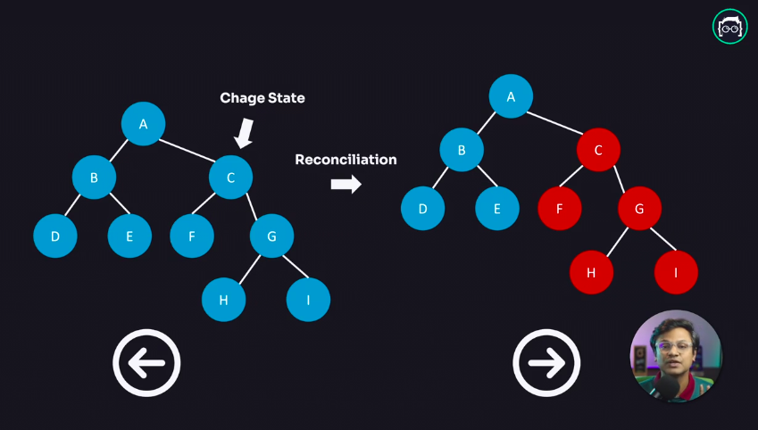

## Is DOM Really Slow?

No, DOM is never slow. In fact, if coded properly, DOM is faster than anything else. But in today's world, web applications are highly interactive, so whenever a user interacts with them, the browser needs to repaint the entire website. When the browser has to repeatedly repaint due to many reactions, that repainting process becomes slow, but fundamentally, the DOM itself is not slow.

## How Does the Browser Render DOM?

We can see that the browser's rendering process is shown through a graph above. What do we see here? We see that when a browser receives `HTML` and `CSS` files, it processes them through parsing, using `HTML PARSER` for `HTML` and `CSS PARSER` for `CSS`. After parsing, the browser creates a `DOM TREE` from the `HTML` and creates `STYLE RULES` called `CSSOM` from the `CSS`. The `DOM TREE` and `STYLE RULES` are then attached together to create a `RENDER TREE`. This `RENDER TREE` goes through a `LAYOUT` phase in the browser. In this `LAYOUT` phase, the coordinates of where the `DOM TREE` will be rendered in the browser are prepared. Finally, the browser paints it in the browser through its PAINTING mechanism, and we see the final output.

## What is Virtual DOM? How Does Virtual DOM Work?

Virtual DOM is a fundamental aspect of React. The foundation of React is primarily this Virtual DOM.

The browser's repainting process slows down the application. To avoid this problem, what can we do? We can solve this in two ways:

-   We can batch update,
-   We can minimize DOM manipulation.

React does exactly that through its Virtual DOM. React performs minimal DOM manipulation.

When a user interacts with the application and if there's a need to change the `UI`, React doesn't directly change the `DOM TREE` of the `HTML`. Whenever there's a change in the `UI`, React creates a replica or copy of the `UI` with the help of its Virtual `DOM`. Then React checks exactly where the change has occurred in the `UI` using its custom algorithm called `Diffing` or `Reconciliation`. This allows it to update only the part that has changed in the `DOM` without re-rendering the entire website. This way, React improves application performance through minimal DOM operations.

