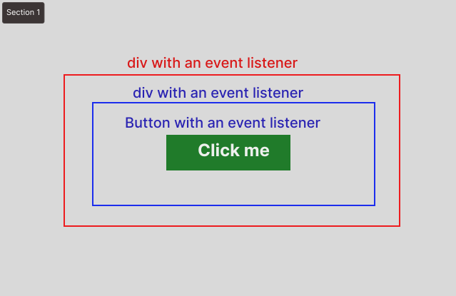
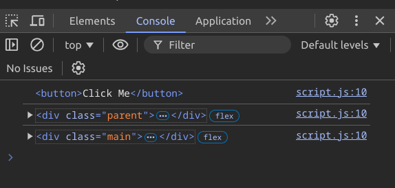
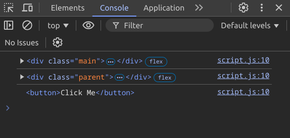

### What is Event Delegation?

Event delegation is maintaining a single event listener for multiple elements and ensuring that the listener works even when new elements are added.

Event delegation is a technique that primarily focuses on two things:

1. **Having a single event listener for multiple elements.**

2. **Ensuring the event listener works properly even when new elements are added.**

Let's say we have a list of product data coming from an `API`. And we want to create a functionality for each of these data items so that when we click on any data name, a background color will be added behind that data name.

We could approach this by attaching an event listener to each item individually. This might be one solution, but since the data is coming from an `API`, we don't know if the number of data items might change or increase. Should we add an event listener for each additional data item every time? This is never feasible. Besides, adding separate listeners for each element would make things `messy`. So what's the solution? The solution is the **event delegation technique**.

Let's learn how to do this:

```jsx filename="index.html" showLineNumbers
<div class='list-of-item'>
    <ul id='list'>
        <li class='item'>Apple</li>
        <li class='item'>Orange</li>
        <li class='item'>Strawberry</li>
        <li class='item'>Banana</li>
    </ul>
</div>
```

We will apply the event delegation technique to this list of items. For this, we need to **add the event listener to the parent element `ul` of these `item`s. This way, we can handle all the `item`s with just one listener.**

```javascript filename="index.js" showLineNumbers
const list = document.getElimentById("list");
list.addEventListener("click", (e) => {
    e.target.style.backgroundColor = "yellow";
});
```

Here, we've added an event listener to the parent element `ul` of the `item`s, and each time on click, we use `e.target` to add a background color to what was clicked. This is how we've implemented event delegation. It means we've delegated the event to the parent.

Now the question is, if the click lands in the `ul` area, the background color will also change for the `ul`.

In that case, the `element.matches()` method of `html DOM` will help us.

The `element.matches()` method takes a value as a `string` and checks if it matches with the element, returning a `Boolean` value.

So we can do it this way:

```javascript filename="index.js" showLineNumbers
const list = document.getElimentById("list");
list.addEventListener("click", (e) => {
    if(e.target.matches("li"){
        e.target.style.backgroundColor = "yellow";
    }

});
```

By doing it this way, you'll see that even if new items are added to the list, this single listener will work properly.

This is primarily what's called **event delegation**.

---

### What is Event Propagation?

The Bengali meaning of the word propagation is to spread, expand, or circulate.

Event propagation is a term in JavaScript. Essentially, event propagation refers to what happens when there are nested elements and each element has an event listener attached, and when an event is triggered on the innermost element, what actually happens?

For example:



In the image above, we can see three nested elements, each with an event listener added. These listeners will be triggered when the elements are clicked.

```jsx filename="index.html" showLineNumbers
<div class='main'>
    <div class='parent'>
        <button>Click Me</button>
    </div>
</div>
```

```jsx filename="index.js" showLineNumbers
const main = document.querySelector(".main");
const parent = main.querySelector(".parent");
const button = parent.querySelector("button");

main.addEventListener("click", listener);
parent.addEventListener("click", listener);
button.addEventListener("click", listener);

function listener() {
    console.log(e.target);
}
```

Now, if we click on the `button` element, we'll see that all the listeners have been called and the output of all three has appeared in the console. This phenomenon where we clicked on one element but all listeners were called is what's known as `event Propagation`. It means the events have spread among the others.

### What is Event Bubbling?

```jsx filename="index.js" showLineNumbers
const main = document.querySelector(".main");
const parent = main.querySelector(".parent");
const button = parent.querySelector("button");

main.addEventListener("click", listener);
parent.addEventListener("click", listener);
button.addEventListener("click", listener);

function listener() {
    console.log(e.currentTarget);
}
```

Output:



Looking at the output of the code above, we can understand that first the `button`, then the `parent`, and finally the `main` element's event listener was triggered. This means propagation starts from the inside and goes outward. This is the default behavior of propagation. This phenomenon of spreading from the inside to the outside is thought of like a bubble, hence it's called **event bubbling**.

### What is Event Capturing or Trickling?

We've learned the default behavior of event propagation, which is that propagation starts from the inside and spreads outward. But we can change this if we want; we can modify it to go from the outside starting inward.

To do this, we need to set the third parameter of the event listener to `{capture:true}`. By default, it's set to `{capture:false}`.

```jsx filename="index.js" showLineNumbers
const main = document.querySelector(".main");
const parent = main.querySelector(".parent");
const button = parent.querySelector("button");

main.addEventListener("click", listener, { capture: true });
parent.addEventListener("click", listener, { capture: true });
button.addEventListener("click", listener, { capture: true });

function listener() {
    console.log(e.currentTarget);
}
```

Output:



This way of `capturing` propagation and changing its direction is called **event capturing or trickling**.

### Propagation in React

All events in React propagate, except for the `onScroll` event.

### How to stop propagation in React?

To stop propagation in React, you need to call the `e.stopPropagation()` method inside the `event handler`.

```jsx filename="App.jsx" showLineNumbers
function Button({ onClick, children }) {
    return (
        <button
            onClick={(e) => {
                e.stopPropagation(); // Propagation is stopped here
                onClick();
            }}>
            {children}
        </button>
    );
}

export default function Toolbar() {
    // This component has three elements nested, and each element has an event handler added. This means propagation will happen by default.
    return (
        <div
            className='Toolbar'
            onClick={() => {
                alert("You clicked on the toolbar!");
            }}>
            <Button onClick={() => alert("Playing!")}>Play Movie</Button>
            <Button onClick={() => alert("Uploading!")}>Upload Image</Button>
        </div>
    );
}
```

### Preventing the default behavior

When we click the submit button of a form, the default behavior of the form is that along with the form being submitted, the page also reloads in the browser.

If we want to stop this default behavior, we can call the `e.preventDefault()` method.

```jsx filename="App.js" showLineNumbers
export default function Signup() {
    return (
        <form
            onSubmit={(e) => {
                e.preventDefault();
                alert("Submitting!");
            }}>
            <input />
            <button>Send</button>
        </form>
    );
}
```

