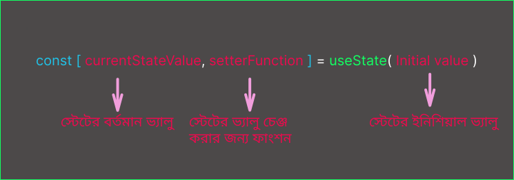

import { Callout, Steps } from "nextra/components";

State is needed in React applications whenever something needs to change during an interaction.

### What is State?

`State` means condition or status. Different states have different conditions.

For example, when a `Modal` opens after clicking a `Button`, that open state is one condition, and when the `Modal` is closed, that's another condition. This is what we call `State`.

Since React helps with reactive applications, React needs to understand when something changes in the application, when it needs to re-render, and what the state was in different conditions. So it needs to manage various states of the application. And React does this through its built-in `hook` called `useState`.

### Can't we do these tasks with regular variables conditionally?

No, we can't do that in React applications, because in React applications, whenever something changes, its component needs to be re-rendered and the `UI` needs to be updated. But if we change the value in a local variable, React can't remember that and it doesn't trigger a re-render. You might think that we could manually update the `UI`, yes - but then why are we using React? We're using React so that when something changes, the `UI` updates automatically.

### What doesn't happen with local variables:

1. **Local variables don't persist between renders:** This means that when a component re-renders, the entire component renders again from scratch. It doesn't remember what changes happened to its local variables in the previous render.

2. **Changes to local variables won't trigger renders:** This means that when a local variable changes, React doesn't even understand that it needs to re-render the component.

---

**To update a component with new data, two things are needed:**

1. **Retain the data between renders:** This means that after re-rendering, the component needs to know what changed in its previous render, which it will update in the `UI`.

2. **Trigger a Re-render:** This means that whenever a state changes, React needs to trigger its re-render.

---

**The `useState` hook provides these two things:**

1. **A State Variable:** The `useState` hook provides a state variable that it can remember across each re-render.

2. **A Setter Function:** The `useState` hook provides a `setter function` that can change the state variable.

### `useState` hook - how to write it and how to use it?

**Syntax:**

```jsx
const [currentValue, setterFunction] = useState(initialValue);
```



<Steps>

### Import the `useState` hook from React:

```jsx filename="App.jsx" showLineNumbers {1}
import { useState } from "react";

export default function App() {
    return (
    <>
        <h1>Count:  </h1>
        <button>Click to Incriment Count</<button>
    </>
    );
}
```

### Declare the `useState` hook.

```jsx filename="App.jsx" showLineNumbers {4}
import { useState } from "react";

export default function App() {
const [count, setCount] = useState(0);

    return (
    <>
         <h1>Count:  </h1>
        <button>Click to Incriment Count</<button>
    </>
    );
}
```

### Change the value of the `State variable` through the `setter function` and use the value.

```jsx filename="App.jsx" showLineNumbers {7,11-12}
import { useState } from "react";

export default function App() {
const [count, setCount] = useState(0);

    function handleCountIncriment() {
        setCount(count + 1);
    }
    return (
    <>
         <h1>Count: {count}  </h1>
        <button onClick={handleCountIncriment}>Click to Incriment Count</<button>
    </>
    );
}
```

</Steps>

**In React, all functions that start with `use` are hooks. Not just `useState`, React has many other built-in hooks that we will learn about later. Each of these hooks adds different features to React. So React's hooks are special functions. Therefore, they shouldn't be treated like normal functions. And React hooks should always be used at the top level of components. They should never be used inside conditions, loops, or other functions.**

### How does React's `useState` hook work?

When we write `useState` inside a component, it's like telling React that this component has some state that it needs to remember.

```jsx
const [index, setIndex] = useState(0);
```

In this case, we've taken a state variable called `index`. So React will remember the value of `index` in its memory during each render.

<Callout
    type='info'
    emoji='📔'>
    The naming convention for `State` is - the `setterFunction` should follow the
    name of the state variable. For example: `const [index, setIndex] = useState(0);`
</Callout>

#### Render and Re-rendering Process:

```jsx
const [index, setIndex] = useState(0);
```


1. **When the component renders for the first time:** It returns the initial value that we gave to the state variable. In this case, `initial value = 0`, so the state will return `0`.

2. **When the value of the state variable is updated:** When the value is updated with the `setter function` due to a user click or some interaction `setIndex(index + 1)`, the state value changes to `1` and tells React to remember it, and then the `setter function` calls React's `Render()` method and triggers another render.

3. **When it renders for the second time:** The component renders again from scratch and React sees that `useState(0)` has an `initial value 0`, but when the `state value` changed in the previous render, React remembered that, and so it will return the value of `index` as `1`.

And this is how each render continues.

### What if a component needs multiple state variables?

If a component needs to manage multiple states, multiple `useState` calls can be made. There's no problem with that. However, if one state is related to another, we can also work by keeping the state value as an `Array` or `object`.

### State is the component's private data

React's state is confined within its component. State is called the component's private data.

Let's say state is used in a component. Now no matter how many times that component is used, the state for each will be separate. It's not like if one's state changes due to component reuse, the rest will also change their state. This will never happen. Because the state of each component stays isolated within it and they are unique.

However, if our requirement is such that the state of each reusable component should remain `sync` or if changing the state in one affects all, then we can use the `lifting state up` technique. We will learn about this in detail later.

