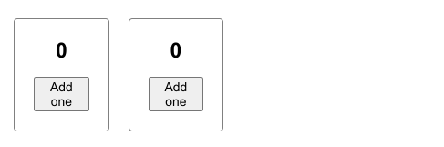
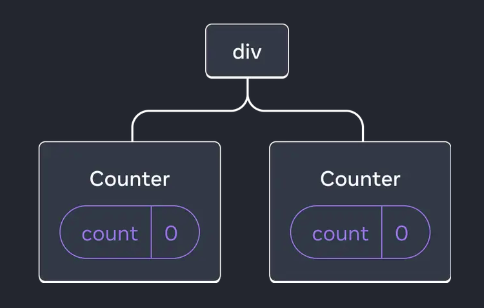
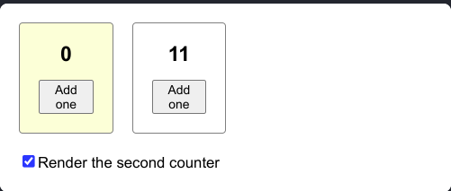
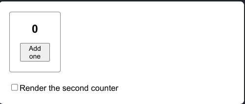
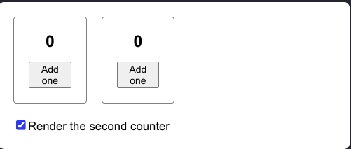
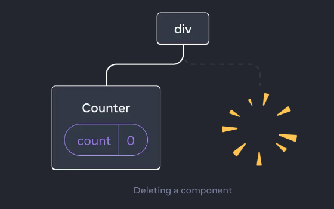
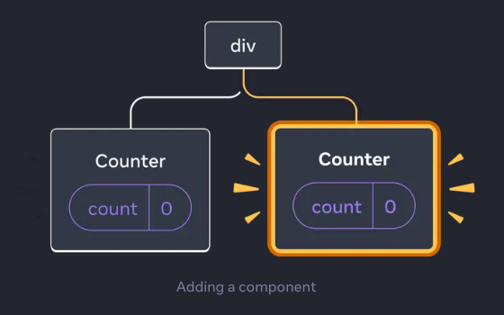

import { Callout } from "nextra/components";

### Preserving and Resetting State

React states remain `isolated` within their components, and when React renders its components, it remembers them along with their states in its render tree, so that it can reset or preserve the state when needed.

Let's learn in detail when React preserves state and when it resets them:

**React follows three main rules:**

👉**1.State is tied to a position in the render tree**

👉**2.Same component at the same position preserves state**

👉**3.Different components at the same position reset state**

### State is tied to a position in the render tree

After rendering its components, React thinks of all components in a tree structure, and it keeps the components at each different position in the tree tied to that position.

This means that if the same component is reused in different positions of React's render tree, the state of each component's position is different due to the different positions. And that's why changing the state in one doesn't change the state in the other.

```jsx filename= "App.jsx"
import { useState } from "react";

export default function App() {
    const counter = <Counter />;
    return (
        <div>
            {counter}
            {counter}
        </div>
    );
}

function Counter() {
    const [score, setScore] = useState(0);
    const [hover, setHover] = useState(false);

    let className = "counter";
    if (hover) {
        className += " hover";
    }

    return (
        <div
            className={className}
            onPointerEnter={() => setHover(true)}
            onPointerLeave={() => setHover(false)}>
            <h1>{score}</h1>
            <button onClick={() => setScore(score + 1)}>Add one</button>
        </div>
    );
}
```

Above, a counter component has been reused twice,

```jsx
export default function App() {
    const counter = <Counter />;
    return (
        <div>
            {counter}
            {counter}
        </div>
    );
}
```

Even though the same component is used twice here, they are in two different positions. If we look at the UI of the code above, we'll see something like this:



Here we can see two identical components side by side, and even though they're side by side, the render tree representation of these components looks like this:



Now it's clear that although they are the same component, their positions in React's tree are different. And that's why changing the state in one component doesn't change the state in the other component. That's why it's said **`State is tied to a position`**

We can understand this better if we look at the examples below.

Let's add a checkbox so that we can render or remove the second counter component if we want.

```jsx filename="App.jsx"
import { useState } from "react";

export default function App() {
    const [showB, setShowB] = useState(true);
    return (
        <div>
            <Counter />
            {showB && <Counter />}
            <label>
                <input
                    type='checkbox'
                    checked={showB}
                    onChange={(e) => {
                        setShowB(e.target.checked);
                    }}
                />
                Render the second counter
            </label>
        </div>
    );
}

function Counter() {
    const [score, setScore] = useState(0);
    const [hover, setHover] = useState(false);

    let className = "counter";
    if (hover) {
        className += " hover";
    }

    return (
        <div
            className={className}
            onPointerEnter={() => setHover(true)}
            onPointerLeave={() => setHover(false)}>
            <h1>{score}</h1>
            <button onClick={() => setScore(score + 1)}>Add one</button>
        </div>
    );
}
```

Output:



Here we see two counters with a checkbox. We can update the states of the counters, and by clicking on the checkbox and unchecking it, the second counter is removed. And when checked again, it returns.





But notice that when the component returned for the second time, its state was reset. So why did this happen?

This happened because when the checkbox was unchecked, the component was deleted from its position along with all its states. So when it's brought back for the second time, it comes as a completely new component.

What's happening in the render tree here is:





That is, when the component is removed from the tree, the tree structure changes, so all the states of the component are destroyed.

**So as long as a component stays in its position, React preserves the state. If it's removed from its position, the state is reset.**

### Same component at the same position preserves state

As long as the same component stays in the same position, it will maintain its own state. Even if you're changing some state from the parent component or doing something conditionally, as long as that component stays in its own position, it will keep its local state.

```jsx filename="App.jsx"
import { useState } from "react";

export default function App() {
    const [isFancy, setIsFancy] = useState(false);
    return (
        <div>
            {isFancy ? <Counter isFancy={true} /> : <Counter isFancy={false} />}
            <label>
                <input
                    type='checkbox'
                    checked={isFancy}
                    onChange={(e) => {
                        setIsFancy(e.target.checked);
                    }}
                />
                Use fancy styling
            </label>
        </div>
    );
}

function Counter({ isFancy }) {
    const [score, setScore] = useState(0);
    const [hover, setHover] = useState(false);

    let className = "counter";
    if (hover) {
        className += " hover";
    }
    if (isFancy) {
        className += " fancy";
    }

    return (
        <div
            className={className}
            onPointerEnter={() => setHover(true)}
            onPointerLeave={() => setHover(false)}>
            <h1>{score}</h1>
            <button onClick={() => setScore(score + 1)}>Add one</button>
        </div>
    );
}
```

In the code above, a counter component is rendered with a condition,

```jsx
const [isFancy, setIsFancy] = useState(false);

isFancy ? <Counter isFancy={true} /> : <Counter isFancy={false} />;
```

Here we can see that the component is conditionally rendered based on an `isFancy` state, and there's a checkbox where clicking changes the value of this `isFancy` state.

Now naturally one might think that when the checkbox is clicked, the previous component will be removed and a new component will come, and its state will be reset.

But no, that won't happen. Because even though the conditional props change, the same counter component is still at the same position in the render tree. So its state won't be reset.

<Callout
    type='warning'
    emoji='📔'>
    When we talk about position, remember that this is React's render tree. It's not the `JSX` tree. As long as there's no change in React's render tree, it will maintain the states of the components. If a component is removed from React's render tree or for some reason another component sits at that position, then that component's state will be reset.
</Callout>

### Different components at the same position reset state

If the component that was in a position in the previous render is not there in the next render, or if another component sits at that position in the next render, then React resets the state.

```jsx
import { useState } from "react";

export default function App() {
    const [isPaused, setIsPaused] = useState(false);
    return (
        <div>
            {isPaused ? <p>See you later!</p> : <Counter />}
            <label>
                <input
                    type='checkbox'
                    checked={isPaused}
                    onChange={(e) => {
                        setIsPaused(e.target.checked);
                    }}
                />
                Take a break
            </label>
        </div>
    );
}

function Counter() {
    const [score, setScore] = useState(0);
    const [hover, setHover] = useState(false);

    let className = "counter";
    if (hover) {
        className += " hover";
    }

    return (
        <div
            className={className}
            onPointerEnter={() => setHover(true)}
            onPointerLeave={() => setHover(false)}>
            <h1>{score}</h1>
            <button onClick={() => setScore(score + 1)}>Add one</button>
        </div>
    );
}
```

Here if you notice,

```jsx {1,4}
    const [isPaused, setIsPaused] = useState(false);
    return (
        <div>
            {isPaused ? <p>See you later!</p> : <Counter />}
            <label>
                <input
                    type='checkbox'
                    checked={isPaused}
                    onChange={(e) => {
                        setIsPaused(e.target.checked);
                    }}
                />
                Take a break
            </label>
        </div>
```

Here two components are conditionally shown at the same position. When the checkbox is clicked, a `<p>...</p>` tag sits at the position of the counter component. As soon as the `<p>...</p>` tag sits, React doesn't find the counter in that position of its render tree in the second render, so the counter component is reset along with its state. So when the checkbox is unchecked again and the counter component is brought back, it comes as a fresh component.

**In conclusion, if the state of components needs to be maintained from one render to the next, the structure of the render tree must remain the same in both renders.**

