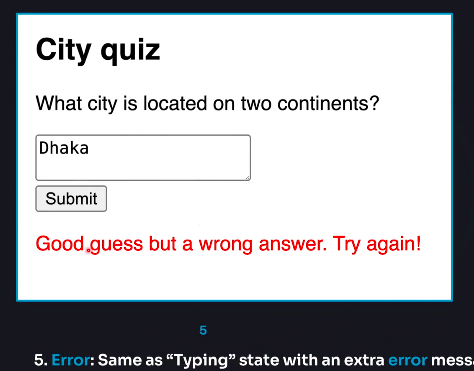

import { Steps } from "nextra/components";

### Thinking about UI declaratively

When we want to change or manage any UI in React, we'll need to manage it with state. To understand well what states a component can have or how to beautifully manage states, we must follow several steps. Below, I'll discuss these steps in detail. If you can understand these steps very well, it's possible to easily manage the state of any complex UI. Let's learn the steps:

1. **Identify Components different visual states**
2. **Determine What trigger those state changes**
3. **Represent the state in memory using `useState`**
4. **Remove any not-essential state variables**
5. **Connect the event handlers to set the state**

<Steps>
### Identify Components different visual states

First, we need to understand what changes can occur in our UI. Meaning, in what conditions will the UI be seen on the screen.

For example, let's think about a form that takes an answer to a question, and shows a success message if the answer is correct, or an error message if it's wrong. And if nothing is written in the form, the form remains disabled, and if something is written and the form is submitted, it shows loading.

So let's visualize what visual states our component might have:

1.  2.  3.  4.  5. 

So here we can see five states in the UI: `empty`, `typing`, `submitting`, `success`, `error`, which gives us a clear idea of what changes will occur in our UI and when it will be in which state. This way of representing each visual change of a component is called a **storybook**.

### Determine what triggers those state changes

We need to determine how the state changes in the UI will be triggered. We need to determine whether the state changes will happen due to some user interaction or whether the computer will do it automatically.

In this case, for example, when the user writes something in the input field, the state will be typing, and when they submit, it will be submitting.

And whether it will be an error or success, the computer will decide that itself.

That is, in the second step, we need to understand when and how state changes will be triggered.

If we can represent these state change steps in a diagram, it becomes much easier to understand the entire state change flow. For example:


### Represent the state in memory with `useState`

In this step, we need to initialize or define all the states we'll need using the `useState` hook. In this example, naturally, we would need five states:

```jsx
const [isEmpty, setIsEmpty] = useState(true);
const [isTyping, setIsTyping] = useState(false);
const [isSubmitting, setIsSubmitting] = useState(false);
const [isSuccess, setIsSuccess] = useState(false);
const [isError, setIsError] = useState(false);
```

In addition, we might also need two more states to handle the form input and to understand if an error has occurred.

```jsx
const [answer, setAnswer] = useState("");
const [error, setError] = useState(null);
```

### Remove any non-essential state variables

At this stage, we need to understand whether **we need each of the `states` we've defined**, whether **one state variable can do the job of another**, or whether **any state is being duplicated**, and **in cases where two states can never be true or false at the same time (paradox), use the same state**.

That is, at this stage, we need to clean up our state, removing the non-essential state variables.

In this case, for example, we can manage everything just from the `answer` state, eliminating the `empty` and `typing` states. For instance, `answer.length == 0` means `empty` and if not `0` then `typing`, so we can easily remove the `empty` and `typing` states.

Again, the other three conditions - `submitting`, `success`, or `error` - we can manage with just one state variable `status`.

```jsx
const [status, setStatus] = useState("typing"); // 'submitting', or 'success / error'
```

So here, just three states make everything work perfectly:

```jsx
const [answer, setAnswer] = useState("");
const [error, setError] = useState(null);
const [status, setStatus] = useState("typing"); // 'submitting', or 'success / error'
```

### Connect the event handlers to set state

At this stage, we just need to connect the state setter functions with event handlers, so that when an event is triggered, the states are updated.

</Steps>

