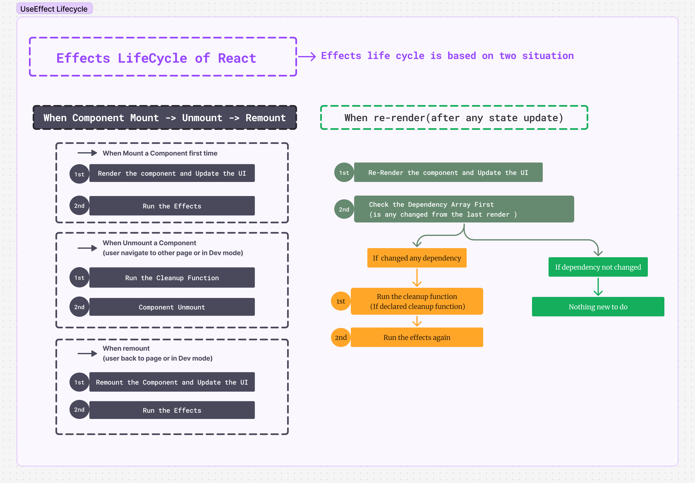

### The lifecycle of an Effect

Every React component goes through the same lifecycle:

-   **Mount:** The component first mounts and becomes visible on the screen.
-   **Update:** The component updates based on changes in props or state.
-   **Unmount:** The component unmounts when it's removed from the screen or when the user navigates to another page.

This is fine when thinking about React components, but the lifecycle of an Effect is different. Each Effect is separate from the component's lifecycle. Effects synchronize the component's state or props with an external server, so whenever our code changes, this synchronization may be needed multiple times.

Let's understand this with an example:

Let's say our code connects to an external chat server.

```jsx
const serverUrl = "https://localhost:1234";

function ChatRoom({ roomId }) {
    useEffect(() => {
        const connection = createConnection(serverUrl, roomId);
        connection.connect();
        return () => {
            connection.disconnect();
        };
    }, [roomId]);
    // ...
}
```

Here, the effect body specifies how to establish a connection with the chat server:

```jsx {2-3}
// ...
const connection = createConnection(serverUrl, roomId);
connection.connect();
return () => {
    connection.disconnect();
};
// ...
```

And in the cleanup, it specifies how to stop the connection:

```jsx {4-6}
// ...
const connection = createConnection(serverUrl, roomId);
connection.connect();
return () => {
    connection.disconnect();
};
// ...
```

You might assume that when the component mounts, the connection will start via the effect, and when the component unmounts, the connection will stop.

But this isn't the end of the story. While the component is mounted, we may need to synchronize with the server multiple times.

#### Why synchronization may need to happen more than once

Let's say the `ChatRoom` component takes a `roomId` as a prop, and whenever the `roomId` changes, the component needs to connect to a new chatroom. Assume the user can select `roomId` from a selection option.

Now suppose the user first selects "General" from the selection option, and the "General" chatroom becomes visible in the UI.

```jsx
const serverUrl = "https://localhost:1234";

function ChatRoom({ roomId /* "general" */ }) {
    // ...
    return <h1>Welcome to the {roomId} room!</h1>;
}
```

Then the effect starts a connection with the general room. In the meantime, the user selects the "Travel" chatroom, which changes the state and brings in a new `roomId` as a prop. This will first show the "Travel" chatroom in the UI.

But our effect is still connected to the "General" chat server. So now the effect needs to re-synchronize and disconnect from the "General" chat server to connect to the "Travel" chat server.

#### How React re-synchronizes your Effect

The effect takes an array of reactive values as its dependency. When these values change, React decides what to do. When the component re-renders due to a state change and receives new values, the component first updates in the UI, then the effect runs. Before running the effect, it checks if any value in the dependency array has changed in the second render. If it has changed, it first stops the synchronization from the first render, and then runs the effect again.

```jsx
const serverUrl = "https://localhost:1234";

function ChatRoom({ roomId }) {
    useEffect(() => {
        const connection = createConnection(serverUrl, roomId);
        connection.connect();
        return () => {
            connection.disconnect();
        };
    }, [roomId]);
    // ...
}
```

#### Lifecycle of React Effects:



### Each Effect represents a separate synchronization process

We can manage related features in a single effect, but if we need to implement separate features, we can manage them in separate effects.
