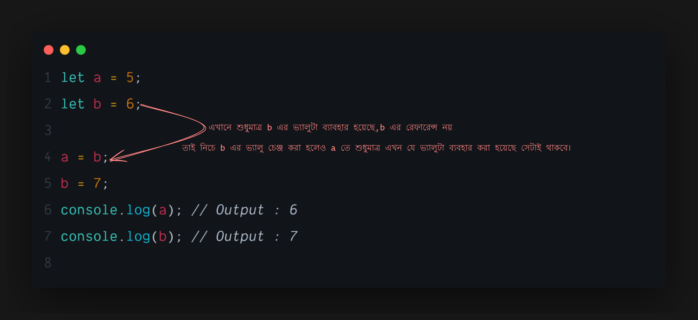
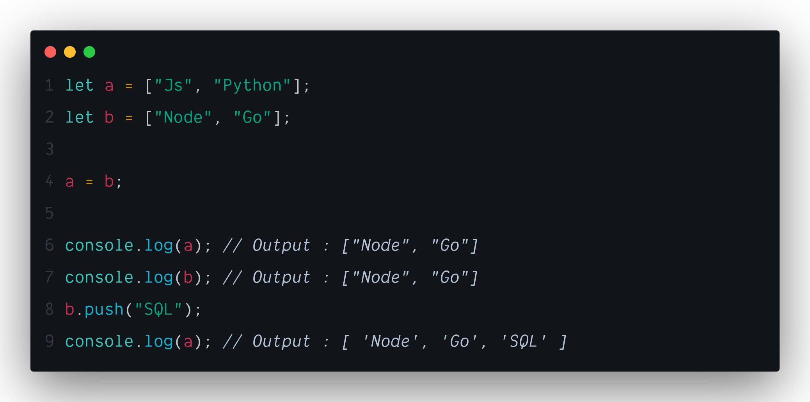
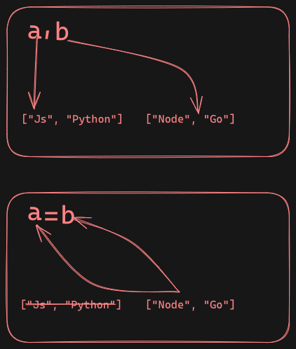

import { Callout } from "nextra/components";

## Scope in JavaScript

## Primitive and Reference types Value

### Primitive

The Bengali meaning of primitive is `primitive/basic`. The DATATYPES in JavaScript include:

-   String
-   Number
-   BigInt
-   Boolean
-   Null
-   Undefined
-   Symbol

These are the core or fundamental elements of JavaScript. Other data types are built using these. These are called primitive data or values.

### References

In JavaScript, `Array` and `Object` are called reference type data or values.

### Difference between Primitive and Reference type data:

The main difference between primitive and reference type data is in their behavior. This is explained below with examples:

### Primitive



Primitive data only shares the value. It doesn't share the reference of the data.

### Reference



Here, when `a` was reassigned with `b`, naturally the value of `a` changed to the value of `b`. But when the value of `b` was changed below, that change also affected `a` and changed it too. This is because when `b` was assigned to `a`, the reference of `b` also went to `a`, so changing either one changes both.

What happened here is:



When `a` and `b` were defined, two `Arrays` were allocated in memory, and these `Arrays` are pointed to by their variable names `a` and `b`. But when we did `a = b`, both pointers became one, pointing from the value of `b` to both `a` and `b`. So now changing either `a` or `b` will change both.

This is the main difference between `primitives` and `References` values.

## Shallow Copy Vs Deep Copy

In JavaScript, "Shallow Copy" and "Deep Copy" are two different processes used to create a copy of an `Object` or `Array`. However, the big difference is in how the data is copied. Below I explain each concept in detail:

### Shallow Copy

In a shallow copy, only the first level values of the object are copied. This means that if there are nested objects within the object or array, they are copied as references. That is, a reference is created for the nested object or array, sharing the same data in the new object.

#### Example:

```javascript showlineNumbers
let originalArray = [1, 2, { a: 3, b: 4 }];

// Creating a shallow copy
let shallowCopy = [...originalArray];

console.log(shallowCopy); // [1, 2, { a: 3, b: 4 }]

// Changing the nested object
shallowCopy[2].a = 10;

console.log(originalArray); // [1, 2, { a: 10, b: 4 }]
console.log(shallowCopy); // [1, 2, { a: 10, b: 4 }] // Because the nested object was copied as a reference, changing it in the copy also changed it in the main data.
```

In this example, we can see that `originalArray` and `shallowCopy` share the same nested object. When `shallowCopy[2].a` is changed, the change also occurs in the original object. This is a limitation of shallow copy.

#### Methods to create a Shallow Copy:

-   Spread Operator: `let copy = [...array];`

### Deep Copy

In a deep copy, a copy of each level of an object is created, including separate copies of nested objects. As a result, changes to the original object do not affect the new copy object and vice versa.

#### Example:

```javascript showlineNumbers
let originalArray = [1, 2, { a: 3, b: 4 }];

// Creating a deep copy (using JSON method)
let deepCopy = JSON.parse(JSON.stringify(originalArray));

console.log(deepCopy); // [1, 2, { a: 3, b: 4 }]

// Changing the nested object
deepCopy[2].a = 10;

console.log(originalArray); // [1, 2, { a: 3, b: 4 }]
console.log(deepCopy); // [1, 2, { a: 10, b: 4 }]
```

Here we can see that even after changing `deepCopy[2].a`, the nested object in `originalArray` remains unchanged. This is because in a deep copy, a new copy of the nested object is created.

#### Methods to create a Deep Copy:

-   1.  `JSON.parse(JSON.stringify(obj))`: A simple method, but it cannot handle functions and undefined.

-   2. Lodash library's cloneDeep method. Lodash is a popular JavaScript library that provides many utility functions. cloneDeep is a special method that can create deep copies.

Example:

First, you need to install lodash:

```bash
 npm i --save lodash
```

Then

```javascript showlineNumbers
const _ = require("lodash");

let originalObject = { a: 1, b: { c: 2, d: 3 } };
let deepCopiedObject = _.cloneDeep(originalObject);

deepCopiedObject.b.c = 10;

console.log(originalObject); // { a: 1, b: { c: 2, d: 3 } }

console.log(deepCopiedObject); // { a: 1, b: { c: 10, d: 3 } }
```

**Lodash's cloneDeep method can correctly handle all data types and nested objects. It is very effective for handling functions, dates, Maps, Sets, and other complex data structures.**

### Shallow Copy vs Deep Copy Differences:

| **Shallow Copy** | **Deep Copy** |
| --- | --- |
| Copies only the first level. | Creates a new copy for each level. |
| Nested objects are copied as references. | Nested objects have completely new copies. |

The choice between these two types of copying depends on your needs.

# Advanced JavaScript

## Usage of `this`. Where and how.

### Implicit Binding

**`👉Rule:` You need to see where the function is called, whether there is a dot in front of where it's called, and what's in front of that dot. If there is something, then that is `this`. In this case, the exception is that `this` will only work in normal functions. But `Arrow` functions won't recognize `this`.**

Example:

```javascript showlineNumbers
let player = {
    name: "Mashrafe",
    age: 38,
    printPlayerName: function () {
        console.log(this.name); // Here `this` points to the `player` object.
    },
};

player.printPlayerName();
```

### Explicitly Binding

#### .call()

**👉 Sometimes there is a need to call an external function with another object. In that case, the syntax is like this:**

```javascript showlineNumbers
function printName() {
    // This is a global function
    console.log(this.name);
}
let player = {
    name: "Sakib",
    age: 33,
};

printName.call(player); // This global function is called with the `player` object using `.call()`.
```

**In this case, what is passed inside `.call()` is what `this` points to. Here, it's explicitly stating what `this` will be.**

#### .apply()

**👉 `.apply()` and `.call()` do the same thing. Everything is the same. However, `.apply()` can take an `Array` as its second parameter, while `.call()` cannot take an `Array`.**

```javascript showlineNumbers
function printPlayerName() {
    console.log(`${this.name} is ${vertue} `);
}

let mashrafe = {
    name: "Mashrafe",
    age: 36,
};
let vartu1 = "Honest";
let vartu2 = "Captain";
```

# JS Itarator

## `Itarables` কি ?

`Itarables` বলতে মূলত সেই সমস্ত জিনিস বা অবজেক্ট কে বোঝায়,যেগুলোর মধ্যে দিয়ে লুপ `eg: for...of` করে স্টেপ বাই স্টেপ যাওয়া যায়। যেমনঃ `Array`,`String`,`Map`,`Set`

টেকনিক্যালি বললে, যেসব অবজেক্টের প্রোটোটাইপের ভিতরে `symbol.itarator` প্রপার্টি রয়েছে সেটাই `itarable` `symbol.itarator` এর মাধ্যমেই জাভাস্ক্রিপ্ট ডিফাইন করে যে, কোনটা `itarable` আর কোনটা নয় ।

<Callout
    type='warning'
    emoji='💡'>
    `Map`,`Set` বলতে এখানে জাভাস্ক্রিপ্ট এর `Map` `Set` ডাটা স্ট্রাকচার কে
    বুঝানো হয়েছে
</Callout>

## itarator বলতে কি বুঝায় ?

`itarable` অবজেক্টকে যার দ্বারা `itarate` করা যায়,সেটাই হলো `itarator`

## `itarating` বলতে কি বুঝায় ?

`itarating` বলতে মূলত `Itarables` অবজেক্টগুলোকে লুপ করে স্টেপ বাই স্টেপ যাওয়ার যেই প্রসেস সেটাকে বুঝায় । যখন `itarate` করা হয় তখন সেটা হলো `itarating`