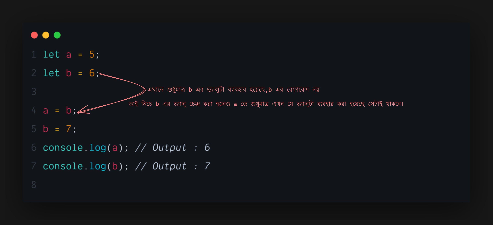

import { Callout } from "nextra/components";

## Scope in JavaScript

## Primitive and Reference types Value

### Primitive

The Bengali meaning of primitive is `ancient` or `original`. The DATATYPES in JavaScript include:

-   String
-   Number
-   BigInt
-   Boolean
-   Null
-   Undefined
-   Symbol

These are the core or basic elements of JavaScript. Other data types are built using these. These are called primitive data or values.

### References

JavaScript's `Array` and `Object` are called reference type data or values.

### Differences between Primitive and Reference type data:

The main difference between primitive and reference type data is in their behavior. As shown in the examples below:

### Primitive



Primitive data only shares the value. It does not share the reference of the data.

### Reference


Here, when `a` is reassigned with `b`, naturally the value of `a` changes to whatever value `b` had. But below, when the value of `b` is changed, that change also affects `a` and changes it too. This is because when `b` was assigned to `a`, the reference of `b` also went to `a`, so changing either one changes both.

What happened here is:


When `a` and `b` were defined, two `Arrays` were allocated in memory, and these `Arrays` are pointed to by the variable names `a` and `b`. But when `a = b` was done, both pointers became one, pointing from the value of `b` to both `a` and `b`. So now, changing either `a` or `b` will change both.

This is the main difference between `primitives` and `References` values.

## Shallow Copy Vs Deep Copy

In JavaScript, "Shallow Copy" and "Deep Copy" are two different processes used to create a copy of an `Object` or `Array`. The big difference between them is in how the data is copied. Below, I explain each concept in detail:

### Shallow Copy

In a shallow copy, only the first level values of the object are copied. This means that if the object or array contains nested objects, they are copied as references. In other words, a reference is created for nested objects or arrays, sharing the same data in the new object.

#### Example:

```javascript showlineNumbers
let originalArray = [1, 2, { a: 3, b: 4 }];

// Creating a shallow copy
let shallowCopy = [...originalArray];

console.log(shallowCopy); // [1, 2, { a: 3, b: 4 }]

// Changing the nested object
shallowCopy[2].a = 10;

console.log(originalArray); // [1, 2, { a: 10, b: 4 }]
console.log(shallowCopy); // [1, 2, { a: 10, b: 4 }] // Because the nested object was copied as a reference, changes to the copy also change the main data.
```

In this example, we can see that `originalArray` and `shallowCopy` share the same nested object. When `shallowCopy[2].a` is changed, the change also occurs in the original object. This is a limitation of shallow copying.

#### Methods for creating a Shallow Copy:

-   Spread Operator: `let copy = [...array];`

### Deep Copy

In a deep copy, a copy of every level of an object is created, including nested objects. As a result, changes to the original object do not affect the new copy object, and vice versa.

#### Example:

```javascript showlineNumbers
let originalArray = [1, 2, { a: 3, b: 4 }];

// Creating a deep copy (using JSON method)
let deepCopy = JSON.parse(JSON.stringify(originalArray));

console.log(deepCopy); // [1, 2, { a: 3, b: 4 }]

// Changing the nested object
deepCopy[2].a = 10;

console.log(originalArray); // [1, 2, { a: 3, b: 4 }]
console.log(deepCopy); // [1, 2, { a: 10, b: 4 }]
```

Here we can see that after changing `deepCopy[2].a`, the nested object in `originalArray` remains unchanged. This is because in a deep copy, a new copy of the nested object is created.

#### Methods for creating a Deep Copy:

-   1.  `JSON.parse(JSON.stringify(obj))`: A simple method, but it cannot handle functions and undefined.

-   2. Lodash library's cloneDeep method. Lodash is a popular JavaScript library that provides many utility functions. cloneDeep is a special method that can create deep copies.

Example:

First, install lodash:

```bash
 npm i --save lodash
```

Then:

```javascript showlineNumbers
const _ = require("lodash");

let originalObject = { a: 1, b: { c: 2, d: 3 } };
let deepCopiedObject = _.cloneDeep(originalObject);

deepCopiedObject.b.c = 10;

console.log(originalObject); // { a: 1, b: { c: 2, d: 3 } }

console.log(deepCopiedObject); // { a: 1, b: { c: 10, d: 3 } }
```

**The cloneDeep method of Lodash can properly handle all data types and nested objects. It is very effective for handling functions, dates, Maps, Sets, and other complex data structures.**

### Differences between Shallow Copy and Deep Copy:

| **Shallow Copy** | **Deep Copy** |
| --- | --- |
| Copies only the first level. | Creates a new copy for each level. |
| Nested objects are copied as references. | Complete new copies are made of nested objects. |

The difference between these two types of copies depends on your needs.

# Advanced JavaScript

## Using `this`. Where and how.

### Implicit Binding

**`👉Rule:` You need to check where the function was called, whether there is a dot before where it was called, and what is in front of the dot. If there is something, that is the `this`. In this case, the exception is that `this` will only work in a normal function. But an `Arrow` function will not recognize `this`.**

Example:

```javascript showlineNumbers
let player = {
    name: "Mashrafe",
    age: 38,
    printPlayerName: function () {
        console.log(this.name); // Here `this` points to the `player` object.
    },
};

player.printPlayerName();
```

### Explicitly Binding

#### .call()

**👉 Sometimes you need to call an external function with another object. In this case, the syntax is like this:**

```javascript showlineNumbers
function printName() {
    // This is a global function
    console.log(this.name);
}
let player = {
    name: "Sakib",
    age: 33,
};

printName.call(player); // This global function is `.call()`'ed with the `player` object.
```

**In this case, what is passed inside `.call()`, `this` points to that. In this case, it is explicitly stated what `this` will be.**

#### .apply()

**👉 `.apply()` and `.call()` do the same thing. Everything is the same. However, `.apply()` can take an `Array` as its second parameter. Whereas `.call()` cannot take an `Array`.**

```javascript showlineNumbers
function printPlayerName() {
    console.log(`${this.name} is ${vertue} `);
}

let mashrafe = {
    name: "Mashrafe",
    age: 36,
};
let vartu1 = "Honest";
let vartu2 = "Captain";
let vartu3 = "Leader";
let vertue = [vartu1, vartu2, vartu3];

printPlayerName.apply(mashrafe, vertue);
```

#### .bind()

**👉 `.bind()` also does the same job as `.call()`. However, the difference is that `.bind()` does not call the function directly but returns a new instance of the function. And that instance needs to be called by the variable in which it is stored.**

Example:

```javascript showlineNumbers
function printAPlayerName() {
    console.log(this.name);
}

let bdPlayer = {
    name: "Ashraful",
    age: 39,
};

let printFunction = printAPlayerName.bind(bdPlayer);
printFunction();
```

# JS Iterator

## What are `Iterables`?

`Iterables` essentially refers to all those things or objects that can be looped through (e.g., using `for...of`) step by step. For example: `Array`, `String`, `Map`, `Set`.

Technically speaking, any object that has the `symbol.iterator` property in its prototype is an `iterable`. JavaScript defines what is `iterable` and what is not through `symbol.iterator`.

<Callout
    type='warning'
    emoji='💡'>
    `Map` and `Set` here refer to JavaScript's `Map` and `Set` data structures
</Callout>

## What is an iterator?

An `iterator` is what allows you to iterate through an `iterable` object.

## What is `iterating`?

`Iterating` essentially refers to the process of looping through `Iterable` objects step by step. When you `iterate`, that is `iterating`.

## Iterating an `Array`.

```javascript showLineNumbers filename="iterate.js" copy
const arr = [1, 2, 3, 4, 5, 6, 7];
for (item of arr) {
    console.log(item);
}
//Output: 1 2 3 4 5 6 7
```

## Iterating a `String`.

```javascript showLineNumbers filename="iterate.js" copy
const str = "Bangladesh";
for (character of str) {
    console.log(character);
}

// Output : B a n g l a d e s h
```

# Asynchronous JavaScript

JavaScript is a single-threaded programming language

