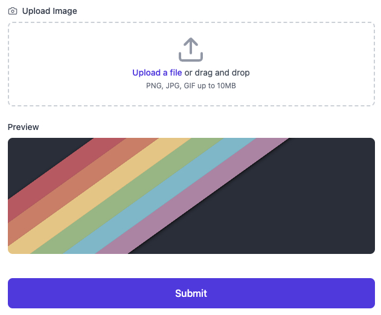

import { Callout, Steps } from "nextra/components";

##  Image Upload with Next.js with Drag and Drop and Image Preview

Below is a discussion on how to implement image upload with drag and drop features and image preview in Next.js.

We'll be working with the basic form code below.

```jsx filename="app.jsx"
import { Camera, Upload } from "lucide-react";
import { useRef, useState } from "react";

function App() {
    const [formData, setFormData] = useState({
        image: null,
    });
    const fileInputRef = useRef(null);
    const [imagePreview, setImagePreview] = useState(null);

    const handleSubmit = (e) => {
    // form submission logic will go here ....
    };

    const handleChange = (e) => {
        // input fileds change logic will go here ....
    };

    return (
        <div className='min-h-screen bg-gradient-to-br from-blue-50 to-indigo-50 py-12 px-4 sm:px-6 lg:px-8'>
            <div className='max-w-2xl mx-auto'>
                <div className='bg-white rounded-2xl shadow-xl p-8'>
                    <div className='flex items-center gap-3 mb-8'>
                        <Hotel className='h-8 w-8 text-indigo-600' />
                        <h1 className='text-3xl font-bold text-gray-900'>
                            Your Image Uploader
                        </h1>
                    </div>

                    <form onSubmit={handleSubmit} className='space-y-6'>

                        <div>
                            <label className='block text-sm font-medium text-gray-700 mb-2'>
                                <div className='flex items-center gap-2'>
                                    <Camera className='h-4 w-4 text-gray-500' />
                                        Upload Image
                                </div>
                            </label>
                            <div
                                onClick={() => fileInputRef.current?.click()}
                                className='mt-1 flex justify-center px-6 pt-5 pb-6 border-2 border-gray-300 border-dashed rounded-lg cursor-pointer hover:border-indigo-500 transition-colors duration-200'>
                                <div className='space-y-1 text-center'>
                                    <Upload className='mx-auto h-12 w-12 text-gray-400' />
                                    <div className='flex text-sm text-gray-600'>
                                        <label className='relative cursor-pointer rounded-md font-medium text-indigo-600 hover:text-indigo-500 focus-within:outline-none focus-within:ring-2 focus-within:ring-offset-2 focus-within:ring-indigo-500'>
                                            <span>Upload a file</span>
                                            <input
                                                ref={fileInputRef}
                                                type='file'
                                                className='sr-only'
                                                accept='image/*'
                                                required
                                            />
                                        </label>
                                        <p className='pl-1'>or drag and drop</p>
                                    </div>
                                    <p className='text-xs text-gray-500'>
                                        PNG, JPG, GIF up to 10MB
                                    </p>
                                </div>
                            </div>
                        </div>

                        {imagePreview && (
                            <div className='mt-4'>
                                <p className='text-sm font-medium text-gray-700 mb-2'>
                                    Preview
                                </p>
                                <div className='relative h-48 rounded-lg overflow-hidden'>
                                    
                                </div>
                            </div>
                        )}

                        <div className='pt-4'>
                            <button
                                type='submit'
                                className='w-full flex items-center justify-center px-8 py-3 border border-transparent text-base font-medium rounded-lg text-white bg-indigo-600 hover:bg-indigo-700 focus:outline-none focus:ring-2 focus:ring-offset-2 focus:ring-indigo-500 transition-colors duration-200'>
                                Submit
                            </button>
                        </div>
                    </form>
                </div>
            </div>
        </div>
    );
}

export default App;
```




In the code above, we can see a basic form with an image upload field designed to allow drag and drop functionality. There's also a preview section below to show the uploaded image.

Now, let's learn step by step how we can upload images, see their previews, and implement the drag and drop feature.

<Steps>
  ### Upload image by click 

    First, let's create the option to upload an image by clicking. For this, we need to add an `onChange` event handler to the `<input type='file'>` so that we can capture the event when an image is uploaded by clicking and work with that image.

    ```jsx {2,9-16}
            <div
               onClick={() => fileInputRef.current?.click()}
               className='mt-1 flex justify-center px-6 pt-5 pb-6 border-2 border-gray-300 border-dashed rounded-lg cursor-pointer hover:border-indigo-500 transition-colors duration-200'>
               <div className='space-y-1 text-center'>
                   <Upload className='mx-auto h-12 w-12 text-gray-400' />
                   <div className='flex text-sm text-gray-600'>
                       <label className='relative cursor-pointer rounded-md font-medium text-indigo-600 hover:text-indigo-500 focus-within:outline-none focus-within:ring-2 focus-within:ring-offset-2 focus-within:ring-indigo-500'>
                           <span>Upload a file</span>
                           <input
                               onChange={handleImageChange}
                               ref={fileInputRef}
                               type='file'
                               className='sr-only'
                               accept='image/*'
                               required
                           />
                       </label>
                       <p className='pl-1'>or drag and drop</p>
                   </div>
                   <p className='text-xs text-gray-500'>
                       PNG, JPG, GIF up to 10MB
                   </p>
               </div>
            </div>
    
    ```

 In this code, we've hidden the default file input for better design and connected it to a div using a `ref`. We've added an `onClick` event to the div:
```jsx

  onClick={() => fileInputRef.current?.click()}

``` 
This way, when we click on the div, our file uploader gets clicked.

Then we've added an event handler `handleImageChange` to the `<input type='file'>` to capture the event:
```jsx {2}
      <input
         onChange={handleImageChange}
         ref={fileInputRef}
         type='file'
         className='sr-only'
         accept='image/*'
         required
     />

```

Now let's work with this event handler:

 ```js
     const handleImageChange = (e) => {
        const file = e.target.files?.[0];

        if (file) {
            setFormData((prev) => ({ ...prev, image: file }));
        }
    };
 
 ```

In this handler, we use `e.target.files?.[0]` to get the file we've uploaded and store it in the state with `setFormData((prev) => ({ ...prev, image: file }));` so that we can send this file to the server later.


### Show Preview of Uploaded Image

At this stage, we'll show a preview of our uploaded image. For the preview, we've created a preview section below and set the image source through state.

```jsx
    const [imagePreview, setImagePreview] = useState(null);

    //componets code 
    {imagePreview && (
       <div className='mt-4'>
           <p className='text-sm font-medium text-gray-700 mb-2'>
               Preview
           </p>
           <div className='relative h-48 rounded-lg overflow-hidden'>
               
           </div>
       </div>
    )}

```

Now we'll use JavaScript's native `FileReader()` API to create a `base64 encoded image file` from the captured file in our event handler and set it in the `imagePreview` state.

 ```js {7-11}
     const handleImageChange = (e) => {
        const file = e.target.files?.[0];

        if (file) {
            setFormData((prev) => ({ ...prev, image: file }));

            const reader = new FileReader(); // FileReader() API instance create
            reader.readAsDataURL(file) // read file as data URL
            reader.onloadend = ()=>{ // reader callback
                setImagePreview(reader.result) // set data url in state
            }
        }
    };
 
 ```
This will display the image preview in our preview section using the URL from the state.

### Upload image by Drag and Drop
To upload images via drag and drop, we need to work with two event handlers: `onDragOver` and `onDrop`.
```jsx
 <div
    onDragOver={(e) => {
        e.preventDefault();
        e.stopPropagation();
    }}
    onDrop={handleImageDrop}
    onClick={() => fileInputRef.current?.click()}
    className='mt-1 flex justify-center px-6 pt-5 pb-6 border-2 border-gray-300 border-dashed rounded-lg cursor-pointer hover:border-indigo-500 transition-colors duration-200'>
   /*  rest of the code goes here */
</div>
                
```
On the div where we want to drag and drop the image, we add these two events and handlers:
 `onDragOver={(e) => {
        e.preventDefault();
        e.stopPropagation();
    }}
onDrop={handleImageDrop}`

Remember, we must use `e.preventDefault()` and `e.stopPropagation()` in the `onDragOver` handler. Otherwise, when we drag an image over the div, the browser will open the image immediately. We'll use the `handleImageDrop` event handler to capture and manage the file.

```jsx
function handleImageDrop(e){
    e.preventDefault();
    const file = e.dataTransfer.files?.[0];
    if(file && file.type.startsWith("image/")){
        setFormData((prev) => ({ ...prev, image: file }));
    }
}

```
This will upload our image and store it in the state.


### Show Image Preview by Drag and Drop

Here we need to use the same process as before:
```jsx
function handleImageDrop(e){
    e.preventDefault();
    const file = e.dataTransfer.files?.[0];
    if(file && file.type.startsWith("image/")){
        setFormData((prev) => ({ ...prev, image: file }));

        const reader = new FileReader();
        reader.readAsDataURL(file);
        reader.onloadend = ()=>{
            setImagePreview(reader.result);
        }
    }
}

```

</Steps>